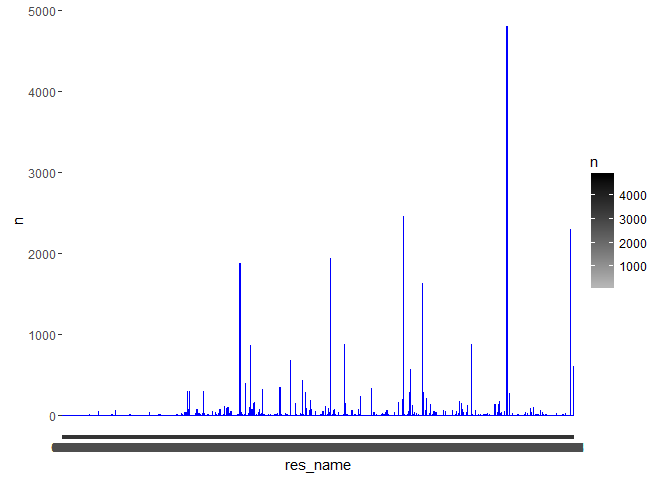
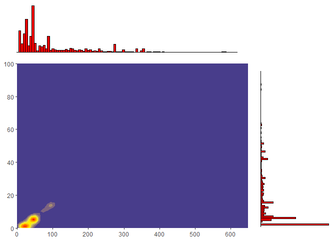
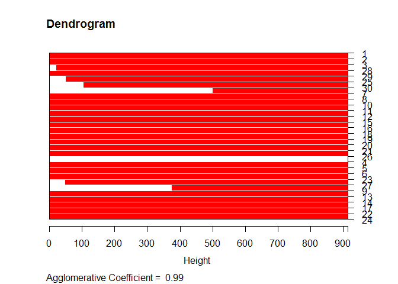

# Raport zaliczeniowy
Kacper Żurański 124481  
11.01.2016  


Główne wnioski z calego projektu
---------------
- wypisuje kod wraz z wynikami

1. Kod wyliczający wykorzystane biblioteki
---------------

```r
library("knitr")
```

```
## Warning: package 'knitr' was built under R version 3.2.3
```

```r
library("dplyr")
```

```
## 
## Attaching package: 'dplyr'
```

```
## The following objects are masked from 'package:stats':
## 
##     filter, lag
```

```
## The following objects are masked from 'package:base':
## 
##     intersect, setdiff, setequal, union
```

```r
library("reshape2")
```

```
## Warning: package 'reshape2' was built under R version 3.2.3
```

```r
library("ggplot2")
```

```
## Warning: package 'ggplot2' was built under R version 3.2.3
```

```r
library("ggExtra")
```

```
## Warning: package 'ggExtra' was built under R version 3.2.3
```

```r
library("hydroGOF")
```

```
## Warning: package 'hydroGOF' was built under R version 3.2.3
```

```
## Loading required package: zoo
```

```
## Warning: package 'zoo' was built under R version 3.2.3
```

```
## 
## Attaching package: 'zoo'
```

```
## The following objects are masked from 'package:base':
## 
##     as.Date, as.Date.numeric
```

```r
library("cluster")
```

```
## Warning: package 'cluster' was built under R version 3.2.3
```

```r
library("iterators")
```

```
## Warning: package 'iterators' was built under R version 3.2.3
```
  
2.Kod zapewniający powtarzalność wyników przy każdym uruchomieniu raportu na tych samych danych
---------------
set.seed(12)
  

3.Kod pozwalający wczytać dane z pliku;
---------------

```r
#getwd()
tmp <-read.csv("all_summary.txt", TRUE, ";")
tabAll <- tbl_df(tmp);
# pamietac zeby zmienic na pierwsze rozwiazanie!
```

4.Kod usuwający z danych wiersze posiadające wartość zmiennej res_name równą: &#x201C;DA&#x201D;,&#x201C;DC&#x201D;,&#x201C;DT&#x201D;, &#x201C;DU&#x201D;, &#x201C;DG&#x201D;, &#x201C;DI&#x201D;,&#x201C;UNK&#x201D;, &#x201C;UNX&#x201D;, &#x201C;UNL&#x201D;, &#x201C;PR&#x201D;, &#x201C;PD&#x201D;, &#x201C;Y1&#x201D;, &#x201C;EU&#x201D;, &#x201C;N&#x201D;, &#x201C;15P&#x201D;, &#x201C;UQ&#x201D;, &#x201C;PX4&#x201D; lub &#x201C;NAN&#x201D;;
---------------

```r
#terrible idea :(
#tabAll <- na.omit(tabAll)
#Tab4 <- tabAll[tabAll$res_name != 'DA' | tabAll$res_name != 'DC' | tabAll$res_name != 'DT' | #tabAll$res_name != 'DU' | tabAll$res_name != 'DG' | tabAll$res_name != 'DI' | tabAll$res_name != #'UNK' | tabAll$res_name != 'UNX'| tabAll$res_name != 'UNL' | tabAll$res_name != 'PR' | #tabAll$res_name != 'PD' | tabAll$res_name != 'Y1' | tabAll$res_name != 'EU' | tabAll$res_name != 'N'| #tabAll$res_name != '15P' | tabAll$res_name != 'UQ' | tabAll$res_name != 'PX4' | tabAll$res_name != #'NAN']

Tab4 <-  tabAll %>% filter(!(res_name %in% c('DA','DC','DT', 'DU', 'DG', 'DI','UNK', 'UNX', 'UNL', 'PR', 'PD', 'Y1', 'EU', 'N', '15P', 'UQ', 'PX4', 'NAN')))

#Tab4
```

5.Kod pozostawiający tylko unikatowe pary wartości (pdb_code, res_name)
---------------

```r
#Tab5<-unique(Tab4[c(Tab4$pdb_code,Tab4$res_name)])
  
up <- Tab4 %>% select(pdb_code, res_name)
filter <- !duplicated(up)
Tab5 <- Tab4 %>% filter(filter)
#Tab5
```

6.Krótkie podsumowanie wartości w każdej kolumnie;
---------------

```r
kable(summary(Tab5))
```

                title          pdb_code        res_name         res_id         chain_id      local_BAa       local_NPa        local_Ra       local_RGa       local_SRGa      local_CCSa      local_CCPa      local_ZOa       local_ZDa     local_ZD_minus_a   local_ZD_plus_a   local_res_atom_count   local_res_atom_non_h_count   local_res_atom_non_h_occupancy_sum   local_res_atom_non_h_electron_sum   local_res_atom_non_h_electron_occupancy_sum   local_res_atom_C_count   local_res_atom_N_count   local_res_atom_O_count   local_res_atom_S_count   dict_atom_non_h_count   dict_atom_non_h_electron_sum   dict_atom_C_count   dict_atom_N_count   dict_atom_O_count   dict_atom_S_count   part_00_blob_electron_sum   part_00_blob_volume_sum   part_00_blob_parts   part_00_shape_O3    part_00_shape_O4    part_00_shape_O5    part_00_shape_FL    part_00_shape_O3_norm   part_00_shape_O4_norm   part_00_shape_O5_norm   part_00_shape_FL_norm   part_00_shape_I1    part_00_shape_I2    part_00_shape_I3    part_00_shape_I4    part_00_shape_I5    part_00_shape_I6    part_00_shape_I1_norm   part_00_shape_I2_norm   part_00_shape_I3_norm   part_00_shape_I4_norm   part_00_shape_I5_norm   part_00_shape_I6_norm   part_00_shape_I1_scaled   part_00_shape_I2_scaled   part_00_shape_I3_scaled   part_00_shape_I4_scaled   part_00_shape_I5_scaled   part_00_shape_I6_scaled   part_00_shape_M000   part_00_shape_E3_E1   part_00_shape_E2_E1   part_00_shape_E3_E2   part_00_shape_sqrt_E1   part_00_shape_sqrt_E2   part_00_shape_sqrt_E3   part_00_density_O3   part_00_density_O4   part_00_density_O5   part_00_density_FL   part_00_density_O3_norm   part_00_density_O4_norm   part_00_density_O5_norm   part_00_density_FL_norm   part_00_density_I1   part_00_density_I2   part_00_density_I3   part_00_density_I4   part_00_density_I5   part_00_density_I6   part_00_density_I1_norm   part_00_density_I2_norm   part_00_density_I3_norm   part_00_density_I4_norm   part_00_density_I5_norm   part_00_density_I6_norm   part_00_density_I1_scaled   part_00_density_I2_scaled   part_00_density_I3_scaled   part_00_density_I4_scaled   part_00_density_I5_scaled   part_00_density_I6_scaled   part_00_density_M000   part_00_density_E3_E1   part_00_density_E2_E1   part_00_density_E3_E2   part_00_density_sqrt_E1   part_00_density_sqrt_E2   part_00_density_sqrt_E3   part_01_blob_electron_sum   part_01_blob_volume_sum   part_01_blob_parts   part_01_shape_O3    part_01_shape_O4    part_01_shape_O5    part_01_shape_FL    part_01_shape_O3_norm   part_01_shape_O4_norm   part_01_shape_O5_norm   part_01_shape_FL_norm   part_01_shape_I1    part_01_shape_I2    part_01_shape_I3    part_01_shape_I4    part_01_shape_I5    part_01_shape_I6    part_01_shape_I1_norm   part_01_shape_I2_norm   part_01_shape_I3_norm   part_01_shape_I4_norm   part_01_shape_I5_norm   part_01_shape_I6_norm   part_01_shape_I1_scaled   part_01_shape_I2_scaled   part_01_shape_I3_scaled   part_01_shape_I4_scaled   part_01_shape_I5_scaled   part_01_shape_I6_scaled   part_01_shape_M000   part_01_shape_E3_E1   part_01_shape_E2_E1   part_01_shape_E3_E2   part_01_shape_sqrt_E1   part_01_shape_sqrt_E2   part_01_shape_sqrt_E3   part_01_density_O3   part_01_density_O4   part_01_density_O5   part_01_density_FL   part_01_density_O3_norm   part_01_density_O4_norm   part_01_density_O5_norm   part_01_density_FL_norm   part_01_density_I1   part_01_density_I2   part_01_density_I3   part_01_density_I4   part_01_density_I5   part_01_density_I6   part_01_density_I1_norm   part_01_density_I2_norm   part_01_density_I3_norm   part_01_density_I4_norm   part_01_density_I5_norm   part_01_density_I6_norm   part_01_density_I1_scaled   part_01_density_I2_scaled   part_01_density_I3_scaled   part_01_density_I4_scaled   part_01_density_I5_scaled   part_01_density_I6_scaled   part_01_density_M000   part_01_density_E3_E1   part_01_density_E2_E1   part_01_density_E3_E2   part_01_density_sqrt_E1   part_01_density_sqrt_E2   part_01_density_sqrt_E3   part_02_blob_electron_sum   part_02_blob_volume_sum   part_02_blob_parts   part_02_shape_O3    part_02_shape_O4    part_02_shape_O5    part_02_shape_FL    part_02_shape_O3_norm   part_02_shape_O4_norm   part_02_shape_O5_norm   part_02_shape_FL_norm   part_02_shape_I1    part_02_shape_I2    part_02_shape_I3    part_02_shape_I4    part_02_shape_I5    part_02_shape_I6    part_02_shape_I1_norm   part_02_shape_I2_norm   part_02_shape_I3_norm   part_02_shape_I4_norm   part_02_shape_I5_norm   part_02_shape_I6_norm   part_02_shape_I1_scaled   part_02_shape_I2_scaled   part_02_shape_I3_scaled   part_02_shape_I4_scaled   part_02_shape_I5_scaled   part_02_shape_I6_scaled   part_02_shape_M000   part_02_shape_E3_E1   part_02_shape_E2_E1   part_02_shape_E3_E2   part_02_shape_sqrt_E1   part_02_shape_sqrt_E2   part_02_shape_sqrt_E3   part_02_density_O3   part_02_density_O4   part_02_density_O5   part_02_density_FL   part_02_density_O3_norm   part_02_density_O4_norm   part_02_density_O5_norm   part_02_density_FL_norm   part_02_density_I1   part_02_density_I2   part_02_density_I3   part_02_density_I4   part_02_density_I5   part_02_density_I6   part_02_density_I1_norm   part_02_density_I2_norm   part_02_density_I3_norm   part_02_density_I4_norm   part_02_density_I5_norm   part_02_density_I6_norm   part_02_density_I1_scaled   part_02_density_I2_scaled   part_02_density_I3_scaled   part_02_density_I4_scaled   part_02_density_I5_scaled   part_02_density_I6_scaled   part_02_density_M000   part_02_density_E3_E1   part_02_density_E2_E1   part_02_density_E3_E2   part_02_density_sqrt_E1   part_02_density_sqrt_E2   part_02_density_sqrt_E3   part_03_blob_electron_sum   part_03_blob_volume_sum   part_03_blob_parts   part_03_shape_O3    part_03_shape_O4    part_03_shape_O5    part_03_shape_FL    part_03_shape_O3_norm   part_03_shape_O4_norm   part_03_shape_O5_norm   part_03_shape_FL_norm   part_03_shape_I1    part_03_shape_I2    part_03_shape_I3    part_03_shape_I4    part_03_shape_I5    part_03_shape_I6    part_03_shape_I1_norm   part_03_shape_I2_norm   part_03_shape_I3_norm   part_03_shape_I4_norm   part_03_shape_I5_norm   part_03_shape_I6_norm   part_03_shape_I1_scaled   part_03_shape_I2_scaled   part_03_shape_I3_scaled   part_03_shape_I4_scaled   part_03_shape_I5_scaled   part_03_shape_I6_scaled   part_03_shape_M000   part_03_shape_E3_E1   part_03_shape_E2_E1   part_03_shape_E3_E2   part_03_shape_sqrt_E1   part_03_shape_sqrt_E2   part_03_shape_sqrt_E3   part_03_density_O3   part_03_density_O4   part_03_density_O5   part_03_density_FL   part_03_density_O3_norm   part_03_density_O4_norm   part_03_density_O5_norm   part_03_density_FL_norm   part_03_density_I1   part_03_density_I2   part_03_density_I3   part_03_density_I4   part_03_density_I5   part_03_density_I6   part_03_density_I1_norm   part_03_density_I2_norm   part_03_density_I3_norm   part_03_density_I4_norm   part_03_density_I5_norm   part_03_density_I6_norm   part_03_density_I1_scaled   part_03_density_I2_scaled   part_03_density_I3_scaled   part_03_density_I4_scaled   part_03_density_I5_scaled   part_03_density_I6_scaled   part_03_density_M000   part_03_density_E3_E1   part_03_density_E2_E1   part_03_density_E3_E2   part_03_density_sqrt_E1   part_03_density_sqrt_E2   part_03_density_sqrt_E3   part_04_blob_electron_sum   part_04_blob_volume_sum   part_04_blob_parts   part_04_shape_O3    part_04_shape_O4    part_04_shape_O5    part_04_shape_FL    part_04_shape_O3_norm   part_04_shape_O4_norm   part_04_shape_O5_norm   part_04_shape_FL_norm   part_04_shape_I1    part_04_shape_I2    part_04_shape_I3    part_04_shape_I4    part_04_shape_I5    part_04_shape_I6    part_04_shape_I1_norm   part_04_shape_I2_norm   part_04_shape_I3_norm   part_04_shape_I4_norm   part_04_shape_I5_norm   part_04_shape_I6_norm   part_04_shape_I1_scaled   part_04_shape_I2_scaled   part_04_shape_I3_scaled   part_04_shape_I4_scaled   part_04_shape_I5_scaled   part_04_shape_I6_scaled   part_04_shape_M000   part_04_shape_E3_E1   part_04_shape_E2_E1   part_04_shape_E3_E2   part_04_shape_sqrt_E1   part_04_shape_sqrt_E2   part_04_shape_sqrt_E3   part_04_density_O3   part_04_density_O4   part_04_density_O5   part_04_density_FL   part_04_density_O3_norm   part_04_density_O4_norm   part_04_density_O5_norm   part_04_density_FL_norm   part_04_density_I1   part_04_density_I2   part_04_density_I3   part_04_density_I4   part_04_density_I5   part_04_density_I6   part_04_density_I1_norm   part_04_density_I2_norm   part_04_density_I3_norm   part_04_density_I4_norm   part_04_density_I5_norm   part_04_density_I6_norm   part_04_density_I1_scaled   part_04_density_I2_scaled   part_04_density_I3_scaled   part_04_density_I4_scaled   part_04_density_I5_scaled   part_04_density_I6_scaled   part_04_density_M000   part_04_density_E3_E1   part_04_density_E2_E1   part_04_density_E3_E2   part_04_density_sqrt_E1   part_04_density_sqrt_E2   part_04_density_sqrt_E3   part_05_blob_electron_sum   part_05_blob_volume_sum   part_05_blob_parts   part_05_shape_O3    part_05_shape_O4    part_05_shape_O5    part_05_shape_FL    part_05_shape_O3_norm   part_05_shape_O4_norm   part_05_shape_O5_norm   part_05_shape_FL_norm   part_05_shape_I1    part_05_shape_I2    part_05_shape_I3    part_05_shape_I4    part_05_shape_I5    part_05_shape_I6    part_05_shape_I1_norm   part_05_shape_I2_norm   part_05_shape_I3_norm   part_05_shape_I4_norm   part_05_shape_I5_norm   part_05_shape_I6_norm   part_05_shape_I1_scaled   part_05_shape_I2_scaled   part_05_shape_I3_scaled   part_05_shape_I4_scaled   part_05_shape_I5_scaled   part_05_shape_I6_scaled   part_05_shape_M000   part_05_shape_E3_E1   part_05_shape_E2_E1   part_05_shape_E3_E2   part_05_shape_sqrt_E1   part_05_shape_sqrt_E2   part_05_shape_sqrt_E3   part_05_density_O3   part_05_density_O4   part_05_density_O5   part_05_density_FL   part_05_density_O3_norm   part_05_density_O4_norm   part_05_density_O5_norm   part_05_density_FL_norm   part_05_density_I1   part_05_density_I2   part_05_density_I3   part_05_density_I4   part_05_density_I5   part_05_density_I6   part_05_density_I1_norm   part_05_density_I2_norm   part_05_density_I3_norm   part_05_density_I4_norm   part_05_density_I5_norm   part_05_density_I6_norm   part_05_density_I1_scaled   part_05_density_I2_scaled   part_05_density_I3_scaled   part_05_density_I4_scaled   part_05_density_I5_scaled   part_05_density_I6_scaled   part_05_density_M000   part_05_density_E3_E1   part_05_density_E2_E1   part_05_density_E3_E2   part_05_density_sqrt_E1   part_05_density_sqrt_E2   part_05_density_sqrt_E3   part_06_blob_electron_sum   part_06_blob_volume_sum   part_06_blob_parts   part_06_shape_O3    part_06_shape_O4    part_06_shape_O5    part_06_shape_FL    part_06_shape_O3_norm   part_06_shape_O4_norm   part_06_shape_O5_norm   part_06_shape_FL_norm   part_06_shape_I1    part_06_shape_I2    part_06_shape_I3    part_06_shape_I4    part_06_shape_I5    part_06_shape_I6    part_06_shape_I1_norm   part_06_shape_I2_norm   part_06_shape_I3_norm   part_06_shape_I4_norm   part_06_shape_I5_norm   part_06_shape_I6_norm   part_06_shape_I1_scaled   part_06_shape_I2_scaled   part_06_shape_I3_scaled   part_06_shape_I4_scaled   part_06_shape_I5_scaled   part_06_shape_I6_scaled   part_06_shape_M000   part_06_shape_E3_E1   part_06_shape_E2_E1   part_06_shape_E3_E2   part_06_shape_sqrt_E1   part_06_shape_sqrt_E2   part_06_shape_sqrt_E3   part_06_density_O3   part_06_density_O4   part_06_density_O5   part_06_density_FL   part_06_density_O3_norm   part_06_density_O4_norm   part_06_density_O5_norm   part_06_density_FL_norm   part_06_density_I1   part_06_density_I2   part_06_density_I3   part_06_density_I4   part_06_density_I5   part_06_density_I6   part_06_density_I1_norm   part_06_density_I2_norm   part_06_density_I3_norm   part_06_density_I4_norm   part_06_density_I5_norm   part_06_density_I6_norm   part_06_density_I1_scaled   part_06_density_I2_scaled   part_06_density_I3_scaled   part_06_density_I4_scaled   part_06_density_I5_scaled   part_06_density_I6_scaled   part_06_density_M000   part_06_density_E3_E1   part_06_density_E2_E1   part_06_density_E3_E2   part_06_density_sqrt_E1   part_06_density_sqrt_E2   part_06_density_sqrt_E3   part_07_blob_electron_sum   part_07_blob_volume_sum   part_07_blob_parts   part_07_shape_O3    part_07_shape_O4    part_07_shape_O5    part_07_shape_FL    part_07_shape_O3_norm   part_07_shape_O4_norm   part_07_shape_O5_norm   part_07_shape_FL_norm   part_07_shape_I1    part_07_shape_I2    part_07_shape_I3    part_07_shape_I4    part_07_shape_I5    part_07_shape_I6    part_07_shape_I1_norm   part_07_shape_I2_norm   part_07_shape_I3_norm   part_07_shape_I4_norm   part_07_shape_I5_norm   part_07_shape_I6_norm   part_07_shape_I1_scaled   part_07_shape_I2_scaled   part_07_shape_I3_scaled   part_07_shape_I4_scaled   part_07_shape_I5_scaled   part_07_shape_I6_scaled   part_07_shape_M000   part_07_shape_E3_E1   part_07_shape_E2_E1   part_07_shape_E3_E2   part_07_shape_sqrt_E1   part_07_shape_sqrt_E2   part_07_shape_sqrt_E3   part_07_density_O3   part_07_density_O4   part_07_density_O5   part_07_density_FL   part_07_density_O3_norm   part_07_density_O4_norm   part_07_density_O5_norm   part_07_density_FL_norm   part_07_density_I1   part_07_density_I2   part_07_density_I3   part_07_density_I4   part_07_density_I5   part_07_density_I6   part_07_density_I1_norm   part_07_density_I2_norm   part_07_density_I3_norm   part_07_density_I4_norm   part_07_density_I5_norm   part_07_density_I6_norm   part_07_density_I1_scaled   part_07_density_I2_scaled   part_07_density_I3_scaled   part_07_density_I4_scaled   part_07_density_I5_scaled   part_07_density_I6_scaled   part_07_density_M000   part_07_density_E3_E1   part_07_density_E2_E1   part_07_density_E3_E2   part_07_density_sqrt_E1   part_07_density_sqrt_E2   part_07_density_sqrt_E3   part_08_blob_electron_sum   part_08_blob_volume_sum   part_08_blob_parts   part_08_shape_O3   part_08_shape_O4    part_08_shape_O5    part_08_shape_FL    part_08_shape_O3_norm   part_08_shape_O4_norm   part_08_shape_O5_norm   part_08_shape_FL_norm   part_08_shape_I1    part_08_shape_I2    part_08_shape_I3    part_08_shape_I4    part_08_shape_I5    part_08_shape_I6    part_08_shape_I1_norm   part_08_shape_I2_norm   part_08_shape_I3_norm   part_08_shape_I4_norm   part_08_shape_I5_norm   part_08_shape_I6_norm   part_08_shape_I1_scaled   part_08_shape_I2_scaled   part_08_shape_I3_scaled   part_08_shape_I4_scaled   part_08_shape_I5_scaled   part_08_shape_I6_scaled   part_08_shape_M000   part_08_shape_E3_E1   part_08_shape_E2_E1   part_08_shape_E3_E2   part_08_shape_sqrt_E1   part_08_shape_sqrt_E2   part_08_shape_sqrt_E3   part_08_density_O3   part_08_density_O4   part_08_density_O5   part_08_density_FL   part_08_density_O3_norm   part_08_density_O4_norm   part_08_density_O5_norm   part_08_density_FL_norm   part_08_density_I1   part_08_density_I2   part_08_density_I3   part_08_density_I4   part_08_density_I5   part_08_density_I6   part_08_density_I1_norm   part_08_density_I2_norm   part_08_density_I3_norm   part_08_density_I4_norm   part_08_density_I5_norm   part_08_density_I6_norm   part_08_density_I1_scaled   part_08_density_I2_scaled   part_08_density_I3_scaled   part_08_density_I4_scaled   part_08_density_I5_scaled   part_08_density_I6_scaled   part_08_density_M000   part_08_density_E3_E1   part_08_density_E2_E1   part_08_density_E3_E2   part_08_density_sqrt_E1   part_08_density_sqrt_E2   part_08_density_sqrt_E3   part_09_blob_electron_sum   part_09_blob_volume_sum   part_09_blob_parts   part_09_shape_O3   part_09_shape_O4    part_09_shape_O5    part_09_shape_FL    part_09_shape_O3_norm   part_09_shape_O4_norm   part_09_shape_O5_norm   part_09_shape_FL_norm   part_09_shape_I1    part_09_shape_I2    part_09_shape_I3    part_09_shape_I4    part_09_shape_I5    part_09_shape_I6    part_09_shape_I1_norm   part_09_shape_I2_norm   part_09_shape_I3_norm   part_09_shape_I4_norm   part_09_shape_I5_norm   part_09_shape_I6_norm   part_09_shape_I1_scaled   part_09_shape_I2_scaled   part_09_shape_I3_scaled   part_09_shape_I4_scaled   part_09_shape_I5_scaled   part_09_shape_I6_scaled   part_09_shape_M000   part_09_shape_E3_E1   part_09_shape_E2_E1   part_09_shape_E3_E2   part_09_shape_sqrt_E1   part_09_shape_sqrt_E2   part_09_shape_sqrt_E3   part_09_density_O3   part_09_density_O4   part_09_density_O5   part_09_density_FL   part_09_density_O3_norm   part_09_density_O4_norm   part_09_density_O5_norm   part_09_density_FL_norm   part_09_density_I1   part_09_density_I2   part_09_density_I3   part_09_density_I4   part_09_density_I5   part_09_density_I6   part_09_density_I1_norm   part_09_density_I2_norm   part_09_density_I3_norm   part_09_density_I4_norm   part_09_density_I5_norm   part_09_density_I6_norm   part_09_density_I1_scaled   part_09_density_I2_scaled   part_09_density_I3_scaled   part_09_density_I4_scaled   part_09_density_I5_scaled   part_09_density_I6_scaled   part_09_density_M000   part_09_density_E3_E1   part_09_density_E2_E1   part_09_density_E3_E2   part_09_density_sqrt_E1   part_09_density_sqrt_E2   part_09_density_sqrt_E3    local_volume      local_electrons     local_mean        local_std        local_min     local_max      local_skewness    local_parts        fo_col          fc_col      weight_col       grid_space   solvent_radius   solvent_opening_radius   resolution_max_limit     resolution     TwoFoFc_mean         TwoFoFc_std       TwoFoFc_square_std    TwoFoFc_min       TwoFoFc_max         Fo_mean               Fo_std        Fo_square_std          Fo_min            Fo_max          FoFc_mean             FoFc_std        FoFc_square_std        FoFc_min            FoFc_max           Fc_mean               Fc_std         Fc_square_std          Fc_min            Fc_max        solvent_mask_count   void_mask_count    modeled_mask_count   solvent_ratio    TwoFoFc_bulk_mean   TwoFoFc_bulk_std   TwoFoFc_void_mean    TwoFoFc_void_std   TwoFoFc_modeled_mean   TwoFoFc_modeled_std    Fo_bulk_mean       Fo_bulk_std       Fo_void_mean       Fo_void_std      Fo_modeled_mean     Fo_modeled_std    FoFc_bulk_mean     FoFc_bulk_std     FoFc_void_mean      FoFc_void_std     FoFc_modeled_mean   FoFc_modeled_std    Fc_bulk_mean       Fc_bulk_std       Fc_void_mean        Fc_void_std      Fc_modeled_mean     Fc_modeled_std    TwoFoFc_void_fit_binormal_mean1   TwoFoFc_void_fit_binormal_std1   TwoFoFc_void_fit_binormal_mean2   TwoFoFc_void_fit_binormal_std2   TwoFoFc_void_fit_binormal_scale   TwoFoFc_solvent_fit_normal_mean   TwoFoFc_solvent_fit_normal_std   part_step_FoFc_std_min   part_step_FoFc_std_max   part_step_FoFc_std_step 
---  ---------------------  --------------  --------------  --------------  -------------  --------------  --------------  --------------  --------------  --------------  --------------  --------------  --------------  --------------  -----------------  ----------------  ---------------------  ---------------------------  -----------------------------------  ----------------------------------  --------------------------------------------  -----------------------  -----------------------  -----------------------  -----------------------  ----------------------  -----------------------------  ------------------  ------------------  ------------------  ------------------  --------------------------  ------------------------  -------------------  ------------------  ------------------  ------------------  ------------------  ----------------------  ----------------------  ----------------------  ----------------------  ------------------  ------------------  ------------------  ------------------  ------------------  ------------------  ----------------------  ----------------------  ----------------------  ----------------------  ----------------------  ----------------------  ------------------------  ------------------------  ------------------------  ------------------------  ------------------------  ------------------------  -------------------  --------------------  --------------------  --------------------  ----------------------  ----------------------  ----------------------  -------------------  -------------------  -------------------  -------------------  ------------------------  ------------------------  ------------------------  ------------------------  -------------------  -------------------  -------------------  -------------------  -------------------  -------------------  ------------------------  ------------------------  ------------------------  ------------------------  ------------------------  ------------------------  --------------------------  --------------------------  --------------------------  --------------------------  --------------------------  --------------------------  ---------------------  ----------------------  ----------------------  ----------------------  ------------------------  ------------------------  ------------------------  --------------------------  ------------------------  -------------------  ------------------  ------------------  ------------------  ------------------  ----------------------  ----------------------  ----------------------  ----------------------  ------------------  ------------------  ------------------  ------------------  ------------------  ------------------  ----------------------  ----------------------  ----------------------  ----------------------  ----------------------  ----------------------  ------------------------  ------------------------  ------------------------  ------------------------  ------------------------  ------------------------  -------------------  --------------------  --------------------  --------------------  ----------------------  ----------------------  ----------------------  -------------------  -------------------  -------------------  -------------------  ------------------------  ------------------------  ------------------------  ------------------------  -------------------  -------------------  -------------------  -------------------  -------------------  -------------------  ------------------------  ------------------------  ------------------------  ------------------------  ------------------------  ------------------------  --------------------------  --------------------------  --------------------------  --------------------------  --------------------------  --------------------------  ---------------------  ----------------------  ----------------------  ----------------------  ------------------------  ------------------------  ------------------------  --------------------------  ------------------------  -------------------  ------------------  ------------------  ------------------  ------------------  ----------------------  ----------------------  ----------------------  ----------------------  ------------------  ------------------  ------------------  ------------------  ------------------  ------------------  ----------------------  ----------------------  ----------------------  ----------------------  ----------------------  ----------------------  ------------------------  ------------------------  ------------------------  ------------------------  ------------------------  ------------------------  -------------------  --------------------  --------------------  --------------------  ----------------------  ----------------------  ----------------------  -------------------  -------------------  -------------------  -------------------  ------------------------  ------------------------  ------------------------  ------------------------  -------------------  -------------------  -------------------  -------------------  -------------------  -------------------  ------------------------  ------------------------  ------------------------  ------------------------  ------------------------  ------------------------  --------------------------  --------------------------  --------------------------  --------------------------  --------------------------  --------------------------  ---------------------  ----------------------  ----------------------  ----------------------  ------------------------  ------------------------  ------------------------  --------------------------  ------------------------  -------------------  ------------------  ------------------  ------------------  ------------------  ----------------------  ----------------------  ----------------------  ----------------------  ------------------  ------------------  ------------------  ------------------  ------------------  ------------------  ----------------------  ----------------------  ----------------------  ----------------------  ----------------------  ----------------------  ------------------------  ------------------------  ------------------------  ------------------------  ------------------------  ------------------------  -------------------  --------------------  --------------------  --------------------  ----------------------  ----------------------  ----------------------  -------------------  -------------------  -------------------  -------------------  ------------------------  ------------------------  ------------------------  ------------------------  -------------------  -------------------  -------------------  -------------------  -------------------  -------------------  ------------------------  ------------------------  ------------------------  ------------------------  ------------------------  ------------------------  --------------------------  --------------------------  --------------------------  --------------------------  --------------------------  --------------------------  ---------------------  ----------------------  ----------------------  ----------------------  ------------------------  ------------------------  ------------------------  --------------------------  ------------------------  -------------------  ------------------  ------------------  ------------------  ------------------  ----------------------  ----------------------  ----------------------  ----------------------  ------------------  ------------------  ------------------  ------------------  ------------------  ------------------  ----------------------  ----------------------  ----------------------  ----------------------  ----------------------  ----------------------  ------------------------  ------------------------  ------------------------  ------------------------  ------------------------  ------------------------  -------------------  --------------------  --------------------  --------------------  ----------------------  ----------------------  ----------------------  -------------------  -------------------  -------------------  -------------------  ------------------------  ------------------------  ------------------------  ------------------------  -------------------  -------------------  -------------------  -------------------  -------------------  -------------------  ------------------------  ------------------------  ------------------------  ------------------------  ------------------------  ------------------------  --------------------------  --------------------------  --------------------------  --------------------------  --------------------------  --------------------------  ---------------------  ----------------------  ----------------------  ----------------------  ------------------------  ------------------------  ------------------------  --------------------------  ------------------------  -------------------  ------------------  ------------------  ------------------  ------------------  ----------------------  ----------------------  ----------------------  ----------------------  ------------------  ------------------  ------------------  ------------------  ------------------  ------------------  ----------------------  ----------------------  ----------------------  ----------------------  ----------------------  ----------------------  ------------------------  ------------------------  ------------------------  ------------------------  ------------------------  ------------------------  -------------------  --------------------  --------------------  --------------------  ----------------------  ----------------------  ----------------------  -------------------  -------------------  -------------------  -------------------  ------------------------  ------------------------  ------------------------  ------------------------  -------------------  -------------------  -------------------  -------------------  -------------------  -------------------  ------------------------  ------------------------  ------------------------  ------------------------  ------------------------  ------------------------  --------------------------  --------------------------  --------------------------  --------------------------  --------------------------  --------------------------  ---------------------  ----------------------  ----------------------  ----------------------  ------------------------  ------------------------  ------------------------  --------------------------  ------------------------  -------------------  ------------------  ------------------  ------------------  ------------------  ----------------------  ----------------------  ----------------------  ----------------------  ------------------  ------------------  ------------------  ------------------  ------------------  ------------------  ----------------------  ----------------------  ----------------------  ----------------------  ----------------------  ----------------------  ------------------------  ------------------------  ------------------------  ------------------------  ------------------------  ------------------------  -------------------  --------------------  --------------------  --------------------  ----------------------  ----------------------  ----------------------  -------------------  -------------------  -------------------  -------------------  ------------------------  ------------------------  ------------------------  ------------------------  -------------------  -------------------  -------------------  -------------------  -------------------  -------------------  ------------------------  ------------------------  ------------------------  ------------------------  ------------------------  ------------------------  --------------------------  --------------------------  --------------------------  --------------------------  --------------------------  --------------------------  ---------------------  ----------------------  ----------------------  ----------------------  ------------------------  ------------------------  ------------------------  --------------------------  ------------------------  -------------------  ------------------  ------------------  ------------------  ------------------  ----------------------  ----------------------  ----------------------  ----------------------  ------------------  ------------------  ------------------  ------------------  ------------------  ------------------  ----------------------  ----------------------  ----------------------  ----------------------  ----------------------  ----------------------  ------------------------  ------------------------  ------------------------  ------------------------  ------------------------  ------------------------  -------------------  --------------------  --------------------  --------------------  ----------------------  ----------------------  ----------------------  -------------------  -------------------  -------------------  -------------------  ------------------------  ------------------------  ------------------------  ------------------------  -------------------  -------------------  -------------------  -------------------  -------------------  -------------------  ------------------------  ------------------------  ------------------------  ------------------------  ------------------------  ------------------------  --------------------------  --------------------------  --------------------------  --------------------------  --------------------------  --------------------------  ---------------------  ----------------------  ----------------------  ----------------------  ------------------------  ------------------------  ------------------------  --------------------------  ------------------------  -------------------  -----------------  ------------------  ------------------  ------------------  ----------------------  ----------------------  ----------------------  ----------------------  ------------------  ------------------  ------------------  ------------------  ------------------  ------------------  ----------------------  ----------------------  ----------------------  ----------------------  ----------------------  ----------------------  ------------------------  ------------------------  ------------------------  ------------------------  ------------------------  ------------------------  -------------------  --------------------  --------------------  --------------------  ----------------------  ----------------------  ----------------------  -------------------  -------------------  -------------------  -------------------  ------------------------  ------------------------  ------------------------  ------------------------  -------------------  -------------------  -------------------  -------------------  -------------------  -------------------  ------------------------  ------------------------  ------------------------  ------------------------  ------------------------  ------------------------  --------------------------  --------------------------  --------------------------  --------------------------  --------------------------  --------------------------  ---------------------  ----------------------  ----------------------  ----------------------  ------------------------  ------------------------  ------------------------  --------------------------  ------------------------  -------------------  -----------------  ------------------  ------------------  ------------------  ----------------------  ----------------------  ----------------------  ----------------------  ------------------  ------------------  ------------------  ------------------  ------------------  ------------------  ----------------------  ----------------------  ----------------------  ----------------------  ----------------------  ----------------------  ------------------------  ------------------------  ------------------------  ------------------------  ------------------------  ------------------------  -------------------  --------------------  --------------------  --------------------  ----------------------  ----------------------  ----------------------  -------------------  -------------------  -------------------  -------------------  ------------------------  ------------------------  ------------------------  ------------------------  -------------------  -------------------  -------------------  -------------------  -------------------  -------------------  ------------------------  ------------------------  ------------------------  ------------------------  ------------------------  ------------------------  --------------------------  --------------------------  --------------------------  --------------------------  --------------------------  --------------------------  ---------------------  ----------------------  ----------------------  ----------------------  ------------------------  ------------------------  ------------------------  -----------------  ----------------  ----------------  ---------------  ------------  ---------------  ---------------  ---------------  -------------  --------------  -------------  -------------  ---------------  -----------------------  ---------------------  --------------  -------------------  -----------------  -------------------  ----------------  ----------------  -------------------  ----------------  -----------------  ----------------  ----------------  -------------------  -----------------  ------------------  ------------------  -----------------  -------------------  -----------------  -----------------  ----------------  ----------------  -------------------  -----------------  -------------------  ---------------  ------------------  -----------------  -------------------  -----------------  ---------------------  --------------------  -----------------  ----------------  -----------------  ----------------  ------------------  ----------------  -----------------  ----------------  ------------------  ----------------  ------------------  -----------------  -----------------  ----------------  ------------------  ----------------  ------------------  ----------------  --------------------------------  -------------------------------  --------------------------------  -------------------------------  --------------------------------  --------------------------------  -------------------------------  -----------------------  -----------------------  ------------------------
     110l BME 901 A:    1   3ag4   :   16   SO4    : 1183   301    :  430   A      :8630   Min.   : NA     Min.   : NA     Min.   : NA     Min.   : NA     Min.   : NA     Min.   : NA     Min.   : NA     Min.   : NA     Min.   : NA     Min.   : NA        Min.   : NA       Min.   :  1.00         Min.   :  1.00               Min.   :  0.00                       Min.   :  3.0                       Min.   :  0.00                                Min.   : 0.000           Min.   : 0.00            Min.   : 0.000           Min.   :0.0000           Min.   :  1.00          Min.   :  3.0                  Min.   : 0.00       Min.   : 0.000      Min.   : 0.000      Min.   :0.0000      Min.   :  0.000             Min.   :   0.00           Min.   :0.0000       Min.   :    24253   Min.   :1.952e+08   Min.   :5.160e+11   Min.   :3.330e+06   Min.   :0.2312          Min.   :0.0178          Min.   :0.0005          Min.   :0.0000          Min.   :6.875e+05   Min.   :1.246e+11   Min.   :9.688e+10   Min.   :1.335e+06   Min.   :4.728e+03   Min.   :5.618e+09   Min.   : 0.0637         Min.   : 0.0011         Min.   :  0.0008        Min.   :0.0000          Min.   :0.0000          Min.   : 0.0049         Min.   :0.0001            Min.   :0.0000            Min.   :0.0000            Min.   :0.0000            Min.   :0e+00             Min.   :0                 Min.   :  1023       Min.   :0.0005        Min.   :0.0142        Min.   :0.0042        Min.   : 2.930          Min.   : 1.793          Min.   : 0.498          Min.   :     1527    Min.   :7.096e+05    Min.   :1.011e+08    Min.   :9.595e+05    Min.   :0.0593            Min.   :0.0012            Min.   :0.0000            Min.   : 0.0000           Min.   :6.548e+04    Min.   :9.611e+08    Min.   :1.275e+09    Min.   :4.130e+05    Min.   :2.366e+04    Min.   :3.899e+07    Min.   : 0.0048           Min.   :  0.0000          Min.   :   0.0000         Min.   : 0.0000           Min.   : 0.0000           Min.   :  0.0001          Min.   :0.0000              Min.   :0.0000              Min.   :0.0000              Min.   :0.0000              Min.   :0.0000              Min.   :0.0000              Min.   :   47          Min.   :0.0007          Min.   :0.0133          Min.   :0.0052          Min.   : 2.499            Min.   : 1.769            Min.   : 0.4972           Min.   :  0.000             Min.   :   0.00           Min.   :0.0000       Min.   :    24186   Min.   :1.947e+08   Min.   :5.217e+11   Min.   :2.023e+06   Min.   :0.2313          Min.   :0.0178          Min.   :0.0005          Min.   :0.0000          Min.   :6.807e+05   Min.   :1.231e+11   Min.   :9.354e+10   Min.   :8.184e+05   Min.   :3.360e+03   Min.   :5.502e+09   Min.   : 0.0637         Min.   : 0.0011         Min.   :  0.0008        Min.   :0.0000          Min.   :0.0000          Min.   : 0.0049         Min.   :0.0001            Min.   :0.0000            Min.   :0.000             Min.   :0.0000            Min.   :0.000             Min.   :0                 Min.   :  1023       Min.   :0.0005        Min.   :0.0127        Min.   :0.0044        Min.   : 2.898          Min.   : 1.947          Min.   : 0.4978         Min.   :    1038     Min.   :3.280e+05    Min.   :3.182e+07    Min.   :3.230e+05    Min.   :0.0592            Min.   :0.0012            Min.   :0.0000            Min.   : 0.0000           Min.   :3.748e+04    Min.   :3.151e+08    Min.   :4.195e+08    Min.   :1.414e+05    Min.   :1.786e+04    Min.   :1.512e+07    Min.   : 0.0048           Min.   :  0.0000          Min.   :   0.000          Min.   : 0.0000           Min.   : 0.0000           Min.   :  0.0001          Min.   :0.0000              Min.   :0.0000              Min.   :0.0000              Min.   :0.0000              Min.   :0.0000              Min.   :0.0000              Min.   :   37.76       Min.   :0.0007          Min.   :0.0122          Min.   :0.0054          Min.   : 2.496            Min.   : 1.877            Min.   : 0.4971           Min.   :  0.00              Min.   :   0.000          Min.   :0.0000       Min.   :    24331   Min.   :1.955e+08   Min.   :5.180e+11   Min.   :2.142e+06   Min.   :0.2312          Min.   :0.0178          Min.   :0.0005          Min.   : 0.0000         Min.   :6.937e+05   Min.   :1.254e+11   Min.   :1.013e+11   Min.   :8.662e+05   Min.   :3.121e+03   Min.   :5.751e+09   Min.   : 0.0637         Min.   : 0.0011         Min.   :  0.0008        Min.   : 0.0000         Min.   : 0.0000         Min.   : 0.0049         Min.   :0.0001            Min.   :0.0000            Min.   :0.0000            Min.   :0.0000            Min.   :0.0000            Min.   :0                 Min.   :  1023       Min.   :0.0006        Min.   :0.0138        Min.   :0.0047        Min.   : 2.917          Min.   : 1.914          Min.   : 0.4957         Min.   :    4269     Min.   :5.654e+06    Min.   :2.385e+09    Min.   :1.443e+06    Min.   :0.0588            Min.   :0.0011            Min.   :0.0000            Min.   :  0.0000          Min.   :1.324e+05    Min.   :3.851e+09    Min.   :4.897e+09    Min.   :6.988e+05    Min.   :1.294e+04    Min.   :2.080e+08    Min.   : 0.0047           Min.   :  0.0000          Min.   :   0.000          Min.   :  0.0000          Min.   :  0.0000          Min.   :  0.0001          Min.   :0.0000              Min.   :0.0000              Min.   :0.0000              Min.   :0.0000              Min.   :0.0000              Min.   :0.0000              Min.   :  177.5        Min.   :0.0008          Min.   :0.0138          Min.   :0.0058          Min.   : 2.487            Min.   : 1.857            Min.   : 0.4957           Min.   :  0.0               Min.   :  0.00            Min.   :0.0000       Min.   :    24164   Min.   :1.941e+08   Min.   :5.143e+11   Min.   :6.027e+06   Min.   :0.231           Min.   :0.018           Min.   :0.000           Min.   : 0.000          Min.   :6.790e+05   Min.   :1.225e+11   Min.   :9.315e+10   Min.   :2.433e+06   Min.   :1.301e+03   Min.   :5.484e+09   Min.   : 0.064          Min.   : 0.001          Min.   :  0.001         Min.   : 0.000          Min.   : 0.000          Min.   : 0.005          Min.   :0.000             Min.   :0.000             Min.   :0.00              Min.   :0.000             Min.   :0.000             Min.   :0                 Min.   :  1023       Min.   :0.001         Min.   :0.012         Min.   :0.005         Min.   : 2.884          Min.   : 1.817          Min.   : 0.493          Min.   :    4027     Min.   :5.262e+06    Min.   :2.243e+09    Min.   :1.389e+06    Min.   : 0.058            Min.   : 0.001            Min.   :0.000             Min.   :  0.000           Min.   :1.186e+05    Min.   :3.489e+09    Min.   :3.239e+09    Min.   :5.853e+05    Min.   :1.301e+04    Min.   :1.669e+08    Min.   :  0.005           Min.   :   0.000          Min.   :    0.00          Min.   :  0.000           Min.   :  0.000           Min.   :   0.000          Min.   :0.000               Min.   :0.000               Min.   : 0.000              Min.   :0.00                Min.   :0.000               Min.   :0.000               Min.   :  168          Min.   :0.001           Min.   :0.011           Min.   :0.006           Min.   : 2.473            Min.   : 1.773            Min.   : 0.494            Min.   :  0.000             Min.   :  0.0             Min.   :0.0000       Min.   :    24198   Min.   :1.946e+08   Min.   :5.198e+11   Min.   :7.913e+06   Min.   :0.231           Min.   :0.018           Min.   :0.000           Min.   : 0.000          Min.   :6.817e+05   Min.   :1.231e+11   Min.   :9.400e+10   Min.   :3.183e+06   Min.   :3.774e+03   Min.   :5.528e+09   Min.   : 0.064          Min.   :  0.001         Min.   :   0.001        Min.   : 0.000          Min.   : 0.000          Min.   :  0.005         Min.   :0.000             Min.   :0.000             Min.   :0.000             Min.   :0.000             Min.   :0.000             Min.   :0                 Min.   : 1023        Min.   :0.001         Min.   :0.009         Min.   :0.010         Min.   : 2.869          Min.   : 1.644          Min.   : 0.496          Min.   :    6632     Min.   :1.333e+07    Min.   :7.807e+09    Min.   :1.426e+06    Min.   : 0.058            Min.   : 0.001            Min.   :0.000             Min.   :   0.000          Min.   :2.208e+05    Min.   :1.088e+10    Min.   :1.331e+10    Min.   :5.746e+05    Min.   :3.000e+00    Min.   :5.871e+08    Min.   :  0.005           Min.   :   0.000          Min.   :     0.00         Min.   :   0.000          Min.   :   0.000          Min.   :   0.000          Min.   :0.000               Min.   :0.000               Min.   :0.000               Min.   :0.000               Min.   :0.000               Min.   :0.000               Min.   :  260.4        Min.   :0.001           Min.   :0.008           Min.   :0.011           Min.   : 2.577            Min.   : 1.617            Min.   : 0.497            Min.   :  0.000             Min.   :  0.000           Min.   :0.00         Min.   :    24236   Min.   :1.956e+08   Min.   :5.224e+11   Min.   :4.696e+06   Min.   :0.231           Min.   :0.018           Min.   :0.000           Min.   :  0.000         Min.   :6.861e+05   Min.   :1.254e+11   Min.   :9.477e+10   Min.   :1.895e+06   Min.   :5.507e+03   Min.   :5.553e+09   Min.   : 0.064          Min.   : 0.001          Min.   :   0.001        Min.   :  0.000         Min.   :  0.000         Min.   :  0.005         Min.   :0.000             Min.   :0.000             Min.   :0.000             Min.   :0.000             Min.   :0.000             Min.   :0                 Min.   : 1023        Min.   :0.001         Min.   :0.008         Min.   :0.011         Min.   : 2.866          Min.   : 2.056          Min.   : 0.496          Min.   :    6155     Min.   :1.161e+07    Min.   :6.600e+09    Min.   :8.006e+05    Min.   : 0.058            Min.   :0.001             Min.   :0.000             Min.   :   0.000          Min.   :1.955e+05    Min.   :9.552e+09    Min.   :8.451e+09    Min.   :3.227e+05    Min.   :8.210e+02    Min.   :4.207e+08    Min.   :  0.005           Min.   :  0.000           Min.   :     0.0          Min.   :   0.000          Min.   :   0.000          Min.   :    0.000         Min.   :0.000               Min.   :0.000               Min.   : 0.000              Min.   :0.000               Min.   :0.000               Min.   :0.000               Min.   :  234.8        Min.   :0.001           Min.   :0.008           Min.   :0.013           Min.   : 2.538            Min.   : 1.980            Min.   : 0.496            Min.   :  0.00              Min.   :  0.00            Min.   :0.0000       Min.   :    24358   Min.   :1.971e+08   Min.   :5.177e+11   Min.   :7.396e+06   Min.   : 0.231          Min.   :0.018           Min.   :0.000           Min.   : 0.000          Min.   :6.850e+05   Min.   :1.250e+11   Min.   :9.408e+10   Min.   :2.975e+06   Min.   :4.763e+03   Min.   :5.566e+09   Min.   :  0.064         Min.   :   0.001        Min.   :    0.001       Min.   :  0.000         Min.   :  0.000         Min.   :   0.005        Min.   :0.000             Min.   :0.000             Min.   :0.000             Min.   :0.00              Min.   :0.000             Min.   :0                 Min.   : 1023        Min.   :0.001         Min.   :0.008         Min.   :0.012         Min.   : 2.853          Min.   : 2.037          Min.   : 0.496          Min.   :    6900     Min.   :1.522e+07    Min.   :1.075e+10    Min.   :2.231e+06    Min.   : 0.057            Min.   :0.001             Min.   :0.000             Min.   :  0.000           Min.   :2.044e+05    Min.   :1.033e+10    Min.   :1.034e+10    Min.   :8.939e+05    Min.   :2.507e+03    Min.   :5.106e+08    Min.   :  0.004           Min.   :    0.000         Min.   :     0.00         Min.   :  0.000           Min.   :  0.000           Min.   :   0.000          Min.   :0.000               Min.   :0.000               Min.   :0.000               Min.   :0.000               Min.   :0.00                Min.   :0.000               Min.   :  292.1        Min.   :0.001           Min.   :0.007           Min.   :0.014           Min.   : 2.523            Min.   : 1.955            Min.   : 0.496            Min.   :  0.000             Min.   :  0.000           Min.   :0.0000       Min.   :    24313   Min.   :1.960e+08   Min.   :5.149e+11   Min.   :5.901e+06   Min.   :0.231           Min.   :0.018           Min.   :0.000           Min.   :  0.000         Min.   :6.911e+05   Min.   :1.255e+11   Min.   :9.856e+10   Min.   :2.436e+06   Min.   :2.860e+03   Min.   :5.679e+09   Min.   :  0.064         Min.   :  0.001         Min.   :    0.001       Min.   :  0.000         Min.   :  0.000         Min.   :  0.005         Min.   :0.000             Min.   :0.000             Min.   :0.000             Min.   :0.000             Min.   :0.000             Min.   :0                 Min.   : 1023        Min.   :0.006         Min.   :0.007         Min.   :0.018         Min.   : 2.930          Min.   : 1.947          Min.   : 1.077          Min.   :    7722     Min.   :1.917e+07    Min.   :1.546e+10    Min.   :2.261e+06    Min.   :0.057             Min.   :0.001             Min.   :0.000             Min.   :  0.000           Min.   :2.348e+05    Min.   :1.442e+10    Min.   :1.161e+10    Min.   :9.168e+05    Min.   :6.445e+03    Min.   :6.453e+08    Min.   : 0.004            Min.   :  0.000           Min.   :   0.000          Min.   :  0.000           Min.   :  0.000           Min.   :  0.000           Min.   :0.000               Min.   :0.000               Min.   :0.000               Min.   :0.000               Min.   :0.000               Min.   :0                   Min.   :  291.9        Min.   :0.005           Min.   :0.007           Min.   :0.018           Min.   : 2.610            Min.   : 1.921            Min.   : 1.063            Min.   :  0.000             Min.   :  0.000           Min.   :0.0000       Min.   :   24284   Min.   :1.955e+08   Min.   :5.167e+11   Min.   :4.143e+06   Min.   :0.231           Min.   :0.018           Min.   :0.000           Min.   : 0.000          Min.   :6.883e+05   Min.   :1.246e+11   Min.   :9.780e+10   Min.   :1.767e+06   Min.   :5.470e+02   Min.   :5.625e+09   Min.   : 0.064          Min.   : 0.001          Min.   :  0.001         Min.   : 0.000          Min.   : 0.000          Min.   : 0.005          Min.   :0.000             Min.   :0.000             Min.   :0.000             Min.   :0.000             Min.   :0.000             Min.   :0                 Min.   : 1023        Min.   :0.005         Min.   :0.010         Min.   :0.020         Min.   : 2.942          Min.   : 2.154          Min.   : 1.051          Min.   :    6023     Min.   :1.180e+07    Min.   :7.555e+09    Min.   :1.376e+06    Min.   :0.057             Min.   :0.001             Min.   :0.000             Min.   : 0.000            Min.   :1.750e+05    Min.   :7.599e+09    Min.   :7.022e+09    Min.   :5.570e+05    Min.   :8.525e+03    Min.   :3.736e+08    Min.   : 0.004            Min.   :  0.000           Min.   :   0.000          Min.   : 0.000            Min.   : 0.000            Min.   :  0.000           Min.   :0.000               Min.   :0.000               Min.   :0.000               Min.   :0.000               Min.   :0.00                Min.   :0                   Min.   :  256.5        Min.   :0.004           Min.   :0.010           Min.   :0.020           Min.   : 2.620            Min.   : 2.106            Min.   : 1.041            Min.   :  0.000             Min.   :  0.000           Min.   :0.0000       Min.   :   24584   Min.   :1.970e+08   Min.   :5.129e+11   Min.   :4.052e+06   Min.   :0.231           Min.   :0.018           Min.   :0.000           Min.   : 0.000          Min.   :7.117e+05   Min.   :1.303e+11   Min.   :1.047e+11   Min.   :1.669e+06   Min.   :3.899e+03   Min.   :5.953e+09   Min.   : 0.064          Min.   :  0.001         Min.   :   0.001        Min.   : 0.000          Min.   : 0.000          Min.   :  0.005         Min.   :0.000             Min.   :0.000             Min.   :0.000             Min.   :0.000             Min.   :0.00              Min.   :0                 Min.   : 1023        Min.   :0.004         Min.   :0.011         Min.   :0.025         Min.   : 2.949          Min.   : 2.144          Min.   : 1.060          Min.   :    7987     Min.   :2.102e+07    Min.   :1.388e+10    Min.   :1.586e+06    Min.   : 0.056            Min.   : 0.001            Min.   :0.000             Min.   :  0.000           Min.   :2.621e+05    Min.   :1.642e+10    Min.   :1.529e+10    Min.   :6.442e+05    Min.   :1.606e+04    Min.   :7.249e+08    Min.   :  0.004           Min.   :   0.000          Min.   :    0.000         Min.   : 0.000            Min.   : 0.000            Min.   :  0.000           Min.   :0.000               Min.   :0.000               Min.   :0.000               Min.   :0.000               Min.   :0.000               Min.   :0.000               Min.   :  297.4        Min.   :0.004           Min.   :0.010           Min.   :0.025           Min.   : 2.598            Min.   : 2.108            Min.   : 1.045            Min.   :   64.77   Min.   :  0.000   Min.   :0.00000   Min.   :0.0000   Min.   :0     Min.   : 0.000   Min.   :0.0000   Min.   :0.0000   DELFWT:14132   PHDELWT:14132   Mode:logical   Min.   :0.2    Min.   :1.9      Min.   :1.4              Min.   :2              Min.   :0.800   Min.   :-2.992e-06   Min.   :0.009962   Min.   :0.0003424    Min.   :-2.3692   Min.   : 0.2245   Min.   :-3.028e-06   Min.   :0.01847   Min.   :0.003589   Min.   :-3.3935   Min.   : 0.2999   Min.   :-2.206e-06   Min.   :0.009009   Min.   :0.0001201   Min.   :-26.24490   Min.   : 0.07625   Min.   :-7.867e-07   Min.   :0.005332   Min.   :0.000403   Min.   :-3.2550   Min.   : 0.2407   Min.   :       0     Min.   :    5472   Min.   :   15008     Min.   :0.0000   Min.   :-0.30666    Min.   :0.00930    Min.   :-0.2850280   Min.   :0.02783    Min.   :6.595e-05      Min.   :0.03485       Min.   :-0.08705   Min.   :0.01120   Min.   :-0.24222   Min.   :0.03827   Min.   :-0.003379   Min.   :0.05494   Min.   :-0.08982   Min.   :0.00893   Min.   :-0.095296   Min.   :0.01336   Min.   :-0.11559    Min.   :0.01705    Min.   :-0.21683   Min.   :0.00345   Min.   :-0.239831   Min.   :0.01529   Min.   :-0.005495   Min.   :0.02092   Min.   :-0.66520                  Min.   :0.01075                  Min.   :0.000e+00                 Min.   :0.000e+00                Min.   :-11.2668                  Min.   :-0.31511                  Min.   :0.00918                  Min.   :2.5              Min.   :7.1              Min.   :0.5             
     111l CL 173 A :    1   3abl   :   15   ZN     :  849   1      :  424   B      :2905   1st Qu.: NA     1st Qu.: NA     1st Qu.: NA     1st Qu.: NA     1st Qu.: NA     1st Qu.: NA     1st Qu.: NA     1st Qu.: NA     1st Qu.: NA     1st Qu.: NA        1st Qu.: NA       1st Qu.:  1.00         1st Qu.:  1.00               1st Qu.:  1.00                       1st Qu.: 30.0                       1st Qu.: 30.00                                1st Qu.: 0.000           1st Qu.: 0.00            1st Qu.: 0.000           1st Qu.:0.0000           1st Qu.:  1.00          1st Qu.: 30.0                  1st Qu.: 0.00       1st Qu.: 0.000      1st Qu.: 0.000      1st Qu.:0.0000      1st Qu.:  9.469             1st Qu.:  14.44           1st Qu.:1.0000       1st Qu.:   106958   1st Qu.:2.876e+09   1st Qu.:2.121e+13   1st Qu.:4.427e+10   1st Qu.:0.3173          1st Qu.:0.0275          1st Qu.:0.0007          1st Qu.:0.0021          1st Qu.:8.630e+06   1st Qu.:1.181e+13   1st Qu.:2.797e+13   1st Qu.:2.340e+10   1st Qu.:5.138e+09   1st Qu.:4.161e+11   1st Qu.: 0.1478         1st Qu.: 0.0037         1st Qu.:  0.0082        1st Qu.:0.0011          1st Qu.:0.0002          1st Qu.: 0.0202         1st Qu.:0.0007            1st Qu.:0.0000            1st Qu.:0.0000            1st Qu.:0.0000            1st Qu.:0e+00             1st Qu.:0                 1st Qu.:  1900       1st Qu.:0.0715        1st Qu.:0.1974        1st Qu.:0.3046        1st Qu.: 5.594          1st Qu.: 3.546          1st Qu.: 2.654          1st Qu.:    62839    1st Qu.:1.048e+09    1st Qu.:4.744e+12    1st Qu.:1.340e+10    1st Qu.:0.3736            1st Qu.:0.0376            1st Qu.:0.0011            1st Qu.: 0.0033           1st Qu.:4.534e+06    1st Qu.:3.276e+12    1st Qu.:7.603e+12    1st Qu.:7.514e+09    1st Qu.:2.054e+09    1st Qu.:1.222e+11    1st Qu.: 0.2201           1st Qu.:  0.0084          1st Qu.:   0.0169         1st Qu.: 0.0020           1st Qu.: 0.0006           1st Qu.:  0.0343          1st Qu.:0.0014              1st Qu.:0.0000              1st Qu.:0.0000              1st Qu.:0.0000              1st Qu.:0.0000              1st Qu.:0.0000              1st Qu.: 1263          1st Qu.:0.0678          1st Qu.:0.1912          1st Qu.:0.2997          1st Qu.: 5.086            1st Qu.: 3.263            1st Qu.: 2.4659           1st Qu.:  8.581             1st Qu.:  12.77           1st Qu.:1.0000       1st Qu.:    99934   1st Qu.:2.480e+09   1st Qu.:1.702e+13   1st Qu.:3.533e+10   1st Qu.:0.3104          1st Qu.:0.0267          1st Qu.:0.0007          1st Qu.:0.0019          1st Qu.:7.759e+06   1st Qu.:9.470e+12   1st Qu.:2.146e+13   1st Qu.:1.857e+10   1st Qu.:3.874e+09   1st Qu.:3.399e+11   1st Qu.: 0.1405         1st Qu.: 0.0034         1st Qu.:  0.0072        1st Qu.:0.0010          1st Qu.:0.0002          1st Qu.: 0.0184         1st Qu.:0.0007            1st Qu.:0.0000            1st Qu.:0.000             1st Qu.:0.0000            1st Qu.:0.000             1st Qu.:0                 1st Qu.:  1829       1st Qu.:0.0687        1st Qu.:0.1929        1st Qu.:0.2994        1st Qu.: 5.444          1st Qu.: 3.499          1st Qu.: 2.6289         1st Qu.:   61609     1st Qu.:1.002e+09    1st Qu.:4.474e+12    1st Qu.:1.122e+10    1st Qu.:0.3578            1st Qu.:0.0353            1st Qu.:0.0010            1st Qu.: 0.0027           1st Qu.:4.245e+06    1st Qu.:2.887e+12    1st Qu.:6.328e+12    1st Qu.:6.274e+09    1st Qu.:1.645e+09    1st Qu.:1.122e+11    1st Qu.: 0.1991           1st Qu.:  0.0072          1st Qu.:   0.014          1st Qu.: 0.0015           1st Qu.: 0.0004           1st Qu.:  0.0295          1st Qu.:0.0013              1st Qu.:0.0000              1st Qu.:0.0000              1st Qu.:0.0000              1st Qu.:0.0000              1st Qu.:0.0000              1st Qu.: 1279.76       1st Qu.:0.0653          1st Qu.:0.1865          1st Qu.:0.2938          1st Qu.: 4.912            1st Qu.: 3.223            1st Qu.: 2.4489           1st Qu.:  5.98              1st Qu.:   9.488          1st Qu.:1.0000       1st Qu.:    87509   1st Qu.:1.981e+09   1st Qu.:1.221e+13   1st Qu.:2.353e+10   1st Qu.:0.2974          1st Qu.:0.0255          1st Qu.:0.0006          1st Qu.: 0.0016         1st Qu.:6.300e+06   1st Qu.:6.696e+12   1st Qu.:1.390e+13   1st Qu.:1.204e+10   1st Qu.:2.229e+09   1st Qu.:2.418e+11   1st Qu.: 0.1256         1st Qu.: 0.0030         1st Qu.:  0.0053        1st Qu.: 0.0008         1st Qu.: 0.0001         1st Qu.: 0.0154         1st Qu.:0.0007            1st Qu.:0.0000            1st Qu.:0.0000            1st Qu.:0.0000            1st Qu.:0.0000            1st Qu.:0                 1st Qu.:  1721       1st Qu.:0.0625        1st Qu.:0.1858        1st Qu.:0.2851        1st Qu.: 5.152          1st Qu.: 3.424          1st Qu.: 2.6169         1st Qu.:   60814     1st Qu.:9.935e+08    1st Qu.:4.544e+12    1st Qu.:8.991e+09    1st Qu.:0.3269            1st Qu.:0.0304            1st Qu.:0.0008            1st Qu.:  0.0017          1st Qu.:3.855e+06    1st Qu.:2.554e+12    1st Qu.:4.996e+12    1st Qu.:4.610e+09    1st Qu.:1.031e+09    1st Qu.:9.700e+10    1st Qu.: 0.1632           1st Qu.:  0.0050          1st Qu.:   0.009          1st Qu.:  0.0009          1st Qu.:  0.0002          1st Qu.:  0.0213          1st Qu.:0.0011              1st Qu.:0.0000              1st Qu.:0.0000              1st Qu.:0.0000              1st Qu.:0.0000              1st Qu.:0.0000              1st Qu.: 1345.6        1st Qu.:0.0602          1st Qu.:0.1798          1st Qu.:0.2815          1st Qu.: 4.652            1st Qu.: 3.168            1st Qu.: 2.4482           1st Qu.:  0.0               1st Qu.:  0.00            1st Qu.:0.0000       1st Qu.:    80446   1st Qu.:1.677e+09   1st Qu.:9.703e+12   1st Qu.:1.576e+10   1st Qu.:0.286           1st Qu.:0.024           1st Qu.:0.001           1st Qu.: 0.001          1st Qu.:5.225e+06   1st Qu.:4.915e+12   1st Qu.:9.243e+12   1st Qu.:7.840e+09   1st Qu.:1.139e+09   1st Qu.:1.751e+11   1st Qu.: 0.113          1st Qu.: 0.003          1st Qu.:  0.004         1st Qu.: 0.001          1st Qu.: 0.000          1st Qu.: 0.013          1st Qu.:0.001             1st Qu.:0.000             1st Qu.:0.00              1st Qu.:0.000             1st Qu.:0.000             1st Qu.:0                 1st Qu.:  1641       1st Qu.:0.058         1st Qu.:0.178         1st Qu.:0.276         1st Qu.: 4.844          1st Qu.: 3.364          1st Qu.: 2.599          1st Qu.:   60306     1st Qu.:9.973e+08    1st Qu.:4.631e+12    1st Qu.:6.872e+09    1st Qu.: 0.297            1st Qu.: 0.025            1st Qu.:0.001             1st Qu.:  0.001           1st Qu.:3.494e+06    1st Qu.:2.266e+12    1st Qu.:3.813e+12    1st Qu.:3.509e+09    1st Qu.:5.793e+08    1st Qu.:8.407e+10    1st Qu.:  0.131           1st Qu.:   0.003          1st Qu.:    0.01          1st Qu.:  0.001           1st Qu.:  0.000           1st Qu.:   0.016          1st Qu.:0.001               1st Qu.:0.000               1st Qu.: 0.000              1st Qu.:0.00                1st Qu.:0.000               1st Qu.:0.000               1st Qu.: 1421          1st Qu.:0.057           1st Qu.:0.173           1st Qu.:0.273           1st Qu.: 4.382            1st Qu.: 3.117            1st Qu.: 2.435            1st Qu.:  0.000             1st Qu.:  0.0             1st Qu.:0.0000       1st Qu.:    71079   1st Qu.:1.326e+09   1st Qu.:6.878e+12   1st Qu.:1.046e+10   1st Qu.:0.279           1st Qu.:0.024           1st Qu.:0.001           1st Qu.: 0.001          1st Qu.:4.357e+06   1st Qu.:3.416e+12   1st Qu.:6.267e+12   1st Qu.:4.954e+09   1st Qu.:6.858e+08   1st Qu.:1.308e+11   1st Qu.: 0.105          1st Qu.:  0.002         1st Qu.:   0.003        1st Qu.: 0.000          1st Qu.: 0.000          1st Qu.:  0.011         1st Qu.:0.001             1st Qu.:0.000             1st Qu.:0.000             1st Qu.:0.000             1st Qu.:0.000             1st Qu.:0                 1st Qu.: 1532        1st Qu.:0.055         1st Qu.:0.174         1st Qu.:0.267         1st Qu.: 4.606          1st Qu.: 3.294          1st Qu.: 2.562          1st Qu.:   59308     1st Qu.:9.687e+08    1st Qu.:4.582e+12    1st Qu.:5.444e+09    1st Qu.: 0.275            1st Qu.: 0.022            1st Qu.:0.001             1st Qu.:   0.001          1st Qu.:3.176e+06    1st Qu.:1.856e+12    1st Qu.:2.981e+12    1st Qu.:2.664e+09    1st Qu.:3.907e+08    1st Qu.:7.490e+10    1st Qu.:  0.111           1st Qu.:   0.002          1st Qu.:     0.00         1st Qu.:   0.000          1st Qu.:   0.000          1st Qu.:   0.012          1st Qu.:0.001               1st Qu.:0.000               1st Qu.:0.000               1st Qu.:0.000               1st Qu.:0.000               1st Qu.:0.000               1st Qu.: 1439.6        1st Qu.:0.054           1st Qu.:0.168           1st Qu.:0.265           1st Qu.: 4.201            1st Qu.: 3.066            1st Qu.: 2.413            1st Qu.:  0.000             1st Qu.:  0.000           1st Qu.:0.00         1st Qu.:    63638   1st Qu.:1.119e+09   1st Qu.:5.454e+12   1st Qu.:7.214e+09   1st Qu.:0.273           1st Qu.:0.023           1st Qu.:0.001           1st Qu.:  0.001         1st Qu.:3.620e+06   1st Qu.:2.433e+12   1st Qu.:4.051e+12   1st Qu.:3.319e+09   1st Qu.:3.608e+08   1st Qu.:9.492e+10   1st Qu.: 0.099          1st Qu.: 0.002          1st Qu.:   0.003        1st Qu.:  0.000         1st Qu.:  0.000         1st Qu.:  0.010         1st Qu.:0.001             1st Qu.:0.000             1st Qu.:0.000             1st Qu.:0.000             1st Qu.:0.000             1st Qu.:0                 1st Qu.: 1461        1st Qu.:0.054         1st Qu.:0.169         1st Qu.:0.273         1st Qu.: 4.408          1st Qu.: 3.226          1st Qu.: 2.530          1st Qu.:   58067     1st Qu.:9.551e+08    1st Qu.:4.472e+12    1st Qu.:4.431e+09    1st Qu.: 0.253            1st Qu.:0.019             1st Qu.:0.000             1st Qu.:   0.001          1st Qu.:2.854e+06    1st Qu.:1.644e+12    1st Qu.:2.343e+12    1st Qu.:2.080e+09    1st Qu.:2.396e+08    1st Qu.:6.389e+10    1st Qu.:  0.094           1st Qu.:  0.002           1st Qu.:     0.0          1st Qu.:   0.000          1st Qu.:   0.000          1st Qu.:    0.009         1st Qu.:0.001               1st Qu.:0.000               1st Qu.: 0.000              1st Qu.:0.000               1st Qu.:0.000               1st Qu.:0.000               1st Qu.: 1473.5        1st Qu.:0.053           1st Qu.:0.163           1st Qu.:0.271           1st Qu.: 4.032            1st Qu.: 3.000            1st Qu.: 2.393            1st Qu.:  0.00              1st Qu.:  0.00            1st Qu.:0.0000       1st Qu.:    57285   1st Qu.:9.262e+08   1st Qu.:4.274e+12   1st Qu.:4.645e+09   1st Qu.: 0.266          1st Qu.:0.022           1st Qu.:0.001           1st Qu.: 0.001          1st Qu.:2.981e+06   1st Qu.:1.764e+12   1st Qu.:2.516e+12   1st Qu.:2.130e+09   1st Qu.:2.076e+08   1st Qu.:6.809e+10   1st Qu.:  0.093         1st Qu.:   0.002        1st Qu.:    0.002       1st Qu.:  0.000         1st Qu.:  0.000         1st Qu.:   0.009        1st Qu.:0.001             1st Qu.:0.000             1st Qu.:0.000             1st Qu.:0.00              1st Qu.:0.000             1st Qu.:0                 1st Qu.: 1401        1st Qu.:0.056         1st Qu.:0.166         1st Qu.:0.287         1st Qu.: 4.190          1st Qu.: 3.164          1st Qu.: 2.517          1st Qu.:   56014     1st Qu.:9.081e+08    1st Qu.:4.089e+12    1st Qu.:3.213e+09    1st Qu.: 0.234            1st Qu.:0.017             1st Qu.:0.000             1st Qu.:  0.000           1st Qu.:2.507e+06    1st Qu.:1.371e+12    1st Qu.:1.719e+12    1st Qu.:1.521e+09    1st Qu.:1.409e+08    1st Qu.:5.238e+10    1st Qu.:  0.080           1st Qu.:    0.001         1st Qu.:     0.00         1st Qu.:  0.000           1st Qu.:  0.000           1st Qu.:   0.007          1st Qu.:0.001               1st Qu.:0.000               1st Qu.:0.000               1st Qu.:0.000               1st Qu.:0.00                1st Qu.:0.000               1st Qu.: 1485.3        1st Qu.:0.056           1st Qu.:0.162           1st Qu.:0.288           1st Qu.: 3.841            1st Qu.: 2.954            1st Qu.: 2.384            1st Qu.:  0.000             1st Qu.:  0.000           1st Qu.:0.0000       1st Qu.:    51008   1st Qu.:7.495e+08   1st Qu.:3.256e+12   1st Qu.:2.976e+09   1st Qu.:0.259           1st Qu.:0.021           1st Qu.:0.001           1st Qu.:  0.000         1st Qu.:2.419e+06   1st Qu.:1.272e+12   1st Qu.:1.559e+12   1st Qu.:1.351e+09   1st Qu.:1.110e+08   1st Qu.:4.633e+10   1st Qu.:  0.087         1st Qu.:  0.002         1st Qu.:    0.002       1st Qu.:  0.000         1st Qu.:  0.000         1st Qu.:  0.008         1st Qu.:0.001             1st Qu.:0.000             1st Qu.:0.000             1st Qu.:0.000             1st Qu.:0.000             1st Qu.:0                 1st Qu.: 1348        1st Qu.:0.061         1st Qu.:0.171         1st Qu.:0.321         1st Qu.: 3.990          1st Qu.: 3.089          1st Qu.: 2.522          1st Qu.:   53459     1st Qu.:8.456e+08    1st Qu.:3.990e+12    1st Qu.:2.255e+09    1st Qu.:0.220             1st Qu.:0.015             1st Qu.:0.000             1st Qu.:  0.000           1st Qu.:2.225e+06    1st Qu.:1.118e+12    1st Qu.:1.272e+12    1st Qu.:1.056e+09    1st Qu.:8.450e+07    1st Qu.:4.341e+10    1st Qu.: 0.069            1st Qu.:  0.001           1st Qu.:   0.001          1st Qu.:  0.000           1st Qu.:  0.000           1st Qu.:  0.006           1st Qu.:0.000               1st Qu.:0.000               1st Qu.:0.000               1st Qu.:0.000               1st Qu.:0.000               1st Qu.:0                   1st Qu.: 1511.6        1st Qu.:0.061           1st Qu.:0.165           1st Qu.:0.318           1st Qu.: 3.670            1st Qu.: 2.887            1st Qu.: 2.384            1st Qu.:  0.000             1st Qu.:  0.000           1st Qu.:0.0000       1st Qu.:   46145   1st Qu.:6.309e+08   1st Qu.:2.522e+12   1st Qu.:1.987e+09   1st Qu.:0.255           1st Qu.:0.021           1st Qu.:0.001           1st Qu.: 0.000          1st Qu.:2.023e+06   1st Qu.:9.101e+11   1st Qu.:1.081e+12   1st Qu.:8.812e+08   1st Qu.:6.662e+07   1st Qu.:3.486e+10   1st Qu.: 0.082          1st Qu.: 0.002          1st Qu.:  0.002         1st Qu.: 0.000          1st Qu.: 0.000          1st Qu.: 0.007          1st Qu.:0.001             1st Qu.:0.000             1st Qu.:0.000             1st Qu.:0.000             1st Qu.:0.000             1st Qu.:0                 1st Qu.: 1298        1st Qu.:0.071         1st Qu.:0.170         1st Qu.:0.371         1st Qu.: 3.840          1st Qu.: 3.024          1st Qu.: 2.518          1st Qu.:   52102     1st Qu.:8.038e+08    1st Qu.:3.678e+12    1st Qu.:1.671e+09    1st Qu.:0.211             1st Qu.:0.013             1st Qu.:0.000             1st Qu.: 0.000            1st Qu.:2.021e+06    1st Qu.:9.610e+11    1st Qu.:1.025e+12    1st Qu.:7.524e+08    1st Qu.:5.455e+07    1st Qu.:3.837e+10    1st Qu.: 0.062            1st Qu.:  0.001           1st Qu.:   0.001          1st Qu.: 0.000            1st Qu.: 0.000            1st Qu.:  0.005           1st Qu.:0.000               1st Qu.:0.000               1st Qu.:0.000               1st Qu.:0.000               1st Qu.:0.00                1st Qu.:0                   1st Qu.: 1531.5        1st Qu.:0.071           1st Qu.:0.162           1st Qu.:0.369           1st Qu.: 3.547            1st Qu.: 2.827            1st Qu.: 2.378            1st Qu.:  0.000             1st Qu.:  0.000           1st Qu.:0.0000       1st Qu.:   43744   1st Qu.:5.732e+08   1st Qu.:2.284e+12   1st Qu.:1.446e+09   1st Qu.:0.251           1st Qu.:0.020           1st Qu.:0.001           1st Qu.: 0.000          1st Qu.:1.885e+06   1st Qu.:8.044e+11   1st Qu.:8.956e+11   1st Qu.:6.424e+08   1st Qu.:4.822e+07   1st Qu.:3.039e+10   1st Qu.: 0.080          1st Qu.:  0.002         1st Qu.:   0.002        1st Qu.: 0.000          1st Qu.: 0.000          1st Qu.:  0.007         1st Qu.:0.001             1st Qu.:0.000             1st Qu.:0.000             1st Qu.:0.000             1st Qu.:0.00              1st Qu.:0                 1st Qu.: 1283        1st Qu.:0.083         1st Qu.:0.164         1st Qu.:0.415         1st Qu.: 3.771          1st Qu.: 2.979          1st Qu.: 2.513          1st Qu.:   50807     1st Qu.:7.782e+08    1st Qu.:3.589e+12    1st Qu.:1.327e+09    1st Qu.: 0.205            1st Qu.: 0.013            1st Qu.:0.000             1st Qu.:  0.000           1st Qu.:1.936e+06    1st Qu.:8.855e+11    1st Qu.:9.161e+11    1st Qu.:6.017e+08    1st Qu.:4.189e+07    1st Qu.:3.637e+10    1st Qu.:  0.058           1st Qu.:   0.001          1st Qu.:    0.001         1st Qu.: 0.000            1st Qu.: 0.000            1st Qu.:  0.004           1st Qu.:0.000               1st Qu.:0.000               1st Qu.:0.000               1st Qu.:0.000               1st Qu.:0.000               1st Qu.:0.000               1st Qu.: 1565.5        1st Qu.:0.082           1st Qu.:0.156           1st Qu.:0.416           1st Qu.: 3.502            1st Qu.: 2.793            1st Qu.: 2.379            1st Qu.:  222.94   1st Qu.:  9.469   1st Qu.:0.02630   1st Qu.:0.1127   1st Qu.:0     1st Qu.: 0.819   1st Qu.:0.1811   1st Qu.:1.0000   NA             NA              NA's:14132     1st Qu.:0.2    1st Qu.:1.9      1st Qu.:1.4              1st Qu.:2              1st Qu.:1.800   1st Qu.:-7.560e-11   1st Qu.:0.209427   1st Qu.:0.1013822    1st Qu.:-1.1336   1st Qu.: 1.7394   1st Qu.:-6.600e-11   1st Qu.:0.20189   1st Qu.:0.103773   1st Qu.:-1.0312   1st Qu.: 1.6707   1st Qu.:-1.104e-10   1st Qu.:0.099798   1st Qu.:0.0220144   1st Qu.: -0.89931   1st Qu.: 1.29550   1st Qu.:-3.450e-11   1st Qu.:0.188691   1st Qu.:0.094683   1st Qu.:-0.9041   1st Qu.: 1.5904   1st Qu.:  303069     1st Qu.:  316088   1st Qu.:  522748     1st Qu.:0.2312   1st Qu.:-0.00873    1st Qu.:0.08642    1st Qu.:-0.1686900   1st Qu.:0.16439    1st Qu.:7.875e-02      1st Qu.:0.28159       1st Qu.:-0.00762   1st Qu.:0.05653   1st Qu.:-0.15855   1st Qu.:0.14448   1st Qu.: 0.073746   1st Qu.:0.28148   1st Qu.:-0.00317   1st Qu.:0.08416   1st Qu.:-0.028594   1st Qu.:0.10356   1st Qu.: 0.00600    1st Qu.:0.11254    1st Qu.:-0.00675   1st Qu.:0.03232   1st Qu.:-0.143829   1st Qu.:0.12733   1st Qu.: 0.066065   1st Qu.:0.26695   1st Qu.:-0.33681                  1st Qu.:0.12728                  1st Qu.:0.000e+00                 1st Qu.:0.000e+00                1st Qu.:  0.3844                  1st Qu.:-0.00788                  1st Qu.:0.08475                  1st Qu.:2.5              1st Qu.:7.1              1st Qu.:0.5             
     115l BME 901 A:    1   3abk   :   14   GOL    :  778   501    :  417   C      : 795   Median : NA     Median : NA     Median : NA     Median : NA     Median : NA     Median : NA     Median : NA     Median : NA     Median : NA     Median : NA        Median : NA       Median :  7.00         Median :  7.00               Median :  7.00                       Median : 55.0                       Median : 52.00                                Median : 3.000           Median : 0.00            Median : 3.000           Median :0.0000           Median :  7.00          Median : 56.0                  Median : 3.00       Median : 0.000      Median : 3.000      Median :0.0000      Median : 18.614             Median :  27.30           Median :1.0000       Median :   392324   Median :3.374e+10   Median :7.154e+14   Median :1.747e+12   Median :0.4826          Median :0.0508          Median :0.0012          Median :0.0129          Median :6.683e+07   Median :5.855e+14   Median :2.106e+15   Median :1.004e+12   Median :3.677e+11   Median :1.259e+13   Median : 0.3602         Median : 0.0167         Median :  0.0633        Median :0.0074          Median :0.0026          Median : 0.0873         Median :0.0014            Median :0.0000            Median :0.0000            Median :0.0000            Median :0e+00             Median :0                 Median :  3580       Median :0.1328        Median :0.3432        Median :0.5061        Median : 8.634          Median : 4.749          Median : 3.275          Median :   201961    Median :8.933e+09    Median :1.036e+14    Median :4.992e+11    Median :0.6608            Median :0.0950            Median :0.0030            Median : 0.0331           Median :3.292e+07    Median :1.356e+14    Median :5.501e+14    Median :3.324e+11    Median :1.688e+11    Median :3.315e+12    Median : 0.7094           Median :  0.0617          Median :   0.2383         Median : 0.0212           Median : 0.0092           Median :  0.2346          Median :0.0035              Median :0.0000              Median :0.0000              Median :0.0000              Median :0.0000              Median :0.0000              Median : 2421          Median :0.1277          Median :0.3387          Median :0.5086          Median : 8.278            Median : 4.407            Median : 3.0316           Median : 17.561             Median :  24.51           Median :1.0000       Median :   371987   Median :3.003e+10   Median :5.893e+14   Median :1.510e+12   Median :0.4898          Median :0.0516          Median :0.0012          Median :0.0133          Median :6.310e+07   Median :4.979e+14   Median :1.913e+15   Median :8.845e+11   Median :3.127e+11   Median :1.150e+13   Median : 0.3698         Median : 0.0172         Median :  0.0669        Median :0.0077          Median :0.0028          Median : 0.0905         Median :0.0014            Median :0.0000            Median :0.000             Median :0.0000            Median :0.000             Median :0                 Median :  3438       Median :0.1310        Median :0.3406        Median :0.5083        Median : 8.615          Median : 4.687          Median : 3.2292         Median :  202072     Median :8.784e+09    Median :9.831e+13    Median :4.894e+11    Median :0.6567            Median :0.0935            Median :0.0029            Median : 0.0320           Median :3.248e+07    Median :1.308e+14    Median :5.311e+14    Median :3.206e+11    Median :1.575e+11    Median :3.324e+12    Median : 0.6992           Median :  0.0591          Median :   0.234          Median : 0.0207           Median : 0.0089           Median :  0.2290          Median :0.0035              Median :0.0000              Median :0.0000              Median :0.0000              Median :0.0000              Median :0.0000              Median : 2417.00       Median :0.1259          Median :0.3374          Median :0.5097          Median : 8.306            Median : 4.348            Median : 2.9975           Median : 14.92              Median :  18.472          Median :1.0000       Median :   353222   Median :2.632e+10   Median :4.586e+14   Median :1.271e+12   Median :0.5084          Median :0.0541          Median :0.0013          Median : 0.0147         Median :5.957e+07   Median :4.354e+14   Median :1.765e+15   Median :7.309e+11   Median :2.667e+11   Median :1.056e+13   Median : 0.3991         Median : 0.0192         Median :  0.0794        Median : 0.0086         Median : 0.0031         Median : 0.1038         Median :0.0016            Median :0.0000            Median :0.0000            Median :0.0000            Median :0.0000            Median :0                 Median :  3199       Median :0.1240        Median :0.3398        Median :0.5108        Median : 8.686          Median : 4.593          Median : 3.1510         Median :  217227     Median :9.850e+09    Median :1.054e+14    Median :5.136e+11    Median :0.6472            Median :0.0889            Median :0.0027            Median :  0.0303          Median :3.677e+07    Median :1.554e+14    Median :7.150e+14    Median :3.379e+11    Median :1.608e+11    Median :4.074e+12    Median : 0.6657           Median :  0.0525          Median :   0.219          Median :  0.0196          Median :  0.0080          Median :  0.2166          Median :0.0034              Median :0.0000              Median :0.0000              Median :0.0000              Median :0.0000              Median :0.0000              Median : 2471.8        Median :0.1191          Median :0.3397          Median :0.5135          Median : 8.412            Median : 4.310            Median : 2.9366           Median : 12.2               Median : 13.93            Median :1.0000       Median :   332182   Median :2.274e+10   Median :3.814e+14   Median :1.155e+12   Median :0.523           Median :0.056           Median :0.001           Median : 0.016          Median :5.614e+07   Median :3.576e+14   Median :1.544e+15   Median :6.599e+11   Median :2.269e+11   Median :9.433e+12   Median : 0.420          Median : 0.021          Median :  0.089         Median : 0.009          Median : 0.003          Median : 0.114          Median :0.002             Median :0.000             Median :0.00              Median :0.000             Median :0.000             Median :0                 Median :  2992       Median :0.121         Median :0.346         Median :0.518         Median : 8.678          Median : 4.500          Median : 3.088          Median :  228546     Median :1.021e+10    Median :1.089e+14    Median :5.777e+11    Median : 0.628            Median : 0.084            Median :0.002             Median :  0.028           Median :3.763e+07    Median :1.593e+14    Median :7.299e+14    Median :3.627e+11    Median :1.751e+11    Median :4.446e+12    Median :  0.630           Median :   0.047          Median :    0.20          Median :  0.018           Median :  0.008           Median :   0.200          Median :0.003               Median :0.000               Median : 0.000              Median :0.00                Median :0.000               Median :0.000               Median : 2517          Median :0.117           Median :0.347           Median :0.521           Median : 8.473            Median : 4.238            Median : 2.885            Median :  9.215             Median : 10.6             Median :1.0000       Median :   280935   Median :1.629e+10   Median :2.224e+14   Median :7.137e+11   Median :0.525           Median :0.056           Median :0.001           Median : 0.015          Median :4.370e+07   Median :2.246e+14   Median :9.829e+14   Median :4.405e+11   Median :1.563e+11   Median :6.147e+12   Median : 0.429          Median :  0.021         Median :   0.091        Median : 0.009          Median : 0.003          Median :  0.116         Median :0.002             Median :0.000             Median :0.000             Median :0.000             Median :0.000             Median :0                 Median : 2709        Median :0.119         Median :0.350         Median :0.527         Median : 8.460          Median : 4.360          Median : 3.012          Median :  208895     Median :8.384e+09    Median :8.358e+13    Median :4.365e+11    Median : 0.594            Median : 0.076            Median :0.002             Median :   0.024          Median :3.302e+07    Median :1.173e+14    Median :6.077e+14    Median :2.828e+11    Median :1.362e+11    Median :3.757e+12    Median :  0.569           Median :   0.040          Median :     0.16         Median :   0.015          Median :   0.006          Median :   0.172          Median :0.003               Median :0.000               Median :0.000               Median :0.000               Median :0.000               Median :0.000               Median : 2479.6        Median :0.114           Median :0.348           Median :0.533           Median : 8.245            Median : 4.104            Median : 2.825            Median :  3.495             Median :  8.224           Median :1.00         Median :   235095   Median :1.149e+10   Median :1.206e+14   Median :4.385e+11   Median :0.516           Median :0.053           Median :0.001           Median :  0.014         Median :3.362e+07   Median :1.342e+14   Median :5.714e+14   Median :2.675e+11   Median :9.867e+10   Median :4.056e+12   Median : 0.406          Median : 0.019          Median :   0.081        Median :  0.008         Median :  0.003         Median :  0.108         Median :0.002             Median :0.000             Median :0.000             Median :0.000             Median :0.000             Median :0                 Median : 2462        Median :0.121         Median :0.350         Median :0.548         Median : 8.105          Median : 4.177          Median : 2.942          Median :  191922     Median :7.194e+09    Median :6.487e+13    Median :3.234e+11    Median : 0.545            Median :0.066             Median :0.002             Median :   0.017          Median :2.862e+07    Median :8.374e+13    Median :4.300e+14    Median :2.165e+11    Median :1.037e+11    Median :3.022e+12    Median :  0.481           Median :  0.030           Median :     0.1          Median :   0.011          Median :   0.005          Median :    0.129         Median :0.003               Median :0.000               Median : 0.000              Median :0.000               Median :0.000               Median :0.000               Median : 2418.0        Median :0.117           Median :0.351           Median :0.556           Median : 7.926            Median : 3.941            Median : 2.760            Median :  0.00              Median :  0.00            Median :0.0000       Median :   185677   Median :7.099e+09   Median :6.726e+13   Median :2.095e+11   Median : 0.485          Median :0.048           Median :0.001           Median : 0.010          Median :2.342e+07   Median :6.457e+13   Median :2.739e+14   Median :1.217e+11   Median :4.539e+10   Median :2.319e+12   Median :  0.353         Median :   0.014        Median :    0.061       Median :  0.006         Median :  0.002         Median :   0.090        Median :0.002             Median :0.000             Median :0.000             Median :0.00              Median :0.000             Median :0                 Median : 2232        Median :0.129         Median :0.370         Median :0.585         Median : 7.658          Median : 3.950          Median : 2.899          Median :  165427     Median :5.518e+09    Median :4.585e+13    Median :1.829e+11    Median : 0.475            Median :0.051             Median :0.001             Median :  0.009           Median :2.158e+07    Median :4.817e+13    Median :2.463e+14    Median :1.245e+11    Median :5.890e+10    Median :1.962e+12    Median :  0.357           Median :    0.017         Median :     0.06         Median :  0.006           Median :  0.003           Median :   0.085          Median :0.002               Median :0.000               Median :0.000               Median :0.000               Median :0.00                Median :0.000               Median : 2389.9        Median :0.126           Median :0.372           Median :0.594           Median : 7.482            Median : 3.700            Median : 2.717            Median :  0.000             Median :  0.000           Median :0.0000       Median :   150813   Median :4.832e+09   Median :3.949e+13   Median :8.898e+10   Median :0.441           Median :0.042           Median :0.001           Median :  0.006         Median :1.700e+07   Median :3.448e+13   Median :1.447e+14   Median :5.238e+10   Median :2.114e+10   Median :1.353e+12   Median :  0.298         Median :  0.010         Median :    0.043       Median :  0.003         Median :  0.001         Median :  0.067         Median :0.002             Median :0.000             Median :0.000             Median :0.000             Median :0.000             Median :0                 Median : 2070        Median :0.145         Median :0.394         Median :0.637         Median : 7.263          Median : 3.706          Median : 2.857          Median :  144521     Median :4.340e+09    Median :3.527e+13    Median :9.948e+10    Median :0.414             Median :0.040             Median :0.001             Median :  0.004           Median :1.634e+07    Median :2.840e+13    Median :1.462e+14    Median :6.826e+10    Median :3.280e+10    Median :1.242e+12    Median : 0.255            Median :  0.009           Median :   0.029          Median :  0.003           Median :  0.001           Median :  0.052           Median :0.002               Median :0.000               Median :0.000               Median :0.000               Median :0.000               Median :0                   Median : 2363.1        Median :0.140           Median :0.400           Median :0.654           Median : 7.036            Median : 3.471            Median : 2.681            Median :  0.000             Median :  0.000           Median :0.0000       Median :  127679   Median :3.534e+09   Median :2.584e+13   Median :4.158e+10   Median :0.407           Median :0.036           Median :0.001           Median : 0.003          Median :1.275e+07   Median :1.843e+13   Median :8.248e+13   Median :2.365e+10   Median :9.899e+09   Median :8.806e+11   Median : 0.254          Median : 0.008          Median :  0.031         Median : 0.002          Median : 0.001          Median : 0.052          Median :0.001             Median :0.000             Median :0.000             Median :0.000             Median :0.000             Median :0                 Median : 1916        Median :0.158         Median :0.414         Median :0.684         Median : 6.899          Median : 3.489          Median : 2.817          Median :  127405     Median :3.506e+09    Median :2.632e+13    Median :5.500e+10    Median :0.371             Median :0.030             Median :0.001             Median : 0.002            Median :1.319e+07    Median :1.688e+13    Median :9.255e+13    Median :3.616e+10    Median :1.775e+10    Median :8.919e+11    Median : 0.198            Median :  0.005           Median :   0.017          Median : 0.001            Median : 0.001            Median :  0.037           Median :0.001               Median :0.000               Median :0.000               Median :0.000               Median :0.00                Median :0                   Median : 2328.1        Median :0.156           Median :0.421           Median :0.700           Median : 6.616            Median : 3.275            Median : 2.650            Median :  0.000             Median :  0.000           Median :0.0000       Median :  116713   Median :2.822e+09   Median :1.990e+13   Median :2.428e+10   Median :0.392           Median :0.034           Median :0.001           Median : 0.002          Median :1.118e+07   Median :1.360e+13   Median :6.380e+13   Median :1.480e+10   Median :5.684e+09   Median :7.004e+11   Median : 0.234          Median :  0.006         Median :   0.027        Median : 0.001          Median : 0.000          Median :  0.046         Median :0.001             Median :0.000             Median :0.000             Median :0.000             Median :0.00              Median :0                 Median : 1847        Median :0.167         Median :0.413         Median :0.722         Median : 6.706          Median : 3.360          Median : 2.773          Median :  124612     Median :3.209e+09    Median :2.297e+13    Median :3.406e+10    Median : 0.347            Median : 0.026            Median :0.001             Median :  0.001           Median :1.204e+07    Median :1.361e+13    Median :7.942e+13    Median :2.196e+10    Median :1.126e+10    Median :7.923e+11    Median :  0.175           Median :   0.004          Median :    0.014         Median : 0.001            Median : 0.000            Median :  0.030           Median :0.001               Median :0.000               Median :0.000               Median :0.000               Median :0.000               Median :0.000               Median : 2294.0        Median :0.166           Median :0.422           Median :0.734           Median : 6.407            Median : 3.166            Median : 2.618            Median :  414.56   Median : 18.614   Median :0.03704   Median :0.1532   Median :0     Median : 1.281   Median :0.2529   Median :1.0000   NA             NA              NA             Median :0.2    Median :1.9      Median :1.4              Median :2              Median :2.040   Median : 1.046e-10   Median :0.273372   Median :0.1720145    Median :-0.9347   Median : 2.5344   Median : 1.430e-10   Median :0.26292   Median :0.177083   Median :-0.8379   Median : 2.4168   Median : 6.200e-12   Median :0.130447   Median :0.0413683   Median : -0.71010   Median : 1.93808   Median : 1.402e-10   Median :0.245466   Median :0.163666   Median :-0.7254   Median : 2.3201   Median :  717445     Median :  514708   Median :  885746     Median :0.3320   Median :-0.00457    Median :0.11254    Median :-0.1453470   Median :0.19674    Median :8.654e-02      Median :0.35584       Median :-0.00383   Median :0.07331   Median :-0.13823   Median :0.17009   Median : 0.082145   Median :0.35579   Median :-0.00132   Median :0.10912   Median :-0.018357   Median :0.13054   Median : 0.01149    Median :0.14498    Median :-0.00305   Median :0.04169   Median :-0.126363   Median :0.15054   Median : 0.074527   Median :0.33948   Median :-0.30237                  Median :0.14707                  Median :0.000e+00                 Median :0.000e+00                Median :  0.4401                  Median :-0.00367                  Median :0.11066                  Median :2.5              Median :7.1              Median :0.5             
     115l CL 173 A :    1   2afh   :   11   CA     :  661   401    :  395   D      : 552   Mean   :NaN     Mean   :NaN     Mean   :NaN     Mean   :NaN     Mean   :NaN     Mean   :NaN     Mean   :NaN     Mean   :NaN     Mean   :NaN     Mean   :NaN        Mean   :NaN       Mean   : 13.59         Mean   : 13.43               Mean   : 13.05                       Mean   :101.5                       Mean   : 98.33                                Mean   : 7.332           Mean   : 1.35            Mean   : 3.817           Mean   :0.2208           Mean   : 13.74          Mean   :103.8                  Mean   : 7.47       Mean   : 1.357      Mean   : 3.979      Mean   :0.2213      Mean   : 31.535             Mean   :  51.45           Mean   :0.9725       Mean   :  3091661   Mean   :1.622e+13   Mean   :1.938e+20   Mean   :2.123e+16   Mean   :0.5752          Mean   :0.0782          Mean   :0.0026          Mean   :0.0651          Mean   :4.023e+09   Mean   :1.143e+20   Mean   :6.415e+20   Mean   :1.253e+16   Mean   :6.720e+15   Mean   :1.592e+17   Mean   : 0.6958         Mean   : 0.1159         Mean   :  1.0010        Mean   :0.0416          Mean   :0.0260          Mean   : 0.4266         Mean   :0.0022            Mean   :0.0000            Mean   :0.0000            Mean   :0.0000            Mean   :0e+00             Mean   :0                 Mean   :  6622       Mean   :0.2174        Mean   :0.4061        Mean   :0.5133        Mean   :10.851          Mean   : 5.807          Mean   : 3.682          Mean   :  1670086    Mean   :3.188e+12    Mean   :4.092e+18    Mean   :3.482e+15    Mean   :0.7665            Mean   :0.1466            Mean   :0.0071            Mean   : 0.2521           Mean   :2.036e+09    Mean   :1.025e+19    Mean   :7.811e+19    Mean   :2.193e+15    Mean   :1.334e+15    Mean   :2.463e+16    Mean   : 1.4490           Mean   :  0.6412          Mean   :   6.6229         Mean   : 0.1849           Mean   : 0.1401           Mean   :  1.4628          Mean   :0.0078              Mean   :0.0000              Mean   :0.0004              Mean   :0.0001              Mean   :0.0001              Mean   :0.0000              Mean   : 4059          Mean   :0.2206          Mean   :0.4058          Mean   :0.5151          Mean   :10.400            Mean   : 5.487            Mean   : 3.4481           Mean   : 29.751             Mean   :  46.67           Mean   :0.9522       Mean   :  2894498   Mean   :1.384e+13   Mean   :1.558e+20   Mean   :1.829e+16   Mean   :0.5905          Mean   :0.0823          Mean   :0.0028          Mean   :0.0756          Mean   :3.739e+09   Mean   :9.661e+19   Mean   :5.336e+20   Mean   :1.094e+16   Mean   :6.034e+15   Mean   :1.347e+17   Mean   : 0.7492         Mean   : 0.1351         Mean   :  1.2288        Mean   :0.0491          Mean   :0.0315          Mean   : 0.4913         Mean   :0.0024            Mean   :0.0000            Mean   :0.000             Mean   :0.0000            Mean   :0.000             Mean   :0                 Mean   :  6285       Mean   :0.2203        Mean   :0.4073        Mean   :0.5139        Mean   :10.825          Mean   : 5.750          Mean   : 3.6288         Mean   : 1627744     Mean   :2.936e+12    Mean   :3.562e+18    Mean   :3.237e+15    Mean   :0.7698            Mean   :0.1473            Mean   :0.0071            Mean   : 0.2734           Mean   :1.973e+09    Mean   :9.264e+18    Mean   :7.123e+19    Mean   :2.063e+15    Mean   :1.281e+15    Mean   :2.274e+16    Mean   : 1.4893           Mean   :  0.6688          Mean   :   7.645          Mean   : 0.2013           Mean   : 0.1533           Mean   :  1.5884          Mean   :0.0079              Mean   :0.0000              Mean   :0.0004              Mean   :0.0001              Mean   :0.0001              Mean   :0.0000              Mean   : 4006.64       Mean   :0.2236          Mean   :0.4073          Mean   :0.5159          Mean   :10.396            Mean   : 5.447            Mean   : 3.4090           Mean   : 25.29              Mean   :  36.283          Mean   :0.8789       Mean   :  2498087   Mean   :9.441e+12   Mean   :9.121e+19   Mean   :1.266e+16   Mean   :0.6297          Mean   :0.0941          Mean   :0.0033          Mean   : 0.1094         Mean   :3.159e+09   Mean   :6.363e+19   Mean   :3.286e+20   Mean   :7.812e+15   Mean   :4.583e+15   Mean   :8.826e+16   Mean   : 0.8958         Mean   : 0.2128         Mean   :  2.0358        Mean   : 0.0736         Mean   : 0.0498         Mean   : 0.6871         Mean   :0.0030            Mean   :0.0000            Mean   :0.0000            Mean   :0.0000            Mean   :0.0000            Mean   :0                 Mean   :  5623       Mean   :0.2274        Mean   :0.4111        Mean   :0.5145        Mean   :10.830          Mean   : 5.664          Mean   : 3.5406         Mean   : 1535388     Mean   :2.373e+12    Mean   :2.490e+18    Mean   :2.667e+15    Mean   :0.7767            Mean   :0.1502            Mean   :0.0071            Mean   :  0.3481          Mean   :1.830e+09    Mean   :7.042e+18    Mean   :5.556e+19    Mean   :1.749e+15    Mean   :1.137e+15    Mean   :1.846e+16    Mean   : 1.5867           Mean   :  0.8918          Mean   :  10.868          Mean   :  0.2686          Mean   :  0.2157          Mean   :  1.8945          Mean   :0.0081              Mean   :0.0000              Mean   :0.0005              Mean   :0.0001              Mean   :0.0001              Mean   :0.0000              Mean   : 3919.5        Mean   :0.2311          Mean   :0.4116          Mean   :0.5172          Mean   :10.432            Mean   : 5.387            Mean   : 3.3448           Mean   : 21.1               Mean   : 28.00            Mean   :0.7844       Mean   :  2143093   Mean   :6.474e+12   Mean   :5.200e+19   Mean   :9.143e+15   Mean   :0.664           Mean   :0.105           Mean   :0.004           Mean   : 0.147          Mean   :2.643e+09   Mean   :4.120e+19   Mean   :2.049e+20   Mean   :5.802e+15   Mean   :3.575e+15   Mean   :5.861e+16   Mean   : 1.043          Mean   : 0.320          Mean   :  3.088         Mean   : 0.100          Mean   : 0.068          Mean   : 0.928          Mean   :0.004             Mean   :0.000             Mean   :0.00              Mean   :0.000             Mean   :0.000             Mean   :0                 Mean   :  5042       Mean   :0.236         Mean   :0.417         Mean   :0.518         Mean   :10.758          Mean   : 5.557          Mean   : 3.458          Mean   : 1416666     Mean   :1.856e+12    Mean   :1.666e+18    Mean   :2.191e+15    Mean   : 0.780            Mean   : 0.153            Mean   :0.007             Mean   :  0.434           Mean   :1.652e+09    Mean   :5.106e+18    Mean   :4.232e+19    Mean   :1.487e+15    Mean   :1.019e+15    Mean   :1.456e+16    Mean   :  1.669           Mean   :   1.234          Mean   :   19.76          Mean   :  0.334           Mean   :  0.268           Mean   :   2.430          Mean   :0.009               Mean   :0.000               Mean   : 0.002              Mean   :0.00                Mean   :0.000               Mean   :0.000               Mean   : 3800          Mean   :0.240           Mean   :0.418           Mean   :0.522           Mean   :10.377            Mean   : 5.298            Mean   : 3.279            Mean   : 17.299             Mean   : 21.4             Mean   :0.6916       Mean   :  1793267   Mean   :4.402e+12   Mean   :2.929e+19   Mean   :6.519e+15   Mean   :0.689           Mean   :0.113           Mean   :0.004           Mean   : 0.191          Mean   :2.154e+09   Mean   :2.754e+19   Mean   :1.289e+20   Mean   :4.253e+15   Mean   :2.743e+15   Mean   :3.912e+16   Mean   : 1.176          Mean   :  0.461         Mean   :   5.020        Mean   : 0.136          Mean   : 0.099          Mean   :  1.241         Mean   :0.004             Mean   :0.000             Mean   :0.000             Mean   :0.000             Mean   :0.000             Mean   :0                 Mean   : 4477        Mean   :0.242         Mean   :0.422         Mean   :0.522         Mean   :10.534          Mean   : 5.386          Mean   : 3.353          Mean   : 1256622     Mean   :1.367e+12    Mean   :1.039e+18    Mean   :1.695e+15    Mean   : 0.771            Mean   : 0.148            Mean   :0.007             Mean   :   0.541          Mean   :1.425e+09    Mean   :3.628e+18    Mean   :3.046e+19    Mean   :1.206e+15    Mean   :8.804e+14    Mean   :1.084e+16    Mean   :  1.688           Mean   :   1.227          Mean   :    25.74         Mean   :   0.456          Mean   :   0.400          Mean   :   2.607          Mean   :0.008               Mean   :0.000               Mean   :0.001               Mean   :0.000               Mean   :0.000               Mean   :0.000               Mean   : 3618.9        Mean   :0.246           Mean   :0.423           Mean   :0.526           Mean   :10.167            Mean   : 5.141            Mean   : 3.188            Mean   : 13.862             Mean   : 16.100           Mean   :0.59         Mean   :  1489327   Mean   :2.966e+12   Mean   :1.528e+19   Mean   :4.724e+15   Mean   :0.699           Mean   :0.116           Mean   :0.004           Mean   :  0.253         Mean   :1.726e+09   Mean   :1.838e+19   Mean   :8.501e+19   Mean   :3.188e+15   Mean   :2.164e+15   Mean   :2.655e+16   Mean   : 1.268          Mean   : 0.495          Mean   :   7.081        Mean   :  0.193         Mean   :  0.153         Mean   :  1.495         Mean   :0.005             Mean   :0.000             Mean   :0.000             Mean   :0.000             Mean   :0.000             Mean   :0                 Mean   : 4002        Mean   :0.251         Mean   :0.427         Mean   :0.532         Mean   :10.218          Mean   : 5.179          Mean   : 3.254          Mean   : 1092621     Mean   :9.870e+11    Mean   :6.227e+17    Mean   :1.339e+15    Mean   : 0.753            Mean   :0.141             Mean   :0.006             Mean   :   1.045          Mean   :1.196e+09    Mean   :2.495e+18    Mean   :2.148e+19    Mean   :9.911e+14    Mean   :7.593e+14    Mean   :7.930e+15    Mean   :  1.737           Mean   :  0.956           Mean   :    73.8          Mean   :   0.958          Mean   :   0.900          Mean   :    3.705         Mean   :0.009               Mean   :0.000               Mean   : 0.009              Mean   :0.001               Mean   :0.001               Mean   :0.000               Mean   : 3446.0        Mean   :0.256           Mean   :0.428           Mean   :0.537           Mean   : 9.854            Mean   : 4.944            Mean   : 3.097            Mean   : 10.88              Mean   : 11.94            Mean   :0.4852       Mean   :  1222842   Mean   :2.019e+12   Mean   :8.302e+18   Mean   :3.378e+15   Mean   : 0.687          Mean   :0.112           Mean   :0.004           Mean   : 0.278          Mean   :1.350e+09   Mean   :1.269e+19   Mean   :5.687e+19   Mean   :2.295e+15   Mean   :1.573e+15   Mean   :1.828e+16   Mean   :  1.299         Mean   :   1.250        Mean   :   12.227       Mean   :  0.224         Mean   :  0.187         Mean   :   1.879        Mean   :0.005             Mean   :0.000             Mean   :0.000             Mean   :0.00              Mean   :0.000             Mean   :0                 Mean   : 3606        Mean   :0.266         Mean   :0.437         Mean   :0.550         Mean   : 9.751          Mean   : 4.941          Mean   : 3.170          Mean   :  926558     Mean   :6.708e+11    Mean   :3.182e+17    Mean   :9.803e+14    Mean   : 0.717            Mean   :0.129             Mean   :0.005             Mean   :  0.478           Mean   :9.550e+08    Mean   :1.601e+18    Mean   :1.355e+19    Mean   :7.529e+14    Mean   :6.013e+14    Mean   :5.339e+15    Mean   :  1.628           Mean   :    3.869         Mean   :    31.36         Mean   :  0.415           Mean   :  0.372           Mean   :   2.996          Mean   :0.008               Mean   :0.000               Mean   :0.002               Mean   :0.000               Mean   :0.00                Mean   :0.000               Mean   : 3285.4        Mean   :0.271           Mean   :0.439           Mean   :0.555           Mean   : 9.395            Mean   : 4.716            Mean   : 3.018            Mean   :  8.499             Mean   :  8.825           Mean   :0.3972       Mean   :   980603   Mean   :1.345e+12   Mean   :4.072e+18   Mean   :2.389e+15   Mean   :0.650           Mean   :0.103           Mean   :0.004           Mean   :  0.315         Mean   :1.037e+09   Mean   :8.459e+18   Mean   :3.897e+19   Mean   :1.649e+15   Mean   :1.156e+15   Mean   :1.262e+16   Mean   :  1.182         Mean   :  0.447         Mean   :    9.429       Mean   :  0.263         Mean   :  0.229         Mean   :  1.570         Mean   :0.005             Mean   :0.000             Mean   :0.000             Mean   :0.000             Mean   :0.000             Mean   :0                 Mean   : 3254        Mean   :0.285         Mean   :0.451         Mean   :0.577         Mean   : 9.133          Mean   : 4.684          Mean   : 3.096          Mean   :  761473     Mean   :4.467e+11    Mean   :1.706e+17    Mean   :6.972e+14    Mean   :0.659             Mean   :0.114             Mean   :0.005             Mean   :  0.406           Mean   :7.320e+08    Mean   :1.082e+18    Mean   :9.105e+18    Mean   :5.415e+14    Mean   :4.377e+14    Mean   :3.615e+15    Mean   : 1.407            Mean   :  0.689           Mean   :  11.904          Mean   :  0.343           Mean   :  0.300           Mean   :  2.001           Mean   :0.007               Mean   :0.000               Mean   :0.000               Mean   :0.000               Mean   :0.000               Mean   :0                   Mean   : 3133.6        Mean   :0.290           Mean   :0.453           Mean   :0.582           Mean   : 8.797            Mean   : 4.464            Mean   : 2.948            Mean   :  6.594             Mean   :  6.491           Mean   :0.3167       Mean   :  770168   Mean   :8.672e+11   Mean   :1.746e+18   Mean   :1.586e+15   Mean   :0.599           Mean   :0.088           Mean   :0.003           Mean   : 0.201          Mean   :7.658e+08   Mean   :5.362e+18   Mean   :2.466e+19   Mean   :1.111e+15   Mean   :7.948e+14   Mean   :8.283e+15   Mean   : 0.996          Mean   : 0.314          Mean   :  5.072         Mean   : 0.157          Mean   : 0.128          Mean   : 1.152          Mean   :0.004             Mean   :0.000             Mean   :0.000             Mean   :0.000             Mean   :0.000             Mean   :0                 Mean   : 2951        Mean   :0.302         Mean   :0.462         Mean   :0.604         Mean   : 8.469          Mean   : 4.391          Mean   : 3.013          Mean   :  607846     Mean   :2.916e+11    Mean   :8.687e+16    Mean   :4.451e+14    Mean   :0.596             Mean   :0.097             Mean   :0.004             Mean   : 0.321            Mean   :5.321e+08    Mean   :7.080e+17    Mean   :5.720e+18    Mean   :3.426e+14    Mean   :2.742e+14    Mean   :2.388e+15    Mean   : 1.205            Mean   :  0.627           Mean   :   8.923          Mean   : 0.262            Mean   : 0.223            Mean   :  1.636           Mean   :0.006               Mean   :0.000               Mean   :0.000               Mean   :0.000               Mean   :0.00                Mean   :0                   Mean   : 2997.7        Mean   :0.306           Mean   :0.463           Mean   :0.610           Mean   : 8.159            Mean   : 4.179            Mean   : 2.866            Mean   :  5.125             Mean   :  4.805           Mean   :0.2491       Mean   :  615842   Mean   :5.264e+11   Mean   :5.428e+17   Mean   :1.288e+15   Mean   :0.564           Mean   :0.077           Mean   :0.003           Mean   : 0.197          Mean   :5.785e+08   Mean   :3.064e+18   Mean   :1.607e+19   Mean   :8.853e+14   Mean   :6.166e+14   Mean   :5.382e+15   Mean   : 0.908          Mean   :  0.327         Mean   :   6.447        Mean   : 0.167          Mean   : 0.147          Mean   :  1.216         Mean   :0.004             Mean   :0.000             Mean   :0.000             Mean   :0.000             Mean   :0.00              Mean   :0                 Mean   : 2720        Mean   :0.314         Mean   :0.464         Mean   :0.631         Mean   : 7.959          Mean   : 4.151          Mean   : 2.954          Mean   :  498566     Mean   :1.960e+11    Mean   :4.007e+16    Mean   :3.507e+14    Mean   : 0.550            Mean   : 0.085            Mean   :0.004             Mean   :  0.349           Mean   :4.013e+08    Mean   :4.416e+17    Mean   :4.001e+18    Mean   :2.741e+14    Mean   :2.230e+14    Mean   :1.661e+15    Mean   :  1.116           Mean   :   1.051          Mean   :   14.992         Mean   : 0.297            Mean   : 0.262            Mean   :  1.927           Mean   :0.006               Mean   :0.000               Mean   :0.001               Mean   :0.000               Mean   :0.000               Mean   :0.000               Mean   : 2900.9        Mean   :0.318           Mean   :0.465           Mean   :0.637           Mean   : 7.671            Mean   : 3.948            Mean   : 2.810            Mean   :  937.24   Mean   : 31.535   Mean   :0.04484   Mean   :0.1815   Mean   :0     Mean   : 1.690   Mean   :0.3039   Mean   :0.9725   NA             NA              NA             Mean   :0.2    Mean   :1.9      Mean   :1.4              Mean   :2              Mean   :2.128   Mean   :-7.000e-11   Mean   :0.275025   Mean   :0.1927164    Mean   :-0.9678   Mean   : 2.7854   Mean   : 2.942e-09   Mean   :0.26458   Mean   :0.197404   Mean   :-0.8724   Mean   : 2.5077   Mean   :-5.264e-10   Mean   :0.133948   Mean   :0.0575110   Mean   : -0.75040   Mean   : 2.38074   Mean   : 4.934e-10   Mean   :0.247163   Mean   :0.182585   Mean   :-0.7575   Mean   : 2.4045   Mean   : 1615555     Mean   :  745313   Mean   : 1369266     Mean   :0.3389   Mean   :-0.00593    Mean   :0.11494    Mean   :-0.1417209   Mean   :0.19472    Mean   :8.550e-02      Mean   :0.35322       Mean   :-0.00488   Mean   :0.07565   Mean   :-0.13486   Mean   :0.16813   Mean   : 0.081655   Mean   :0.35238   Mean   :-0.00190   Mean   :0.11144   Mean   :-0.018502   Mean   :0.13226   Mean   : 0.01071    Mean   :0.14801    Mean   :-0.00403   Mean   :0.04446   Mean   :-0.123219   Mean   :0.14792   Mean   : 0.074781   Mean   :0.33536   Mean   :-0.28451                  Mean   :0.15577                  Mean   :1.348e+73                 Mean   :6.825e+71                Mean   :  0.4472                  Mean   :-0.00524                  Mean   :0.11325                  Mean   :2.5              Mean   :7.1              Mean   :0.5             
     123l BME 901 A:    1   3a0b   :   11   MG     :  402   201    :  306   E      : 221   3rd Qu.: NA     3rd Qu.: NA     3rd Qu.: NA     3rd Qu.: NA     3rd Qu.: NA     3rd Qu.: NA     3rd Qu.: NA     3rd Qu.: NA     3rd Qu.: NA     3rd Qu.: NA        3rd Qu.: NA       3rd Qu.: 21.00         3rd Qu.: 20.00               3rd Qu.: 20.00                       3rd Qu.:145.0                       3rd Qu.:139.15                                3rd Qu.:10.000           3rd Qu.: 2.00            3rd Qu.: 5.000           3rd Qu.:0.0000           3rd Qu.: 21.00          3rd Qu.:151.0                  3rd Qu.:10.00       3rd Qu.: 2.000      3rd Qu.: 6.000      3rd Qu.:0.0000      3rd Qu.: 41.434             3rd Qu.:  67.06           3rd Qu.:1.0000       3rd Qu.:  2563883   3rd Qu.:1.258e+12   3rd Qu.:1.241e+17   3rd Qu.:2.287e+14   3rd Qu.:0.7365          3rd Qu.:0.0992          3rd Qu.:0.0028          3rd Qu.:0.0521          3rd Qu.:1.197e+09   3rd Qu.:1.535e+17   3rd Qu.:7.688e+17   3rd Qu.:1.300e+14   3rd Qu.:5.116e+13   3rd Qu.:1.647e+15   3rd Qu.: 0.8471         3rd Qu.: 0.0720         3rd Qu.:  0.4041        3rd Qu.:0.0306          3rd Qu.:0.0150          3rd Qu.: 0.3408         3rd Qu.:0.0026            3rd Qu.:0.0000            3rd Qu.:0.0000            3rd Qu.:0.0000            3rd Qu.:0e+00             3rd Qu.:0                 3rd Qu.:  8604       3rd Qu.:0.2864        3rd Qu.:0.5983        3rd Qu.:0.7264        3rd Qu.:14.739          3rd Qu.: 7.444          3rd Qu.: 4.313          3rd Qu.:  1405891    3rd Qu.:3.835e+11    3rd Qu.:2.108e+16    3rd Qu.:7.100e+13    3rd Qu.:1.0132            3rd Qu.:0.1898            3rd Qu.:0.0074            3rd Qu.: 0.1622           3rd Qu.:6.281e+08    3rd Qu.:4.085e+16    3rd Qu.:2.124e+17    3rd Qu.:4.662e+13    3rd Qu.:2.294e+13    3rd Qu.:4.635e+14    3rd Qu.: 1.6894           3rd Qu.:  0.2874          3rd Qu.:   1.6383         3rd Qu.: 0.1056           3rd Qu.: 0.0611           3rd Qu.:  0.9441          3rd Qu.:0.0077              3rd Qu.:0.0000              3rd Qu.:0.0000              3rd Qu.:0.0000              3rd Qu.:0.0000              3rd Qu.:0.0000              3rd Qu.: 5322          3rd Qu.:0.3017          3rd Qu.:0.6051          3rd Qu.:0.7363          3rd Qu.:14.368            3rd Qu.: 7.143            3rd Qu.: 4.0015           3rd Qu.: 39.384             3rd Qu.:  61.21           3rd Qu.:1.0000       3rd Qu.:  2444647   3rd Qu.:1.136e+12   3rd Qu.:1.036e+17   3rd Qu.:2.211e+14   3rd Qu.:0.7633          3rd Qu.:0.1046          3rd Qu.:0.0029          3rd Qu.:0.0576          3rd Qu.:1.145e+09   3rd Qu.:1.387e+17   3rd Qu.:7.039e+17   3rd Qu.:1.258e+14   3rd Qu.:4.840e+13   3rd Qu.:1.513e+15   3rd Qu.: 0.9138         3rd Qu.: 0.0810         3rd Qu.:  0.4712        3rd Qu.:0.0344          3rd Qu.:0.0168          3rd Qu.: 0.3852         3rd Qu.:0.0029            3rd Qu.:0.0000            3rd Qu.:0.000             3rd Qu.:0.0000            3rd Qu.:0.000             3rd Qu.:0                 3rd Qu.:  8213       3rd Qu.:0.2989        3rd Qu.:0.6085        3rd Qu.:0.7338        3rd Qu.:14.839          3rd Qu.: 7.393          3rd Qu.: 4.2305         3rd Qu.: 1411425     3rd Qu.:3.754e+11    3rd Qu.:1.981e+16    3rd Qu.:7.614e+13    3rd Qu.:1.0250            3rd Qu.:0.1896            3rd Qu.:0.0073            3rd Qu.: 0.1652           3rd Qu.:6.229e+08    3rd Qu.:4.167e+16    3rd Qu.:2.155e+17    3rd Qu.:4.987e+13    3rd Qu.:2.406e+13    3rd Qu.:4.685e+14    3rd Qu.: 1.7199           3rd Qu.:  0.2869          3rd Qu.:   1.696          3rd Qu.: 0.1089           3rd Qu.: 0.0639           3rd Qu.:  0.9822          3rd Qu.:0.0078              3rd Qu.:0.0000              3rd Qu.:0.0000              3rd Qu.:0.0000              3rd Qu.:0.0000              3rd Qu.:0.0000              3rd Qu.: 5277.11       3rd Qu.:0.3139          3rd Qu.:0.6152          3rd Qu.:0.7444          3rd Qu.:14.466            3rd Qu.: 7.099            3rd Qu.: 3.9472           3rd Qu.: 34.14              3rd Qu.:  47.706          3rd Qu.:1.0000       3rd Qu.:  2198054   3rd Qu.:9.254e+11   3rd Qu.:7.874e+16   3rd Qu.:1.902e+14   3rd Qu.:0.8274          3rd Qu.:0.1201          3rd Qu.:0.0033          3rd Qu.: 0.0759         3rd Qu.:1.030e+09   3rd Qu.:1.117e+17   3rd Qu.:5.691e+17   3rd Qu.:1.103e+14   3rd Qu.:4.242e+13   3rd Qu.:1.216e+15   3rd Qu.: 1.0766         3rd Qu.: 0.1077         3rd Qu.:  0.6657        3rd Qu.: 0.0462         3rd Qu.: 0.0222         3rd Qu.: 0.5005         3rd Qu.:0.0035            3rd Qu.:0.0000            3rd Qu.:0.0000            3rd Qu.:0.0000            3rd Qu.:0.0000            3rd Qu.:0                 3rd Qu.:  7378       3rd Qu.:0.3368        3rd Qu.:0.6307        3rd Qu.:0.7479        3rd Qu.:15.036          3rd Qu.: 7.290          3rd Qu.: 4.1043         3rd Qu.: 1379860     3rd Qu.:3.597e+11    3rd Qu.:1.752e+16    3rd Qu.:8.023e+13    3rd Qu.:1.0468            3rd Qu.:0.1909            3rd Qu.:0.0069            3rd Qu.:  0.1823          3rd Qu.:6.298e+08    3rd Qu.:3.960e+16    3rd Qu.:2.164e+17    3rd Qu.:5.226e+13    3rd Qu.:2.598e+13    3rd Qu.:4.794e+14    3rd Qu.: 1.7974           3rd Qu.:  0.3002          3rd Qu.:   1.901          3rd Qu.:  0.1243          3rd Qu.:  0.0725          3rd Qu.:  1.0608          3rd Qu.:0.0079              3rd Qu.:0.0000              3rd Qu.:0.0000              3rd Qu.:0.0000              3rd Qu.:0.0000              3rd Qu.:0.0000              3rd Qu.: 5181.2        3rd Qu.:0.3548          3rd Qu.:0.6380          3rd Qu.:0.7573          3rd Qu.:14.648            3rd Qu.: 7.018            3rd Qu.: 3.8449           3rd Qu.: 28.5               3rd Qu.: 36.67            3rd Qu.:1.0000       3rd Qu.:  1985591   3rd Qu.:7.154e+11   3rd Qu.:4.886e+16   3rd Qu.:1.600e+14   3rd Qu.:0.884           3rd Qu.:0.134           3rd Qu.:0.004           3rd Qu.: 0.097          3rd Qu.:9.385e+08   3rd Qu.:8.713e+16   3rd Qu.:5.017e+17   3rd Qu.:9.193e+13   3rd Qu.:3.750e+13   3rd Qu.:1.022e+15   3rd Qu.: 1.213          3rd Qu.: 0.133          3rd Qu.:  0.881         3rd Qu.: 0.058          3rd Qu.: 0.029          3rd Qu.: 0.610          3rd Qu.:0.004             3rd Qu.:0.000             3rd Qu.:0.00              3rd Qu.:0.000             3rd Qu.:0.000             3rd Qu.:0                 3rd Qu.:  6578       3rd Qu.:0.378         3rd Qu.:0.659         3rd Qu.:0.762         3rd Qu.:15.087          3rd Qu.: 7.121          3rd Qu.: 3.971          3rd Qu.: 1320446     3rd Qu.:3.169e+11    3rd Qu.:1.409e+16    3rd Qu.:7.506e+13    3rd Qu.: 1.068            3rd Qu.: 0.189            3rd Qu.:0.007             3rd Qu.:  0.193           3rd Qu.:6.024e+08    3rd Qu.:3.541e+16    3rd Qu.:2.111e+17    3rd Qu.:4.923e+13    3rd Qu.:2.523e+13    3rd Qu.:4.485e+14    3rd Qu.:  1.859           3rd Qu.:   0.305          3rd Qu.:    2.03          3rd Qu.:  0.132           3rd Qu.:  0.079           3rd Qu.:   1.123          3rd Qu.:0.008               3rd Qu.:0.000               3rd Qu.: 0.000              3rd Qu.:0.00                3rd Qu.:0.000               3rd Qu.:0.000               3rd Qu.: 5018          3rd Qu.:0.400           3rd Qu.:0.667           3rd Qu.:0.773           3rd Qu.:14.673            3rd Qu.: 6.898            3rd Qu.: 3.738            3rd Qu.: 23.645             3rd Qu.: 27.2             3rd Qu.:1.0000       3rd Qu.:  1660848   3rd Qu.:4.777e+11   3rd Qu.:2.560e+16   3rd Qu.:9.978e+13   3rd Qu.:0.913           3rd Qu.:0.139           3rd Qu.:0.004           3rd Qu.: 0.109          3rd Qu.:7.484e+08   3rd Qu.:5.254e+16   3rd Qu.:3.179e+17   3rd Qu.:6.074e+13   3rd Qu.:2.617e+13   3rd Qu.:6.772e+14   3rd Qu.: 1.309          3rd Qu.:  0.153         3rd Qu.:   1.000        3rd Qu.: 0.069          3rd Qu.: 0.035          3rd Qu.:  0.675         3rd Qu.:0.005             3rd Qu.:0.000             3rd Qu.:0.000             3rd Qu.:0.000             3rd Qu.:0.000             3rd Qu.:0                 3rd Qu.: 5715        3rd Qu.:0.414         3rd Qu.:0.674         3rd Qu.:0.778         3rd Qu.:14.650          3rd Qu.: 6.874          3rd Qu.: 3.811          3rd Qu.: 1199231     3rd Qu.:2.535e+11    3rd Qu.:9.606e+15    3rd Qu.:5.416e+13    3rd Qu.: 1.080            3rd Qu.: 0.185            3rd Qu.:0.006             3rd Qu.:   0.198          3rd Qu.:5.172e+08    3rd Qu.:2.475e+16    3rd Qu.:1.516e+17    3rd Qu.:3.561e+13    3rd Qu.:1.979e+13    3rd Qu.:3.399e+14    3rd Qu.:  1.916           3rd Qu.:   0.292          3rd Qu.:     2.22         3rd Qu.:   0.136          3rd Qu.:   0.085          3rd Qu.:   1.187          3rd Qu.:0.008               3rd Qu.:0.000               3rd Qu.:0.000               3rd Qu.:0.000               3rd Qu.:0.000               3rd Qu.:0.000               3rd Qu.: 4716.6        3rd Qu.:0.431           3rd Qu.:0.681           3rd Qu.:0.785           3rd Qu.:14.332            3rd Qu.: 6.642            3rd Qu.: 3.601            3rd Qu.: 19.464             3rd Qu.: 19.824           3rd Qu.:1.00         3rd Qu.:  1371273   3rd Qu.:3.140e+11   3rd Qu.:1.314e+16   3rd Qu.:5.502e+13   3rd Qu.:0.921           3rd Qu.:0.139           3rd Qu.:0.004           3rd Qu.:  0.116         3rd Qu.:5.617e+08   3rd Qu.:2.766e+16   3rd Qu.:1.793e+17   3rd Qu.:3.384e+13   3rd Qu.:1.651e+13   3rd Qu.:4.296e+14   3rd Qu.: 1.350          3rd Qu.: 0.161          3rd Qu.:   1.109        3rd Qu.:  0.074         3rd Qu.:  0.039         3rd Qu.:  0.710         3rd Qu.:0.005             3rd Qu.:0.000             3rd Qu.:0.000             3rd Qu.:0.000             3rd Qu.:0.000             3rd Qu.:0                 3rd Qu.: 5064        3rd Qu.:0.455         3rd Qu.:0.694         3rd Qu.:0.791         3rd Qu.:14.138          3rd Qu.: 6.550          3rd Qu.: 3.655          3rd Qu.: 1031112     3rd Qu.:1.790e+11    3rd Qu.:5.742e+15    3rd Qu.:3.455e+13    3rd Qu.: 1.052            3rd Qu.:0.176             3rd Qu.:0.006             3rd Qu.:   0.191          3rd Qu.:3.961e+08    3rd Qu.:1.451e+16    3rd Qu.:9.160e+16    3rd Qu.:2.328e+13    3rd Qu.:1.350e+13    3rd Qu.:2.183e+14    3rd Qu.:  1.817           3rd Qu.:  0.266           3rd Qu.:     2.1          3rd Qu.:   0.136          3rd Qu.:   0.089          3rd Qu.:    1.124         3rd Qu.:0.008               3rd Qu.:0.000               3rd Qu.: 0.000              3rd Qu.:0.000               3rd Qu.:0.000               3rd Qu.:0.000               3rd Qu.: 4449.9        3rd Qu.:0.468           3rd Qu.:0.697           3rd Qu.:0.799           3rd Qu.:13.871            3rd Qu.: 6.336            3rd Qu.: 3.466            3rd Qu.: 15.80              3rd Qu.: 14.36            3rd Qu.:1.0000       3rd Qu.:  1107271   3rd Qu.:2.027e+11   3rd Qu.:7.000e+15   3rd Qu.:3.081e+13   3rd Qu.: 0.883          3rd Qu.:0.130           3rd Qu.:0.003           3rd Qu.: 0.105          3rd Qu.:3.914e+08   3rd Qu.:1.424e+16   3rd Qu.:8.976e+16   3rd Qu.:1.922e+13   3rd Qu.:9.001e+12   3rd Qu.:2.430e+14   3rd Qu.:  1.261         3rd Qu.:   0.133        3rd Qu.:    0.979       3rd Qu.:  0.068         3rd Qu.:  0.038         3rd Qu.:   0.652        3rd Qu.:0.005             3rd Qu.:0.000             3rd Qu.:0.000             3rd Qu.:0.00              3rd Qu.:0.000             3rd Qu.:0                 3rd Qu.: 4507        3rd Qu.:0.495         3rd Qu.:0.715         3rd Qu.:0.808         3rd Qu.:13.334          3rd Qu.: 6.186          3rd Qu.: 3.528          3rd Qu.:  866913     3rd Qu.:1.323e+11    3rd Qu.:3.651e+15    3rd Qu.:2.025e+13    3rd Qu.: 1.002            3rd Qu.:0.162             3rd Qu.:0.005             3rd Qu.:  0.171           3rd Qu.:2.906e+08    3rd Qu.:8.087e+15    3rd Qu.:4.935e+16    3rd Qu.:1.365e+13    3rd Qu.:7.566e+12    3rd Qu.:1.366e+14    3rd Qu.:  1.708           3rd Qu.:    0.224         3rd Qu.:     1.79         3rd Qu.:  0.129           3rd Qu.:  0.076           3rd Qu.:   0.981          3rd Qu.:0.008               3rd Qu.:0.000               3rd Qu.:0.000               3rd Qu.:0.000               3rd Qu.:0.00                3rd Qu.:0.000               3rd Qu.: 4279.1        3rd Qu.:0.511           3rd Qu.:0.721           3rd Qu.:0.816           3rd Qu.:13.031            3rd Qu.: 5.983            3rd Qu.: 3.340            3rd Qu.: 12.412             3rd Qu.: 10.976           3rd Qu.:1.0000       3rd Qu.:   814855   3rd Qu.:1.176e+11   3rd Qu.:3.385e+15   3rd Qu.:1.206e+13   3rd Qu.:0.801           3rd Qu.:0.114           3rd Qu.:0.003           3rd Qu.:  0.080         3rd Qu.:2.398e+08   3rd Qu.:5.767e+15   3rd Qu.:3.260e+16   3rd Qu.:7.591e+12   3rd Qu.:3.179e+12   3rd Qu.:1.042e+14   3rd Qu.:  1.050         3rd Qu.:  0.095         3rd Qu.:    0.639       3rd Qu.:  0.053         3rd Qu.:  0.026         3rd Qu.:  0.471         3rd Qu.:0.005             3rd Qu.:0.000             3rd Qu.:0.000             3rd Qu.:0.000             3rd Qu.:0.000             3rd Qu.:0                 3rd Qu.: 4013        3rd Qu.:0.537         3rd Qu.:0.740         3rd Qu.:0.826         3rd Qu.:11.845          3rd Qu.: 5.824          3rd Qu.: 3.387          3rd Qu.:  690176     3rd Qu.:8.212e+10    3rd Qu.:1.911e+15    3rd Qu.:9.179e+12    3rd Qu.:0.903             3rd Qu.:0.139             3rd Qu.:0.004             3rd Qu.:  0.127           3rd Qu.:1.923e+08    3rd Qu.:3.656e+15    3rd Qu.:2.131e+16    3rd Qu.:5.996e+12    3rd Qu.:3.316e+12    3rd Qu.:6.995e+13    3rd Qu.: 1.407            3rd Qu.:  0.158           3rd Qu.:   1.187          3rd Qu.:  0.091           3rd Qu.:  0.054           3rd Qu.:  0.741           3rd Qu.:0.007               3rd Qu.:0.000               3rd Qu.:0.000               3rd Qu.:0.000               3rd Qu.:0.000               3rd Qu.:0                   3rd Qu.: 4036.0        3rd Qu.:0.554           3rd Qu.:0.747           3rd Qu.:0.834           3rd Qu.:11.634            3rd Qu.: 5.615            3rd Qu.: 3.204            3rd Qu.:  8.015             3rd Qu.:  8.848           3rd Qu.:1.0000       3rd Qu.:  572611   3rd Qu.:6.305e+10   3rd Qu.:1.417e+15   3rd Qu.:4.757e+12   3rd Qu.:0.703           3rd Qu.:0.089           3rd Qu.:0.002           3rd Qu.: 0.052          3rd Qu.:1.303e+08   3rd Qu.:1.804e+15   3rd Qu.:8.163e+15   3rd Qu.:2.646e+12   3rd Qu.:1.042e+12   3rd Qu.:3.926e+13   3rd Qu.: 0.809          3rd Qu.: 0.056          3rd Qu.:  0.372         3rd Qu.: 0.032          3rd Qu.: 0.017          3rd Qu.: 0.319          3rd Qu.:0.004             3rd Qu.:0.000             3rd Qu.:0.000             3rd Qu.:0.000             3rd Qu.:0.000             3rd Qu.:0                 3rd Qu.: 3556        3rd Qu.:0.566         3rd Qu.:0.758         3rd Qu.:0.838         3rd Qu.:10.520          3rd Qu.: 5.438          3rd Qu.: 3.241          3rd Qu.:  522346     3rd Qu.:4.874e+10    3rd Qu.:9.783e+14    3rd Qu.:4.184e+12    3rd Qu.:0.754             3rd Qu.:0.099             3rd Qu.:0.003             3rd Qu.: 0.065            3rd Qu.:1.118e+08    3rd Qu.:1.395e+15    3rd Qu.:5.903e+15    3rd Qu.:2.501e+12    3rd Qu.:1.071e+12    3rd Qu.:2.916e+13    3rd Qu.: 0.982            3rd Qu.:  0.077           3rd Qu.:   0.550          3rd Qu.: 0.047            3rd Qu.: 0.026            3rd Qu.:  0.410           3rd Qu.:0.005               3rd Qu.:0.000               3rd Qu.:0.000               3rd Qu.:0.000               3rd Qu.:0.00                3rd Qu.:0                   3rd Qu.: 3776.1        3rd Qu.:0.584           3rd Qu.:0.761           3rd Qu.:0.846           3rd Qu.:10.263            3rd Qu.: 5.200            3rd Qu.: 3.063            3rd Qu.:  0.000             3rd Qu.:  0.000           3rd Qu.:0.0000       3rd Qu.:  407467   3rd Qu.:3.338e+10   3rd Qu.:6.203e+14   3rd Qu.:2.083e+12   3rd Qu.:0.620           3rd Qu.:0.072           3rd Qu.:0.002           3rd Qu.: 0.033          3rd Qu.:7.534e+07   3rd Qu.:6.485e+14   3rd Qu.:2.948e+15   3rd Qu.:1.143e+12   3rd Qu.:3.898e+11   3rd Qu.:1.651e+13   3rd Qu.: 0.593          3rd Qu.:  0.036         3rd Qu.:   0.198        3rd Qu.: 0.019          3rd Qu.: 0.009          3rd Qu.:  0.198         3rd Qu.:0.003             3rd Qu.:0.000             3rd Qu.:0.000             3rd Qu.:0.000             3rd Qu.:0.00              3rd Qu.:0                 3rd Qu.: 3176        3rd Qu.:0.586         3rd Qu.:0.769         3rd Qu.:0.853         3rd Qu.: 9.419          3rd Qu.: 4.989          3rd Qu.: 3.140          3rd Qu.:  389669     3rd Qu.:3.000e+10    3rd Qu.:4.772e+14    3rd Qu.:1.779e+12    3rd Qu.: 0.608            3rd Qu.: 0.074            3rd Qu.:0.002             3rd Qu.:  0.032           3rd Qu.:6.932e+07    3rd Qu.:5.867e+14    3rd Qu.:2.249e+15    3rd Qu.:1.103e+12    3rd Qu.:4.860e+11    3rd Qu.:1.376e+13    3rd Qu.:  0.583           3rd Qu.:   0.038          3rd Qu.:    0.192         3rd Qu.: 0.020            3rd Qu.: 0.011            3rd Qu.:  0.195           3rd Qu.:0.004               3rd Qu.:0.000               3rd Qu.:0.000               3rd Qu.:0.000               3rd Qu.:0.000               3rd Qu.:0.000               3rd Qu.: 3583.6        3rd Qu.:0.599           3rd Qu.:0.773           3rd Qu.:0.859           3rd Qu.: 9.171            3rd Qu.: 4.796            3rd Qu.: 2.962            3rd Qu.: 1140.48   3rd Qu.: 41.434   3rd Qu.:0.05407   3rd Qu.:0.2123   3rd Qu.:0     3rd Qu.: 2.098   3rd Qu.:0.3560   3rd Qu.:1.0000   NA             NA              NA             3rd Qu.:0.2    3rd Qu.:1.9      3rd Qu.:1.4              3rd Qu.:2              3rd Qu.:2.401   3rd Qu.: 4.709e-10   3rd Qu.:0.337722   3rd Qu.:0.2628045    3rd Qu.:-0.7773   3rd Qu.: 3.4233   3rd Qu.: 6.750e-10   3rd Qu.:0.32442   3rd Qu.:0.269623   3rd Qu.:-0.6866   3rd Qu.: 3.1626   3rd Qu.: 1.301e-10   3rd Qu.:0.164254   3rd Qu.:0.0715205   3rd Qu.: -0.55303   3rd Qu.: 2.95817   3rd Qu.: 4.920e-10   3rd Qu.:0.304156   3rd Qu.:0.251224   3rd Qu.:-0.5877   3rd Qu.: 3.0455   3rd Qu.: 1632553     3rd Qu.:  847645   3rd Qu.: 1577760     3rd Qu.:0.4363   3rd Qu.:-0.00172    3rd Qu.:0.14024    3rd Qu.:-0.1177243   3rd Qu.:0.22674    3rd Qu.:9.420e-02      3rd Qu.:0.42618       3rd Qu.:-0.00113   3rd Qu.:0.09062   3rd Qu.:-0.11395   3rd Qu.:0.19424   3rd Qu.: 0.091062   3rd Qu.:0.42462   3rd Qu.:-0.00012   3rd Qu.:0.13623   3rd Qu.:-0.007293   3rd Qu.:0.15861   3rd Qu.: 0.01579    3rd Qu.:0.17967    3rd Qu.:-0.00043   3rd Qu.:0.05314   3rd Qu.:-0.106279   3rd Qu.:0.17112   3rd Qu.: 0.084687   3rd Qu.:0.40525   3rd Qu.:-0.23695                  3rd Qu.:0.17675                  3rd Qu.:0.000e+00                 3rd Qu.:0.000e+00                3rd Qu.:  0.5041                  3rd Qu.:-0.00096                  3rd Qu.:0.13851                  3rd Qu.:2.5              3rd Qu.:7.1              3rd Qu.:0.5             
     123l CL 173 A :    1   3g6e   :   11   (Other):10021   500    :  228   H      : 153   Max.   : NA     Max.   : NA     Max.   : NA     Max.   : NA     Max.   : NA     Max.   : NA     Max.   : NA     Max.   : NA     Max.   : NA     Max.   : NA        Max.   : NA       Max.   :178.00         Max.   :104.00               Max.   :104.00                       Max.   :800.0                       Max.   :800.00                                Max.   :81.000           Max.   :15.00            Max.   :55.000           Max.   :9.0000           Max.   :128.00          Max.   :866.0                  Max.   :81.00       Max.   :20.000      Max.   :55.000      Max.   :9.0000      Max.   :320.010             Max.   :1467.68           Max.   :3.0000       Max.   :531191023   Max.   :6.478e+16   Max.   :2.263e+24   Max.   :1.007e+20   Max.   :2.8594          Max.   :0.8164          Max.   :0.0560          Max.   :7.4135          Max.   :2.280e+12   Max.   :9.980e+23   Max.   :3.152e+24   Max.   :5.832e+19   Max.   :3.005e+19   Max.   :5.869e+20   Max.   :14.2814         Max.   :44.5807         Max.   :179.6831        Max.   :4.1117          Max.   :3.5597          Max.   :32.0411         Max.   :0.0778            Max.   :0.0014            Max.   :0.0056            Max.   :0.0014            Max.   :8e-04             Max.   :0                 Max.   :183460       Max.   :0.9517        Max.   :0.9949        Max.   :1.0000        Max.   :57.618          Max.   :23.513          Max.   :19.245          Max.   :103498612    Max.   :2.493e+15    Max.   :1.713e+22    Max.   :4.246e+18    Max.   :6.2210            Max.   :3.2789            Max.   :0.4408            Max.   :56.1583           Max.   :5.444e+11    Max.   :3.703e+22    Max.   :2.191e+23    Max.   :2.480e+18    Max.   :1.500e+18    Max.   :3.396e+19    Max.   :55.3711           Max.   :671.2784          Max.   :2712.8508         Max.   :54.3712           Max.   :53.1798           Max.   :257.4787          Max.   :1.0142              Max.   :0.0892              Max.   :0.9735              Max.   :0.1136              Max.   :0.1108              Max.   :0.0036              Max.   :40001          Max.   :0.9577          Max.   :0.9973          Max.   :1.0000          Max.   :57.158            Max.   :23.337            Max.   :18.8283           Max.   :308.854             Max.   :1364.02           Max.   :3.0000       Max.   :488904295   Max.   :5.504e+16   Max.   :1.774e+24   Max.   :8.822e+19   Max.   :3.2426          Max.   :0.8686          Max.   :0.0658          Max.   :8.7118          Max.   :2.080e+12   Max.   :8.316e+23   Max.   :2.328e+24   Max.   :5.101e+19   Max.   :2.620e+19   Max.   :4.918e+20   Max.   :15.7489         Max.   :17.9810         Max.   :216.0913        Max.   :5.7801          Max.   :4.1458          Max.   :35.0370         Max.   :0.0797            Max.   :0.0012            Max.   :0.005             Max.   :0.0016            Max.   :0.001             Max.   :0                 Max.   :170502       Max.   :0.9550        Max.   :0.9933        Max.   :1.0000        Max.   :57.498          Max.   :23.530          Max.   :19.1324         Max.   :98387452     Max.   :2.257e+15    Max.   :1.476e+22    Max.   :3.925e+18    Max.   :6.8569            Max.   :3.2948            Max.   :0.4961            Max.   :71.1604           Max.   :4.837e+11    Max.   :3.307e+22    Max.   :1.741e+23    Max.   :2.292e+18    Max.   :1.423e+18    Max.   :2.699e+19    Max.   :69.6222           Max.   :249.4129          Max.   :4234.377          Max.   :69.3275           Max.   :68.1055           Max.   :353.0231          Max.   :0.6962              Max.   :0.1087              Max.   :0.3068              Max.   :0.0309              Max.   :0.0301              Max.   :0.0052              Max.   :38606.79       Max.   :0.9601          Max.   :0.9942          Max.   :1.0000          Max.   :56.999            Max.   :23.302            Max.   :18.7365           Max.   :285.05              Max.   :1126.792          Max.   :6.0000       Max.   :393595202   Max.   :3.603e+16   Max.   :9.429e+23   Max.   :6.152e+19   Max.   :4.1657          Max.   :1.2761          Max.   :0.1188          Max.   :15.0771         Max.   :1.635e+12   Max.   :5.176e+23   Max.   :1.283e+24   Max.   :3.555e+19   Max.   :1.823e+19   Max.   :3.091e+20   Max.   :25.9777         Max.   :60.5935         Max.   :617.9170        Max.   :16.9693         Max.   :19.4099         Max.   :76.7622         Max.   :0.1386            Max.   :0.0017            Max.   :0.0176            Max.   :0.0066            Max.   :0.0076            Max.   :0                 Max.   :140849       Max.   :0.9807        Max.   :1.0000        Max.   :0.9975        Max.   :57.058          Max.   :23.104          Max.   :18.8476         Max.   :85505656     Max.   :1.717e+15    Max.   :9.809e+21    Max.   :3.126e+18    Max.   :8.0310            Max.   :5.9281            Max.   :0.7223            Max.   :175.3947          Max.   :3.525e+11    Max.   :2.426e+22    Max.   :8.098e+22    Max.   :1.825e+18    Max.   :1.225e+18    Max.   :1.436e+19    Max.   :93.9830           Max.   :662.4172          Max.   :8293.848          Max.   :174.6308          Max.   :174.1215          Max.   :562.7741          Max.   :0.7774              Max.   :0.0311              Max.   :0.5675              Max.   :0.0891              Max.   :0.0928              Max.   :0.0014              Max.   :35631.8        Max.   :0.9870          Max.   :1.0000          Max.   :0.9981          Max.   :56.374            Max.   :22.701            Max.   :18.4920           Max.   :259.2               Max.   :912.68            Max.   :8.0000       Max.   :308821123   Max.   :2.259e+16   Max.   :4.715e+23   Max.   :4.159e+19   Max.   :4.964           Max.   :2.782           Max.   :0.279           Max.   :16.600          Max.   :1.252e+12   Max.   :3.069e+23   Max.   :7.404e+23   Max.   :2.404e+19   Max.   :1.234e+19   Max.   :1.832e+20   Max.   :27.950          Max.   :87.376          Max.   :627.766         Max.   :12.672          Max.   :11.434          Max.   :92.899          Max.   :0.117             Max.   :0.002             Max.   :0.01              Max.   :0.004             Max.   :0.003             Max.   :0                 Max.   :114085       Max.   :0.972         Max.   :1.000         Max.   :0.997         Max.   :56.054          Max.   :22.190          Max.   :18.573          Max.   :72213243     Max.   :1.241e+15    Max.   :6.053e+21    Max.   :2.396e+18    Max.   :13.448            Max.   :19.719            Max.   :2.609             Max.   :611.380           Max.   :2.923e+11    Max.   :1.683e+22    Max.   :5.210e+22    Max.   :1.399e+18    Max.   :1.016e+18    Max.   :9.946e+18    Max.   :276.318           Max.   :2741.695          Max.   :63118.30          Max.   :466.450           Max.   :369.830           Max.   :2877.496          Max.   :4.533               Max.   :0.738               Max.   :16.988              Max.   :0.98                Max.   :0.777               Max.   :0.013               Max.   :32406          Max.   :0.979           Max.   :1.000           Max.   :0.999           Max.   :55.183            Max.   :22.311            Max.   :18.240            Max.   :242.292             Max.   :734.9             Max.   :6.0000       Max.   :243030424   Max.   :1.407e+16   Max.   :2.311e+23   Max.   :2.710e+19   Max.   :6.215           Max.   :2.838           Max.   :0.408           Max.   :50.977          Max.   :9.772e+11   Max.   :1.880e+23   Max.   :4.504e+23   Max.   :1.585e+19   Max.   :8.347e+18   Max.   :1.119e+20   Max.   :51.132          Max.   :191.662         Max.   :2122.910        Max.   :50.723          Max.   :50.553          Max.   :182.251         Max.   :0.199             Max.   :0.004             Max.   :0.031             Max.   :0.008             Max.   :0.008             Max.   :0                 Max.   :91862        Max.   :0.967         Max.   :1.000         Max.   :1.000         Max.   :50.403          Max.   :22.264          Max.   :18.180          Max.   :60618204     Max.   :8.775e+14    Max.   :3.583e+21    Max.   :1.761e+18    Max.   :14.157            Max.   :10.311            Max.   :2.323             Max.   :1309.539          Max.   :2.437e+11    Max.   :1.178e+22    Max.   :3.483e+22    Max.   :1.037e+18    Max.   :7.782e+17    Max.   :6.932e+18    Max.   :327.414           Max.   :2492.875          Max.   :103155.64         Max.   :1303.359          Max.   :1299.239          Max.   :3605.319          Max.   :2.772               Max.   :0.035               Max.   :7.392               Max.   :1.015               Max.   :1.012               Max.   :0.002               Max.   :30286.4        Max.   :0.977           Max.   :1.000           Max.   :1.000           Max.   :49.514            Max.   :22.358            Max.   :17.884            Max.   :240.712             Max.   :573.448           Max.   :6.00         Max.   :184531954   Max.   :8.164e+15   Max.   :1.012e+23   Max.   :1.692e+19   Max.   :7.021           Max.   :3.351           Max.   :0.373           Max.   :193.305         Max.   :7.452e+11   Max.   :1.104e+23   Max.   :2.633e+23   Max.   :1.011e+19   Max.   :5.568e+18   Max.   :6.424e+19   Max.   :84.196          Max.   :88.967          Max.   :6898.659        Max.   :192.202         Max.   :191.467         Max.   :462.156         Max.   :0.354             Max.   :0.002             Max.   :0.122             Max.   :0.052             Max.   :0.052             Max.   :0                 Max.   :71681        Max.   :0.972         Max.   :1.000         Max.   :1.000         Max.   :41.957          Max.   :22.471          Max.   :17.579          Max.   :49064625     Max.   :5.773e+14    Max.   :1.892e+21    Max.   :1.231e+18    Max.   :19.611            Max.   :6.290             Max.   :0.719             Max.   :4345.452          Max.   :1.979e+11    Max.   :7.841e+21    Max.   :2.082e+22    Max.   :7.361e+17    Max.   :6.431e+17    Max.   :4.524e+18    Max.   :662.334           Max.   :473.929           Max.   :427358.8          Max.   :4322.121          Max.   :4306.567          Max.   :10158.080         Max.   :7.758               Max.   :0.016               Max.   :58.633              Max.   :5.479               Max.   :5.459               Max.   :0.016               Max.   :30089.0        Max.   :0.982           Max.   :1.000           Max.   :1.000           Max.   :41.755            Max.   :22.507            Max.   :17.352            Max.   :238.48              Max.   :450.09            Max.   :6.0000       Max.   :141422172   Max.   :4.800e+15   Max.   :4.536e+22   Max.   :1.039e+19   Max.   :12.078          Max.   :2.802           Max.   :0.231           Max.   :93.727          Max.   :5.683e+11   Max.   :6.499e+22   Max.   :1.532e+23   Max.   :6.245e+18   Max.   :3.483e+18   Max.   :3.737e+19   Max.   :157.219         Max.   :3703.779        Max.   :23597.343       Max.   :116.724         Max.   :132.056         Max.   :1460.896        Max.   :0.886             Max.   :0.118             Max.   :0.749             Max.   :0.03              Max.   :0.031             Max.   :0                 Max.   :56261        Max.   :0.973         Max.   :1.000         Max.   :1.000         Max.   :46.014          Max.   :22.362          Max.   :17.225          Max.   :39694362     Max.   :3.776e+14    Max.   :9.941e+20    Max.   :8.397e+17    Max.   :17.590            Max.   :6.303             Max.   :0.983             Max.   :274.406           Max.   :1.595e+11    Max.   :5.145e+21    Max.   :1.208e+22    Max.   :5.500e+17    Max.   :5.643e+17    Max.   :2.939e+18    Max.   :337.296           Max.   :17045.143         Max.   :108788.98         Max.   :285.981           Max.   :293.698           Max.   :4567.181          Max.   :2.779               Max.   :1.157               Max.   :7.385               Max.   :0.214               Max.   :0.22                Max.   :0.003               Max.   :29809.5        Max.   :0.973           Max.   :1.000           Max.   :1.000           Max.   :45.925            Max.   :22.399            Max.   :17.016            Max.   :236.349             Max.   :348.256           Max.   :7.0000       Max.   :103908616   Max.   :2.597e+15   Max.   :1.792e+22   Max.   :5.927e+18   Max.   :7.413           Max.   :3.909           Max.   :0.214           Max.   :394.221         Max.   :4.166e+11   Max.   :3.557e+22   Max.   :8.263e+22   Max.   :3.604e+18   Max.   :2.055e+18   Max.   :1.999e+19   Max.   :117.872         Max.   :109.662         Max.   :13570.728       Max.   :405.549         Max.   :413.101         Max.   :611.524         Max.   :0.445             Max.   :0.002             Max.   :0.193             Max.   :0.094             Max.   :0.096             Max.   :0                 Max.   :43532        Max.   :0.972         Max.   :1.000         Max.   :1.000         Max.   :42.733          Max.   :22.266          Max.   :16.773          Max.   :30747979     Max.   :2.265e+14    Max.   :4.576e+20    Max.   :5.324e+17    Max.   :8.417             Max.   :8.882             Max.   :1.425             Max.   :246.942           Max.   :1.233e+11    Max.   :3.127e+21    Max.   :7.267e+21    Max.   :3.467e+17    Max.   :3.558e+17    Max.   :1.752e+18    Max.   :83.135            Max.   :282.797           Max.   :6814.175          Max.   :257.105           Max.   :263.880           Max.   :417.867           Max.   :0.656               Max.   :0.023               Max.   :0.387               Max.   :0.042               Max.   :0.044               Max.   :0                   Max.   :29543.7        Max.   :0.967           Max.   :1.000           Max.   :1.000           Max.   :41.685            Max.   :22.301            Max.   :16.576            Max.   :234.397             Max.   :316.040           Max.   :6.0000       Max.   :73090459   Max.   :1.261e+15   Max.   :5.981e+21   Max.   :3.113e+18   Max.   :4.457           Max.   :2.474           Max.   :0.286           Max.   :29.382          Max.   :2.967e+11   Max.   :1.823e+22   Max.   :4.243e+22   Max.   :1.930e+18   Max.   :1.141e+18   Max.   :1.002e+19   Max.   :26.949          Max.   :49.871          Max.   :638.793         Max.   :17.530          Max.   :14.218          Max.   :92.492          Max.   :0.123             Max.   :0.001             Max.   :0.014             Max.   :0.005             Max.   :0.004             Max.   :0                 Max.   :39505        Max.   :0.970         Max.   :1.000         Max.   :1.000         Max.   :42.058          Max.   :21.703          Max.   :16.344          Max.   :23214720     Max.   :1.215e+14    Max.   :1.769e+20    Max.   :3.087e+17    Max.   :7.025             Max.   :6.600             Max.   :2.241             Max.   :42.231            Max.   :9.229e+10    Max.   :1.767e+21    Max.   :4.120e+21    Max.   :2.388e+17    Max.   :2.438e+17    Max.   :9.872e+17    Max.   :56.246            Max.   :474.557           Max.   :2820.646          Max.   :40.636            Max.   :39.572            Max.   :250.787           Max.   :0.532               Max.   :0.013               Max.   :0.252               Max.   :0.011               Max.   :0.01                Max.   :0                   Max.   :29299.6        Max.   :0.971           Max.   :1.000           Max.   :1.000           Max.   :41.788            Max.   :21.761            Max.   :16.156            Max.   :232.159             Max.   :283.688           Max.   :4.0000       Max.   :48013563   Max.   :5.045e+14   Max.   :1.345e+21   Max.   :2.072e+18   Max.   :6.653           Max.   :2.235           Max.   :0.397           Max.   :63.114          Max.   :1.992e+11   Max.   :8.237e+21   Max.   :2.055e+22   Max.   :1.195e+18   Max.   :7.140e+17   Max.   :4.573e+18   Max.   :54.351          Max.   :115.524         Max.   :2704.378        Max.   :58.872          Max.   :56.045          Max.   :304.055         Max.   :0.273             Max.   :0.003             Max.   :0.068             Max.   :0.021             Max.   :0.02              Max.   :0                 Max.   :35461        Max.   :0.972         Max.   :0.993         Max.   :1.000         Max.   :42.217          Max.   :21.431          Max.   :14.392          Max.   :20363317     Max.   :5.384e+13    Max.   :4.668e+19    Max.   :2.211e+17    Max.   :10.189            Max.   :10.013            Max.   :3.744             Max.   :116.909           Max.   :6.505e+10    Max.   :8.788e+20    Max.   :2.193e+21    Max.   :2.102e+17    Max.   :2.170e+17    Max.   :6.758e+17    Max.   :117.167           Max.   :1321.551          Max.   :12642.835         Max.   :67.944            Max.   :54.022            Max.   :767.723           Max.   :1.550               Max.   :0.109               Max.   :2.212               Max.   :0.043               Max.   :0.053               Max.   :0.002               Max.   :29019.9        Max.   :0.973           Max.   :0.999           Max.   :1.000           Max.   :41.755            Max.   :21.493            Max.   :14.349            Max.   :20509.63   Max.   :320.010   Max.   :0.51469   Max.   :1.7125   Max.   :0     Max.   :14.225   Max.   :2.8667   Max.   :3.0000   NA             NA              NA             Max.   :0.2    Max.   :1.9      Max.   :1.4              Max.   :2              Max.   :4.601   Max.   : 1.245e-06   Max.   :0.635689   Max.   :1.2013200    Max.   :-0.1770   Max.   :16.1506   Max.   : 1.078e-05   Max.   :0.54304   Max.   :5.386880   Max.   :-0.1863   Max.   :47.9604   Max.   : 1.388e-06   Max.   :0.430955   Max.   :1.6430900   Max.   : -0.07612   Max.   :13.36110   Max.   : 1.299e-06   Max.   :0.516563   Max.   :4.222430   Max.   :-0.1056   Max.   :42.3955   Max.   :75081554     Max.   :14297165   Max.   :27645380     Max.   :0.9915   Max.   : 0.06003    Max.   :0.30144    Max.   :-0.0006912   Max.   :0.36990    Max.   :3.068e-01      Max.   :0.70524       Max.   : 0.05589   Max.   :0.30466   Max.   : 0.01291   Max.   :0.33391   Max.   : 0.249921   Max.   :0.67106   Max.   : 0.12699   Max.   :0.30686   Max.   : 0.058075   Max.   :0.33255   Max.   : 0.04754    Max.   :0.46476    Max.   : 0.04670   Max.   :0.17221   Max.   : 0.007429   Max.   :0.27081   Max.   : 0.259225   Max.   :0.61432   Max.   : 0.09531                  Max.   :0.39516                  Max.   :1.886e+77                 Max.   :9.550e+75                Max.   :  0.9943                  Max.   : 0.06219                  Max.   :0.30440                  Max.   :2.5              Max.   :7.1              Max.   :0.5             
     (Other)       :14126   (Other):14054   NA's   :  238   (Other):11932   (Other): 876   NA's   :14132   NA's   :14132   NA's   :14132   NA's   :14132   NA's   :14132   NA's   :14132   NA's   :14132   NA's   :14132   NA's   :14132   NA's   :14132      NA's   :14132     NA                     NA                           NA                                   NA                                  NA                                            NA                       NA                       NA                       NA                       NA's   :19              NA's   :19                     NA's   :19          NA's   :19          NA's   :19          NA's   :19          NA                          NA                        NA                   NA's   :407         NA's   :407         NA's   :407         NA's   :407         NA's   :407             NA's   :407             NA's   :407             NA's   :407             NA's   :407         NA's   :407         NA's   :407         NA's   :407         NA's   :407         NA's   :407         NA's   :407             NA's   :407             NA's   :407             NA's   :407             NA's   :407             NA's   :407             NA's   :407               NA's   :407               NA's   :407               NA's   :407               NA's   :407               NA's   :407               NA's   :407          NA's   :407           NA's   :407           NA's   :407           NA's   :407             NA's   :407             NA's   :407             NA's   :407          NA's   :407          NA's   :407          NA's   :407          NA's   :407               NA's   :407               NA's   :407               NA's   :407               NA's   :407          NA's   :407          NA's   :407          NA's   :407          NA's   :407          NA's   :407          NA's   :407               NA's   :407               NA's   :407               NA's   :407               NA's   :407               NA's   :407               NA's   :407                 NA's   :407                 NA's   :407                 NA's   :407                 NA's   :407                 NA's   :407                 NA's   :407            NA's   :407             NA's   :407             NA's   :407             NA's   :407               NA's   :407               NA's   :407               NA                          NA                        NA                   NA's   :1015        NA's   :1015        NA's   :1015        NA's   :1015        NA's   :1015            NA's   :1015            NA's   :1015            NA's   :1015            NA's   :1015        NA's   :1015        NA's   :1015        NA's   :1015        NA's   :1015        NA's   :1015        NA's   :1015            NA's   :1015            NA's   :1015            NA's   :1015            NA's   :1015            NA's   :1015            NA's   :1015              NA's   :1015              NA's   :1015              NA's   :1015              NA's   :1015              NA's   :1015              NA's   :1015         NA's   :1015          NA's   :1015          NA's   :1015          NA's   :1015            NA's   :1015            NA's   :1015            NA's   :1015         NA's   :1015         NA's   :1015         NA's   :1015         NA's   :1015              NA's   :1015              NA's   :1015              NA's   :1015              NA's   :1015         NA's   :1015         NA's   :1015         NA's   :1015         NA's   :1015         NA's   :1015         NA's   :1015              NA's   :1015              NA's   :1015              NA's   :1015              NA's   :1015              NA's   :1015              NA's   :1015                NA's   :1015                NA's   :1015                NA's   :1015                NA's   :1015                NA's   :1015                NA's   :1015           NA's   :1015            NA's   :1015            NA's   :1015            NA's   :1015              NA's   :1015              NA's   :1015              NA                          NA                        NA                   NA's   :2733        NA's   :2733        NA's   :2733        NA's   :2733        NA's   :2733            NA's   :2733            NA's   :2733            NA's   :2733            NA's   :2733        NA's   :2733        NA's   :2733        NA's   :2733        NA's   :2733        NA's   :2733        NA's   :2733            NA's   :2733            NA's   :2733            NA's   :2733            NA's   :2733            NA's   :2733            NA's   :2733              NA's   :2733              NA's   :2733              NA's   :2733              NA's   :2733              NA's   :2733              NA's   :2733         NA's   :2733          NA's   :2733          NA's   :2733          NA's   :2733            NA's   :2733            NA's   :2733            NA's   :2733         NA's   :2733         NA's   :2733         NA's   :2733         NA's   :2733              NA's   :2733              NA's   :2733              NA's   :2733              NA's   :2733         NA's   :2733         NA's   :2733         NA's   :2733         NA's   :2733         NA's   :2733         NA's   :2733              NA's   :2733              NA's   :2733              NA's   :2733              NA's   :2733              NA's   :2733              NA's   :2733                NA's   :2733                NA's   :2733                NA's   :2733                NA's   :2733                NA's   :2733                NA's   :2733           NA's   :2733            NA's   :2733            NA's   :2733            NA's   :2733              NA's   :2733              NA's   :2733              NA                          NA                        NA                   NA's   :4323        NA's   :4323        NA's   :4323        NA's   :4323        NA's   :4323            NA's   :4323            NA's   :4323            NA's   :4323            NA's   :4323        NA's   :4323        NA's   :4323        NA's   :4323        NA's   :4323        NA's   :4323        NA's   :4323            NA's   :4323            NA's   :4323            NA's   :4323            NA's   :4323            NA's   :4323            NA's   :4323              NA's   :4323              NA's   :4323              NA's   :4323              NA's   :4323              NA's   :4323              NA's   :4323         NA's   :4323          NA's   :4323          NA's   :4323          NA's   :4323            NA's   :4323            NA's   :4323            NA's   :4323         NA's   :4323         NA's   :4323         NA's   :4323         NA's   :4323              NA's   :4323              NA's   :4323              NA's   :4323              NA's   :4323         NA's   :4323         NA's   :4323         NA's   :4323         NA's   :4323         NA's   :4323         NA's   :4323              NA's   :4323              NA's   :4323              NA's   :4323              NA's   :4323              NA's   :4323              NA's   :4323                NA's   :4323                NA's   :4323                NA's   :4323                NA's   :4323                NA's   :4323                NA's   :4323           NA's   :4323            NA's   :4323            NA's   :4323            NA's   :4323              NA's   :4323              NA's   :4323              NA                          NA                        NA                   NA's   :5688        NA's   :5688        NA's   :5688        NA's   :5688        NA's   :5688            NA's   :5688            NA's   :5688            NA's   :5688            NA's   :5688        NA's   :5688        NA's   :5688        NA's   :5688        NA's   :5688        NA's   :5688        NA's   :5688            NA's   :5688            NA's   :5688            NA's   :5688            NA's   :5688            NA's   :5688            NA's   :5688              NA's   :5688              NA's   :5688              NA's   :5688              NA's   :5688              NA's   :5688              NA's   :5688         NA's   :5688          NA's   :5688          NA's   :5688          NA's   :5688            NA's   :5688            NA's   :5688            NA's   :5688         NA's   :5688         NA's   :5688         NA's   :5688         NA's   :5688              NA's   :5688              NA's   :5688              NA's   :5688              NA's   :5688         NA's   :5688         NA's   :5688         NA's   :5688         NA's   :5688         NA's   :5688         NA's   :5688              NA's   :5688              NA's   :5688              NA's   :5688              NA's   :5688              NA's   :5688              NA's   :5688                NA's   :5688                NA's   :5688                NA's   :5688                NA's   :5688                NA's   :5688                NA's   :5688           NA's   :5688            NA's   :5688            NA's   :5688            NA's   :5688              NA's   :5688              NA's   :5688              NA                          NA                        NA                   NA's   :7026        NA's   :7026        NA's   :7026        NA's   :7026        NA's   :7026            NA's   :7026            NA's   :7026            NA's   :7026            NA's   :7026        NA's   :7026        NA's   :7026        NA's   :7026        NA's   :7026        NA's   :7026        NA's   :7026            NA's   :7026            NA's   :7026            NA's   :7026            NA's   :7026            NA's   :7026            NA's   :7026              NA's   :7026              NA's   :7026              NA's   :7026              NA's   :7026              NA's   :7026              NA's   :7026         NA's   :7026          NA's   :7026          NA's   :7026          NA's   :7026            NA's   :7026            NA's   :7026            NA's   :7026         NA's   :7026         NA's   :7026         NA's   :7026         NA's   :7026              NA's   :7026              NA's   :7026              NA's   :7026              NA's   :7026         NA's   :7026         NA's   :7026         NA's   :7026         NA's   :7026         NA's   :7026         NA's   :7026              NA's   :7026              NA's   :7026              NA's   :7026              NA's   :7026              NA's   :7026              NA's   :7026                NA's   :7026                NA's   :7026                NA's   :7026                NA's   :7026                NA's   :7026                NA's   :7026           NA's   :7026            NA's   :7026            NA's   :7026            NA's   :7026              NA's   :7026              NA's   :7026              NA                          NA                        NA                   NA's   :8280        NA's   :8280        NA's   :8280        NA's   :8280        NA's   :8280            NA's   :8280            NA's   :8280            NA's   :8280            NA's   :8280        NA's   :8280        NA's   :8280        NA's   :8280        NA's   :8280        NA's   :8280        NA's   :8280            NA's   :8280            NA's   :8280            NA's   :8280            NA's   :8280            NA's   :8280            NA's   :8280              NA's   :8280              NA's   :8280              NA's   :8280              NA's   :8280              NA's   :8280              NA's   :8280         NA's   :8280          NA's   :8280          NA's   :8280          NA's   :8280            NA's   :8280            NA's   :8280            NA's   :8280         NA's   :8280         NA's   :8280         NA's   :8280         NA's   :8280              NA's   :8280              NA's   :8280              NA's   :8280              NA's   :8280         NA's   :8280         NA's   :8280         NA's   :8280         NA's   :8280         NA's   :8280         NA's   :8280              NA's   :8280              NA's   :8280              NA's   :8280              NA's   :8280              NA's   :8280              NA's   :8280                NA's   :8280                NA's   :8280                NA's   :8280                NA's   :8280                NA's   :8280                NA's   :8280           NA's   :8280            NA's   :8280            NA's   :8280            NA's   :8280              NA's   :8280              NA's   :8280              NA                          NA                        NA                   NA's   :9341        NA's   :9341        NA's   :9341        NA's   :9341        NA's   :9341            NA's   :9341            NA's   :9341            NA's   :9341            NA's   :9341        NA's   :9341        NA's   :9341        NA's   :9341        NA's   :9341        NA's   :9341        NA's   :9341            NA's   :9341            NA's   :9341            NA's   :9341            NA's   :9341            NA's   :9341            NA's   :9341              NA's   :9341              NA's   :9341              NA's   :9341              NA's   :9341              NA's   :9341              NA's   :9341         NA's   :9341          NA's   :9341          NA's   :9341          NA's   :9341            NA's   :9341            NA's   :9341            NA's   :9341         NA's   :9341         NA's   :9341         NA's   :9341         NA's   :9341              NA's   :9341              NA's   :9341              NA's   :9341              NA's   :9341         NA's   :9341         NA's   :9341         NA's   :9341         NA's   :9341         NA's   :9341         NA's   :9341              NA's   :9341              NA's   :9341              NA's   :9341              NA's   :9341              NA's   :9341              NA's   :9341                NA's   :9341                NA's   :9341                NA's   :9341                NA's   :9341                NA's   :9341                NA's   :9341           NA's   :9341            NA's   :9341            NA's   :9341            NA's   :9341              NA's   :9341              NA's   :9341              NA                          NA                        NA                   NA's   :10246      NA's   :10246       NA's   :10246       NA's   :10246       NA's   :10246           NA's   :10246           NA's   :10246           NA's   :10246           NA's   :10246       NA's   :10246       NA's   :10246       NA's   :10246       NA's   :10246       NA's   :10246       NA's   :10246           NA's   :10246           NA's   :10246           NA's   :10246           NA's   :10246           NA's   :10246           NA's   :10246             NA's   :10246             NA's   :10246             NA's   :10246             NA's   :10246             NA's   :10246             NA's   :10246        NA's   :10246         NA's   :10246         NA's   :10246         NA's   :10246           NA's   :10246           NA's   :10246           NA's   :10246        NA's   :10246        NA's   :10246        NA's   :10246        NA's   :10246             NA's   :10246             NA's   :10246             NA's   :10246             NA's   :10246        NA's   :10246        NA's   :10246        NA's   :10246        NA's   :10246        NA's   :10246        NA's   :10246             NA's   :10246             NA's   :10246             NA's   :10246             NA's   :10246             NA's   :10246             NA's   :10246               NA's   :10246               NA's   :10246               NA's   :10246               NA's   :10246               NA's   :10246               NA's   :10246          NA's   :10246           NA's   :10246           NA's   :10246           NA's   :10246             NA's   :10246             NA's   :10246             NA                          NA                        NA                   NA's   :11011      NA's   :11011       NA's   :11011       NA's   :11011       NA's   :11011           NA's   :11011           NA's   :11011           NA's   :11011           NA's   :11011       NA's   :11011       NA's   :11011       NA's   :11011       NA's   :11011       NA's   :11011       NA's   :11011           NA's   :11011           NA's   :11011           NA's   :11011           NA's   :11011           NA's   :11011           NA's   :11011             NA's   :11011             NA's   :11011             NA's   :11011             NA's   :11011             NA's   :11011             NA's   :11011        NA's   :11011         NA's   :11011         NA's   :11011         NA's   :11011           NA's   :11011           NA's   :11011           NA's   :11011        NA's   :11011        NA's   :11011        NA's   :11011        NA's   :11011             NA's   :11011             NA's   :11011             NA's   :11011             NA's   :11011        NA's   :11011        NA's   :11011        NA's   :11011        NA's   :11011        NA's   :11011        NA's   :11011             NA's   :11011             NA's   :11011             NA's   :11011             NA's   :11011             NA's   :11011             NA's   :11011               NA's   :11011               NA's   :11011               NA's   :11011               NA's   :11011               NA's   :11011               NA's   :11011          NA's   :11011           NA's   :11011           NA's   :11011           NA's   :11011             NA's   :11011             NA's   :11011             NA                 NA                NA                NA               NA            NA               NA               NA               NA             NA              NA             NA             NA               NA                       NA                     NA              NA                   NA                 NA                   NA                NA                NA                   NA                NA                 NA                NA                NA                   NA                 NA                  NA                  NA                 NA                   NA                 NA                 NA                NA                NA                   NA                 NA                   NA               NA's   :77          NA's   :77         NA                   NA                 NA                     NA                    NA's   :77         NA's   :77        NA                 NA                NA                  NA                NA's   :77         NA's   :77        NA                  NA                NA                  NA                 NA's   :77         NA's   :77        NA                  NA                NA                  NA                NA's   :139                       NA's   :139                      NA's   :139                       NA's   :139                      NA's   :139                       NA's   :77                        NA's   :77                       NA                       NA                       NA                      

7.Sekcje sprawdzającą korelacje między zmiennymi; sekcja ta powinna zawierać jakąś formę graficznej prezentacji korelacji
---------------

```r
Tab7num <- sapply(Tab5, is.numeric)
Tab7num1 <- Tab5[ , Tab7num] 
Tab7num1 <- round(cor(Tab7num1),2)
```

```
## Warning in cor(Tab7num1): the standard deviation is zero
```

```r
t1 <- Tab7num1[,c("local_res_atom_O_count","local_res_atom_C_count","local_res_atom_N_count","local_res_atom_S_count")]
t1 <- melt(t1,na.rm = TRUE)

#t1

ggplot(data = t1, aes(Var2 , Var1 ,Var3 , Var4 ,fill=value))+scale_fill_gradient2(low = "black", high = "White", mid = "grey", 
 midpoint = 0, limit = c(-0.01,0.01), space = "Lab", 
 name="Pearson\nCorrelation")+ geom_bar(stat = "identity" , color = "blue")
```

```
## Warning: The plyr::rename operation has created duplicates for the
## following name(s): (``)
```

\


8.Określenie ile przykładów ma każda z klas (res_name);
---------------

```r
#sort(table(Tab4["res_name"]))

counter <- Tab4  %>% count(res_name)
kable(counter)
```


res_name       n
---------  -----
006            1
010            1
017            3
01K            3
027            1
02P            1
031            1
03P            1
03Q            2
03R            1
043            1
048            1
04C            8
04L            1
056            1
057            2
05B            1
065            1
06W            2
074            2
07V            1
085            1
08B            3
08E            2
08Q            2
08R            3
091            1
098            1
09B            1
09M            2
09N            3
0AF            6
0B3            1
0BB            1
0BT            2
0C2            2
0C5            2
0DJ            2
0ET            4
0F9            1
0FN            1
0FQ            5
0FX            3
0G1            4
0G6            4
0GE            1
0H6            1
0HH            3
0HV            5
0IW            3
0J5            2
0JJ            1
0JK            1
0JO            1
0K1            1
0KH            1
0L6            1
0LB            1
0LG            1
0LI            2
0LJ            2
0LL            2
0LM            2
0M8            1
0ME            2
0MO            3
0MR            2
0N3            2
0N6            4
0NH            4
0NQ            2
0O4            2
0OC            3
0OJ            2
0OQ            2
0OU            1
0QA            2
0QE            1
0QK            1
0RF            1
0RQ            2
0RS            1
0S7            2
0SC            1
0SV            1
0T4            1
0TD            1
0TR            2
0TU            1
0UL            2
0VE            1
0VH            1
0WH            1
0WN            1
0WO            1
0WU            1
0WZ            1
0Y4            1
0ZS            2
10E            2
10L            1
117            4
11E            2
11H            1
11M            2
11O            1
11S            1
126            2
128            2
12F            1
12P            7
12V            4
13C            4
13P            7
13U            1
140            2
144            4
149            4
14D            1
14H            3
14Q            3
14W            2
14Z            1
15H            2
15R            6
16B            2
16H            3
16L            2
17J            2
17L            2
182            6
188            1
189            2
18A            2
18F            3
18H            2
18O            2
198            1
19E            1
19G           18
19J            1
19Q            1
19T            1
1A4            1
1AC            1
1BB            1
1BI            1
1BK            1
1BO            5
1BQ            1
1BS            1
1BX            1
1CA            4
1CI            6
1CO            2
1CP            1
1CS            1
1DF            2
1DP            1
1DQ            2
1DZ            1
1E8            1
1EO            4
1ET            4
1EU            2
1F2            1
1FL            6
1FZ            2
1G5            4
1GP            9
1H3            1
1HW            2
1JD            1
1KG            2
1KX            1
1LG            1
1M8            4
1MA            2
1MF            2
1MH            1
1MY            3
1N1            7
1N4            1
1NK            1
1NT            2
1O6            1
1P0            1
1PE           58
1PG            4
1PR            2
1PS            1
1PV            6
1QK            1
1QN            2
1QO            2
1QZ            1
1RC            2
1RH            1
1RO            2
1RS            2
1RY            4
1SB            1
1SM            2
1SS            4
1TB            1
1TL            3
1TY            3
1U8            1
1V1            2
1VK            1
1VY            2
1WH            2
1WO            2
1WX            2
1YX            2
200            2
21P            2
21Q            1
21U            1
23Q            2
23R            1
246            1
24I            1
24M            3
24P            1
24X            1
24Z            2
250            3
25A            4
25E            3
25H            2
25P            1
25R            1
25U            1
263            1
265            1
27U            1
285            1
28C            2
28D            2
28F            1
29N            1
29Q            2
29X            1
2A2            4
2AD            1
2AK            2
2AL            7
2AM            2
2AN            5
2B4            4
2BA            1
2BO            2
2BP            1
2BR            1
2CD            1
2CK            1
2CL            1
2CS            6
2CV           15
2D0            1
2D2            1
2D3            1
2DA            4
2DB            1
2DE            4
2DT            5
2FA            1
2FY            1
2FZ            4
2G0            2
2GE            2
2GP           10
2HC            2
2HF            6
2HP           66
2ID            2
2IP            2
2J8            2
2JR            1
2JZ            1
2K1            2
2KD            1
2KJ            2
2KK            2
2LC            1
2LJ            2
2M8            1
2MG            1
2MR            1
2NC           11
2NF            2
2OB            3
2OK            2
2OO            1
2OP            5
2OT            3
2OU            2
2OX            4
2PE            7
2PG            6
2Q4            1
2QB            2
2QG            3
2SB            1
2ST            2
2TS            1
2TW            4
2UJ            2
2UZ            2
2VR            1
2WQ            1
2XA            4
2XE            1
2XS            4
2XY            1
2Y1            2
2YH            3
2YR            1
2ZT            1
2ZV            1
312            1
313            4
31J            3
31U            1
321            4
32G            1
332            2
334            2
33C            5
33F            1
344            1
34H            2
34I            1
357            1
35I           11
361            2
364            2
37D            1
388            1
38G            1
38R            1
38T            1
393            2
394            1
398            4
39K            3
3A2            1
3AB            2
3AD            1
3BC            1
3BE            3
3BM            1
3BV           13
3BZ            1
3CM            2
3CN            5
3CO           10
3CU            1
3D1            1
3D8            1
3DG            1
3DH            7
3DR            8
3E1            1
3E5            4
3EB            1
3EY            1
3F8            1
3FE            1
3FN            1
3FV            1
3FX            5
3GB            1
3GP            6
3GQ            2
3GW            1
3HC            1
3HX            5
3J7            5
3J9            1
3JN            1
3JR            2
3JY            2
3LZ            1
3M2            7
3M4            2
3MC            1
3MI            2
3MS            2
3N6            1
3NG            1
3NM            4
3NS            1
3NU            1
3NY            1
3O4            5
3OB            1
3OD            1
3PD            1
3PG            5
3PI            1
3PS            1
3PT            4
3QC            2
3RA            1
3RS            1
3S2            1
3SA            2
3SD            2
3SL            3
3SZ            2
3T9            1
3TL            3
3TR            3
3U1            1
3UN            3
3V0            1
3VB            4
3WD            4
3WP            1
3WR            2
3XD            3
3XU            1
3Z3            1
3Z8            1
3ZB            1
405            1
406            2
408            1
40A            6
40B            2
40C            3
40G            1
40T            1
40U            2
416            4
426            1
428            1
42K            1
42Z            1
431            2
444            4
447            2
451            2
452            2
48T            1
4A3            8
4AW            1
4BF            1
4BT            3
4BZ            1
4C0            1
4CC            2
4CM            1
4CQ           36
4CS            2
4DB            2
4FF            1
4FJ            1
4FY            1
4FZ            1
4G5            1
4HD            2
4HN            2
4HY            3
4IP            3
4KA            2
4MO            5
4NP            3
4OC            1
4PI            2
4SB            1
4SP            3
4SU            1
4TT            1
4UB            1
509            1
513            1
518            2
523            3
52A            2
52B            4
52P            1
52X            2
534            1
53I            8
53J            1
53V            2
552            1
569            1
57D            1
581            4
585            1
596            1
598            1
59A            2
59W            3
5AD            1
5B1            1
5B2            1
5BA            1
5BU            8
5CM           18
5DR            3
5EL            2
5FC            5
5FD            3
5FE            3
5FU            4
5GF            3
5GP           14
5H4            2
5HE            4
5HK            1
5IU            9
5MA            1
5MC            3
5MU            5
5MY            3
5NB            3
5NH            1
5P3            1
5P8            1
5PA            5
5RP            1
5SE            2
5YL            6
611            1
614            1
626            2
647            1
64T            2
64U            1
65B            1
675            1
678            1
680            2
6A5            2
6AS            1
6CF            1
6CN            2
6CW            1
6DJ            4
6HK            1
6IA            1
6MA            1
6MO            1
6MZ            1
6NA            1
6OB            2
6OC            1
6OG            6
6P3            8
6PC            1
6PG            1
6PL            3
6QM            1
6T6            1
6TG            1
75A            3
76V            1
770            1
780            1
78M            5
78N            2
79X            2
79Z            1
7A5            1
7CP            1
7DA            1
7DE            2
7DR            3
7HA            3
7MD            4
7ME            1
7PQ            2
7RG            1
7X3            1
7X4            1
7X5            2
7X6            2
7YG            1
801            1
809            1
815            2
81R            1
824            1
839            1
845            4
861            2
879            1
880            1
88W            6
897            2
8AR            1
8CX            4
8DA            3
8HG            1
8ME            1
8OG           19
8PH           16
8UP            1
92G            2
92P            1
935            4
93N            1
942            4
99B            2
9DP            1
9MR            1
9MX            1
9NE            4
9PA            1
9RA            1
A09            2
A12            2
A14            2
A1R            5
A22            3
A23            7
A26            1
A2G           27
A2M            6
A2P            9
A3P            8
A3T            2
A48            2
A49            1
A5M            4
A5P           15
A60            1
A6J            2
A6M            1
A8B            2
A8S            5
A9U            1
AA1            1
AAA            2
AAL            3
AB1            4
AB2            1
ABA           43
ABB            1
ABG            4
ABJ            2
ABN            2
AC2            1
ACD            4
ACE           42
ACH            1
ACM            2
ACN            1
ACO           80
ACP           14
ACR            3
ACT          305
ACV            1
ACY           74
AD9            2
ADA            3
ADE            8
ADK            5
ADN           24
ADP          304
ADX            4
AEI            4
AEJ            4
AES            8
AF             2
AF3            1
AFR            1
AG0            1
AG2            3
AG6            1
AG7            8
AGD            1
AGG            1
AGL            1
AGS           11
AGT            1
AHB            1
AHR            5
AHU            2
AIA            1
AIB            1
AIG            1
AIQ            1
AIS            1
AJD            2
AKG           10
AKH            2
AKR            4
ALC           11
ALF            4
ALQ            2
ALY           34
AM2            7
AM7            4
AME            7
AMF            4
AMG            4
AMI            2
AMP           73
AMQ            1
AMZ            4
AN2            2
ANK            2
ANO            1
ANP           78
ANQ            2
ANU            1
AOC            2
AOE            2
AOV            2
AP5           11
APC           29
APJ           28
APR            6
AQH           19
AQM            2
AR6           10
ARB           12
ARD            1
ARF            1
ARS           16
AS0            2
AS1            4
ASA            1
ASC            2
ASD            2
ASJ            6
ASO            4
ASV            1
ASX           28
AT1            1
AT2            6
AT3            4
ATG            9
ATM            8
ATP          299
ATR            1
ATV            2
AU            24
AV2            1
AVC            1
AVN            1
AVU            3
AVW            2
AVX            2
AX2            4
AX5            4
AXA            2
AXD            1
AXX            2
AYA            8
AYH            3
AZ5            2
AZA            4
AZI            6
AZX            1
AZZ            1
B12           19
B13           14
B1R            2
B27            2
B2A            1
B2P            6
B3E            3
B3L            1
B3N            2
B3P            9
B3Q            1
B3Y            1
B41            1
B4P            6
B5F            2
B5S            1
B60            2
B73            4
B78            2
B7G            2
B85            1
B86            1
B93            1
BA            53
BA3            3
BAL            2
BAM            2
BAP            2
BAT            2
BAV            3
BB0            2
BB6            1
BB9            2
BBL            1
BBQ            1
BBZ            1
BC2            2
BC6            4
BCB            7
BCD           11
BCL           40
BCN            8
BCO            4
BCR           19
BCT            7
BCZ            3
BD6            2
BDB            2
BDE            2
BDP            9
BDW            2
BDX            2
BE1            1
BE2            1
BEB            1
BEI            1
BEM            3
BEN           31
BER            2
BES            3
BEZ           16
BFD            2
BFG            1
BG6            4
BGC           81
BGM            6
BGU            1
BGV            3
BH9            2
BHB            1
BHE            1
BHF            1
BHG            7
BHO            1
BI1            1
BI4            5
BI8            1
BIK            1
BIL            4
BIO            2
BJA            3
BK5            1
BLA           14
BLK            5
BLL            1
BLS            2
BM4            1
BMA           56
BME          115
BMP            6
BMQ            4
BMT            5
BMU            2
BNG            6
BNL            3
BNZ            3
BO2           12
BO3            3
BOG           89
BOU            2
BP1            3
BPB            6
BPH           20
BPU            2
BPY            2
BQN            4
BR           101
BR8            2
BRH            1
BRK            1
BRL            1
BRU           32
BRV            3
BSA            1
BSF            4
BSH            3
BSM            1
BT5            3
BTB           17
BTI           10
BTK            1
BTM            1
BTN           60
BTQ            1
BTS            1
BTX            1
BU1            3
BU3            4
BU4            8
BUD            1
BUM            1
BV5            1
BVD            4
BX3            1
BX7            2
BXA            1
BXB            7
BXY            2
BZ2            2
BZ3            2
BZ5            1
BZB            1
BZG            1
BZH            2
C0R            1
C0T            2
C12            2
C15            2
C17            3
C1E            1
C1P            2
C1X            2
C27            1
C28            2
C2C            1
C2E           11
C2F           13
C2G            1
C2O            6
C38            2
C42            2
C46            2
C5P           21
C6B            1
C6L            1
C70            1
C8C            1
C8E           72
C9M            1
CA          1878
CA2            2
CA8            2
CAC           29
CAD           10
CAF           14
CAM            8
CAO            1
CAP           36
CAQ            3
CAS           18
CAZ            3
CB3           14
CB4            3
CB7            1
CB8            1
CBD            3
CBE            6
CBH            1
CBI            3
CBK            4
CBQ            4
CBR            3
CBY            2
CCC           14
CCD            4
CCL            1
CCQ            2
CCS            3
CD           398
CDL           53
CDM            2
CDP            8
CE1            2
CE5            2
CEE            1
CEF            3
CER            2
CF2            2
CFA            2
CFN            6
CFQ            5
CFV            1
CFZ            5
CGU           15
CH1            1
CHD           30
CHL           16
CHT            9
CHV            2
CIR            6
CIT          104
CJC            1
CK5            1
CK7            2
CL           871
CL6            2
CL7            1
CLA           79
CLF           10
CLR            2
CLY            1
CM0            1
CM5            6
CMA            3
CMC            2
CME           80
CMJ            2
CMP           10
CMT            1
CNC            4
CNH            1
CNT            1
CO           152
CO3           14
CO4            1
CO8           15
COA          169
COB            1
COC            2
COF            2
COH           10
COU            3
CP             5
CP3            2
CPQ            1
CPS           13
CPT            9
CQ2            2
CQU            1
CR             1
CR2            9
CR4            1
CR7            2
CR8           11
CRF            1
CRN            1
CRO           30
CRQ           10
CRS            8
CS            37
CSD           56
CSF            3
CSO           74
CSS           26
CSU            2
CSX           20
CSZ            1
CT0            1
CT4            8
CTE            1
CTM            1
CTN            2
CTO           11
CTP           27
CTT           11
CTZ            1
CU           326
CU1           26
CUA           13
CUO            2
CX2            3
CXG            1
CXM            7
CXS           16
CXT            1
CY3            2
CY8            1
CYC           20
CYR            5
CZH            3
D09            2
D10            3
D15            5
D1C            2
D1D            4
D1S            1
D1T            3
D30            1
D3M            2
D3T            5
D3Y            8
D42            1
D44            4
D46            1
D4M            1
D5M            2
D80            2
D87            1
DAH            2
DAK           12
DAL           20
DAN            4
DAO            5
DAP            1
DAQ            2
DAR            1
DAS            1
DAU           18
DB8            2
DBJ            1
DBR            1
DC8            2
DCE            2
DCM            4
DCP            9
DCQ            2
DCR            4
DCS            1
DCT            3
DCZ            4
DDE            8
DDG            5
DDR            1
DDY            2
DDZ            1
DE3            2
DEP           10
DEX            2
DFP            1
DGA            5
DGD           13
DGJ            2
DGL            2
DGP            3
DGT           12
DH2            1
DHB            5
DHC            8
DHE           16
DHF            3
DHK            2
DHT            6
DHY            1
DIF            1
DIH           10
DIL            1
DIO           29
DIX            2
DJK            1
DKD            1
DKI            2
DKT           10
DLG            1
DLI            1
DLY            4
DM2            1
DMA            4
DME            1
DMG            1
DMS          347
DMU           31
DNB            1
DND            3
DNP            3
DOC           14
DOO            3
DOT            1
DP2            2
DPD            4
DPN            1
DPO            2
DPR            2
DPX            5
DQH            1
DQO            1
DQR            1
DR4            1
DRX            1
DSC            2
DSD            4
DSG            1
DSN            4
DST            2
DSU            1
DT5            1
DTD            6
DTM            1
DTP           19
DTT           32
DTU            2
DTV            3
DTZ            1
DU3            3
DUD            1
DUP           11
DUR            2
DUT           15
DVP            6
DWD            1
DWF            1
DXC            7
DXP            3
DZE            2
DZO            1
E20            1
E36            1
E3O            1
E4H            1
E5G            1
EAA            6
EAX            1
EBP            4
ECC            1
ECH            2
EDA            1
EDO          688
EDT            4
EDV            2
EEA            1
EEE            1
EF3            3
EFG            1
EFT            1
EFZ            2
EGD            1
EIC            1
EIP            2
EK4            1
EK5            2
EMC            6
EME            2
EMF            1
EMT            8
ENO            1
ENP            6
EOH            7
EOL            1
EP1            2
EPA            4
EPB            1
EPD            1
EPE          154
EPH            3
EPZ           13
ERB            1
ERM            1
ERT            2
ERY            2
ESA            6
ESI            1
EST            2
ET             2
ET1            4
ETF            2
ETM            4
ETS            1
ETX            1
EUG            2
EV2            3
EV4            1
EVJ            1
EWW            2
F01            3
F09            3
F12            4
F2I            1
F2Y            2
F3S           28
F42           22
F47            1
F4S            2
F6P           12
F6R            2
F76            2
F89           11
F9F            1
F9J            2
FAD          441
FAH            3
FAP            1
FAQ            1
FBO            1
FBP           18
FCE            3
FCL            2
FCN            2
FCO            3
FCT            1
FD1            1
FDA            8
FDG            1
FDP            1
FDR            2
FE           290
FE2          122
FEA            1
FEO            5
FER            1
FES           92
FFX            1
FG5            2
FGH            1
FGP            1
FHO            1
FHP            2
FHU            3
FID            1
FII            3
FIP            2
FJP            1
FK5            3
FK9            2
FKP            2
FLA            1
FLC           63
FLF            1
FLW            1
FMB            3
FME           22
FMN          184
FMP            1
FMR            2
FMT           82
FNR           12
FNU            1
FO1            6
FOA            1
FOL            6
FOM            1
FON            1
FOS            1
FP1            1
FPF            1
FPM            1
FPQ            2
FRU            3
FRV            2
FS9            1
FSC            1
FSK            2
FSL            1
FSO            3
FT0            1
FT1            2
FTR            2
FTY            1
FUC           53
FUL            3
FUM            2
FVQ            1
FWD            1
FWF            5
FXN            2
FYN            4
FZN            1
G00            2
G07            1
G16            1
G18            2
G1C            1
G1P            1
G2F            2
G2P            2
G38            7
G39            3
G3B            1
G3E            4
G3G            1
G3H            6
G3P           11
G3R            1
G3X            1
G4M            2
G4P           12
G6D            3
G6P           12
G75            2
G7P            2
G85            5
G9D            1
GA2            1
GA4            1
GA9            1
GAA           11
GAI            4
GAL           59
GAU            2
GAX            1
GB             2
GBL            2
GBN            2
GBX            8
GC2            1
GCD            2
GCP            4
GCS            1
GD             7
GD9            1
GDD            1
GDP          113
GDS            2
GDU            3
GEQ            5
GER            1
GFB            1
GG4            2
GGV            1
GH3            2
GI2            2
GIC            3
GK1            2
GLA           20
GLC           87
GLF            1
GLJ            1
GLP            6
GLX           42
GLZ            1
GM6            3
GMH            1
GMP            4
GN1            2
GNG            2
GNH            3
GNP           66
GOA            4
GOL         1944
GOX            1
GP0            1
GP1            1
GP7            1
GPA            2
GPF            1
GPJ            6
GPP           11
GPU            1
GRB            8
GRG           13
GS8            2
GSB            5
GSF            3
GSH           61
GSP            8
GSW           11
GTB            7
GTC            4
GTG            4
GTP           73
GTR            1
GTT           11
GTX           19
GUA            1
GUN           11
GVE            1
GW9            2
GWH            1
GWJ            1
GYC            7
GYN            5
GYS            9
H02            1
H06            1
H13            4
H16            1
H1L            3
H1S            3
H2S            1
H2U            7
H4B           48
H4W            3
H57            7
H5S            2
H5U            2
H9K            1
HA3            1
HA5            2
HAH            1
HAM            3
HAN            4
HAO            8
HAR            2
HAS            6
HBA            2
HBB            3
HBP            2
HBQ            1
HC4            7
HCA            2
HCI            3
HCS            1
HD1            2
HDB            1
HDD           17
HDE            1
HDS            1
HE3            4
HEA           16
HEC          156
HED           13
HEM          881
HEX            1
HEZ           16
HFT            1
HG           152
HGB            1
HGI            3
HHA            4
HHG            1
HHS            2
HI3            2
HI5            1
HIC           13
HKA            1
HLT            6
HMD            1
HMT            1
HO            10
HOC            1
HP7            5
HPA            2
HPH            1
HQY            6
HR7            1
HRD            1
HRG            1
HS4            1
HSX            3
HT             1
HTG            2
HTI            2
HTL            2
HTO            4
HUP            1
HW9            1
HXJ           10
HY0            2
HYG            1
HYP           70
I13            4
I1H            2
I1S            5
I22            5
I2H            2
I3K            1
I3P            4
I5I            1
I5U            2
I6P            2
I76            2
IAB            1
IAC            3
IAS           13
IBN            1
ICE            2
ICS            2
ICT            3
ID2            2
IDS           12
IFM            2
IH5            1
IHE            1
IHH            4
IHJ            1
IHM            5
IHP           11
IK2            2
IL2            3
ILO            3
IM2            4
IM9            1
IMD           73
IMI            2
IMN            1
IMO            2
IMP           21
IND            3
INE            1
INI            5
INS            3
IOB            2
IOD          241
IOP            1
IP2            1
IP9            3
IPA           28
IPD            2
IPE            4
IPH           10
IPT            3
IQO            1
IQX            2
IR4            1
IRE            1
IRG            1
ISF            2
ISL            1
ISN            2
ITA            1
ITT            8
IUM            6
IVA            2
IVU            3
IW3            2
IW6            4
IXM            4
IYZ            1
IZ3            1
IZ5            1
IZA            2
J07            1
J21            1
J2T            2
J3Z            2
J72            1
JAK            1
JAN            2
JAO            3
JB1            1
JB2            1
JE2            3
JEF            1
JFK            2
JG1            6
JG3            1
JGZ            1
JHG            2
JHM            1
JI2            5
JK1            1
JK3            1
JLS            2
JM2            2
JNO            1
JPJ            1
JRO            2
JRS            1
JS4            2
JZ2            1
JZI            2
JZN            4
JZS            2
K            337
K03            2
K11            1
K17            2
K2Q            3
K4F            2
K55            2
K83            1
KAB            1
KAI           10
KAP            5
KBI            1
KCX           39
KD0            3
KDA            1
KDE            1
KDI            2
KDO            3
KGC            2
KI1            1
KJ8            1
KJZ            2
KLI            4
KMB            1
KN3            6
KNA            3
KPI           12
KR             2
KRL            1
KRW            1
KTC            1
KTP            2
KWS            8
KWT            1
KWZ            1
KYS            1
KYT            1
L1R            2
L20            1
L21            1
L2C            1
L2P            3
L3P            4
LA2            4
LA6            1
LA8            2
LAC            2
LAE            3
LAG            1
LAI            4
LAR            1
LAT           12
LAZ            1
LBT            7
LBV            4
LC0            3
LC2            1
LDA           32
LDN            4
LDT            5
LE2            4
LFA            3
LFC            2
LGJ            1
LHG           16
LI            10
LI1           13
LIV            2
LJH            1
LK0            6
LL3            1
LL9            1
LLO            1
LLP           45
LLT            1
LM2            1
LMA            4
LMB            2
LMR            2
LMS            1
LMT           67
LMU            4
LN6            2
LNP            4
LNR            1
LNV            1
LOC            3
LP4            1
LP5            2
LP6           12
LPA            4
LPM            1
LPN            4
LPQ            2
LPR            2
LRD            5
LRG            2
LS4            1
LSR            1
LT2            2
LU             1
LWW            2
LX9            1
LYA            2
LZ7            2
LZ8            2
LZC            1
LZD            1
LZJ            2
LZP            1
LZS            1
M06            1
M0E            1
M0N            1
M0Z            2
M23            1
M27            1
M2F            2
M2P           12
M2T            1
M3I            2
M3L           38
M3S            1
M42            2
M6D            2
M77            1
M7G            4
M7K            2
M7P            4
M7S            2
M7U            4
M87            2
MA4            5
MA5            9
MA6            1
MA7            2
MAA            2
MAE            3
MAG            1
MAL           30
MAN          167
MAP            2
MAR            1
MAU            2
MAY            5
MBB            1
MBG            1
MBN            5
MBO            7
MCA            2
MDF            2
MDL            1
MDO           10
MDS            1
MDX            3
ME2            6
ME5            1
ME6            2
MEF            2
MEN            2
MER            1
MES          197
MEV            1
MF4            3
MFR            2
MFT            1
MG          2459
MG7            2
MGD            1
MGE           12
MGM            6
MGO            2
MGT            1
MGX            3
MH4            1
MHO            3
MI1            1
MI2            1
MI6            4
MIA            1
MIS            3
MIY            3
MJI            8
MK1            1
MK3            1
MK5            1
MK8            1
ML0            1
ML2            2
ML5            1
MLA           19
MLD            4
MLE           27
MLG            3
MLI           55
MLR            6
MLT            7
MLY          295
MLZ           18
MMC            3
MME           18
MMP            3
MMY            1
MN           573
MN0            1
MN3            2
MNA            1
MNB            1
MNR            2
MNU            1
MO7            2
MOG            1
MOM            4
MOO            7
MOS            2
MOW            2
MPD          134
MPG           13
MPO            8
MPR            1
MPZ            1
MQ7            1
MQ9            1
MQU            2
MR1            1
MRC            1
MRD           47
MRG            9
MS0            2
MT9            2
MTA            8
MTE            5
MTH            3
MTL            1
MTN            2
MTT            3
MTX           32
MTY            2
MU1            1
MUG            4
MUU            1
MVA            6
MVI            3
MXC            1
MYA            2
MYE            2
MYR           15
MYU            1
MYY            7
N11            2
N1C            1
N1M            1
N22            2
N2A            3
N2P            2
N2Y            5
N32            2
N4D            2
N4I            1
N5M            2
N5P            1
N6G            1
N7I            4
N7R            1
N8E            7
NA1            1
NAA            3
NAD          274
NAG         1633
NAI           63
NAL            1
NAP          291
NAR            2
NB8            1
NBB            3
NBG            2
NBQ            1
NBZ            2
NC3            2
NC8            2
NC9            1
NCD            1
NCN            3
NCO           68
NDB            2
NDD            1
NDG           41
NDP          214
NDS            3
NDY            1
NEA            1
NEP            2
NEQ            4
NEU            1
NFG            2
NFM            2
NFQ            3
NFW            2
NFZ            5
NG1            2
NGA            4
NGF            4
NGT            7
NH2            2
NH4            2
NHE           25
NHT            2
NI           136
NI7            1
NIA            1
NII            1
NIO            3
NJQ            3
NK             2
NK8            1
NKN            2
NKP            1
NKQ            2
NLC            2
NLE           21
NLG            2
NLP            2
NM7            2
NMN            2
NMY            2
NNB            1
NO2            3
NO3           54
NOB            8
NOJ            4
NON            1
NPB            2
NPO            7
NPS            2
NPV            3
NPW            1
NQG            1
NRQ           47
NS5            2
NSC            3
NSS            2
NT2            2
NTM            7
NTO            5
NTP            5
NUD            2
NUP            1
NUT            3
NVP            3
NXC            3
NXL            4
NXN            2
NXP            1
NXU            2
NXZ            2
NYM            1
NYS            1
NZT            3
O09            1
O13            1
O2C            6
O7M            1
O8H            2
O92            1
OA1            3
OAA            5
OAN            2
OAR            1
OAS            1
OBI            2
OBN            2
OC9            1
OCE            1
OCQ            1
OCR            3
OCS           65
OCY            6
ODK            1
ODR            1
OEC            2
OEM            1
OEU            2
OFM            2
OHH            1
OHI            3
OHT            6
OIL            1
OIO            1
OLA            4
OLC           55
OLP            7
OMG            2
OMT            5
OMX            1
OMY            2
OOP            4
OP1            2
OPC            6
ORO            6
ORP            2
OS             2
OSE            1
OXL            8
OXM            9
OXN            2
OXY            3
OXZ            2
P              2
P22            3
P23            2
P27            1
P2Q            4
P33            1
P34            7
P38            2
P39            1
P3J            1
P41            2
P47            1
P4C           10
P4L            1
P4O            2
P5A            2
P6G           72
P6L            1
P7A            3
P86            6
P9C            1
P9G            1
PA5            4
PA7            1
PAF            9
PAI            5
PAL            6
PAN            3
PAO           10
PAP            5
PAR            4
PAU            2
PB            14
PBE            1
PBZ            1
PC             2
PC0            1
PC1            9
PCA           57
PCD            2
PCF            4
PCG            4
PCJ            1
PCP            4
PCR            1
PCW            2
PDA            3
PE3            8
PE4           14
PE8            2
PEB            2
PEE           27
PEF            1
PEG          181
PEK           29
PEP           39
PEU            4
PEY            1
PF8            2
PFB            1
PFD            2
PFF            2
PFU            1
PFY            1
PG0            3
PG4          148
PG5            3
PG6            4
PGA           13
PGE           80
PGH            1
PGO            3
PGP            1
PGR            2
PGV           47
PH2            1
PH7            1
PHB            2
PHD            6
PHI            8
PHK            1
PHO            5
PHS            5
PI7            1
PID            5
PII            1
PIN            2
PIO            4
PIV            1
PIW            2
PIZ            1
PJ7            1
PK1            1
PLC           40
PLG            4
PLL            1
PLM           48
PLP          128
PLR            8
PLZ            1
PM2            5
PM3            1
PMB            6
PMJ            1
PMM            2
PMP            7
PNK            1
PNM            5
PNN            4
PNS            3
PNT            1
PNU            2
PNW            1
PNX            6
PNY            6
PO3            3
PO4          877
POA            1
POL            3
POP           33
POV           12
POY            2
PPS            3
PPU            1
PPV            4
PQ0            1
PQ9            3
PRF            2
PRL            1
PRM            1
PRP            5
PRZ            1
PS9            1
PSC            7
PSG            3
PSU            9
PT            50
PT1            1
PT6           10
PTD            3
PTR           61
PTY            8
PU1            1
PU2            1
PU4            1
PUT            1
PVS            1
PXG            7
PXL            2
PXM            2
PXT            3
PYC            2
PYN            1
PYR           16
PYZ            1
PZ1            1
PZX            1
Q7U            2
QAP            1
QEI            2
QH3            1
QJ8            4
QK0            1
QMN            2
QN7            2
QPA           16
QPT            1
QQY            3
QSI            3
QUS            1
R18            3
R4A            2
R4L            1
R57            2
R8D            1
R8E            1
RAJ            1
RAL            2
RAM            3
RAP            1
RAR           16
RAS            1
RB             7
RBF           15
RBZ            2
RC1            1
RCA            2
RCO            7
RDA            1
RDC            2
RDI            1
REA            1
REN            1
RET           15
RFQ            1
RGP            1
RH3            4
RH9            4
RIB            3
RIE            4
RIO            2
RIS            3
RIT            2
RJP           26
RLI            2
RLL            1
RLP            7
RMA            1
RML            1
RMO            2
RO8            6
ROC            8
ROP            1
RP4           15
RPF            3
RPR            1
RR8            1
RRC            2
RRG            1
RT7            1
RTZ            3
RU             3
RU7            1
RUM            2
RUT            4
RWY            1
RXC            1
RXP            2
S0C            2
S0N            2
S12            5
S20            2
S2C            1
S3H            1
S3P            9
S47            1
S79            1
S9L            8
SAC           13
SAG            2
SAH          137
SAL            4
SAM           46
SAP            1
SAR            3
SAY            5
SB             2
SB4            4
SBE            1
SBI            1
SBT            2
SCH           10
SCN           38
SCQ            1
SCR            3
SCS            1
SDP            2
SDS            6
SEB            5
SEE            2
SEK            3
SEP          137
SES            1
SET            1
SF4          173
SFF            4
SFG            4
SGA            2
SGC            4
SGM            9
SGN           32
SHF            1
SHG            2
SHY            1
SI3            2
SIA           40
SIN           16
SK4            1
SKM            5
SKZ            1
SL6            2
SLB            8
SLC            1
SLI            1
SLL            3
SLU            2
SM             3
SM2            2
SMA            2
SMC           51
SME            8
SMM            1
SMQ            2
SMT            2
SN0            1
SNC           10
SNE            2
SNF            1
SNL            1
SNN            3
SO1            1
SO2            1
SO3            2
SO4         4805
SOA            1
SOG            2
SOP            7
SOR            2
SPD            3
SPM            6
SPN            6
SPO            2
SPX            2
SQD            1
SQO            2
SR           278
SRA            4
SRM           26
SRT            6
SRX            2
SRY            2
ST4            1
ST8            2
STA            7
STE            7
STI            2
STL            2
STN            1
STR            1
STU            5
STZ            1
SUA            1
SUC           25
SUE           11
SUG            4
SUJ            1
SUO            4
SUR            1
SVE            1
SW2            1
SW4            5
SWA            2
SWG            2
SX0            1
SXE            2
SXI            2
SXM            1
SYC            2
SYM            2
SYR            2
SYY            1
SZH            2
T04            1
T05            2
T23            3
T25            1
T3             1
T3A            4
T3C            2
T3P            1
T3Q            4
T44           13
T50            1
T5C            1
T6A            1
T6Q            2
T95            2
T9T            1
TAC            1
TAD            6
TAF            5
TAK            2
TAM            9
TAR            8
TAT            4
TAU            9
TB             5
TBA            2
TBN            1
TBU            2
TBY            1
TCB            1
TCE            3
TCG            1
TCL            9
TD9            4
TDB            1
TDH            1
TDL            1
TDP            9
TDR            4
TDY            1
TEO            3
TES            5
TFA            7
TFE            3
TFO            1
TFP           17
TFX            3
TG1            2
TGL           40
TGT            3
TH5            3
THC            1
THF            1
THG            3
THH            2
THJ            3
THM            4
THP           11
TIZ            1
TL             8
TLA           28
TLM            2
TLN            2
TM1            1
TMF            3
TMP            7
TMQ            4
TMZ            1
TNE            2
TNL            2
TOE            2
TOP            6
TOU            2
TOX            2
TP8            1
TP9            3
TPO           86
TPP           37
TPQ           20
TPS            3
TQQ            2
TQX            1
TR1            1
TR3            2
TR4            2
TR5            4
TR7            1
TRD            6
TRE            6
TRH           16
TRO            1
TRQ            8
TRS          107
TSC            1
TSH            1
TT1            2
TTB            2
TTD            3
TTP           11
TX2            2
TX4            2
TYD            6
TYK            1
TYM            1
TYS           20
TYY            6
TZ4            2
TZ5            2
TZE            2
TZM            1
U10           20
U1S            2
U21            1
U2F            6
U2P            1
U31            2
U5P           16
UA1            2
UAP            3
UBD            1
UBS            1
UC1            2
UCL            6
UCM            1
UD1            3
UD5            1
UDP           61
UDT            1
UDX            6
UF2            2
UFG            4
UFR            5
UFT            9
UGA            4
UI2            1
ULA            1
UM3            1
UMA            1
UMP           38
UMQ           18
UMS            2
UNU            2
UP3            2
UPG           22
UPX            1
UQ1            2
UQ2            2
UQ5            3
UR3            2
URA            3
URC            2
URD            4
URE            4
URF           11
URN            1
US2            1
UTP           17
UW2            1
UXH            2
V10            2
V1N            2
V55            2
VAP            2
VD2            1
VDO            3
VDX            1
VET            1
VG5            1
VGD            4
VGP            2
VHH            4
VIB            2
VIV            2
VJP            1
VME            1
VN4            1
VNL            4
VO4           10
VPR            1
VRB            1
VSC            1
VV7            3
VX6            8
W05            1
W7C            2
WA2            2
WF4            2
WLM            4
WM9            1
WO4            9
WO5            1
WOE            1
WRA            4
WUB            1
X01            1
X05            2
X0B            2
X0T            2
X1S            2
X21            1
X2F            1
X8D            1
XAN            6
XAP            1
XAV            2
XC2            1
XCC            4
XCN            1
XCP            6
XDS            1
XE            34
XFE            1
XFM            2
XFN            5
XG4            4
XI2            1
XJG            1
XK0            1
XK9            1
XL3            1
XLX            2
XMM            4
XMP            7
XNI            2
XPC            3
XPE            6
XPL            1
XPR            1
XQI            2
XQK            1
XRA            2
XTF            4
XUL            4
XVE            1
XXA            6
XXH            4
XY3            2
XYA            2
XYD            1
XYG            4
XYL            1
XYP           20
XYS           11
Y19           11
Y1N            2
Y1Z            1
Y27            1
YB            13
YBY            1
YCM           15
YHX            1
YI1            1
YIX            1
YLA            2
YLO            1
YM4            1
YM6            1
YNM            2
YRO            2
YS2            1
YT3           35
YVQ            1
YYY            2
Z12            1
Z34            1
Z3R            2
Z74            2
Z76            2
Z80            1
Z82            1
Z84            1
Z85            1
Z8B            1
Z90            6
Z92            2
Z98            4
ZAA            1
ZAE            3
ZDR            6
ZEA            7
ZID            4
ZIO            2
ZIP            2
ZLD            4
ZMA            1
ZMG            4
ZMR            7
ZN          2307
ZOL            3
ZOO            1
ZPE            2
ZPG            1
ZSC            3
ZSN            2
ZST            8
ZU4            1
ZW3            1
ZX0            1
ZYM            1
ZYV            1
ZYZ            1
ZZ0            1
NA           608

```r
ggplot(data = counter, aes(x =res_name , y = n , fill = n)) + geom_bar(stat = "identity" , color = "blue")+scale_fill_gradient2(low = "red", high = "black", mid = "grey")
```

\

9.Wykresy rozkładów liczby atomów (local_res_atom_non_h_count) i elektronów (local_res_atom_non_h_electron_sum)
---------------

Rozklad atomow


```r
#select <- Tab4  %>% select(res_name,local_res_atom_non_h_count)

ggplot(Tab4, aes(x=local_res_atom_non_h_count)) + geom_histogram(binwidth = 1, fill=I("red"), col=I("green")) + labs(title="local_res_atom_non_h_count")
```

\

Rozklad eletkronow


```r
ggplot(Tab4, aes(x=local_res_atom_non_h_electron_sum)) + geom_histogram(binwidth = 8, fill=I("blue"), col=I("green")) + labs(title="local_res_atom_non_h_electron_sum")
```

\

10.Próbę odtworzenia następującego wykresu (oś X - liczba elektronów, oś y - liczba atomów)
---------------

```r
Main  <- ggplot(Tab4, aes(x=local_res_atom_non_h_electron_sum, y=local_res_atom_non_h_count)) + stat_density2d(aes(fill=..level..), geom="polygon") + scale_fill_gradientn(colours=c("darkslateblue", "yellow", "red")) + theme(legend.position = "none", axis.title = element_blank(), panel.background = element_rect(fill = "darkslateblue"), panel.grid=element_blank(), panel.border=element_blank()) + scale_y_continuous(expand = c(0, 0), limits = c(0, 100), breaks=seq(0,100, by=20)) + 
scale_x_continuous(expand = c(0, 0), limits = c(0, 650), breaks=seq(0,650, by=100))

#blank<-ggplot(mtcars, aes(x = wt, y = mpg)) + geom_blank()
blank<-ggplot(color="white")+ theme_classic()

hist_right  <- ggplot(Tab4, aes(x=dict_atom_non_h_count)) + geom_histogram(binwidth = 1, fill=I("red"), col=I("black")) + xlim(c(0,100)) + coord_flip() + theme(axis.text = element_blank(), axis.title = element_blank(), line = element_blank(), panel.background = element_blank())

hist_up  <- ggplot(Tab4, aes(x=local_res_atom_non_h_electron_sum)) + geom_histogram(binwidth = 6.5, fill=I("red"), col=I("black")) + xlim(c(0,650)) + theme(axis.text = element_blank(), axis.title = element_blank(), line = element_blank(), panel.background = element_blank())

uklad <- ggplot(Tab4, aes(x = local_res_atom_non_h_electron_sum, y = local_res_atom_non_h_count)) + geom_blank() + theme(axis.text = element_blank(), axis.title = element_blank(), line = element_blank(), panel.background = element_blank())

gridExtra::grid.arrange(hist_up,blank, Main, hist_right, ncol = 2, nrow = 2, widths = c(3, 1), heights = c(1, 3))
```

```
## Warning: Removed 32 rows containing non-finite values (stat_bin).
```

```
## Warning: Removed 2 rows containing missing values (geom_bar).
```

```
## Warning in max(vapply(evaled, length, integer(1))): no non-missing
## arguments to max; returning -Inf
```

```
## Warning: Removed 32 rows containing non-finite values (stat_density2d).
```

```
## Warning: Removed 49 rows containing non-finite values (stat_bin).
```

```
## Warning: Removed 2 rows containing missing values (geom_bar).
```

\

11.Tabelę pokazującą 10 klas z największą niezgodnością liczby atomów (local_res_atom_non_h_count vs dict_atom_non_h_count) i tabelę pokazującą 10 klas z największą niezgodnością liczby elektronów (local_res_atom_non_h_electron_sum vs dict_atom_non_h_electron_sum;)
---------------

Tabela atomow


```r
Top10 <- Tab4

Top10 <- mutate(Top10,diff=abs(local_res_atom_non_h_count - dict_atom_non_h_count))

Top10 <- select(Top10 , res_name , local_res_atom_non_h_count, dict_atom_non_h_count , diff)

#head(Top10[order(Top10$diff), ])
Top10 <- Top10[with(Top10,order(-diff)),]
Top10 <- Top10[1:10,]
kable(Top10)
```


res_name    local_res_atom_non_h_count   dict_atom_non_h_count   diff
---------  ---------------------------  ----------------------  -----
PEU                                 14                      83     69
PEU                                 14                      83     69
PEU                                 17                      83     66
PEU                                 19                      83     64
CDL                                 40                     100     60
CDL                                 40                     100     60
CDL                                 40                     100     60
CDL                                 40                     100     60
CDL                                 40                     100     60
CDL                                 40                     100     60

Tabela elektronow


```r
Top10 <- Tab4

Top10 <- mutate(Top10,diff=abs(local_res_atom_non_h_electron_sum - dict_atom_non_h_electron_sum))

Top10 <- select(Top10 , res_name , local_res_atom_non_h_electron_sum, dict_atom_non_h_electron_sum , diff)

#head(Top10[order(Top10$diff), ])
Top10 <- Top10[with(Top10,order(-diff)),]
Top10 <- Top10[1:10,]
kable(Top10)
```


res_name    local_res_atom_non_h_electron_sum   dict_atom_non_h_electron_sum   diff
---------  ----------------------------------  -----------------------------  -----
PEU                                        94                            554    460
PEU                                        94                            554    460
PEU                                       114                            554    440
PEU                                       128                            554    426
CDL                                       292                            652    360
CDL                                       292                            652    360
CDL                                       292                            652    360
CDL                                       292                            652    360
CDL                                       292                            652    360
CDL                                       292                            652    360

12.Sekcję pokazującą rozkład wartości wszystkich kolumn zaczynających się od part_01 z zaznaczeniem (graficznym i liczbowym) średniej wartości;
---------------

```r
TabP1 <- Tab4[  , grepl( "part_01" , names(Tab4) ) ]
dfav <- select(Tab4, matches("part_01"))

nums <- sapply(dfav, as.numeric)

nums <- colMeans(nums, na.rm = FALSE, dims = 1)
nums <- nums[complete.cases(nums)]


ggplot(TabP1, aes(part_01_blob_electron_sum)) + geom_histogram(aes(width=200, fill = ..count..))+ geom_vline(aes(xintercept=as.numeric(nums[1]) ),linetype="dotted" , size=1) + geom_vline(aes(xintercept=as.numeric(nums[2]) ),linetype="dashed" , size=1) + geom_vline(aes(xintercept=as.numeric(nums[3]) ),linetype="dotdash" , size=1) + theme_classic() +  ggtitle("Sekcja pokazująca rozkład wartości wszystkich kolumn") + ylab("Counter")
```

```
## `stat_bin()` using `bins = 30`. Pick better value with `binwidth`.
```

\

13.Sekcję sprawdzającą czy na podstawie wartości innych kolumn można przewidzieć liczbę elektronów i atomów oraz z jaką dokładnością można dokonać takiej predykcji; trafność regresji powinna zostać oszacowana na podstawie miar R^2 i RMSE;
---------------


Elektrony


```r
#Tab13 <- sapply(Tab4, as.numeric)
#Tab13 <- Tab13[complete.cases(Tab13)]

Tab13 <- Tab4
Tab13[is.na(Tab4)] <- 0
```

```
## Warning in `[<-.factor`(`*tmp*`, thisvar, value = 0): invalid factor level,
## NA generated
```

```r
Tab13 <- Tab13[sapply(Tab13, is.numeric)]
Tablm <- lm(local_res_atom_non_h_electron_sum  ~ ., Tab13) #adds regression line to plot
#squared sigma
summary(Tablm)
```

```
## 
## Call:
## lm(formula = local_res_atom_non_h_electron_sum ~ ., data = Tab13)
## 
## Residuals:
##      Min       1Q   Median       3Q      Max 
## -24.3245  -0.1096  -0.0201   0.0745  20.3493 
## 
## Coefficients: (82 not defined because of singularities)
##                                               Estimate Std. Error  t value
## (Intercept)                                 -5.759e-01  7.471e-02   -7.709
## local_BAa                                           NA         NA       NA
## local_NPa                                           NA         NA       NA
## local_Ra                                            NA         NA       NA
## local_RGa                                           NA         NA       NA
## local_SRGa                                          NA         NA       NA
## local_CCSa                                          NA         NA       NA
## local_CCPa                                          NA         NA       NA
## local_ZOa                                           NA         NA       NA
## local_ZDa                                           NA         NA       NA
## local_ZD_minus_a                                    NA         NA       NA
## local_ZD_plus_a                                     NA         NA       NA
## local_res_atom_count                         6.318e-03  2.482e-03    2.545
## local_res_atom_non_h_count                   1.038e+01  2.693e-02  385.453
## local_res_atom_non_h_occupancy_sum          -1.292e-01  6.138e-03  -21.048
## local_res_atom_non_h_electron_occupancy_sum  1.762e-02  8.289e-04   21.257
## local_res_atom_C_count                      -4.374e+00  2.684e-02 -162.952
## local_res_atom_N_count                      -2.465e+00  3.585e-02  -68.758
## local_res_atom_O_count                      -2.178e+00  2.869e-02  -75.930
## local_res_atom_S_count                       4.784e+00  7.264e-02   65.863
## dict_atom_non_h_count                       -1.022e+01  2.705e-02 -377.682
## dict_atom_non_h_electron_sum                 9.804e-01  6.755e-04 1451.449
## dict_atom_C_count                            4.343e+00  2.617e-02  165.962
## dict_atom_N_count                            2.429e+00  3.530e-02   68.828
## dict_atom_O_count                            2.148e+00  2.790e-02   76.983
## dict_atom_S_count                           -4.820e+00  7.243e-02  -66.552
## part_00_blob_electron_sum                    1.272e+02  2.575e+02    0.494
## part_00_blob_volume_sum                      9.298e-03  8.651e-03    1.075
## part_00_blob_parts                          -1.405e-01  5.813e-02   -2.417
## part_00_shape_O3                            -1.127e-07  1.521e-07   -0.741
## part_00_shape_O4                            -2.508e-15  1.367e-14   -0.183
## part_00_shape_O5                             3.789e-22  2.720e-21    0.139
## part_00_shape_FL                             1.809e-17  6.289e-18    2.877
## part_00_shape_O3_norm                       -1.394e-02  6.445e-01   -0.022
## part_00_shape_O4_norm                       -4.081e-01  1.714e+00   -0.238
## part_00_shape_O5_norm                       -1.460e+01  1.641e+01   -0.890
## part_00_shape_FL_norm                        7.258e-01  6.020e-01    1.206
## part_00_shape_I1                             1.486e-10  8.186e-11    1.815
## part_00_shape_I2                            -8.103e-22  1.500e-21   -0.540
## part_00_shape_I3                             1.320e-21  7.648e-22    1.726
## part_00_shape_I4                            -2.800e-17  1.059e-17   -2.643
## part_00_shape_I5                                    NA         NA       NA
## part_00_shape_I6                            -5.955e-18  3.013e-18   -1.976
## part_00_shape_I1_norm                        3.667e-02  2.489e-01    0.147
## part_00_shape_I2_norm                        2.160e-01  1.445e-01    1.494
## part_00_shape_I3_norm                       -3.832e-02  2.358e-02   -1.625
## part_00_shape_I4_norm                       -1.220e+00  8.461e-01   -1.441
## part_00_shape_I5_norm                               NA         NA       NA
## part_00_shape_I6_norm                        2.450e-01  1.384e-01    1.770
## part_00_shape_I1_scaled                     -1.170e+01  3.233e+01   -0.362
## part_00_shape_I2_scaled                     -3.211e+03  4.165e+03   -0.771
## part_00_shape_I3_scaled                     -4.820e+02  4.998e+02   -0.964
## part_00_shape_I4_scaled                     -1.285e+03  2.053e+03   -0.626
## part_00_shape_I5_scaled                      1.764e+03  2.056e+03    0.858
## part_00_shape_I6_scaled                      1.653e+05  2.253e+05    0.734
## part_00_shape_M000                                  NA         NA       NA
## part_00_shape_E3_E1                         -3.806e-01  8.531e-01   -0.446
## part_00_shape_E2_E1                          1.899e-01  5.084e-01    0.374
## part_00_shape_E3_E2                         -1.413e-01  5.216e-01   -0.271
## part_00_shape_sqrt_E1                        4.491e-02  6.402e-02    0.701
## part_00_shape_sqrt_E2                       -8.873e-02  1.138e-01   -0.780
## part_00_shape_sqrt_E3                        4.986e-02  1.982e-01    0.251
## part_00_density_O3                           2.510e-07  3.065e-07    0.819
## part_00_density_O4                          -4.046e-14  5.594e-14   -0.723
## part_00_density_O5                           1.140e-20  1.531e-20    0.745
## part_00_density_FL                          -1.179e-16  3.587e-17   -3.288
## part_00_density_O3_norm                     -1.031e-01  2.501e-01   -0.412
## part_00_density_O4_norm                     -2.587e-01  5.378e-01   -0.481
## part_00_density_O5_norm                      8.978e-01  2.932e+00    0.306
## part_00_density_FL_norm                      5.401e-02  8.311e-02    0.650
## part_00_density_I1                          -3.543e-10  1.886e-10   -1.878
## part_00_density_I2                           1.079e-20  9.390e-21    1.149
## part_00_density_I3                          -6.960e-21  4.994e-21   -1.394
## part_00_density_I4                           1.903e-16  5.725e-17    3.324
## part_00_density_I5                                  NA         NA       NA
## part_00_density_I6                           2.896e-17  1.735e-17    1.669
## part_00_density_I1_norm                     -5.084e-02  6.808e-02   -0.747
## part_00_density_I2_norm                     -1.892e-02  9.514e-03   -1.988
## part_00_density_I3_norm                      2.716e-03  1.674e-03    1.623
## part_00_density_I4_norm                     -2.633e-03  9.752e-02   -0.027
## part_00_density_I5_norm                             NA         NA       NA
## part_00_density_I6_norm                     -2.394e-02  1.991e-02   -1.202
## part_00_density_I1_scaled                    5.125e+00  3.504e+00    1.462
## part_00_density_I2_scaled                    7.374e+01  4.731e+01    1.559
## part_00_density_I3_scaled                    3.915e+00  5.490e+00    0.713
## part_00_density_I4_scaled                   -1.271e+01  9.412e+01   -0.135
## part_00_density_I5_scaled                    1.068e+00  8.919e+01    0.012
## part_00_density_I6_scaled                   -2.799e+03  2.115e+03   -1.324
## part_00_density_M000                                NA         NA       NA
## part_00_density_E3_E1                        6.686e-01  8.749e-01    0.764
## part_00_density_E2_E1                       -4.087e-01  5.228e-01   -0.782
## part_00_density_E3_E2                       -1.074e-02  5.342e-01   -0.020
## part_00_density_sqrt_E1                     -3.145e-02  6.584e-02   -0.478
## part_00_density_sqrt_E2                      1.493e-01  1.207e-01    1.237
## part_00_density_sqrt_E3                     -2.627e-02  2.164e-01   -0.121
## part_01_blob_electron_sum                    1.488e-02  1.165e-02    1.277
## part_01_blob_volume_sum                     -1.189e-02  1.227e-02   -0.969
## part_01_blob_parts                           2.262e-02  2.465e-02    0.917
## part_01_shape_O3                             9.988e-08  2.005e-07    0.498
## part_01_shape_O4                             6.836e-15  2.187e-14    0.313
## part_01_shape_O5                            -1.041e-21  5.077e-21   -0.205
## part_01_shape_FL                            -2.780e-17  1.018e-17   -2.730
## part_01_shape_O3_norm                       -8.775e-01  6.761e-01   -1.298
## part_01_shape_O4_norm                        8.115e-01  1.696e+00    0.479
## part_01_shape_O5_norm                        3.267e+00  1.543e+01    0.212
## part_01_shape_FL_norm                       -6.119e-01  5.387e-01   -1.136
## part_01_shape_I1                            -1.255e-10  1.065e-10   -1.179
## part_01_shape_I2                             7.212e-22  2.279e-21    0.316
## part_01_shape_I3                            -1.664e-21  1.177e-21   -1.413
## part_01_shape_I4                             3.927e-17  1.588e-17    2.473
## part_01_shape_I5                                    NA         NA       NA
## part_01_shape_I6                             7.359e-18  4.708e-18    1.563
## part_01_shape_I1_norm                        1.208e-01  2.359e-01    0.512
## part_01_shape_I2_norm                       -1.732e-01  1.158e-01   -1.496
## part_01_shape_I3_norm                        3.432e-02  1.766e-02    1.943
## part_01_shape_I4_norm                        8.077e-01  7.567e-01    1.067
## part_01_shape_I5_norm                               NA         NA       NA
## part_01_shape_I6_norm                       -2.459e-01  1.129e-01   -2.179
## part_01_shape_I1_scaled                      2.515e+01  2.907e+01    0.865
## part_01_shape_I2_scaled                      2.705e+03  2.412e+03    1.121
## part_01_shape_I3_scaled                      2.621e+01  2.604e+02    0.101
## part_01_shape_I4_scaled                      2.610e+03  1.567e+03    1.665
## part_01_shape_I5_scaled                     -3.114e+03  1.601e+03   -1.945
## part_01_shape_I6_scaled                     -4.159e+04  1.342e+05   -0.310
## part_01_shape_M000                                  NA         NA       NA
## part_01_shape_E3_E1                          1.283e+00  1.025e+00    1.252
## part_01_shape_E2_E1                         -6.929e-01  6.021e-01   -1.151
## part_01_shape_E3_E2                         -1.361e-01  6.259e-01   -0.217
## part_01_shape_sqrt_E1                       -3.140e-02  7.475e-02   -0.420
## part_01_shape_sqrt_E2                        1.283e-01  1.354e-01    0.947
## part_01_shape_sqrt_E3                        2.065e-02  2.411e-01    0.086
## part_01_density_O3                          -1.315e-07  3.707e-07   -0.355
## part_01_density_O4                           2.118e-14  7.813e-14    0.271
## part_01_density_O5                          -1.566e-20  2.483e-20   -0.631
## part_01_density_FL                           1.536e-16  4.825e-17    3.183
## part_01_density_O3_norm                      8.045e-02  2.685e-01    0.300
## part_01_density_O4_norm                      2.810e-01  5.530e-01    0.508
## part_01_density_O5_norm                      3.145e-01  2.851e+00    0.110
## part_01_density_FL_norm                     -1.203e-01  8.492e-02   -1.417
## part_01_density_I1                           2.713e-10  2.297e-10    1.181
## part_01_density_I2                          -8.906e-21  1.226e-20   -0.726
## part_01_density_I3                           7.264e-21  6.511e-21    1.116
## part_01_density_I4                          -2.305e-16  7.432e-17   -3.102
## part_01_density_I5                                  NA         NA       NA
## part_01_density_I6                          -2.924e-17  2.346e-17   -1.246
## part_01_density_I1_norm                     -5.078e-02  6.861e-02   -0.740
## part_01_density_I2_norm                      1.343e-02  8.689e-03    1.545
## part_01_density_I3_norm                     -1.892e-03  1.252e-03   -1.511
## part_01_density_I4_norm                      1.605e-01  1.017e-01    1.579
## part_01_density_I5_norm                             NA         NA       NA
## part_01_density_I6_norm                      2.914e-02  1.693e-02    1.721
## part_01_density_I1_scaled                    1.281e+00  3.633e+00    0.353
## part_01_density_I2_scaled                   -3.109e+01  3.864e+01   -0.805
## part_01_density_I3_scaled                   -5.448e+00  4.029e+00   -1.352
## part_01_density_I4_scaled                   -4.064e+00  8.614e+01   -0.047
## part_01_density_I5_scaled                   -4.316e+01  8.559e+01   -0.504
## part_01_density_I6_scaled                    7.241e+02  1.483e+03    0.488
## part_01_density_M000                                NA         NA       NA
## part_01_density_E3_E1                       -1.596e+00  1.051e+00   -1.518
## part_01_density_E2_E1                        9.530e-01  6.193e-01    1.539
## part_01_density_E3_E2                        2.460e-01  6.410e-01    0.384
## part_01_density_sqrt_E1                      7.247e-02  7.721e-02    0.939
## part_01_density_sqrt_E2                     -1.809e-01  1.429e-01   -1.266
## part_01_density_sqrt_E3                     -1.125e-02  2.613e-01   -0.043
## part_02_blob_electron_sum                   -4.374e-03  6.942e-03   -0.630
## part_02_blob_volume_sum                     -1.727e-02  8.612e-03   -2.006
## part_02_blob_parts                          -1.570e-02  1.830e-02   -0.858
## part_02_shape_O3                             1.225e-07  1.302e-07    0.940
## part_02_shape_O4                             6.693e-15  1.905e-14    0.351
## part_02_shape_O5                             2.636e-21  5.182e-21    0.509
## part_02_shape_FL                             3.284e-18  1.115e-17    0.294
## part_02_shape_O3_norm                       -4.227e-01  4.238e-01   -0.998
## part_02_shape_O4_norm                        1.041e+00  8.170e-01    1.274
## part_02_shape_O5_norm                       -1.708e+01  7.038e+00   -2.427
## part_02_shape_FL_norm                        3.467e-01  2.105e-01    1.647
## part_02_shape_I1                            -5.033e-11  6.322e-11   -0.796
## part_02_shape_I2                            -1.701e-23  2.093e-21   -0.008
## part_02_shape_I3                             5.030e-22  1.232e-21    0.408
## part_02_shape_I4                            -6.857e-18  1.522e-17   -0.450
## part_02_shape_I5                                    NA         NA       NA
## part_02_shape_I6                            -2.149e-18  4.049e-18   -0.531
## part_02_shape_I1_norm                        5.699e-02  1.098e-01    0.519
## part_02_shape_I2_norm                        2.467e-02  3.328e-02    0.741
## part_02_shape_I3_norm                       -4.277e-03  5.585e-03   -0.766
## part_02_shape_I4_norm                       -4.254e-01  2.496e-01   -1.704
## part_02_shape_I5_norm                               NA         NA       NA
## part_02_shape_I6_norm                        2.541e-02  4.116e-02    0.617
## part_02_shape_I1_scaled                     -6.810e+00  1.643e+01   -0.414
## part_02_shape_I2_scaled                     -6.023e+02  1.090e+03   -0.553
## part_02_shape_I3_scaled                     -3.540e+01  1.479e+02   -0.239
## part_02_shape_I4_scaled                     -1.491e+03  8.952e+02   -1.665
## part_02_shape_I5_scaled                      1.861e+03  8.481e+02    2.195
## part_02_shape_I6_scaled                      6.327e+04  9.402e+04    0.673
## part_02_shape_M000                                  NA         NA       NA
## part_02_shape_E3_E1                          1.930e-01  8.286e-01    0.233
## part_02_shape_E2_E1                          3.507e-01  5.114e-01    0.686
## part_02_shape_E3_E2                          5.414e-01  5.131e-01    1.055
## part_02_shape_sqrt_E1                        1.785e-02  5.479e-02    0.326
## part_02_shape_sqrt_E2                        2.241e-02  9.456e-02    0.237
## part_02_shape_sqrt_E3                        3.516e-01  1.740e-01    2.020
## part_02_density_O3                          -2.940e-07  2.070e-07   -1.420
## part_02_density_O4                           3.092e-14  5.241e-14    0.590
## part_02_density_O5                          -1.537e-20  2.498e-20   -0.615
## part_02_density_FL                          -1.262e-17  2.864e-17   -0.441
## part_02_density_O3_norm                     -2.938e-02  1.858e-01   -0.158
## part_02_density_O4_norm                     -5.481e-01  3.350e-01   -1.636
## part_02_density_O5_norm                      4.262e+00  2.081e+00    2.048
## part_02_density_FL_norm                      1.516e-02  4.626e-02    0.328
## part_02_density_I1                           1.300e-10  1.163e-10    1.118
## part_02_density_I2                          -4.459e-21  7.023e-21   -0.635
## part_02_density_I3                          -5.579e-22  3.425e-21   -0.163
## part_02_density_I4                           1.796e-17  4.300e-17    0.418
## part_02_density_I5                                  NA         NA       NA
## part_02_density_I6                           3.084e-19  1.210e-17    0.025
## part_02_density_I1_norm                     -6.443e-03  3.871e-02   -0.166
## part_02_density_I2_norm                     -1.443e-03  2.649e-03   -0.545
## part_02_density_I3_norm                      1.928e-04  3.907e-04    0.493
## part_02_density_I4_norm                     -3.060e-02  4.666e-02   -0.656
## part_02_density_I5_norm                             NA         NA       NA
## part_02_density_I6_norm                     -1.075e-03  7.507e-03   -0.143
## part_02_density_I1_scaled                    1.719e+00  2.607e+00    0.659
## part_02_density_I2_scaled                    8.168e+00  1.458e+01    0.560
## part_02_density_I3_scaled                    7.943e-01  4.340e+00    0.183
## part_02_density_I4_scaled                    5.784e+00  7.023e+01    0.082
## part_02_density_I5_scaled                   -8.562e+00  6.407e+01   -0.134
## part_02_density_I6_scaled                   -7.975e+02  1.381e+03   -0.577
## part_02_density_M000                                NA         NA       NA
## part_02_density_E3_E1                       -2.677e-01  8.395e-01   -0.319
## part_02_density_E2_E1                       -3.371e-01  5.190e-01   -0.649
## part_02_density_E3_E2                       -6.252e-01  5.200e-01   -1.202
## part_02_density_sqrt_E1                      3.095e-02  5.645e-02    0.548
## part_02_density_sqrt_E2                      2.022e-02  9.777e-02    0.207
## part_02_density_sqrt_E3                     -3.228e-01  1.837e-01   -1.757
## part_03_blob_electron_sum                    4.801e-03  6.111e-03    0.786
## part_03_blob_volume_sum                      4.176e-03  9.210e-03    0.453
## part_03_blob_parts                          -6.276e-03  1.942e-02   -0.323
## part_03_shape_O3                            -2.207e-07  1.511e-07   -1.460
## part_03_shape_O4                            -9.149e-16  2.895e-14   -0.032
## part_03_shape_O5                            -9.736e-21  1.225e-20   -0.795
## part_03_shape_FL                             2.194e-17  1.612e-17    1.361
## part_03_shape_O3_norm                        4.365e-02  3.939e-01    0.111
## part_03_shape_O4_norm                       -3.246e-01  7.023e-01   -0.462
## part_03_shape_O5_norm                        8.169e+00  5.167e+00    1.581
## part_03_shape_FL_norm                       -1.690e-01  1.524e-01   -1.109
## part_03_shape_I1                             2.243e-11  8.361e-11    0.268
## part_03_shape_I2                             1.669e-22  5.709e-21    0.029
## part_03_shape_I3                            -1.053e-21  1.882e-21   -0.560
## part_03_shape_I4                            -1.824e-17  2.179e-17   -0.837
## part_03_shape_I5                                    NA         NA       NA
## part_03_shape_I6                             4.218e-18  6.757e-18    0.624
## part_03_shape_I1_norm                       -1.965e-01  9.763e-02   -2.013
## part_03_shape_I2_norm                       -2.453e-02  2.165e-02   -1.133
## part_03_shape_I3_norm                        1.405e-03  4.075e-03    0.345
## part_03_shape_I4_norm                        1.961e-01  2.050e-01    0.957
## part_03_shape_I5_norm                               NA         NA       NA
## part_03_shape_I6_norm                        4.672e-02  3.090e-02    1.512
## part_03_shape_I1_scaled                      6.174e+00  1.511e+01    0.409
## part_03_shape_I2_scaled                      7.836e+02  9.473e+02    0.827
## part_03_shape_I3_scaled                     -9.222e+01  1.306e+02   -0.706
## part_03_shape_I4_scaled                     -5.453e+02  6.829e+02   -0.799
## part_03_shape_I5_scaled                      5.903e+02  7.456e+02    0.792
## part_03_shape_I6_scaled                     -9.256e+03  6.867e+04   -0.135
## part_03_shape_M000                                  NA         NA       NA
## part_03_shape_E3_E1                         -1.364e+00  8.742e-01   -1.560
## part_03_shape_E2_E1                          3.660e-01  5.365e-01    0.682
## part_03_shape_E3_E2                          6.826e-01  5.357e-01    1.274
## part_03_shape_sqrt_E1                        2.511e-02  5.658e-02    0.444
## part_03_shape_sqrt_E2                       -3.518e-02  9.757e-02   -0.361
## part_03_shape_sqrt_E3                       -4.731e-01  1.843e-01   -2.568
## part_03_density_O3                           3.893e-07  2.094e-07    1.859
## part_03_density_O4                          -3.842e-15  6.076e-14   -0.063
## part_03_density_O5                           4.319e-20  3.379e-20    1.278
## part_03_density_FL                          -4.622e-17  3.363e-17   -1.374
## part_03_density_O3_norm                     -1.679e-02  1.846e-01   -0.091
## part_03_density_O4_norm                      8.545e-02  3.510e-01    0.243
## part_03_density_O5_norm                     -1.988e+00  2.405e+00   -0.827
## part_03_density_FL_norm                      1.431e-02  4.134e-02    0.346
## part_03_density_I1                          -3.702e-11  1.299e-10   -0.285
## part_03_density_I2                          -9.538e-23  1.296e-20   -0.007
## part_03_density_I3                           4.282e-21  4.355e-21    0.983
## part_03_density_I4                           3.265e-17  5.011e-17    0.652
## part_03_density_I5                                  NA         NA       NA
## part_03_density_I6                          -1.590e-17  1.530e-17   -1.039
## part_03_density_I1_norm                      5.484e-02  4.382e-02    1.251
## part_03_density_I2_norm                      6.065e-03  3.128e-03    1.939
## part_03_density_I3_norm                     -9.226e-04  8.031e-04   -1.149
## part_03_density_I4_norm                      3.635e-03  5.186e-02    0.070
## part_03_density_I5_norm                             NA         NA       NA
## part_03_density_I6_norm                     -4.815e-03  8.977e-03   -0.536
## part_03_density_I1_scaled                    5.391e-01  2.753e+00    0.196
## part_03_density_I2_scaled                   -6.949e+01  2.166e+01   -3.208
## part_03_density_I3_scaled                    6.329e+00  2.450e+00    2.584
## part_03_density_I4_scaled                    7.134e+01  5.961e+01    1.197
## part_03_density_I5_scaled                   -9.415e+01  6.477e+01   -1.454
## part_03_density_I6_scaled                   -1.631e+03  1.304e+03   -1.251
## part_03_density_M000                                NA         NA       NA
## part_03_density_E3_E1                        1.483e+00  8.799e-01    1.685
## part_03_density_E2_E1                       -3.897e-01  5.407e-01   -0.721
## part_03_density_E3_E2                       -7.231e-01  5.412e-01   -1.336
## part_03_density_sqrt_E1                     -1.950e-02  5.892e-02   -0.331
## part_03_density_sqrt_E2                      7.638e-03  9.886e-02    0.077
## part_03_density_sqrt_E3                      4.922e-01  1.926e-01    2.555
## part_04_blob_electron_sum                   -1.680e-02  5.843e-03   -2.875
## part_04_blob_volume_sum                      2.392e-02  9.963e-03    2.400
## part_04_blob_parts                           1.137e-02  2.073e-02    0.548
## part_04_shape_O3                             4.092e-07  1.719e-07    2.380
## part_04_shape_O4                            -6.847e-14  4.358e-14   -1.571
## part_04_shape_O5                             1.986e-20  2.276e-20    0.872
## part_04_shape_FL                            -1.361e-17  1.934e-17   -0.703
## part_04_shape_O3_norm                        1.390e+00  3.891e-01    3.573
## part_04_shape_O4_norm                       -1.807e+00  6.680e-01   -2.705
## part_04_shape_O5_norm                        7.056e+00  4.334e+00    1.628
## part_04_shape_FL_norm                        1.182e-01  1.502e-01    0.787
## part_04_shape_I1                            -1.869e-10  9.341e-11   -2.001
## part_04_shape_I2                             5.217e-21  9.875e-21    0.528
## part_04_shape_I3                            -5.734e-22  2.451e-21   -0.234
## part_04_shape_I4                             2.162e-17  2.410e-17    0.897
## part_04_shape_I5                                    NA         NA       NA
## part_04_shape_I6                             4.752e-18  9.193e-18    0.517
## part_04_shape_I1_norm                        3.155e-02  1.019e-01    0.310
## part_04_shape_I2_norm                        3.646e-03  1.910e-02    0.191
## part_04_shape_I3_norm                       -2.647e-03  2.986e-03   -0.887
## part_04_shape_I4_norm                       -1.528e-01  1.829e-01   -0.835
## part_04_shape_I5_norm                               NA         NA       NA
## part_04_shape_I6_norm                        4.265e-03  2.580e-02    0.165
## part_04_shape_I1_scaled                     -1.025e+01  1.695e+01   -0.605
## part_04_shape_I2_scaled                      2.823e+02  7.291e+02    0.387
## part_04_shape_I3_scaled                      5.002e+01  1.099e+02    0.455
## part_04_shape_I4_scaled                      6.659e+02  6.009e+02    1.108
## part_04_shape_I5_scaled                     -2.470e+02  6.383e+02   -0.387
## part_04_shape_I6_scaled                     -8.966e+04  8.300e+04   -1.080
## part_04_shape_M000                                  NA         NA       NA
## part_04_shape_E3_E1                         -3.614e-01  9.203e-01   -0.393
## part_04_shape_E2_E1                          3.914e-01  5.751e-01    0.681
## part_04_shape_E3_E2                          1.347e+00  5.575e-01    2.415
## part_04_shape_sqrt_E1                       -9.556e-02  6.210e-02   -1.539
## part_04_shape_sqrt_E2                        5.864e-02  1.014e-01    0.578
## part_04_shape_sqrt_E3                        2.845e-02  1.908e-01    0.149
## part_04_density_O3                          -4.655e-07  2.142e-07   -2.173
## part_04_density_O4                           7.828e-14  7.729e-14    1.013
## part_04_density_O5                          -2.630e-20  5.752e-20   -0.457
## part_04_density_FL                           2.828e-17  3.950e-17    0.716
## part_04_density_O3_norm                     -6.853e-01  2.302e-01   -2.977
## part_04_density_O4_norm                      8.027e-01  4.322e-01    1.857
## part_04_density_O5_norm                     -2.812e+00  2.689e+00   -1.046
## part_04_density_FL_norm                     -1.118e-01  7.617e-02   -1.467
## part_04_density_I1                           2.232e-10  1.334e-10    1.673
## part_04_density_I2                          -8.463e-21  2.273e-20   -0.372
## part_04_density_I3                           9.085e-22  4.669e-21    0.195
## part_04_density_I4                          -3.565e-17  5.212e-17   -0.684
## part_04_density_I5                                  NA         NA       NA
## part_04_density_I6                          -6.144e-18  1.711e-17   -0.359
## part_04_density_I1_norm                     -9.318e-03  5.439e-02   -0.171
## part_04_density_I2_norm                     -2.755e-03  5.673e-03   -0.486
## part_04_density_I3_norm                      1.115e-03  9.946e-04    1.121
## part_04_density_I4_norm                      1.158e-01  7.973e-02    1.452
## part_04_density_I5_norm                             NA         NA       NA
## part_04_density_I6_norm                     -5.338e-03  1.206e-02   -0.442
## part_04_density_I1_scaled                    2.480e+00  4.867e+00    0.510
## part_04_density_I2_scaled                    1.030e+02  7.519e+01    1.370
## part_04_density_I3_scaled                   -8.173e+00  6.312e+00   -1.295
## part_04_density_I4_scaled                    3.825e+01  1.332e+02    0.287
## part_04_density_I5_scaled                   -8.752e+01  1.323e+02   -0.661
## part_04_density_I6_scaled                    4.039e+03  2.574e+03    1.570
## part_04_density_M000                                NA         NA       NA
## part_04_density_E3_E1                        2.920e-01  9.233e-01    0.316
## part_04_density_E2_E1                       -5.380e-01  5.788e-01   -0.930
## part_04_density_E3_E2                       -1.185e+00  5.620e-01   -2.108
## part_04_density_sqrt_E1                      3.092e-02  6.469e-02    0.478
## part_04_density_sqrt_E2                     -3.364e-02  1.025e-01   -0.328
## part_04_density_sqrt_E3                     -3.661e-02  1.978e-01   -0.185
## part_05_blob_electron_sum                    1.699e-02  5.894e-03    2.883
## part_05_blob_volume_sum                     -2.484e-03  1.121e-02   -0.222
## part_05_blob_parts                          -5.007e-02  2.361e-02   -2.120
## part_05_shape_O3                            -3.917e-07  1.821e-07   -2.151
## part_05_shape_O4                             4.081e-14  5.426e-14    0.752
## part_05_shape_O5                             1.789e-20  3.411e-20    0.524
## part_05_shape_FL                            -1.525e-17  2.349e-17   -0.649
## part_05_shape_O3_norm                       -8.790e-01  4.019e-01   -2.187
## part_05_shape_O4_norm                        7.543e-01  6.195e-01    1.218
## part_05_shape_O5_norm                       -8.325e-01  4.507e+00   -0.185
## part_05_shape_FL_norm                       -4.801e-02  1.453e-01   -0.330
## part_05_shape_I1                             2.620e-10  9.572e-11    2.737
## part_05_shape_I2                            -5.171e-21  1.192e-20   -0.434
## part_05_shape_I3                             3.048e-21  2.938e-21    1.038
## part_05_shape_I4                            -4.546e-18  2.970e-17   -0.153
## part_05_shape_I5                                    NA         NA       NA
## part_05_shape_I6                            -1.357e-17  9.643e-18   -1.407
## part_05_shape_I1_norm                        4.187e-02  9.932e-02    0.422
## part_05_shape_I2_norm                       -5.997e-04  1.487e-02   -0.040
## part_05_shape_I3_norm                        2.315e-03  2.411e-03    0.960
## part_05_shape_I4_norm                        1.158e-02  1.775e-01    0.065
## part_05_shape_I5_norm                               NA         NA       NA
## part_05_shape_I6_norm                       -9.255e-03  1.936e-02   -0.478
## part_05_shape_I1_scaled                      6.470e+00  1.728e+01    0.374
## part_05_shape_I2_scaled                     -2.971e+02  5.093e+02   -0.583
## part_05_shape_I3_scaled                     -8.773e+01  7.996e+01   -1.097
## part_05_shape_I4_scaled                     -1.535e+02  6.830e+02   -0.225
## part_05_shape_I5_scaled                      2.414e+02  6.936e+02    0.348
## part_05_shape_I6_scaled                      3.225e+04  8.032e+04    0.401
## part_05_shape_M000                                  NA         NA       NA
## part_05_shape_E3_E1                          9.983e-01  1.005e+00    0.993
## part_05_shape_E2_E1                          1.149e-01  6.077e-01    0.189
## part_05_shape_E3_E2                         -1.860e+00  5.814e-01   -3.199
## part_05_shape_sqrt_E1                        1.124e-01  6.573e-02    1.710
## part_05_shape_sqrt_E2                       -6.396e-02  1.049e-01   -0.610
## part_05_shape_sqrt_E3                       -1.064e-01  2.052e-01   -0.519
## part_05_density_O3                           4.372e-07  2.166e-07    2.018
## part_05_density_O4                          -9.014e-14  8.478e-14   -1.063
## part_05_density_O5                          -4.992e-20  8.223e-20   -0.607
## part_05_density_FL                           6.605e-18  4.937e-17    0.134
## part_05_density_O3_norm                      9.456e-01  2.682e-01    3.525
## part_05_density_O4_norm                     -4.788e-01  4.568e-01   -1.048
## part_05_density_O5_norm                      5.098e-01  3.330e+00    0.153
## part_05_density_FL_norm                      6.204e-02  5.937e-02    1.045
## part_05_density_I1                          -3.563e-10  1.470e-10   -2.424
## part_05_density_I2                           1.265e-20  2.020e-20    0.626
## part_05_density_I3                          -8.824e-21  4.632e-21   -1.905
## part_05_density_I4                           3.812e-17  6.033e-17    0.632
## part_05_density_I5                                  NA         NA       NA
## part_05_density_I6                           3.656e-17  1.733e-17    2.110
## part_05_density_I1_norm                     -5.579e-02  6.416e-02   -0.870
## part_05_density_I2_norm                      3.936e-03  7.083e-03    0.556
## part_05_density_I3_norm                     -2.465e-04  1.158e-03   -0.213
## part_05_density_I4_norm                     -5.422e-02  6.252e-02   -0.867
## part_05_density_I5_norm                             NA         NA       NA
## part_05_density_I6_norm                      4.733e-03  1.104e-02    0.429
## part_05_density_I1_scaled                   -2.277e+00  6.705e+00   -0.340
## part_05_density_I2_scaled                   -4.823e+01  1.153e+02   -0.418
## part_05_density_I3_scaled                    1.242e-01  7.458e+00    0.017
## part_05_density_I4_scaled                   -1.050e+01  1.489e+02   -0.071
## part_05_density_I5_scaled                    1.628e+01  1.372e+02    0.119
## part_05_density_I6_scaled                    2.186e+03  6.823e+03    0.320
## part_05_density_M000                                NA         NA       NA
## part_05_density_E3_E1                       -1.049e+00  1.011e+00   -1.037
## part_05_density_E2_E1                       -8.429e-02  6.156e-01   -0.137
## part_05_density_E3_E2                        1.863e+00  5.851e-01    3.184
## part_05_density_sqrt_E1                     -1.302e-01  6.894e-02   -1.888
## part_05_density_sqrt_E2                      5.585e-02  1.059e-01    0.528
## part_05_density_sqrt_E3                      7.172e-02  2.125e-01    0.338
## part_06_blob_electron_sum                    4.535e-04  6.198e-03    0.073
## part_06_blob_volume_sum                     -4.831e-03  1.257e-02   -0.384
## part_06_blob_parts                          -1.977e-02  2.811e-02   -0.703
## part_06_shape_O3                             1.723e-07  2.191e-07    0.786
## part_06_shape_O4                             4.676e-14  8.586e-14    0.545
## part_06_shape_O5                            -1.033e-19  8.557e-20   -1.207
## part_06_shape_FL                            -7.885e-18  3.397e-17   -0.232
## part_06_shape_O3_norm                       -2.828e-01  4.441e-01   -0.637
## part_06_shape_O4_norm                        4.135e-01  5.909e-01    0.700
## part_06_shape_O5_norm                        2.915e+00  5.143e+00    0.567
## part_06_shape_FL_norm                        8.771e-02  1.903e-01    0.461
## part_06_shape_I1                            -7.925e-11  1.413e-10   -0.561
## part_06_shape_I2                             3.448e-21  2.299e-20    0.150
## part_06_shape_I3                             5.694e-24  3.491e-21    0.002
## part_06_shape_I4                             9.436e-18  4.141e-17    0.228
## part_06_shape_I5                                    NA         NA       NA
## part_06_shape_I6                             9.181e-21  1.270e-17    0.001
## part_06_shape_I1_norm                       -6.123e-02  1.217e-01   -0.503
## part_06_shape_I2_norm                       -7.036e-03  1.497e-02   -0.470
## part_06_shape_I3_norm                        1.593e-04  1.800e-03    0.089
## part_06_shape_I4_norm                       -6.487e-02  2.094e-01   -0.310
## part_06_shape_I5_norm                               NA         NA       NA
## part_06_shape_I6_norm                        5.485e-03  1.898e-02    0.289
## part_06_shape_I1_scaled                      1.121e+01  2.052e+01    0.546
## part_06_shape_I2_scaled                      1.455e+02  5.787e+02    0.251
## part_06_shape_I3_scaled                     -2.026e+01  7.069e+01   -0.287
## part_06_shape_I4_scaled                     -5.203e+02  8.709e+02   -0.597
## part_06_shape_I5_scaled                      4.798e+02  8.590e+02    0.559
## part_06_shape_I6_scaled                     -2.543e+04  8.011e+04   -0.317
## part_06_shape_M000                                  NA         NA       NA
## part_06_shape_E3_E1                          3.200e-02  1.104e+00    0.029
## part_06_shape_E2_E1                         -3.890e-01  6.943e-01   -0.560
## part_06_shape_E3_E2                         -5.515e-01  6.378e-01   -0.865
## part_06_shape_sqrt_E1                        2.887e-05  7.403e-02    0.000
## part_06_shape_sqrt_E2                       -7.547e-02  1.143e-01   -0.660
## part_06_shape_sqrt_E3                        1.860e-01  2.331e-01    0.798
## part_06_density_O3                          -8.927e-08  2.449e-07   -0.365
## part_06_density_O4                          -8.006e-14  1.358e-13   -0.589
## part_06_density_O5                           1.669e-19  1.910e-19    0.874
## part_06_density_FL                           3.652e-17  7.392e-17    0.494
## part_06_density_O3_norm                      1.796e-01  3.037e-01    0.591
## part_06_density_O4_norm                     -3.431e-01  4.367e-01   -0.785
## part_06_density_O5_norm                      5.107e-01  3.819e+00    0.134
## part_06_density_FL_norm                     -5.208e-02  8.466e-02   -0.615
## part_06_density_I1                           9.214e-11  1.836e-10    0.502
## part_06_density_I2                           1.909e-21  2.939e-20    0.065
## part_06_density_I3                           2.639e-21  5.393e-21    0.489
## part_06_density_I4                          -4.723e-17  8.249e-17   -0.573
## part_06_density_I5                                  NA         NA       NA
## part_06_density_I6                          -1.019e-17  2.153e-17   -0.473
## part_06_density_I1_norm                      2.251e-03  7.946e-02    0.028
## part_06_density_I2_norm                      1.783e-03  7.925e-03    0.225
## part_06_density_I3_norm                      2.707e-04  8.393e-04    0.322
## part_06_density_I4_norm                      5.053e-02  8.421e-02    0.600
## part_06_density_I5_norm                             NA         NA       NA
## part_06_density_I6_norm                     -3.413e-03  1.186e-02   -0.288
## part_06_density_I1_scaled                   -1.201e-01  8.205e+00   -0.015
## part_06_density_I2_scaled                   -3.959e+01  9.966e+01   -0.397
## part_06_density_I3_scaled                    3.097e+00  1.387e+01    0.223
## part_06_density_I4_scaled                    1.778e+02  2.738e+02    0.649
## part_06_density_I5_scaled                   -1.857e+02  2.522e+02   -0.736
## part_06_density_I6_scaled                   -8.672e+02  9.896e+03   -0.088
## part_06_density_M000                                NA         NA       NA
## part_06_density_E3_E1                       -3.938e-02  1.109e+00   -0.036
## part_06_density_E2_E1                        5.539e-01  7.016e-01    0.790
## part_06_density_E3_E2                        6.028e-01  6.445e-01    0.935
## part_06_density_sqrt_E1                      1.518e-02  7.768e-02    0.195
## part_06_density_sqrt_E2                      5.196e-02  1.157e-01    0.449
## part_06_density_sqrt_E3                     -2.201e-01  2.446e-01   -0.900
## part_07_blob_electron_sum                   -3.564e-03  6.641e-03   -0.537
## part_07_blob_volume_sum                      1.567e-02  1.468e-02    1.067
## part_07_blob_parts                           5.439e-02  3.474e-02    1.566
## part_07_shape_O3                            -3.145e-07  2.788e-07   -1.128
## part_07_shape_O4                             5.189e-14  1.449e-13    0.358
## part_07_shape_O5                             7.755e-20  2.169e-19    0.358
## part_07_shape_FL                             4.936e-17  6.824e-17    0.723
## part_07_shape_O3_norm                        2.710e-02  5.068e-01    0.053
## part_07_shape_O4_norm                        7.361e-01  7.108e-01    1.035
## part_07_shape_O5_norm                       -3.197e+00  5.665e+00   -0.564
## part_07_shape_FL_norm                       -3.041e-01  2.383e-01   -1.276
## part_07_shape_I1                             1.901e-11  2.083e-10    0.091
## part_07_shape_I2                            -3.216e-20  4.756e-20   -0.676
## part_07_shape_I3                            -2.444e-21  4.929e-21   -0.496
## part_07_shape_I4                            -4.748e-17  7.435e-17   -0.639
## part_07_shape_I5                                    NA         NA       NA
## part_07_shape_I6                             5.351e-18  2.138e-17    0.250
## part_07_shape_I1_norm                       -1.044e-01  1.461e-01   -0.715
## part_07_shape_I2_norm                        8.712e-03  2.045e-02    0.426
## part_07_shape_I3_norm                       -1.024e-03  2.855e-03   -0.359
## part_07_shape_I4_norm                        4.016e-01  2.820e-01    1.424
## part_07_shape_I5_norm                               NA         NA       NA
## part_07_shape_I6_norm                        1.799e-02  2.767e-02    0.650
## part_07_shape_I1_scaled                      2.079e+01  2.505e+01    0.830
## part_07_shape_I2_scaled                     -3.713e+02  7.841e+02   -0.474
## part_07_shape_I3_scaled                      7.915e+00  1.161e+02    0.068
## part_07_shape_I4_scaled                      1.829e+02  9.714e+02    0.188
## part_07_shape_I5_scaled                     -5.333e+02  9.738e+02   -0.548
## part_07_shape_I6_scaled                     -8.144e+04  1.283e+05   -0.635
## part_07_shape_M000                                  NA         NA       NA
## part_07_shape_E3_E1                         -7.584e-01  1.187e+00   -0.639
## part_07_shape_E2_E1                         -1.657e-01  7.626e-01   -0.217
## part_07_shape_E3_E2                          1.590e+00  7.476e-01    2.127
## part_07_shape_sqrt_E1                       -9.082e-03  8.518e-02   -0.107
## part_07_shape_sqrt_E2                        1.219e-01  1.340e-01    0.910
## part_07_shape_sqrt_E3                       -9.761e-03  2.580e-01   -0.038
## part_07_density_O3                           7.610e-08  2.915e-07    0.261
## part_07_density_O4                           4.173e-14  1.914e-13    0.218
## part_07_density_O5                          -1.650e-19  3.568e-19   -0.462
## part_07_density_FL                          -9.083e-17  1.091e-16   -0.832
## part_07_density_O3_norm                      4.084e-02  3.663e-01    0.112
## part_07_density_O4_norm                     -3.690e-01  6.418e-01   -0.575
## part_07_density_O5_norm                      2.071e+00  5.368e+00    0.386
## part_07_density_FL_norm                      2.694e-01  1.295e-01    2.080
## part_07_density_I1                           6.844e-11  2.496e-10    0.274
## part_07_density_I2                           3.647e-21  5.680e-20    0.064
## part_07_density_I3                           1.757e-21  8.754e-21    0.201
## part_07_density_I4                           5.909e-17  1.188e-16    0.497
## part_07_density_I5                                  NA         NA       NA
## part_07_density_I6                           2.736e-18  3.281e-17    0.083
## part_07_density_I1_norm                      3.117e-02  9.335e-02    0.334
## part_07_density_I2_norm                      4.111e-03  8.704e-03    0.472
## part_07_density_I3_norm                      6.617e-04  1.248e-03    0.530
## part_07_density_I4_norm                     -2.994e-01  1.397e-01   -2.144
## part_07_density_I5_norm                             NA         NA       NA
## part_07_density_I6_norm                     -1.771e-02  1.642e-02   -1.078
## part_07_density_I1_scaled                    2.460e+00  1.021e+01    0.241
## part_07_density_I2_scaled                   -1.132e+02  1.250e+02   -0.906
## part_07_density_I3_scaled                    1.038e+01  1.308e+01    0.793
## part_07_density_I4_scaled                   -3.825e+02  2.838e+02   -1.348
## part_07_density_I5_scaled                    4.649e+02  2.772e+02    1.677
## part_07_density_I6_scaled                   -4.969e+03  1.021e+04   -0.487
## part_07_density_M000                                NA         NA       NA
## part_07_density_E3_E1                        8.468e-01  1.187e+00    0.713
## part_07_density_E2_E1                        1.160e-01  7.697e-01    0.151
## part_07_density_E3_E2                       -1.625e+00  7.532e-01   -2.157
## part_07_density_sqrt_E1                     -1.515e-02  8.903e-02   -0.170
## part_07_density_sqrt_E2                     -1.546e-01  1.361e-01   -1.136
## part_07_density_sqrt_E3                     -3.390e-03  2.690e-01   -0.013
## part_08_blob_electron_sum                    3.247e-03  7.279e-03    0.446
## part_08_blob_volume_sum                     -1.791e-03  1.833e-02   -0.098
## part_08_blob_parts                          -3.266e-02  4.412e-02   -0.740
## part_08_shape_O3                             5.687e-07  3.920e-07    1.451
## part_08_shape_O4                            -1.598e-13  2.751e-13   -0.581
## part_08_shape_O5                             1.127e-19  4.464e-19    0.253
## part_08_shape_FL                            -1.176e-16  1.410e-16   -0.834
## part_08_shape_O3_norm                       -5.507e-02  6.666e-01   -0.083
## part_08_shape_O4_norm                        1.325e+00  1.154e+00    1.149
## part_08_shape_O5_norm                       -4.463e+00  9.663e+00   -0.462
## part_08_shape_FL_norm                       -1.518e-01  3.580e-01   -0.424
## part_08_shape_I1                            -1.782e-10  3.122e-10   -0.571
## part_08_shape_I2                            -3.978e-21  6.457e-20   -0.062
## part_08_shape_I3                             5.671e-21  1.013e-20    0.560
## part_08_shape_I4                             1.161e-16  1.535e-16    0.756
## part_08_shape_I5                                    NA         NA       NA
## part_08_shape_I6                             7.667e-18  4.126e-17    0.186
## part_08_shape_I1_norm                        4.197e-02  2.240e-01    0.187
## part_08_shape_I2_norm                        4.357e-03  3.810e-02    0.114
## part_08_shape_I3_norm                       -1.393e-04  4.288e-03   -0.032
## part_08_shape_I4_norm                        1.917e-01  4.188e-01    0.458
## part_08_shape_I5_norm                               NA         NA       NA
## part_08_shape_I6_norm                        8.161e-03  3.756e-02    0.217
## part_08_shape_I1_scaled                     -2.516e+00  3.646e+01   -0.069
## part_08_shape_I2_scaled                     -7.789e+02  1.631e+03   -0.478
## part_08_shape_I3_scaled                     -6.953e+01  1.818e+02   -0.382
## part_08_shape_I4_scaled                      5.033e+01  1.508e+03    0.033
## part_08_shape_I5_scaled                     -1.129e+02  1.551e+03   -0.073
## part_08_shape_I6_scaled                      3.550e+03  1.529e+05    0.023
## part_08_shape_M000                                  NA         NA       NA
## part_08_shape_E3_E1                         -5.451e-01  1.359e+00   -0.401
## part_08_shape_E2_E1                          1.667e-02  9.168e-01    0.018
## part_08_shape_E3_E2                         -5.121e-01  9.005e-01   -0.569
## part_08_shape_sqrt_E1                       -8.019e-02  1.102e-01   -0.728
## part_08_shape_sqrt_E2                       -1.209e-01  1.740e-01   -0.695
## part_08_shape_sqrt_E3                        3.533e-01  3.317e-01    1.065
## part_08_density_O3                          -5.011e-07  4.221e-07   -1.187
## part_08_density_O4                           2.560e-13  3.400e-13    0.753
## part_08_density_O5                          -1.733e-19  7.990e-19   -0.217
## part_08_density_FL                           1.312e-16  2.021e-16    0.649
## part_08_density_O3_norm                      2.547e-02  4.867e-01    0.052
## part_08_density_O4_norm                     -6.490e-01  9.703e-01   -0.669
## part_08_density_O5_norm                     -1.160e+00  7.674e+00   -0.151
## part_08_density_FL_norm                      7.920e-02  1.917e-01    0.413
## part_08_density_I1                           3.574e-11  4.081e-10    0.088
## part_08_density_I2                           3.170e-20  9.884e-20    0.321
## part_08_density_I3                          -2.132e-22  1.793e-20   -0.012
## part_08_density_I4                          -1.441e-16  2.236e-16   -0.644
## part_08_density_I5                                  NA         NA       NA
## part_08_density_I6                          -2.790e-17  6.536e-17   -0.427
## part_08_density_I1_norm                      3.888e-03  1.506e-01    0.026
## part_08_density_I2_norm                     -2.709e-03  2.464e-02   -0.110
## part_08_density_I3_norm                      1.429e-03  2.214e-03    0.645
## part_08_density_I4_norm                     -2.940e-02  2.124e-01   -0.138
## part_08_density_I5_norm                             NA         NA       NA
## part_08_density_I6_norm                     -1.139e-02  2.072e-02   -0.550
## part_08_density_I1_scaled                   -3.742e+00  1.809e+01   -0.207
## part_08_density_I2_scaled                    2.013e+02  4.089e+02    0.492
## part_08_density_I3_scaled                   -1.701e+01  4.050e+01   -0.420
## part_08_density_I4_scaled                   -2.729e+01  5.456e+02   -0.050
## part_08_density_I5_scaled                   -1.592e+02  5.395e+02   -0.295
## part_08_density_I6_scaled                    2.594e+04  3.402e+04    0.763
## part_08_density_M000                                NA         NA       NA
## part_08_density_E3_E1                        3.281e-01  1.365e+00    0.240
## part_08_density_E2_E1                        1.865e-01  9.315e-01    0.200
## part_08_density_E3_E2                        5.756e-01  9.097e-01    0.633
## part_08_density_sqrt_E1                      8.936e-02  1.152e-01    0.776
## part_08_density_sqrt_E2                      8.737e-02  1.778e-01    0.491
## part_08_density_sqrt_E3                     -3.422e-01  3.413e-01   -1.003
## part_09_blob_electron_sum                   -1.567e-03  5.623e-03   -0.279
## part_09_blob_volume_sum                     -1.462e-02  1.348e-02   -1.085
## part_09_blob_parts                           1.066e-01  4.500e-02    2.370
## part_09_shape_O3                            -8.943e-08  3.484e-07   -0.257
## part_09_shape_O4                             1.791e-13  2.913e-13    0.615
## part_09_shape_O5                            -5.606e-19  5.313e-19   -1.055
## part_09_shape_FL                             1.166e-16  1.673e-16    0.697
## part_09_shape_O3_norm                       -3.851e-02  5.356e-01   -0.072
## part_09_shape_O4_norm                       -1.076e+00  1.136e+00   -0.947
## part_09_shape_O5_norm                       -3.449e+00  9.384e+00   -0.368
## part_09_shape_FL_norm                       -1.756e-01  3.499e-01   -0.502
## part_09_shape_I1                             1.873e-10  2.442e-10    0.767
## part_09_shape_I2                             7.767e-20  7.979e-20    0.973
## part_09_shape_I3                            -1.921e-22  1.133e-20   -0.017
## part_09_shape_I4                            -1.183e-16  1.743e-16   -0.679
## part_09_shape_I5                                    NA         NA       NA
## part_09_shape_I6                            -2.795e-17  3.862e-17   -0.724
## part_09_shape_I1_norm                        1.594e-01  1.960e-01    0.813
## part_09_shape_I2_norm                       -3.471e-03  3.431e-02   -0.101
## part_09_shape_I3_norm                        1.384e-03  3.722e-03    0.372
## part_09_shape_I4_norm                        4.644e-01  3.741e-01    1.241
## part_09_shape_I5_norm                               NA         NA       NA
## part_09_shape_I6_norm                       -2.981e-02  3.149e-02   -0.946
## part_09_shape_I1_scaled                      8.676e-01  3.137e+01    0.028
## part_09_shape_I2_scaled                      7.314e+02  1.532e+03    0.477
## part_09_shape_I3_scaled                      6.298e+01  1.311e+02    0.480
## part_09_shape_I4_scaled                      1.744e+02  1.515e+03    0.115
## part_09_shape_I5_scaled                     -1.198e+03  1.480e+03   -0.809
## part_09_shape_I6_scaled                     -4.668e+04  1.459e+05   -0.320
## part_09_shape_M000                                  NA         NA       NA
## part_09_shape_E3_E1                         -2.905e+00  1.296e+00   -2.241
## part_09_shape_E2_E1                          1.004e+00  8.828e-01    1.138
## part_09_shape_E3_E2                          1.390e+00  8.980e-01    1.548
## part_09_shape_sqrt_E1                        2.033e-02  9.672e-02    0.210
## part_09_shape_sqrt_E2                        1.541e-01  1.639e-01    0.940
## part_09_shape_sqrt_E3                       -7.332e-01  3.012e-01   -2.434
## part_09_density_O3                           2.786e-07  3.789e-07    0.735
## part_09_density_O4                          -3.980e-13  4.188e-13   -0.950
## part_09_density_O5                           1.441e-18  1.098e-18    1.312
## part_09_density_FL                          -7.092e-17  2.470e-16   -0.287
## part_09_density_O3_norm                     -2.580e-01  4.031e-01   -0.640
## part_09_density_O4_norm                      1.783e+00  8.675e-01    2.056
## part_09_density_O5_norm                     -3.721e+00  5.133e+00   -0.725
## part_09_density_FL_norm                     -1.118e-01  1.812e-01   -0.617
## part_09_density_I1                          -3.007e-10  3.490e-10   -0.862
## part_09_density_I2                          -8.033e-20  1.241e-19   -0.648
## part_09_density_I3                          -3.093e-21  1.849e-20   -0.167
## part_09_density_I4                           6.289e-17  2.469e-16    0.255
## part_09_density_I5                                  NA         NA       NA
## part_09_density_I6                           4.697e-17  5.713e-17    0.822
## part_09_density_I1_norm                     -2.080e-01  1.247e-01   -1.669
## part_09_density_I2_norm                      6.245e-04  1.930e-02    0.032
## part_09_density_I3_norm                     -2.970e-04  1.886e-03   -0.157
## part_09_density_I4_norm                      1.360e-01  1.805e-01    0.753
## part_09_density_I5_norm                             NA         NA       NA
## part_09_density_I6_norm                      1.885e-02  1.876e-02    1.005
## part_09_density_I1_scaled                    1.306e+01  1.411e+01    0.925
## part_09_density_I2_scaled                    2.212e+01  3.180e+02    0.070
## part_09_density_I3_scaled                   -1.273e+01  2.579e+01   -0.494
## part_09_density_I4_scaled                    2.646e+01  4.791e+02    0.055
## part_09_density_I5_scaled                   -1.025e+02  4.558e+02   -0.225
## part_09_density_I6_scaled                    7.811e+03  2.512e+04    0.311
## part_09_density_M000                                NA         NA       NA
## part_09_density_E3_E1                        2.882e+00  1.296e+00    2.224
## part_09_density_E2_E1                       -9.722e-01  8.967e-01   -1.084
## part_09_density_E3_E2                       -1.458e+00  9.082e-01   -1.605
## part_09_density_sqrt_E1                     -2.599e-03  1.006e-01   -0.026
## part_09_density_sqrt_E2                     -1.984e-01  1.691e-01   -1.173
## part_09_density_sqrt_E3                      8.289e-01  3.080e-01    2.691
## local_volume                                -3.131e-06  1.013e-05   -0.309
## local_electrons                             -1.272e+02  2.575e+02   -0.494
## local_mean                                  -1.459e+00  1.540e+00   -0.947
## local_std                                    1.156e+00  1.716e+00    0.674
## local_min                                           NA         NA       NA
## local_max                                    2.008e-02  2.811e-02    0.714
## local_skewness                              -4.395e-01  9.155e-01   -0.480
## local_parts                                         NA         NA       NA
## weight_col                                          NA         NA       NA
## grid_space                                          NA         NA       NA
## solvent_radius                                      NA         NA       NA
## solvent_opening_radius                              NA         NA       NA
## resolution_max_limit                                NA         NA       NA
## resolution                                   2.918e-02  1.486e-02    1.963
## TwoFoFc_mean                                 4.782e+07  1.117e+07    4.283
## TwoFoFc_std                                  2.104e+01  2.291e+00    9.183
## TwoFoFc_square_std                          -1.643e+00  2.495e-01   -6.584
## TwoFoFc_min                                 -1.217e-02  5.098e-02   -0.239
## TwoFoFc_max                                  6.305e-02  1.073e-02    5.876
## Fo_mean                                      1.373e+04  3.938e+04    0.349
## Fo_std                                       7.444e+00  2.313e+00    3.219
## Fo_square_std                               -1.047e+00  4.399e-01   -2.381
## Fo_min                                       3.790e-01  6.828e-02    5.552
## Fo_max                                       1.311e-01  2.260e-02    5.802
## FoFc_mean                                   -4.780e+07  1.117e+07   -4.281
## FoFc_std                                    -2.724e+01  1.885e+00  -14.452
## FoFc_square_std                              6.784e-01  2.083e-01    3.256
## FoFc_min                                     8.553e-02  1.855e-02    4.610
## FoFc_max                                    -6.150e-02  7.342e-03   -8.376
## Fc_mean                                     -4.789e+07  1.116e+07   -4.290
## Fc_std                                      -2.192e+01  2.780e+00   -7.885
## Fc_square_std                                1.603e+00  5.241e-01    3.059
## Fc_min                                      -4.085e-01  5.962e-02   -6.852
## Fc_max                                      -1.760e-01  2.083e-02   -8.448
## solvent_mask_count                          -7.858e-09  1.848e-09   -4.251
## void_mask_count                              1.635e-08  1.157e-08    1.413
## modeled_mask_count                           7.352e-09  5.209e-09    1.411
## solvent_ratio                                1.266e-01  8.326e-02    1.521
## TwoFoFc_bulk_mean                            5.098e+05  1.585e+05    3.216
## TwoFoFc_bulk_std                            -1.052e+01  3.442e+00   -3.055
## TwoFoFc_void_mean                            1.850e+04  7.979e+03    2.319
## TwoFoFc_void_std                            -6.130e+00  1.253e+00   -4.893
## TwoFoFc_modeled_mean                         2.540e+05  1.860e+04   13.654
## TwoFoFc_modeled_std                         -9.400e+00  1.421e+00   -6.617
## Fo_bulk_mean                                -2.931e-01  1.446e+00   -0.203
## Fo_bulk_std                                  2.629e-01  1.076e+00    0.244
## Fo_void_mean                                 1.680e+00  1.354e+00    1.240
## Fo_void_std                                  1.635e+00  1.703e+00    0.960
## Fo_modeled_mean                              4.984e+00  1.648e+00    3.023
## Fo_modeled_std                              -6.739e+00  1.470e+00   -4.585
## FoFc_bulk_mean                              -5.098e+05  1.585e+05   -3.216
## FoFc_bulk_std                                3.276e+00  1.128e+00    2.905
## FoFc_void_mean                              -1.850e+04  7.978e+03   -2.319
## FoFc_void_std                                2.934e+00  1.156e+00    2.538
## FoFc_modeled_mean                           -2.540e+05  1.860e+04  -13.654
## FoFc_modeled_std                             2.121e+01  1.041e+00   20.373
## Fc_bulk_mean                                -5.098e+05  1.585e+05   -3.216
## Fc_bulk_std                                 -1.747e+00  6.971e-01   -2.506
## Fc_void_mean                                -1.850e+04  7.978e+03   -2.319
## Fc_void_std                                  6.929e+00  1.124e+00    6.165
## Fc_modeled_mean                             -2.540e+05  1.860e+04  -13.654
## Fc_modeled_std                               1.294e+01  1.629e+00    7.944
## TwoFoFc_void_fit_binormal_mean1              2.595e-02  8.672e-02    0.299
## TwoFoFc_void_fit_binormal_std1               3.715e-01  1.801e-01    2.062
## TwoFoFc_void_fit_binormal_mean2              4.522e-78  3.084e-78    1.466
## TwoFoFc_void_fit_binormal_std2                      NA         NA       NA
## TwoFoFc_void_fit_binormal_scale             -3.945e-02  2.770e-02   -1.424
## TwoFoFc_solvent_fit_normal_mean             -5.948e+00  2.522e+00   -2.359
## TwoFoFc_solvent_fit_normal_std               8.207e+00  3.205e+00    2.561
## part_step_FoFc_std_min                              NA         NA       NA
## part_step_FoFc_std_max                              NA         NA       NA
## part_step_FoFc_std_step                             NA         NA       NA
##                                             Pr(>|t|)    
## (Intercept)                                 1.30e-14 ***
## local_BAa                                         NA    
## local_NPa                                         NA    
## local_Ra                                          NA    
## local_RGa                                         NA    
## local_SRGa                                        NA    
## local_CCSa                                        NA    
## local_CCPa                                        NA    
## local_ZOa                                         NA    
## local_ZDa                                         NA    
## local_ZD_minus_a                                  NA    
## local_ZD_plus_a                                   NA    
## local_res_atom_count                        0.010931 *  
## local_res_atom_non_h_count                   < 2e-16 ***
## local_res_atom_non_h_occupancy_sum           < 2e-16 ***
## local_res_atom_non_h_electron_occupancy_sum  < 2e-16 ***
## local_res_atom_C_count                       < 2e-16 ***
## local_res_atom_N_count                       < 2e-16 ***
## local_res_atom_O_count                       < 2e-16 ***
## local_res_atom_S_count                       < 2e-16 ***
## dict_atom_non_h_count                        < 2e-16 ***
## dict_atom_non_h_electron_sum                 < 2e-16 ***
## dict_atom_C_count                            < 2e-16 ***
## dict_atom_N_count                            < 2e-16 ***
## dict_atom_O_count                            < 2e-16 ***
## dict_atom_S_count                            < 2e-16 ***
## part_00_blob_electron_sum                   0.621394    
## part_00_blob_volume_sum                     0.282425    
## part_00_blob_parts                          0.015653 *  
## part_00_shape_O3                            0.458847    
## part_00_shape_O4                            0.854485    
## part_00_shape_O5                            0.889212    
## part_00_shape_FL                            0.004018 ** 
## part_00_shape_O3_norm                       0.982747    
## part_00_shape_O4_norm                       0.811856    
## part_00_shape_O5_norm                       0.373644    
## part_00_shape_FL_norm                       0.227947    
## part_00_shape_I1                            0.069528 .  
## part_00_shape_I2                            0.589054    
## part_00_shape_I3                            0.084296 .  
## part_00_shape_I4                            0.008224 ** 
## part_00_shape_I5                                  NA    
## part_00_shape_I6                            0.048128 *  
## part_00_shape_I1_norm                       0.882859    
## part_00_shape_I2_norm                       0.135148    
## part_00_shape_I3_norm                       0.104142    
## part_00_shape_I4_norm                       0.149459    
## part_00_shape_I5_norm                             NA    
## part_00_shape_I6_norm                       0.076748 .  
## part_00_shape_I1_scaled                     0.717390    
## part_00_shape_I2_scaled                     0.440674    
## part_00_shape_I3_scaled                     0.334822    
## part_00_shape_I4_scaled                     0.531306    
## part_00_shape_I5_scaled                     0.390823    
## part_00_shape_I6_scaled                     0.463193    
## part_00_shape_M000                                NA    
## part_00_shape_E3_E1                         0.655478    
## part_00_shape_E2_E1                         0.708695    
## part_00_shape_E3_E2                         0.786486    
## part_00_shape_sqrt_E1                       0.483033    
## part_00_shape_sqrt_E2                       0.435410    
## part_00_shape_sqrt_E3                       0.801432    
## part_00_density_O3                          0.412837    
## part_00_density_O4                          0.469458    
## part_00_density_O5                          0.456448    
## part_00_density_FL                          0.001010 ** 
## part_00_density_O3_norm                     0.680170    
## part_00_density_O4_norm                     0.630451    
## part_00_density_O5_norm                     0.759454    
## part_00_density_FL_norm                     0.515796    
## part_00_density_I1                          0.060368 .  
## part_00_density_I2                          0.250422    
## part_00_density_I3                          0.163416    
## part_00_density_I4                          0.000888 ***
## part_00_density_I5                                NA    
## part_00_density_I6                          0.095133 .  
## part_00_density_I1_norm                     0.455185    
## part_00_density_I2_norm                     0.046803 *  
## part_00_density_I3_norm                     0.104621    
## part_00_density_I4_norm                     0.978465    
## part_00_density_I5_norm                           NA    
## part_00_density_I6_norm                     0.229199    
## part_00_density_I1_scaled                   0.143636    
## part_00_density_I2_scaled                   0.119078    
## part_00_density_I3_scaled                   0.475762    
## part_00_density_I4_scaled                   0.892543    
## part_00_density_I5_scaled                   0.990442    
## part_00_density_I6_scaled                   0.185650    
## part_00_density_M000                              NA    
## part_00_density_E3_E1                       0.444762    
## part_00_density_E2_E1                       0.434283    
## part_00_density_E3_E2                       0.983965    
## part_00_density_sqrt_E1                     0.632942    
## part_00_density_sqrt_E2                     0.216201    
## part_00_density_sqrt_E3                     0.903404    
## part_01_blob_electron_sum                   0.201753    
## part_01_blob_volume_sum                     0.332412    
## part_01_blob_parts                          0.358946    
## part_01_shape_O3                            0.618448    
## part_01_shape_O4                            0.754579    
## part_01_shape_O5                            0.837541    
## part_01_shape_FL                            0.006338 ** 
## part_01_shape_O3_norm                       0.194378    
## part_01_shape_O4_norm                       0.632253    
## part_01_shape_O5_norm                       0.832314    
## part_01_shape_FL_norm                       0.256025    
## part_01_shape_I1                            0.238423    
## part_01_shape_I2                            0.751708    
## part_01_shape_I3                            0.157670    
## part_01_shape_I4                            0.013421 *  
## part_01_shape_I5                                  NA    
## part_01_shape_I6                            0.118030    
## part_01_shape_I1_norm                       0.608516    
## part_01_shape_I2_norm                       0.134731    
## part_01_shape_I3_norm                       0.051966 .  
## part_01_shape_I4_norm                       0.285806    
## part_01_shape_I5_norm                             NA    
## part_01_shape_I6_norm                       0.029349 *  
## part_01_shape_I1_scaled                     0.387034    
## part_01_shape_I2_scaled                     0.262167    
## part_01_shape_I3_scaled                     0.919840    
## part_01_shape_I4_scaled                     0.095830 .  
## part_01_shape_I5_scaled                     0.051807 .  
## part_01_shape_I6_scaled                     0.756629    
## part_01_shape_M000                                NA    
## part_01_shape_E3_E1                         0.210689    
## part_01_shape_E2_E1                         0.249878    
## part_01_shape_E3_E2                         0.827908    
## part_01_shape_sqrt_E1                       0.674458    
## part_01_shape_sqrt_E2                       0.343636    
## part_01_shape_sqrt_E3                       0.931755    
## part_01_density_O3                          0.722737    
## part_01_density_O4                          0.786312    
## part_01_density_O5                          0.528352    
## part_01_density_FL                          0.001459 ** 
## part_01_density_O3_norm                     0.764436    
## part_01_density_O4_norm                     0.611320    
## part_01_density_O5_norm                     0.912186    
## part_01_density_FL_norm                     0.156460    
## part_01_density_I1                          0.237515    
## part_01_density_I2                          0.467707    
## part_01_density_I3                          0.264611    
## part_01_density_I4                          0.001925 ** 
## part_01_density_I5                                NA    
## part_01_density_I6                          0.212608    
## part_01_density_I1_norm                     0.459296    
## part_01_density_I2_norm                     0.122316    
## part_01_density_I3_norm                     0.130848    
## part_01_density_I4_norm                     0.114367    
## part_01_density_I5_norm                           NA    
## part_01_density_I6_norm                     0.085302 .  
## part_01_density_I1_scaled                   0.724437    
## part_01_density_I2_scaled                   0.421080    
## part_01_density_I3_scaled                   0.176281    
## part_01_density_I4_scaled                   0.962366    
## part_01_density_I5_scaled                   0.614030    
## part_01_density_I6_scaled                   0.625376    
## part_01_density_M000                              NA    
## part_01_density_E3_E1                       0.128998    
## part_01_density_E2_E1                       0.123868    
## part_01_density_E3_E2                       0.701086    
## part_01_density_sqrt_E1                     0.347932    
## part_01_density_sqrt_E2                     0.205673    
## part_01_density_sqrt_E3                     0.965650    
## part_02_blob_electron_sum                   0.528592    
## part_02_blob_volume_sum                     0.044877 *  
## part_02_blob_parts                          0.391055    
## part_02_shape_O3                            0.346987    
## part_02_shape_O4                            0.725345    
## part_02_shape_O5                            0.611023    
## part_02_shape_FL                            0.768458    
## part_02_shape_O3_norm                       0.318502    
## part_02_shape_O4_norm                       0.202596    
## part_02_shape_O5_norm                       0.015235 *  
## part_02_shape_FL_norm                       0.099583 .  
## part_02_shape_I1                            0.426003    
## part_02_shape_I2                            0.993515    
## part_02_shape_I3                            0.682996    
## part_02_shape_I4                            0.652367    
## part_02_shape_I5                                  NA    
## part_02_shape_I6                            0.595684    
## part_02_shape_I1_norm                       0.603797    
## part_02_shape_I2_norm                       0.458609    
## part_02_shape_I3_norm                       0.443767    
## part_02_shape_I4_norm                       0.088351 .  
## part_02_shape_I5_norm                             NA    
## part_02_shape_I6_norm                       0.536935    
## part_02_shape_I1_scaled                     0.678573    
## part_02_shape_I2_scaled                     0.580479    
## part_02_shape_I3_scaled                     0.810829    
## part_02_shape_I4_scaled                     0.095882 .  
## part_02_shape_I5_scaled                     0.028175 *  
## part_02_shape_I6_scaled                     0.501021    
## part_02_shape_M000                                NA    
## part_02_shape_E3_E1                         0.815832    
## part_02_shape_E2_E1                         0.492895    
## part_02_shape_E3_E2                         0.291319    
## part_02_shape_sqrt_E1                       0.744506    
## part_02_shape_sqrt_E2                       0.812677    
## part_02_shape_sqrt_E3                       0.043370 *  
## part_02_density_O3                          0.155504    
## part_02_density_O4                          0.555136    
## part_02_density_O5                          0.538288    
## part_02_density_FL                          0.659552    
## part_02_density_O3_norm                     0.874357    
## part_02_density_O4_norm                     0.101792    
## part_02_density_O5_norm                     0.040583 *  
## part_02_density_FL_norm                     0.743197    
## part_02_density_I1                          0.263689    
## part_02_density_I2                          0.525497    
## part_02_density_I3                          0.870618    
## part_02_density_I4                          0.676105    
## part_02_density_I5                                NA    
## part_02_density_I6                          0.979656    
## part_02_density_I1_norm                     0.867789    
## part_02_density_I2_norm                     0.585843    
## part_02_density_I3_norm                     0.621778    
## part_02_density_I4_norm                     0.511995    
## part_02_density_I5_norm                           NA    
## part_02_density_I6_norm                     0.886184    
## part_02_density_I1_scaled                   0.509789    
## part_02_density_I2_scaled                   0.575241    
## part_02_density_I3_scaled                   0.854777    
## part_02_density_I4_scaled                   0.934363    
## part_02_density_I5_scaled                   0.893702    
## part_02_density_I6_scaled                   0.563656    
## part_02_density_M000                              NA    
## part_02_density_E3_E1                       0.749802    
## part_02_density_E2_E1                       0.516079    
## part_02_density_E3_E2                       0.229314    
## part_02_density_sqrt_E1                     0.583522    
## part_02_density_sqrt_E2                     0.836180    
## part_02_density_sqrt_E3                     0.078905 .  
## part_03_blob_electron_sum                   0.432091    
## part_03_blob_volume_sum                     0.650268    
## part_03_blob_parts                          0.746528    
## part_03_shape_O3                            0.144189    
## part_03_shape_O4                            0.974788    
## part_03_shape_O5                            0.426706    
## part_03_shape_FL                            0.173662    
## part_03_shape_O3_norm                       0.911769    
## part_03_shape_O4_norm                       0.643937    
## part_03_shape_O5_norm                       0.113892    
## part_03_shape_FL_norm                       0.267570    
## part_03_shape_I1                            0.788485    
## part_03_shape_I2                            0.976676    
## part_03_shape_I3                            0.575575    
## part_03_shape_I4                            0.402520    
## part_03_shape_I5                                  NA    
## part_03_shape_I6                            0.532498    
## part_03_shape_I1_norm                       0.044149 *  
## part_03_shape_I2_norm                       0.257401    
## part_03_shape_I3_norm                       0.730197    
## part_03_shape_I4_norm                       0.338812    
## part_03_shape_I5_norm                             NA    
## part_03_shape_I6_norm                       0.130583    
## part_03_shape_I1_scaled                     0.682821    
## part_03_shape_I2_scaled                     0.408168    
## part_03_shape_I3_scaled                     0.480253    
## part_03_shape_I4_scaled                     0.424543    
## part_03_shape_I5_scaled                     0.428531    
## part_03_shape_I6_scaled                     0.892784    
## part_03_shape_M000                                NA    
## part_03_shape_E3_E1                         0.118710    
## part_03_shape_E2_E1                         0.495039    
## part_03_shape_E3_E2                         0.202606    
## part_03_shape_sqrt_E1                       0.657250    
## part_03_shape_sqrt_E2                       0.718405    
## part_03_shape_sqrt_E3                       0.010246 *  
## part_03_density_O3                          0.063027 .  
## part_03_density_O4                          0.949584    
## part_03_density_O5                          0.201220    
## part_03_density_FL                          0.169329    
## part_03_density_O3_norm                     0.927550    
## part_03_density_O4_norm                     0.807664    
## part_03_density_O5_norm                     0.408396    
## part_03_density_FL_norm                     0.729312    
## part_03_density_I1                          0.775710    
## part_03_density_I2                          0.994130    
## part_03_density_I3                          0.325497    
## part_03_density_I4                          0.514708    
## part_03_density_I5                                NA    
## part_03_density_I6                          0.298707    
## part_03_density_I1_norm                     0.210777    
## part_03_density_I2_norm                     0.052533 .  
## part_03_density_I3_norm                     0.250670    
## part_03_density_I4_norm                     0.944126    
## part_03_density_I5_norm                           NA    
## part_03_density_I6_norm                     0.591704    
## part_03_density_I1_scaled                   0.844720    
## part_03_density_I2_scaled                   0.001338 ** 
## part_03_density_I3_scaled                   0.009778 ** 
## part_03_density_I4_scaled                   0.231398    
## part_03_density_I5_scaled                   0.146057    
## part_03_density_I6_scaled                   0.210872    
## part_03_density_M000                              NA    
## part_03_density_E3_E1                       0.091934 .  
## part_03_density_E2_E1                       0.471066    
## part_03_density_E3_E2                       0.181547    
## part_03_density_sqrt_E1                     0.740706    
## part_03_density_sqrt_E2                     0.938419    
## part_03_density_sqrt_E3                     0.010608 *  
## part_04_blob_electron_sum                   0.004039 ** 
## part_04_blob_volume_sum                     0.016386 *  
## part_04_blob_parts                          0.583373    
## part_04_shape_O3                            0.017310 *  
## part_04_shape_O4                            0.116186    
## part_04_shape_O5                            0.383086    
## part_04_shape_FL                            0.481768    
## part_04_shape_O3_norm                       0.000353 ***
## part_04_shape_O4_norm                       0.006837 ** 
## part_04_shape_O5_norm                       0.103504    
## part_04_shape_FL_norm                       0.431318    
## part_04_shape_I1                            0.045421 *  
## part_04_shape_I2                            0.597330    
## part_04_shape_I3                            0.815021    
## part_04_shape_I4                            0.369674    
## part_04_shape_I5                                  NA    
## part_04_shape_I6                            0.605241    
## part_04_shape_I1_norm                       0.756922    
## part_04_shape_I2_norm                       0.848600    
## part_04_shape_I3_norm                       0.375341    
## part_04_shape_I4_norm                       0.403619    
## part_04_shape_I5_norm                             NA    
## part_04_shape_I6_norm                       0.868680    
## part_04_shape_I1_scaled                     0.545298    
## part_04_shape_I2_scaled                     0.698578    
## part_04_shape_I3_scaled                     0.648907    
## part_04_shape_I4_scaled                     0.267778    
## part_04_shape_I5_scaled                     0.698778    
## part_04_shape_I6_scaled                     0.280036    
## part_04_shape_M000                                NA    
## part_04_shape_E3_E1                         0.694568    
## part_04_shape_E2_E1                         0.496093    
## part_04_shape_E3_E2                         0.015718 *  
## part_04_shape_sqrt_E1                       0.123850    
## part_04_shape_sqrt_E2                       0.562962    
## part_04_shape_sqrt_E3                       0.881495    
## part_04_density_O3                          0.029772 *  
## part_04_density_O4                          0.311160    
## part_04_density_O5                          0.647535    
## part_04_density_FL                          0.474031    
## part_04_density_O3_norm                     0.002910 ** 
## part_04_density_O4_norm                     0.063258 .  
## part_04_density_O5_norm                     0.295635    
## part_04_density_FL_norm                     0.142324    
## part_04_density_I1                          0.094415 .  
## part_04_density_I2                          0.709700    
## part_04_density_I3                          0.845744    
## part_04_density_I4                          0.493931    
## part_04_density_I5                                NA    
## part_04_density_I6                          0.719566    
## part_04_density_I1_norm                     0.863958    
## part_04_density_I2_norm                     0.627186    
## part_04_density_I3_norm                     0.262159    
## part_04_density_I4_norm                     0.146452    
## part_04_density_I5_norm                           NA    
## part_04_density_I6_norm                     0.658136    
## part_04_density_I1_scaled                   0.610381    
## part_04_density_I2_scaled                   0.170577    
## part_04_density_I3_scaled                   0.195424    
## part_04_density_I4_scaled                   0.773902    
## part_04_density_I5_scaled                   0.508321    
## part_04_density_I6_scaled                   0.116528    
## part_04_density_M000                              NA    
## part_04_density_E3_E1                       0.751802    
## part_04_density_E2_E1                       0.352592    
## part_04_density_E3_E2                       0.035061 *  
## part_04_density_sqrt_E1                     0.632720    
## part_04_density_sqrt_E2                     0.742887    
## part_04_density_sqrt_E3                     0.853156    
## part_05_blob_electron_sum                   0.003945 ** 
## part_05_blob_volume_sum                     0.824576    
## part_05_blob_parts                          0.034003 *  
## part_05_shape_O3                            0.031453 *  
## part_05_shape_O4                            0.452025    
## part_05_shape_O5                            0.599986    
## part_05_shape_FL                            0.516109    
## part_05_shape_O3_norm                       0.028743 *  
## part_05_shape_O4_norm                       0.223386    
## part_05_shape_O5_norm                       0.853469    
## part_05_shape_FL_norm                       0.741167    
## part_05_shape_I1                            0.006204 ** 
## part_05_shape_I2                            0.664410    
## part_05_shape_I3                            0.299483    
## part_05_shape_I4                            0.878341    
## part_05_shape_I5                                  NA    
## part_05_shape_I6                            0.159500    
## part_05_shape_I1_norm                       0.673377    
## part_05_shape_I2_norm                       0.967838    
## part_05_shape_I3_norm                       0.336962    
## part_05_shape_I4_norm                       0.948002    
## part_05_shape_I5_norm                             NA    
## part_05_shape_I6_norm                       0.632573    
## part_05_shape_I1_scaled                     0.708044    
## part_05_shape_I2_scaled                     0.559671    
## part_05_shape_I3_scaled                     0.272568    
## part_05_shape_I4_scaled                     0.822139    
## part_05_shape_I5_scaled                     0.727858    
## part_05_shape_I6_scaled                     0.688061    
## part_05_shape_M000                                NA    
## part_05_shape_E3_E1                         0.320537    
## part_05_shape_E2_E1                         0.850058    
## part_05_shape_E3_E2                         0.001382 ** 
## part_05_shape_sqrt_E1                       0.087230 .  
## part_05_shape_sqrt_E2                       0.542095    
## part_05_shape_sqrt_E3                       0.604056    
## part_05_density_O3                          0.043576 *  
## part_05_density_O4                          0.287643    
## part_05_density_O5                          0.543779    
## part_05_density_FL                          0.893579    
## part_05_density_O3_norm                     0.000424 ***
## part_05_density_O4_norm                     0.294500    
## part_05_density_O5_norm                     0.878325    
## part_05_density_FL_norm                     0.295980    
## part_05_density_I1                          0.015335 *  
## part_05_density_I2                          0.531072    
## part_05_density_I3                          0.056821 .  
## part_05_density_I4                          0.527519    
## part_05_density_I5                                NA    
## part_05_density_I6                          0.034907 *  
## part_05_density_I1_norm                     0.384532    
## part_05_density_I2_norm                     0.578441    
## part_05_density_I3_norm                     0.831431    
## part_05_density_I4_norm                     0.385836    
## part_05_density_I5_norm                           NA    
## part_05_density_I6_norm                     0.668125    
## part_05_density_I1_scaled                   0.734202    
## part_05_density_I2_scaled                   0.675704    
## part_05_density_I3_scaled                   0.986709    
## part_05_density_I4_scaled                   0.943772    
## part_05_density_I5_scaled                   0.905583    
## part_05_density_I6_scaled                   0.748676    
## part_05_density_M000                              NA    
## part_05_density_E3_E1                       0.299817    
## part_05_density_E2_E1                       0.891083    
## part_05_density_E3_E2                       0.001456 ** 
## part_05_density_sqrt_E1                     0.059026 .  
## part_05_density_sqrt_E2                     0.597805    
## part_05_density_sqrt_E3                     0.735713    
## part_06_blob_electron_sum                   0.941676    
## part_06_blob_volume_sum                     0.700748    
## part_06_blob_parts                          0.481963    
## part_06_shape_O3                            0.431598    
## part_06_shape_O4                            0.586063    
## part_06_shape_O5                            0.227344    
## part_06_shape_FL                            0.816424    
## part_06_shape_O3_norm                       0.524234    
## part_06_shape_O4_norm                       0.484057    
## part_06_shape_O5_norm                       0.570891    
## part_06_shape_FL_norm                       0.644825    
## part_06_shape_I1                            0.574911    
## part_06_shape_I2                            0.880795    
## part_06_shape_I3                            0.998699    
## part_06_shape_I4                            0.819734    
## part_06_shape_I5                                  NA    
## part_06_shape_I6                            0.999423    
## part_06_shape_I1_norm                       0.614946    
## part_06_shape_I2_norm                       0.638318    
## part_06_shape_I3_norm                       0.929453    
## part_06_shape_I4_norm                       0.756698    
## part_06_shape_I5_norm                             NA    
## part_06_shape_I6_norm                       0.772575    
## part_06_shape_I1_scaled                     0.585066    
## part_06_shape_I2_scaled                     0.801520    
## part_06_shape_I3_scaled                     0.774404    
## part_06_shape_I4_scaled                     0.550223    
## part_06_shape_I5_scaled                     0.576427    
## part_06_shape_I6_scaled                     0.750899    
## part_06_shape_M000                                NA    
## part_06_shape_E3_E1                         0.976879    
## part_06_shape_E2_E1                         0.575295    
## part_06_shape_E3_E2                         0.387205    
## part_06_shape_sqrt_E1                       0.999689    
## part_06_shape_sqrt_E2                       0.509268    
## part_06_shape_sqrt_E3                       0.424951    
## part_06_density_O3                          0.715478    
## part_06_density_O4                          0.555596    
## part_06_density_O5                          0.382146    
## part_06_density_FL                          0.621232    
## part_06_density_O3_norm                     0.554194    
## part_06_density_O4_norm                     0.432173    
## part_06_density_O5_norm                     0.893629    
## part_06_density_FL_norm                     0.538506    
## part_06_density_I1                          0.615814    
## part_06_density_I2                          0.948215    
## part_06_density_I3                          0.624585    
## part_06_density_I4                          0.566923    
## part_06_density_I5                                NA    
## part_06_density_I6                          0.636114    
## part_06_density_I1_norm                     0.977404    
## part_06_density_I2_norm                     0.821995    
## part_06_density_I3_norm                     0.747087    
## part_06_density_I4_norm                     0.548504    
## part_06_density_I5_norm                           NA    
## part_06_density_I6_norm                     0.773604    
## part_06_density_I1_scaled                   0.988322    
## part_06_density_I2_scaled                   0.691148    
## part_06_density_I3_scaled                   0.823254    
## part_06_density_I4_scaled                   0.516058    
## part_06_density_I5_scaled                   0.461507    
## part_06_density_I6_scaled                   0.930168    
## part_06_density_M000                              NA    
## part_06_density_E3_E1                       0.971681    
## part_06_density_E2_E1                       0.429812    
## part_06_density_E3_E2                       0.349707    
## part_06_density_sqrt_E1                     0.845110    
## part_06_density_sqrt_E2                     0.653249    
## part_06_density_sqrt_E3                     0.368195    
## part_07_blob_electron_sum                   0.591549    
## part_07_blob_volume_sum                     0.285839    
## part_07_blob_parts                          0.117383    
## part_07_shape_O3                            0.259283    
## part_07_shape_O4                            0.720325    
## part_07_shape_O5                            0.720648    
## part_07_shape_FL                            0.469545    
## part_07_shape_O3_norm                       0.957364    
## part_07_shape_O4_norm                       0.300451    
## part_07_shape_O5_norm                       0.572516    
## part_07_shape_FL_norm                       0.201797    
## part_07_shape_I1                            0.927312    
## part_07_shape_I2                            0.498926    
## part_07_shape_I3                            0.620082    
## part_07_shape_I4                            0.523061    
## part_07_shape_I5                                  NA    
## part_07_shape_I6                            0.802331    
## part_07_shape_I1_norm                       0.474897    
## part_07_shape_I2_norm                       0.670045    
## part_07_shape_I3_norm                       0.719884    
## part_07_shape_I4_norm                       0.154513    
## part_07_shape_I5_norm                             NA    
## part_07_shape_I6_norm                       0.515595    
## part_07_shape_I1_scaled                     0.406743    
## part_07_shape_I2_scaled                     0.635801    
## part_07_shape_I3_scaled                     0.945628    
## part_07_shape_I4_scaled                     0.850667    
## part_07_shape_I5_scaled                     0.583952    
## part_07_shape_I6_scaled                     0.525650    
## part_07_shape_M000                                NA    
## part_07_shape_E3_E1                         0.523008    
## part_07_shape_E2_E1                         0.827960    
## part_07_shape_E3_E2                         0.033424 *  
## part_07_shape_sqrt_E1                       0.915086    
## part_07_shape_sqrt_E2                       0.362730    
## part_07_shape_sqrt_E3                       0.969825    
## part_07_density_O3                          0.794016    
## part_07_density_O4                          0.827430    
## part_07_density_O5                          0.643781    
## part_07_density_FL                          0.405193    
## part_07_density_O3_norm                     0.911213    
## part_07_density_O4_norm                     0.565301    
## part_07_density_O5_norm                     0.699679    
## part_07_density_FL_norm                     0.037499 *  
## part_07_density_I1                          0.783956    
## part_07_density_I2                          0.948795    
## part_07_density_I3                          0.840932    
## part_07_density_I4                          0.618960    
## part_07_density_I5                                NA    
## part_07_density_I6                          0.933555    
## part_07_density_I1_norm                     0.738498    
## part_07_density_I2_norm                     0.636729    
## part_07_density_I3_norm                     0.595888    
## part_07_density_I4_norm                     0.032024 *  
## part_07_density_I5_norm                           NA    
## part_07_density_I6_norm                     0.281029    
## part_07_density_I1_scaled                   0.809540    
## part_07_density_I2_scaled                   0.365029    
## part_07_density_I3_scaled                   0.427584    
## part_07_density_I4_scaled                   0.177649    
## part_07_density_I5_scaled                   0.093468 .  
## part_07_density_I6_scaled                   0.626523    
## part_07_density_M000                              NA    
## part_07_density_E3_E1                       0.475744    
## part_07_density_E2_E1                       0.880238    
## part_07_density_E3_E2                       0.031003 *  
## part_07_density_sqrt_E1                     0.864846    
## part_07_density_sqrt_E2                     0.255931    
## part_07_density_sqrt_E3                     0.989943    
## part_08_blob_electron_sum                   0.655520    
## part_08_blob_volume_sum                     0.922171    
## part_08_blob_parts                          0.459146    
## part_08_shape_O3                            0.146786    
## part_08_shape_O4                            0.561266    
## part_08_shape_O5                            0.800626    
## part_08_shape_FL                            0.404413    
## part_08_shape_O3_norm                       0.934158    
## part_08_shape_O4_norm                       0.250763    
## part_08_shape_O5_norm                       0.644203    
## part_08_shape_FL_norm                       0.671450    
## part_08_shape_I1                            0.568092    
## part_08_shape_I2                            0.950877    
## part_08_shape_I3                            0.575651    
## part_08_shape_I4                            0.449548    
## part_08_shape_I5                                  NA    
## part_08_shape_I6                            0.852596    
## part_08_shape_I1_norm                       0.851364    
## part_08_shape_I2_norm                       0.908967    
## part_08_shape_I3_norm                       0.974079    
## part_08_shape_I4_norm                       0.647101    
## part_08_shape_I5_norm                             NA    
## part_08_shape_I6_norm                       0.827962    
## part_08_shape_I1_scaled                     0.944978    
## part_08_shape_I2_scaled                     0.632955    
## part_08_shape_I3_scaled                     0.702149    
## part_08_shape_I4_scaled                     0.973379    
## part_08_shape_I5_scaled                     0.941947    
## part_08_shape_I6_scaled                     0.981481    
## part_08_shape_M000                                NA    
## part_08_shape_E3_E1                         0.688246    
## part_08_shape_E2_E1                         0.985495    
## part_08_shape_E3_E2                         0.569562    
## part_08_shape_sqrt_E1                       0.466677    
## part_08_shape_sqrt_E2                       0.487133    
## part_08_shape_sqrt_E3                       0.286745    
## part_08_density_O3                          0.235229    
## part_08_density_O4                          0.451529    
## part_08_density_O5                          0.828301    
## part_08_density_FL                          0.516199    
## part_08_density_O3_norm                     0.958255    
## part_08_density_O4_norm                     0.503567    
## part_08_density_O5_norm                     0.879830    
## part_08_density_FL_norm                     0.679525    
## part_08_density_I1                          0.930215    
## part_08_density_I2                          0.748402    
## part_08_density_I3                          0.990511    
## part_08_density_I4                          0.519322    
## part_08_density_I5                                NA    
## part_08_density_I6                          0.669464    
## part_08_density_I1_norm                     0.979408    
## part_08_density_I2_norm                     0.912448    
## part_08_density_I3_norm                     0.518780    
## part_08_density_I4_norm                     0.889881    
## part_08_density_I5_norm                           NA    
## part_08_density_I6_norm                     0.582443    
## part_08_density_I1_scaled                   0.836132    
## part_08_density_I2_scaled                   0.622546    
## part_08_density_I3_scaled                   0.674464    
## part_08_density_I4_scaled                   0.960104    
## part_08_density_I5_scaled                   0.767979    
## part_08_density_I6_scaled                   0.445739    
## part_08_density_M000                              NA    
## part_08_density_E3_E1                       0.810030    
## part_08_density_E2_E1                       0.841308    
## part_08_density_E3_E2                       0.526931    
## part_08_density_sqrt_E1                     0.438014    
## part_08_density_sqrt_E2                     0.623116    
## part_08_density_sqrt_E3                     0.316061    
## part_09_blob_electron_sum                   0.780504    
## part_09_blob_volume_sum                     0.278143    
## part_09_blob_parts                          0.017815 *  
## part_09_shape_O3                            0.797447    
## part_09_shape_O4                            0.538603    
## part_09_shape_O5                            0.291389    
## part_09_shape_FL                            0.485596    
## part_09_shape_O3_norm                       0.942686    
## part_09_shape_O4_norm                       0.343550    
## part_09_shape_O5_norm                       0.713167    
## part_09_shape_FL_norm                       0.615764    
## part_09_shape_I1                            0.442940    
## part_09_shape_I2                            0.330321    
## part_09_shape_I3                            0.986471    
## part_09_shape_I4                            0.497455    
## part_09_shape_I5                                  NA    
## part_09_shape_I6                            0.469164    
## part_09_shape_I1_norm                       0.416088    
## part_09_shape_I2_norm                       0.919419    
## part_09_shape_I3_norm                       0.709974    
## part_09_shape_I4_norm                       0.214442    
## part_09_shape_I5_norm                             NA    
## part_09_shape_I6_norm                       0.343957    
## part_09_shape_I1_scaled                     0.977934    
## part_09_shape_I2_scaled                     0.633018    
## part_09_shape_I3_scaled                     0.631027    
## part_09_shape_I4_scaled                     0.908348    
## part_09_shape_I5_scaled                     0.418255    
## part_09_shape_I6_scaled                     0.748966    
## part_09_shape_M000                                NA    
## part_09_shape_E3_E1                         0.025031 *  
## part_09_shape_E2_E1                         0.255319    
## part_09_shape_E3_E2                         0.121602    
## part_09_shape_sqrt_E1                       0.833477    
## part_09_shape_sqrt_E2                       0.347094    
## part_09_shape_sqrt_E3                       0.014931 *  
## part_09_density_O3                          0.462182    
## part_09_density_O4                          0.341926    
## part_09_density_O5                          0.189369    
## part_09_density_FL                          0.773982    
## part_09_density_O3_norm                     0.522111    
## part_09_density_O4_norm                     0.039810 *  
## part_09_density_O5_norm                     0.468416    
## part_09_density_FL_norm                     0.537401    
## part_09_density_I1                          0.388955    
## part_09_density_I2                          0.517310    
## part_09_density_I3                          0.867131    
## part_09_density_I4                          0.798946    
## part_09_density_I5                                NA    
## part_09_density_I6                          0.411059    
## part_09_density_I1_norm                     0.095206 .  
## part_09_density_I2_norm                     0.974181    
## part_09_density_I3_norm                     0.874858    
## part_09_density_I4_norm                     0.451281    
## part_09_density_I5_norm                           NA    
## part_09_density_I6_norm                     0.314925    
## part_09_density_I1_scaled                   0.354770    
## part_09_density_I2_scaled                   0.944533    
## part_09_density_I3_scaled                   0.621597    
## part_09_density_I4_scaled                   0.955959    
## part_09_density_I5_scaled                   0.822047    
## part_09_density_I6_scaled                   0.755797    
## part_09_density_M000                              NA    
## part_09_density_E3_E1                       0.026174 *  
## part_09_density_E2_E1                       0.278250    
## part_09_density_E3_E2                       0.108409    
## part_09_density_sqrt_E1                     0.979395    
## part_09_density_sqrt_E2                     0.240632    
## part_09_density_sqrt_E3                     0.007130 ** 
## local_volume                                0.757170    
## local_electrons                             0.621345    
## local_mean                                  0.343460    
## local_std                                   0.500353    
## local_min                                         NA    
## local_max                                   0.474940    
## local_skewness                              0.631217    
## local_parts                                       NA    
## weight_col                                        NA    
## grid_space                                        NA    
## solvent_radius                                    NA    
## solvent_opening_radius                            NA    
## resolution_max_limit                              NA    
## resolution                                  0.049606 *  
## TwoFoFc_mean                                1.85e-05 ***
## TwoFoFc_std                                  < 2e-16 ***
## TwoFoFc_square_std                          4.63e-11 ***
## TwoFoFc_min                                 0.811361    
## TwoFoFc_max                                 4.24e-09 ***
## Fo_mean                                     0.727301    
## Fo_std                                      0.001288 ** 
## Fo_square_std                               0.017264 *  
## Fo_min                                      2.85e-08 ***
## Fo_max                                      6.61e-09 ***
## FoFc_mean                                   1.87e-05 ***
## FoFc_std                                     < 2e-16 ***
## FoFc_square_std                             0.001130 ** 
## FoFc_min                                    4.03e-06 ***
## FoFc_max                                     < 2e-16 ***
## Fc_mean                                     1.79e-05 ***
## Fc_std                                      3.24e-15 ***
## Fc_square_std                               0.002220 ** 
## Fc_min                                      7.40e-12 ***
## Fc_max                                       < 2e-16 ***
## solvent_mask_count                          2.13e-05 ***
## void_mask_count                             0.157733    
## modeled_mask_count                          0.158162    
## solvent_ratio                               0.128258    
## TwoFoFc_bulk_mean                           0.001300 ** 
## TwoFoFc_bulk_std                            0.002253 ** 
## TwoFoFc_void_mean                           0.020410 *  
## TwoFoFc_void_std                            9.97e-07 ***
## TwoFoFc_modeled_mean                         < 2e-16 ***
## TwoFoFc_modeled_std                         3.71e-11 ***
## Fo_bulk_mean                                0.839352    
## Fo_bulk_std                                 0.806927    
## Fo_void_mean                                0.214839    
## Fo_void_std                                 0.336952    
## Fo_modeled_mean                             0.002502 ** 
## Fo_modeled_std                              4.55e-06 ***
## FoFc_bulk_mean                              0.001300 ** 
## FoFc_bulk_std                               0.003677 ** 
## FoFc_void_mean                              0.020416 *  
## FoFc_void_std                               0.011162 *  
## FoFc_modeled_mean                            < 2e-16 ***
## FoFc_modeled_std                             < 2e-16 ***
## Fc_bulk_mean                                0.001300 ** 
## Fc_bulk_std                                 0.012231 *  
## Fc_void_mean                                0.020416 *  
## Fc_void_std                                 7.12e-10 ***
## Fc_modeled_mean                              < 2e-16 ***
## Fc_modeled_std                              2.02e-15 ***
## TwoFoFc_void_fit_binormal_mean1             0.764730    
## TwoFoFc_void_fit_binormal_std1              0.039167 *  
## TwoFoFc_void_fit_binormal_mean2             0.142610    
## TwoFoFc_void_fit_binormal_std2                    NA    
## TwoFoFc_void_fit_binormal_scale             0.154486    
## TwoFoFc_solvent_fit_normal_mean             0.018345 *  
## TwoFoFc_solvent_fit_normal_std              0.010438 *  
## part_step_FoFc_std_min                            NA    
## part_step_FoFc_std_max                            NA    
## part_step_FoFc_std_step                           NA    
## ---
## Signif. codes:  0 '***' 0.001 '**' 0.01 '*' 0.05 '.' 0.1 ' ' 1
## 
## Residual standard error: 0.5672 on 39321 degrees of freedom
## Multiple R-squared:      1,	Adjusted R-squared:      1 
## F-statistic: 1.838e+06 on 705 and 39321 DF,  p-value: < 2.2e-16
```

```r
#head(Tab4$local_res_atom_non_h_electron_sum)
#head(Tab13)
#head(rmse(Tab4$local_res_atom_non_h_electron_sum, as.numeric(Tab13), na.rm=TRUE))
```

Atomy

```r
Tab13 <- Tab4
Tab13[is.na(Tab4)] <- 0
```

```
## Warning in `[<-.factor`(`*tmp*`, thisvar, value = 0): invalid factor level,
## NA generated
```

```r
Tab13 <- Tab13[sapply(Tab13, is.numeric)]
Tablm <- lm(local_res_atom_non_h_count ~ ., Tab13) #adds regression line to plot
#squared sigma
summary(Tablm)
```

```
## 
## Call:
## lm(formula = local_res_atom_non_h_count ~ ., data = Tab13)
## 
## Residuals:
##      Min       1Q   Median       3Q      Max 
## -1.47235 -0.00798  0.00110  0.01065  1.67693 
## 
## Coefficients: (82 not defined because of singularities)
##                                               Estimate Std. Error  t value
## (Intercept)                                  8.705e-02  6.389e-03   13.626
## local_BAa                                           NA         NA       NA
## local_NPa                                           NA         NA       NA
## local_Ra                                            NA         NA       NA
## local_RGa                                           NA         NA       NA
## local_SRGa                                          NA         NA       NA
## local_CCSa                                          NA         NA       NA
## local_CCPa                                          NA         NA       NA
## local_ZOa                                           NA         NA       NA
## local_ZDa                                           NA         NA       NA
## local_ZD_minus_a                                    NA         NA       NA
## local_ZD_plus_a                                     NA         NA       NA
## local_res_atom_count                         1.008e-03  2.126e-04    4.740
## local_res_atom_non_h_occupancy_sum           4.051e-03  5.283e-04    7.668
## local_res_atom_non_h_electron_sum            7.617e-02  1.976e-04  385.453
## local_res_atom_non_h_electron_occupancy_sum -4.519e-04  7.137e-05   -6.332
## local_res_atom_C_count                       5.399e-01  1.202e-03  449.270
## local_res_atom_N_count                       4.310e-01  2.417e-03  178.353
## local_res_atom_O_count                       3.837e-01  1.783e-03  215.226
## local_res_atom_S_count                      -1.860e-01  6.489e-03  -28.666
## dict_atom_non_h_count                        9.776e-01  7.325e-04 1334.711
## dict_atom_non_h_electron_sum                -7.504e-02  1.988e-04 -377.496
## dict_atom_C_count                           -5.268e-01  1.218e-03 -432.501
## dict_atom_N_count                           -4.171e-01  2.412e-03 -172.920
## dict_atom_O_count                           -3.708e-01  1.754e-03 -211.412
## dict_atom_S_count                            1.933e-01  6.471e-03   29.864
## part_00_blob_electron_sum                   -4.620e+00  2.206e+01   -0.209
## part_00_blob_volume_sum                      2.358e-04  7.410e-04    0.318
## part_00_blob_parts                           4.581e-03  4.980e-03    0.920
## part_00_shape_O3                            -4.072e-10  1.303e-08   -0.031
## part_00_shape_O4                            -5.409e-16  1.171e-15   -0.462
## part_00_shape_O5                             7.644e-23  2.330e-22    0.328
## part_00_shape_FL                            -1.458e-18  5.387e-19   -2.706
## part_00_shape_O3_norm                        1.797e-02  5.520e-02    0.325
## part_00_shape_O4_norm                       -1.160e-02  1.468e-01   -0.079
## part_00_shape_O5_norm                        5.474e-01  1.406e+00    0.389
## part_00_shape_FL_norm                       -3.303e-02  5.156e-02   -0.641
## part_00_shape_I1                            -9.328e-12  7.012e-12   -1.330
## part_00_shape_I2                             1.290e-22  1.285e-22    1.004
## part_00_shape_I3                            -1.158e-22  6.551e-23   -1.767
## part_00_shape_I4                             2.504e-18  9.074e-19    2.759
## part_00_shape_I5                                    NA         NA       NA
## part_00_shape_I6                             4.543e-19  2.581e-19    1.760
## part_00_shape_I1_norm                       -1.269e-02  2.132e-02   -0.595
## part_00_shape_I2_norm                       -8.937e-03  1.238e-02   -0.722
## part_00_shape_I3_norm                        1.660e-03  2.020e-03    0.822
## part_00_shape_I4_norm                        6.385e-02  7.247e-02    0.881
## part_00_shape_I5_norm                               NA         NA       NA
## part_00_shape_I6_norm                       -1.076e-02  1.186e-02   -0.907
## part_00_shape_I1_scaled                      2.294e+00  2.769e+00    0.829
## part_00_shape_I2_scaled                      1.324e+02  3.568e+02    0.371
## part_00_shape_I3_scaled                      1.013e+01  4.281e+01    0.237
## part_00_shape_I4_scaled                      3.828e+01  1.758e+02    0.218
## part_00_shape_I5_scaled                     -6.878e+01  1.761e+02   -0.391
## part_00_shape_I6_scaled                     -7.156e+03  1.930e+04   -0.371
## part_00_shape_M000                                  NA         NA       NA
## part_00_shape_E3_E1                          1.565e-02  7.308e-02    0.214
## part_00_shape_E2_E1                         -1.086e-03  4.354e-02   -0.025
## part_00_shape_E3_E2                          2.229e-04  4.468e-02    0.005
## part_00_shape_sqrt_E1                       -4.170e-03  5.484e-03   -0.760
## part_00_shape_sqrt_E2                        2.420e-03  9.745e-03    0.248
## part_00_shape_sqrt_E3                       -3.833e-03  1.698e-02   -0.226
## part_00_density_O3                          -1.102e-08  2.625e-08   -0.420
## part_00_density_O4                           4.903e-15  4.791e-15    1.023
## part_00_density_O5                          -1.013e-21  1.311e-21   -0.773
## part_00_density_FL                           9.229e-18  3.072e-18    3.004
## part_00_density_O3_norm                     -2.187e-02  2.142e-02   -1.021
## part_00_density_O4_norm                      5.771e-02  4.607e-02    1.253
## part_00_density_O5_norm                     -2.047e-01  2.511e-01   -0.815
## part_00_density_FL_norm                     -6.142e-03  7.119e-03   -0.863
## part_00_density_I1                           2.841e-11  1.616e-11    1.758
## part_00_density_I2                          -1.091e-21  8.043e-22   -1.356
## part_00_density_I3                           7.190e-22  4.277e-22    1.681
## part_00_density_I4                          -1.580e-17  4.904e-18   -3.223
## part_00_density_I5                                  NA         NA       NA
## part_00_density_I6                          -2.756e-18  1.486e-18   -1.854
## part_00_density_I1_norm                      5.595e-03  5.831e-03    0.959
## part_00_density_I2_norm                      9.510e-04  8.149e-04    1.167
## part_00_density_I3_norm                     -1.730e-04  1.434e-04   -1.207
## part_00_density_I4_norm                      2.425e-03  8.353e-03    0.290
## part_00_density_I5_norm                             NA         NA       NA
## part_00_density_I6_norm                      1.605e-03  1.705e-03    0.941
## part_00_density_I1_scaled                   -3.670e-01  3.002e-01   -1.223
## part_00_density_I2_scaled                   -3.592e+00  4.052e+00   -0.887
## part_00_density_I3_scaled                   -1.017e-01  4.702e-01   -0.216
## part_00_density_I4_scaled                    1.801e+00  8.062e+00    0.223
## part_00_density_I5_scaled                   -9.393e-01  7.640e+00   -0.123
## part_00_density_I6_scaled                    1.154e+02  1.811e+02    0.637
## part_00_density_M000                                NA         NA       NA
## part_00_density_E3_E1                       -3.835e-02  7.494e-02   -0.512
## part_00_density_E2_E1                        1.952e-02  4.478e-02    0.436
## part_00_density_E3_E2                        1.530e-02  4.576e-02    0.334
## part_00_density_sqrt_E1                      4.108e-03  5.640e-03    0.728
## part_00_density_sqrt_E2                     -6.926e-03  1.034e-02   -0.670
## part_00_density_sqrt_E3                      1.879e-03  1.854e-02    0.101
## part_01_blob_electron_sum                   -7.437e-04  9.981e-04   -0.745
## part_01_blob_volume_sum                     -3.244e-04  1.051e-03   -0.309
## part_01_blob_parts                          -4.137e-03  2.112e-03   -1.959
## part_01_shape_O3                             4.501e-09  1.718e-08    0.262
## part_01_shape_O4                             5.262e-16  1.873e-15    0.281
## part_01_shape_O5                            -7.896e-23  4.349e-22   -0.182
## part_01_shape_FL                             2.101e-18  8.723e-19    2.408
## part_01_shape_O3_norm                        5.831e-02  5.792e-02    1.007
## part_01_shape_O4_norm                       -9.344e-02  1.452e-01   -0.643
## part_01_shape_O5_norm                        6.820e-01  1.321e+00    0.516
## part_01_shape_FL_norm                        3.129e-02  4.614e-02    0.678
## part_01_shape_I1                             7.714e-12  9.119e-12    0.846
## part_01_shape_I2                            -1.513e-22  1.952e-22   -0.775
## part_01_shape_I3                             1.541e-22  1.009e-22    1.528
## part_01_shape_I4                            -3.476e-18  1.360e-18   -2.555
## part_01_shape_I5                                    NA         NA       NA
## part_01_shape_I6                            -5.919e-19  4.032e-19   -1.468
## part_01_shape_I1_norm                        3.249e-03  2.020e-02    0.161
## part_01_shape_I2_norm                        6.948e-03  9.919e-03    0.701
## part_01_shape_I3_norm                       -1.279e-03  1.512e-03   -0.845
## part_01_shape_I4_norm                       -5.055e-02  6.482e-02   -0.780
## part_01_shape_I5_norm                               NA         NA       NA
## part_01_shape_I6_norm                        9.383e-03  9.669e-03    0.970
## part_01_shape_I1_scaled                     -2.478e+00  2.490e+00   -0.995
## part_01_shape_I2_scaled                     -8.376e+01  2.066e+02   -0.405
## part_01_shape_I3_scaled                      1.889e+00  2.230e+01    0.085
## part_01_shape_I4_scaled                     -1.013e+02  1.342e+02   -0.754
## part_01_shape_I5_scaled                      1.408e+02  1.372e+02    1.026
## part_01_shape_I6_scaled                      7.900e+02  1.150e+04    0.069
## part_01_shape_M000                                  NA         NA       NA
## part_01_shape_E3_E1                         -6.936e-02  8.782e-02   -0.790
## part_01_shape_E2_E1                          2.287e-02  5.158e-02    0.443
## part_01_shape_E3_E2                          1.984e-02  5.362e-02    0.370
## part_01_shape_sqrt_E1                        1.840e-03  6.403e-03    0.287
## part_01_shape_sqrt_E2                       -1.239e-03  1.160e-02   -0.107
## part_01_shape_sqrt_E3                       -7.460e-03  2.065e-02   -0.361
## part_01_density_O3                          -8.614e-10  3.175e-08   -0.027
## part_01_density_O4                          -4.579e-15  6.693e-15   -0.684
## part_01_density_O5                           1.529e-21  2.127e-21    0.719
## part_01_density_FL                          -1.185e-17  4.133e-18   -2.866
## part_01_density_O3_norm                     -9.462e-04  2.300e-02   -0.041
## part_01_density_O4_norm                     -2.633e-02  4.737e-02   -0.556
## part_01_density_O5_norm                     -1.306e-02  2.442e-01   -0.053
## part_01_density_FL_norm                      7.199e-03  7.274e-03    0.990
## part_01_density_I1                          -2.382e-11  1.967e-11   -1.211
## part_01_density_I2                           1.078e-21  1.050e-21    1.027
## part_01_density_I3                          -8.389e-22  5.577e-22   -1.504
## part_01_density_I4                           1.956e-17  6.366e-18    3.073
## part_01_density_I5                                  NA         NA       NA
## part_01_density_I6                           3.136e-18  2.009e-18    1.561
## part_01_density_I1_norm                      2.595e-04  5.877e-03    0.044
## part_01_density_I2_norm                     -6.334e-04  7.443e-04   -0.851
## part_01_density_I3_norm                      1.032e-04  1.073e-04    0.962
## part_01_density_I4_norm                     -6.572e-03  8.708e-03   -0.755
## part_01_density_I5_norm                             NA         NA       NA
## part_01_density_I6_norm                     -1.593e-03  1.450e-03   -1.098
## part_01_density_I1_scaled                    3.786e-02  3.112e-01    0.122
## part_01_density_I2_scaled                    9.516e-01  3.310e+00    0.288
## part_01_density_I3_scaled                    2.439e-01  3.451e-01    0.707
## part_01_density_I4_scaled                   -1.547e-01  7.378e+00   -0.021
## part_01_density_I5_scaled                    8.066e-01  7.331e+00    0.110
## part_01_density_I6_scaled                   -2.994e-01  1.270e+02   -0.002
## part_01_density_M000                                NA         NA       NA
## part_01_density_E3_E1                        9.373e-02  9.004e-02    1.041
## part_01_density_E2_E1                       -4.097e-02  5.305e-02   -0.772
## part_01_density_E3_E2                       -2.796e-02  5.490e-02   -0.509
## part_01_density_sqrt_E1                     -3.940e-03  6.613e-03   -0.596
## part_01_density_sqrt_E2                      5.918e-03  1.224e-02    0.483
## part_01_density_sqrt_E3                      7.533e-03  2.238e-02    0.337
## part_02_blob_electron_sum                    3.711e-04  5.946e-04    0.624
## part_02_blob_volume_sum                      1.421e-03  7.376e-04    1.926
## part_02_blob_parts                           1.595e-03  1.568e-03    1.017
## part_02_shape_O3                            -7.071e-09  1.115e-08   -0.634
## part_02_shape_O4                            -7.988e-16  1.632e-15   -0.490
## part_02_shape_O5                            -1.960e-22  4.438e-22   -0.442
## part_02_shape_FL                             3.227e-20  9.555e-19    0.034
## part_02_shape_O3_norm                        8.011e-03  3.630e-02    0.221
## part_02_shape_O4_norm                        3.061e-03  6.998e-02    0.044
## part_02_shape_O5_norm                        7.796e-01  6.029e-01    1.293
## part_02_shape_FL_norm                       -2.459e-02  1.803e-02   -1.364
## part_02_shape_I1                             2.055e-12  5.415e-12    0.379
## part_02_shape_I2                             6.118e-23  1.793e-22    0.341
## part_02_shape_I3                            -4.069e-23  1.055e-22   -0.386
## part_02_shape_I4                             5.297e-19  1.304e-18    0.406
## part_02_shape_I5                                    NA         NA       NA
## part_02_shape_I6                             1.696e-19  3.469e-19    0.489
## part_02_shape_I1_norm                       -7.905e-03  9.406e-03   -0.840
## part_02_shape_I2_norm                       -4.000e-04  2.851e-03   -0.140
## part_02_shape_I3_norm                        2.390e-04  4.784e-04    0.499
## part_02_shape_I4_norm                        3.293e-02  2.138e-02    1.540
## part_02_shape_I5_norm                               NA         NA       NA
## part_02_shape_I6_norm                       -1.008e-03  3.525e-03   -0.286
## part_02_shape_I1_scaled                      1.543e+00  1.408e+00    1.096
## part_02_shape_I2_scaled                      2.328e+01  9.334e+01    0.249
## part_02_shape_I3_scaled                     -1.239e+00  1.267e+01   -0.098
## part_02_shape_I4_scaled                      6.226e+01  7.668e+01    0.812
## part_02_shape_I5_scaled                     -9.492e+01  7.265e+01   -1.307
## part_02_shape_I6_scaled                     -4.716e+03  8.053e+03   -0.586
## part_02_shape_M000                                  NA         NA       NA
## part_02_shape_E3_E1                         -1.245e-02  7.097e-02   -0.175
## part_02_shape_E2_E1                          4.150e-03  4.381e-02    0.095
## part_02_shape_E3_E2                         -7.962e-02  4.395e-02   -1.812
## part_02_shape_sqrt_E1                       -1.491e-04  4.693e-03   -0.032
## part_02_shape_sqrt_E2                       -9.525e-03  8.100e-03   -1.176
## part_02_shape_sqrt_E3                       -1.390e-02  1.491e-02   -0.933
## part_02_density_O3                           1.536e-08  1.773e-08    0.866
## part_02_density_O4                          -1.939e-15  4.489e-15   -0.432
## part_02_density_O5                           1.042e-21  2.140e-21    0.487
## part_02_density_FL                           6.322e-19  2.453e-18    0.258
## part_02_density_O3_norm                      6.455e-03  1.592e-02    0.406
## part_02_density_O4_norm                      2.164e-02  2.869e-02    0.754
## part_02_density_O5_norm                     -2.203e-01  1.783e-01   -1.236
## part_02_density_FL_norm                     -1.612e-04  3.963e-03   -0.041
## part_02_density_I1                          -5.125e-12  9.959e-12   -0.515
## part_02_density_I2                           2.342e-22  6.016e-22    0.389
## part_02_density_I3                          -4.849e-24  2.934e-22   -0.017
## part_02_density_I4                          -2.006e-18  3.683e-18   -0.545
## part_02_density_I5                                  NA         NA       NA
## part_02_density_I6                           1.217e-20  1.036e-18    0.012
## part_02_density_I1_norm                      1.684e-03  3.315e-03    0.508
## part_02_density_I2_norm                     -4.855e-05  2.269e-04   -0.214
## part_02_density_I3_norm                     -1.452e-05  3.347e-05   -0.434
## part_02_density_I4_norm                      4.559e-04  3.997e-03    0.114
## part_02_density_I5_norm                             NA         NA       NA
## part_02_density_I6_norm                     -1.699e-04  6.430e-04   -0.264
## part_02_density_I1_scaled                   -1.306e-01  2.233e-01   -0.585
## part_02_density_I2_scaled                   -3.428e-02  1.249e+00   -0.027
## part_02_density_I3_scaled                    1.644e-01  3.717e-01    0.442
## part_02_density_I4_scaled                    2.049e-01  6.015e+00    0.034
## part_02_density_I5_scaled                    2.822e-01  5.488e+00    0.051
## part_02_density_I6_scaled                   -3.144e+01  1.183e+02   -0.266
## part_02_density_M000                                NA         NA       NA
## part_02_density_E3_E1                        1.408e-02  7.191e-02    0.196
## part_02_density_E2_E1                       -1.622e-03  4.446e-02   -0.036
## part_02_density_E3_E2                        8.737e-02  4.454e-02    1.962
## part_02_density_sqrt_E1                     -3.172e-03  4.835e-03   -0.656
## part_02_density_sqrt_E2                      6.329e-03  8.374e-03    0.756
## part_02_density_sqrt_E3                      1.066e-02  1.574e-02    0.677
## part_03_blob_electron_sum                   -2.865e-04  5.235e-04   -0.547
## part_03_blob_volume_sum                     -3.526e-04  7.889e-04   -0.447
## part_03_blob_parts                           3.592e-04  1.663e-03    0.216
## part_03_shape_O3                             1.024e-08  1.294e-08    0.791
## part_03_shape_O4                             5.041e-16  2.480e-15    0.203
## part_03_shape_O5                             6.606e-22  1.049e-21    0.630
## part_03_shape_FL                            -1.571e-18  1.381e-18   -1.138
## part_03_shape_O3_norm                        9.995e-03  3.374e-02    0.296
## part_03_shape_O4_norm                        1.786e-02  6.015e-02    0.297
## part_03_shape_O5_norm                       -5.061e-01  4.426e-01   -1.143
## part_03_shape_FL_norm                        1.732e-02  1.305e-02    1.327
## part_03_shape_I1                            -2.484e-13  7.162e-12   -0.035
## part_03_shape_I2                            -1.825e-22  4.890e-22   -0.373
## part_03_shape_I3                             6.592e-23  1.612e-22    0.409
## part_03_shape_I4                             1.160e-18  1.866e-18    0.622
## part_03_shape_I5                                    NA         NA       NA
## part_03_shape_I6                            -2.667e-19  5.788e-19   -0.461
## part_03_shape_I1_norm                        1.128e-02  8.363e-03    1.349
## part_03_shape_I2_norm                        4.218e-04  1.855e-03    0.227
## part_03_shape_I3_norm                        7.911e-05  3.490e-04    0.227
## part_03_shape_I4_norm                       -2.199e-02  1.756e-02   -1.252
## part_03_shape_I5_norm                               NA         NA       NA
## part_03_shape_I6_norm                       -3.436e-03  2.647e-03   -1.298
## part_03_shape_I1_scaled                     -5.716e-01  1.294e+00   -0.442
## part_03_shape_I2_scaled                     -9.895e+00  8.114e+01   -0.122
## part_03_shape_I3_scaled                      2.631e+00  1.119e+01    0.235
## part_03_shape_I4_scaled                      5.955e+00  5.849e+01    0.102
## part_03_shape_I5_scaled                      4.769e+00  6.386e+01    0.075
## part_03_shape_I6_scaled                      1.043e+03  5.882e+03    0.177
## part_03_shape_M000                                  NA         NA       NA
## part_03_shape_E3_E1                          7.314e-02  7.488e-02    0.977
## part_03_shape_E2_E1                         -5.279e-02  4.595e-02   -1.149
## part_03_shape_E3_E2                         -3.184e-02  4.589e-02   -0.694
## part_03_shape_sqrt_E1                       -4.394e-03  4.847e-03   -0.907
## part_03_shape_sqrt_E2                        5.309e-03  8.357e-03    0.635
## part_03_shape_sqrt_E3                        2.869e-02  1.578e-02    1.818
## part_03_density_O3                          -1.673e-08  1.794e-08   -0.932
## part_03_density_O4                           7.425e-17  5.204e-15    0.014
## part_03_density_O5                          -3.161e-21  2.894e-21   -1.092
## part_03_density_FL                           2.972e-18  2.880e-18    1.032
## part_03_density_O3_norm                      4.828e-03  1.582e-02    0.305
## part_03_density_O4_norm                     -8.436e-03  3.007e-02   -0.281
## part_03_density_O5_norm                      9.281e-02  2.060e-01    0.451
## part_03_density_FL_norm                     -2.183e-06  3.541e-03   -0.001
## part_03_density_I1                          -3.748e-13  1.113e-11   -0.034
## part_03_density_I2                           4.151e-22  1.110e-21    0.374
## part_03_density_I3                          -1.150e-22  3.730e-22   -0.308
## part_03_density_I4                          -1.553e-18  4.293e-18   -0.362
## part_03_density_I5                                  NA         NA       NA
## part_03_density_I6                           5.798e-19  1.311e-18    0.442
## part_03_density_I1_norm                     -2.756e-03  3.754e-03   -0.734
## part_03_density_I2_norm                     -1.784e-04  2.679e-04   -0.666
## part_03_density_I3_norm                      2.306e-05  6.879e-05    0.335
## part_03_density_I4_norm                     -8.749e-04  4.442e-03   -0.197
## part_03_density_I5_norm                             NA         NA       NA
## part_03_density_I6_norm                      3.830e-04  7.689e-04    0.498
## part_03_density_I1_scaled                   -6.427e-02  2.358e-01   -0.273
## part_03_density_I2_scaled                    1.937e+00  1.856e+00    1.044
## part_03_density_I3_scaled                   -1.684e-01  2.098e-01   -0.803
## part_03_density_I4_scaled                   -3.904e+00  5.106e+00   -0.765
## part_03_density_I5_scaled                    4.874e+00  5.548e+00    0.878
## part_03_density_I6_scaled                    5.254e+01  1.117e+02    0.470
## part_03_density_M000                                NA         NA       NA
## part_03_density_E3_E1                       -7.503e-02  7.537e-02   -0.996
## part_03_density_E2_E1                        5.165e-02  4.631e-02    1.115
## part_03_density_E3_E2                        2.898e-02  4.636e-02    0.625
## part_03_density_sqrt_E1                      3.054e-03  5.047e-03    0.605
## part_03_density_sqrt_E2                     -4.168e-03  8.468e-03   -0.492
## part_03_density_sqrt_E3                     -2.845e-02  1.650e-02   -1.724
## part_04_blob_electron_sum                    1.225e-03  5.005e-04    2.447
## part_04_blob_volume_sum                     -1.663e-03  8.534e-04   -1.949
## part_04_blob_parts                          -1.538e-03  1.775e-03   -0.867
## part_04_shape_O3                            -2.922e-08  1.473e-08   -1.984
## part_04_shape_O4                             4.220e-15  3.733e-15    1.130
## part_04_shape_O5                            -1.098e-21  1.950e-21   -0.563
## part_04_shape_FL                             8.737e-19  1.657e-18    0.527
## part_04_shape_O3_norm                       -1.107e-01  3.333e-02   -3.323
## part_04_shape_O4_norm                        1.684e-01  5.722e-02    2.944
## part_04_shape_O5_norm                       -6.410e-01  3.712e-01   -1.727
## part_04_shape_FL_norm                       -7.350e-03  1.286e-02   -0.571
## part_04_shape_I1                             1.213e-11  8.001e-12    1.516
## part_04_shape_I2                            -2.571e-22  8.459e-22   -0.304
## part_04_shape_I3                            -1.009e-24  2.099e-22   -0.005
## part_04_shape_I4                            -1.282e-18  2.064e-18   -0.621
## part_04_shape_I5                                    NA         NA       NA
## part_04_shape_I6                            -1.753e-19  7.874e-19   -0.223
## part_04_shape_I1_norm                       -5.144e-03  8.730e-03   -0.589
## part_04_shape_I2_norm                       -4.825e-04  1.636e-03   -0.295
## part_04_shape_I3_norm                        2.335e-04  2.557e-04    0.913
## part_04_shape_I4_norm                        1.042e-02  1.567e-02    0.665
## part_04_shape_I5_norm                               NA         NA       NA
## part_04_shape_I6_norm                       -3.595e-04  2.210e-03   -0.163
## part_04_shape_I1_scaled                      8.228e-01  1.452e+00    0.567
## part_04_shape_I2_scaled                     -1.229e+01  6.245e+01   -0.197
## part_04_shape_I3_scaled                     -3.442e+00  9.411e+00   -0.366
## part_04_shape_I4_scaled                     -5.421e+01  5.147e+01   -1.053
## part_04_shape_I5_scaled                      2.699e+01  5.467e+01    0.494
## part_04_shape_I6_scaled                      7.458e+03  7.109e+03    1.049
## part_04_shape_M000                                  NA         NA       NA
## part_04_shape_E3_E1                          5.362e-02  7.883e-02    0.680
## part_04_shape_E2_E1                         -2.286e-02  4.926e-02   -0.464
## part_04_shape_E3_E2                         -1.174e-01  4.775e-02   -2.459
## part_04_shape_sqrt_E1                        1.261e-02  5.319e-03    2.371
## part_04_shape_sqrt_E2                       -1.880e-03  8.684e-03   -0.217
## part_04_shape_sqrt_E3                        7.455e-03  1.635e-02    0.456
## part_04_density_O3                           3.413e-08  1.835e-08    1.860
## part_04_density_O4                          -4.348e-15  6.621e-15   -0.657
## part_04_density_O5                           1.502e-21  4.927e-21    0.305
## part_04_density_FL                          -1.813e-18  3.384e-18   -0.536
## part_04_density_O3_norm                      6.997e-02  1.971e-02    3.549
## part_04_density_O4_norm                     -8.279e-02  3.702e-02   -2.237
## part_04_density_O5_norm                      2.890e-01  2.303e-01    1.255
## part_04_density_FL_norm                      7.124e-03  6.524e-03    1.092
## part_04_density_I1                          -1.495e-11  1.143e-11   -1.308
## part_04_density_I2                           4.347e-23  1.947e-21    0.022
## part_04_density_I3                           1.685e-23  4.000e-22    0.042
## part_04_density_I4                           1.842e-18  4.464e-18    0.413
## part_04_density_I5                                  NA         NA       NA
## part_04_density_I6                           2.542e-19  1.466e-18    0.173
## part_04_density_I1_norm                      3.245e-03  4.658e-03    0.697
## part_04_density_I2_norm                      2.729e-04  4.859e-04    0.562
## part_04_density_I3_norm                     -4.406e-05  8.520e-05   -0.517
## part_04_density_I4_norm                     -8.518e-03  6.829e-03   -1.247
## part_04_density_I5_norm                             NA         NA       NA
## part_04_density_I6_norm                     -2.824e-04  1.033e-03   -0.273
## part_04_density_I1_scaled                   -3.757e-01  4.169e-01   -0.901
## part_04_density_I2_scaled                   -9.223e+00  6.441e+00   -1.432
## part_04_density_I3_scaled                    5.465e-01  5.407e-01    1.011
## part_04_density_I4_scaled                    1.039e+00  1.141e+01    0.091
## part_04_density_I5_scaled                    3.720e+00  1.133e+01    0.328
## part_04_density_I6_scaled                   -2.333e+02  2.204e+02   -1.058
## part_04_density_M000                                NA         NA       NA
## part_04_density_E3_E1                       -4.169e-02  7.909e-02   -0.527
## part_04_density_E2_E1                        3.102e-02  4.957e-02    0.626
## part_04_density_E3_E2                        1.033e-01  4.814e-02    2.146
## part_04_density_sqrt_E1                     -9.051e-03  5.541e-03   -1.634
## part_04_density_sqrt_E2                     -3.651e-04  8.783e-03   -0.042
## part_04_density_sqrt_E3                     -7.620e-03  1.694e-02   -0.450
## part_05_blob_electron_sum                   -1.222e-03  5.048e-04   -2.421
## part_05_blob_volume_sum                      5.882e-05  9.600e-04    0.061
## part_05_blob_parts                           3.682e-03  2.023e-03    1.820
## part_05_shape_O3                             3.253e-08  1.559e-08    2.086
## part_05_shape_O4                            -3.466e-15  4.648e-15   -0.746
## part_05_shape_O5                            -7.095e-22  2.922e-21   -0.243
## part_05_shape_FL                             1.032e-18  2.012e-18    0.513
## part_05_shape_O3_norm                        6.803e-02  3.442e-02    1.976
## part_05_shape_O4_norm                       -8.660e-02  5.307e-02   -1.632
## part_05_shape_O5_norm                        1.798e-01  3.861e-01    0.466
## part_05_shape_FL_norm                        1.583e-03  1.245e-02    0.127
## part_05_shape_I1                            -1.658e-11  8.199e-12   -2.022
## part_05_shape_I2                             5.950e-22  1.021e-21    0.583
## part_05_shape_I3                            -1.188e-22  2.516e-22   -0.472
## part_05_shape_I4                             5.022e-20  2.544e-18    0.020
## part_05_shape_I5                                    NA         NA       NA
## part_05_shape_I6                             5.857e-19  8.260e-19    0.709
## part_05_shape_I1_norm                       -1.397e-03  8.508e-03   -0.164
## part_05_shape_I2_norm                       -3.074e-04  1.274e-03   -0.241
## part_05_shape_I3_norm                       -2.365e-04  2.065e-04   -1.145
## part_05_shape_I4_norm                        2.609e-03  1.520e-02    0.172
## part_05_shape_I5_norm                               NA         NA       NA
## part_05_shape_I6_norm                        1.130e-03  1.658e-03    0.681
## part_05_shape_I1_scaled                     -3.435e-01  1.480e+00   -0.232
## part_05_shape_I2_scaled                      3.704e+01  4.363e+01    0.849
## part_05_shape_I3_scaled                      9.271e+00  6.849e+00    1.354
## part_05_shape_I4_scaled                      1.886e+01  5.851e+01    0.322
## part_05_shape_I5_scaled                     -2.808e+01  5.941e+01   -0.473
## part_05_shape_I6_scaled                     -6.767e+03  6.880e+03   -0.984
## part_05_shape_M000                                  NA         NA       NA
## part_05_shape_E3_E1                         -1.010e-01  8.608e-02   -1.173
## part_05_shape_E2_E1                         -1.736e-02  5.205e-02   -0.333
## part_05_shape_E3_E2                          1.340e-01  4.981e-02    2.690
## part_05_shape_sqrt_E1                       -1.270e-02  5.630e-03   -2.256
## part_05_shape_sqrt_E2                        2.548e-03  8.986e-03    0.284
## part_05_shape_sqrt_E3                        2.887e-03  1.757e-02    0.164
## part_05_density_O3                          -3.644e-08  1.856e-08   -1.964
## part_05_density_O4                           8.456e-15  7.261e-15    1.164
## part_05_density_O5                           1.910e-21  7.043e-21    0.271
## part_05_density_FL                          -6.993e-19  4.229e-18   -0.165
## part_05_density_O3_norm                     -8.470e-02  2.298e-02   -3.686
## part_05_density_O4_norm                      4.699e-02  3.912e-02    1.201
## part_05_density_O5_norm                     -6.844e-02  2.852e-01   -0.240
## part_05_density_FL_norm                     -3.404e-03  5.085e-03   -0.669
## part_05_density_I1                           2.243e-11  1.259e-11    1.782
## part_05_density_I2                          -9.835e-22  1.730e-21   -0.568
## part_05_density_I3                           4.459e-22  3.968e-22    1.124
## part_05_density_I4                          -1.876e-18  5.168e-18   -0.363
## part_05_density_I5                                  NA         NA       NA
## part_05_density_I6                          -2.044e-18  1.485e-18   -1.377
## part_05_density_I1_norm                      1.525e-03  5.496e-03    0.277
## part_05_density_I2_norm                     -2.538e-04  6.067e-04   -0.418
## part_05_density_I3_norm                      3.804e-05  9.918e-05    0.384
## part_05_density_I4_norm                      2.393e-03  5.355e-03    0.447
## part_05_density_I5_norm                             NA         NA       NA
## part_05_density_I6_norm                     -2.626e-04  9.456e-04   -0.278
## part_05_density_I1_scaled                    5.024e-01  5.743e-01    0.875
## part_05_density_I2_scaled                   -1.257e+00  9.876e+00   -0.127
## part_05_density_I3_scaled                   -1.616e-01  6.388e-01   -0.253
## part_05_density_I4_scaled                   -3.309e+00  1.275e+01   -0.259
## part_05_density_I5_scaled                    3.283e+00  1.175e+01    0.279
## part_05_density_I6_scaled                   -3.030e+02  5.844e+02   -0.518
## part_05_density_M000                                NA         NA       NA
## part_05_density_E3_E1                        9.900e-02  8.662e-02    1.143
## part_05_density_E2_E1                        1.489e-02  5.273e-02    0.282
## part_05_density_E3_E2                       -1.342e-01  5.012e-02   -2.677
## part_05_density_sqrt_E1                      1.522e-02  5.905e-03    2.577
## part_05_density_sqrt_E2                     -5.836e-04  9.068e-03   -0.064
## part_05_density_sqrt_E3                      1.479e-04  1.820e-02    0.008
## part_06_blob_electron_sum                   -1.825e-04  5.309e-04   -0.344
## part_06_blob_volume_sum                      1.212e-04  1.077e-03    0.113
## part_06_blob_parts                           5.610e-04  2.408e-03    0.233
## part_06_shape_O3                            -2.113e-09  1.877e-08   -0.113
## part_06_shape_O4                            -3.292e-15  7.355e-15   -0.448
## part_06_shape_O5                             5.341e-21  7.329e-21    0.729
## part_06_shape_FL                            -8.409e-19  2.909e-18   -0.289
## part_06_shape_O3_norm                        1.511e-02  3.804e-02    0.397
## part_06_shape_O4_norm                       -1.007e-02  5.061e-02   -0.199
## part_06_shape_O5_norm                       -3.447e-01  4.405e-01   -0.782
## part_06_shape_FL_norm                       -4.364e-03  1.630e-02   -0.268
## part_06_shape_I1                            -2.983e-14  1.210e-11   -0.002
## part_06_shape_I2                             2.934e-22  1.969e-21    0.149
## part_06_shape_I3                            -9.476e-23  2.991e-22   -0.317
## part_06_shape_I4                             8.248e-19  3.547e-18    0.233
## part_06_shape_I5                                    NA         NA       NA
## part_06_shape_I6                             4.372e-19  1.087e-18    0.402
## part_06_shape_I1_norm                        5.891e-03  1.043e-02    0.565
## part_06_shape_I2_norm                        1.290e-03  1.282e-03    1.006
## part_06_shape_I3_norm                       -4.503e-05  1.542e-04   -0.292
## part_06_shape_I4_norm                       -3.534e-04  1.793e-02   -0.020
## part_06_shape_I5_norm                               NA         NA       NA
## part_06_shape_I6_norm                       -5.184e-04  1.626e-03   -0.319
## part_06_shape_I1_scaled                     -8.892e-01  1.758e+00   -0.506
## part_06_shape_I2_scaled                     -4.095e+01  4.957e+01   -0.826
## part_06_shape_I3_scaled                      3.478e+00  6.055e+00    0.574
## part_06_shape_I4_scaled                      3.662e+01  7.459e+01    0.491
## part_06_shape_I5_scaled                     -2.671e+01  7.358e+01   -0.363
## part_06_shape_I6_scaled                      8.732e+02  6.862e+03    0.127
## part_06_shape_M000                                  NA         NA       NA
## part_06_shape_E3_E1                         -4.321e-02  9.456e-02   -0.457
## part_06_shape_E2_E1                          4.557e-02  5.947e-02    0.766
## part_06_shape_E3_E2                          6.076e-02  5.463e-02    1.112
## part_06_shape_sqrt_E1                       -1.431e-03  6.341e-03   -0.226
## part_06_shape_sqrt_E2                        2.903e-03  9.795e-03    0.296
## part_06_shape_sqrt_E3                       -1.053e-02  1.996e-02   -0.527
## part_06_density_O3                          -2.057e-10  2.098e-08   -0.010
## part_06_density_O4                           5.880e-15  1.163e-14    0.505
## part_06_density_O5                          -1.134e-20  1.636e-20   -0.693
## part_06_density_FL                           1.610e-18  6.332e-18    0.254
## part_06_density_O3_norm                     -2.114e-02  2.601e-02   -0.813
## part_06_density_O4_norm                      3.230e-03  3.741e-02    0.086
## part_06_density_O5_norm                      1.447e-01  3.272e-01    0.442
## part_06_density_FL_norm                      2.248e-03  7.252e-03    0.310
## part_06_density_I1                          -2.935e-12  1.573e-11   -0.187
## part_06_density_I2                          -1.072e-21  2.518e-21   -0.426
## part_06_density_I3                           4.789e-23  4.620e-22    0.104
## part_06_density_I4                          -7.648e-19  7.066e-18   -0.108
## part_06_density_I5                                  NA         NA       NA
## part_06_density_I6                           2.195e-20  1.845e-18    0.012
## part_06_density_I1_norm                     -1.683e-03  6.806e-03   -0.247
## part_06_density_I2_norm                     -2.737e-04  6.788e-04   -0.403
## part_06_density_I3_norm                     -3.307e-05  7.189e-05   -0.460
## part_06_density_I4_norm                     -8.246e-04  7.213e-03   -0.114
## part_06_density_I5_norm                             NA         NA       NA
## part_06_density_I6_norm                      6.025e-04  1.016e-03    0.593
## part_06_density_I1_scaled                    2.020e-01  7.028e-01    0.287
## part_06_density_I2_scaled                    5.396e+00  8.536e+00    0.632
## part_06_density_I3_scaled                   -1.979e-01  1.188e+00   -0.167
## part_06_density_I4_scaled                   -6.974e+00  2.346e+01   -0.297
## part_06_density_I5_scaled                    5.626e+00  2.160e+01    0.260
## part_06_density_I6_scaled                   -8.679e+01  8.477e+02   -0.102
## part_06_density_M000                                NA         NA       NA
## part_06_density_E3_E1                        3.692e-02  9.503e-02    0.388
## part_06_density_E2_E1                       -5.245e-02  6.009e-02   -0.873
## part_06_density_E3_E2                       -5.820e-02  5.521e-02   -1.054
## part_06_density_sqrt_E1                      1.818e-03  6.654e-03    0.273
## part_06_density_sqrt_E2                     -7.005e-04  9.908e-03   -0.071
## part_06_density_sqrt_E3                      1.174e-02  2.095e-02    0.560
## part_07_blob_electron_sum                    2.446e-04  5.689e-04    0.430
## part_07_blob_volume_sum                     -6.037e-04  1.258e-03   -0.480
## part_07_blob_parts                          -1.404e-03  2.975e-03   -0.472
## part_07_shape_O3                             5.867e-09  2.388e-08    0.246
## part_07_shape_O4                            -3.662e-16  1.241e-14   -0.029
## part_07_shape_O5                            -2.982e-21  1.857e-20   -0.161
## part_07_shape_FL                            -2.247e-18  5.846e-18   -0.384
## part_07_shape_O3_norm                        9.164e-03  4.341e-02    0.211
## part_07_shape_O4_norm                       -7.127e-02  6.089e-02   -1.170
## part_07_shape_O5_norm                        2.808e-01  4.852e-01    0.579
## part_07_shape_FL_norm                        1.542e-02  2.041e-02    0.755
## part_07_shape_I1                            -3.206e-12  1.784e-11   -0.180
## part_07_shape_I2                            -4.463e-22  4.074e-21   -0.110
## part_07_shape_I3                             1.180e-22  4.222e-22    0.279
## part_07_shape_I4                             2.413e-18  6.369e-18    0.379
## part_07_shape_I5                                    NA         NA       NA
## part_07_shape_I6                            -1.287e-19  1.831e-18   -0.070
## part_07_shape_I1_norm                        1.933e-03  1.251e-02    0.154
## part_07_shape_I2_norm                       -5.608e-04  1.751e-03   -0.320
## part_07_shape_I3_norm                        6.722e-05  2.446e-04    0.275
## part_07_shape_I4_norm                       -2.195e-02  2.416e-02   -0.908
## part_07_shape_I5_norm                               NA         NA       NA
## part_07_shape_I6_norm                       -5.968e-04  2.370e-03   -0.252
## part_07_shape_I1_scaled                     -1.068e+00  2.146e+00   -0.498
## part_07_shape_I2_scaled                      2.031e+01  6.716e+01    0.302
## part_07_shape_I3_scaled                     -2.587e+00  9.941e+00   -0.260
## part_07_shape_I4_scaled                      4.935e-01  8.320e+01    0.006
## part_07_shape_I5_scaled                      2.702e+01  8.341e+01    0.324
## part_07_shape_I6_scaled                      5.882e+03  1.099e+04    0.535
## part_07_shape_M000                                  NA         NA       NA
## part_07_shape_E3_E1                          6.433e-02  1.017e-01    0.633
## part_07_shape_E2_E1                          1.201e-02  6.532e-02    0.184
## part_07_shape_E3_E2                         -8.802e-02  6.404e-02   -1.375
## part_07_shape_sqrt_E1                        1.912e-03  7.296e-03    0.262
## part_07_shape_sqrt_E2                       -6.247e-03  1.147e-02   -0.544
## part_07_shape_sqrt_E3                       -4.522e-03  2.210e-02   -0.205
## part_07_density_O3                           4.844e-09  2.497e-08    0.194
## part_07_density_O4                          -5.937e-15  1.640e-14   -0.362
## part_07_density_O5                           5.439e-21  3.056e-20    0.178
## part_07_density_FL                           2.431e-18  9.347e-18    0.260
## part_07_density_O3_norm                     -3.770e-03  3.137e-02   -0.120
## part_07_density_O4_norm                      3.578e-02  5.497e-02    0.651
## part_07_density_O5_norm                     -2.347e-01  4.598e-01   -0.511
## part_07_density_FL_norm                     -8.142e-03  1.109e-02   -0.734
## part_07_density_I1                           1.199e-12  2.138e-11    0.056
## part_07_density_I2                           2.380e-21  4.865e-21    0.489
## part_07_density_I3                          -2.882e-22  7.499e-22   -0.384
## part_07_density_I4                          -1.130e-18  1.018e-17   -0.111
## part_07_density_I5                                  NA         NA       NA
## part_07_density_I6                          -1.367e-20  2.810e-18   -0.005
## part_07_density_I1_norm                      2.657e-03  7.996e-03    0.332
## part_07_density_I2_norm                      1.078e-04  7.456e-04    0.145
## part_07_density_I3_norm                     -1.134e-05  1.069e-04   -0.106
## part_07_density_I4_norm                      8.493e-03  1.196e-02    0.710
## part_07_density_I5_norm                             NA         NA       NA
## part_07_density_I6_norm                      4.954e-04  1.407e-03    0.352
## part_07_density_I1_scaled                   -3.445e-01  8.743e-01   -0.394
## part_07_density_I2_scaled                    1.573e+00  1.071e+01    0.147
## part_07_density_I3_scaled                   -7.505e-01  1.120e+00   -0.670
## part_07_density_I4_scaled                    7.942e+00  2.431e+01    0.327
## part_07_density_I5_scaled                   -1.190e+01  2.374e+01   -0.501
## part_07_density_I6_scaled                    4.799e+02  8.746e+02    0.549
## part_07_density_M000                                NA         NA       NA
## part_07_density_E3_E1                       -7.119e-02  1.017e-01   -0.700
## part_07_density_E2_E1                       -1.240e-02  6.593e-02   -0.188
## part_07_density_E3_E2                        8.878e-02  6.452e-02    1.376
## part_07_density_sqrt_E1                     -1.835e-03  7.626e-03   -0.241
## part_07_density_sqrt_E2                      7.811e-03  1.166e-02    0.670
## part_07_density_sqrt_E3                      6.495e-03  2.304e-02    0.282
## part_08_blob_electron_sum                   -2.818e-04  6.235e-04   -0.452
## part_08_blob_volume_sum                      5.363e-05  1.570e-03    0.034
## part_08_blob_parts                          -9.024e-04  3.779e-03   -0.239
## part_08_shape_O3                            -1.756e-08  3.357e-08   -0.523
## part_08_shape_O4                             8.665e-15  2.357e-14    0.368
## part_08_shape_O5                            -8.973e-21  3.824e-20   -0.235
## part_08_shape_FL                             6.772e-18  1.208e-17    0.561
## part_08_shape_O3_norm                       -1.071e-02  5.710e-02   -0.188
## part_08_shape_O4_norm                       -6.061e-02  9.885e-02   -0.613
## part_08_shape_O5_norm                        3.849e-02  8.277e-01    0.047
## part_08_shape_FL_norm                        2.323e-02  3.066e-02    0.757
## part_08_shape_I1                             1.178e-11  2.674e-11    0.441
## part_08_shape_I2                             1.657e-21  5.531e-21    0.300
## part_08_shape_I3                            -1.164e-22  8.677e-22   -0.134
## part_08_shape_I4                            -6.944e-18  1.315e-17   -0.528
## part_08_shape_I5                                    NA         NA       NA
## part_08_shape_I6                            -1.284e-18  3.534e-18   -0.363
## part_08_shape_I1_norm                       -3.792e-04  1.919e-02   -0.020
## part_08_shape_I2_norm                       -1.621e-06  3.264e-03    0.000
## part_08_shape_I3_norm                       -1.574e-04  3.673e-04   -0.429
## part_08_shape_I4_norm                       -2.075e-02  3.587e-02   -0.579
## part_08_shape_I5_norm                               NA         NA       NA
## part_08_shape_I6_norm                        7.118e-04  3.217e-03    0.221
## part_08_shape_I1_scaled                      7.320e-01  3.123e+00    0.234
## part_08_shape_I2_scaled                      1.371e+01  1.397e+02    0.098
## part_08_shape_I3_scaled                      1.129e+00  1.557e+01    0.073
## part_08_shape_I4_scaled                     -1.011e+02  1.292e+02   -0.783
## part_08_shape_I5_scaled                      8.999e+01  1.328e+02    0.677
## part_08_shape_I6_scaled                      1.231e+02  1.310e+04    0.009
## part_08_shape_M000                                  NA         NA       NA
## part_08_shape_E3_E1                         -6.993e-03  1.164e-01   -0.060
## part_08_shape_E2_E1                          1.881e-02  7.852e-02    0.240
## part_08_shape_E3_E2                          3.895e-02  7.713e-02    0.505
## part_08_shape_sqrt_E1                        2.809e-03  9.437e-03    0.298
## part_08_shape_sqrt_E2                       -8.600e-05  1.491e-02   -0.006
## part_08_shape_sqrt_E3                       -1.867e-02  2.841e-02   -0.657
## part_08_density_O3                           1.901e-08  3.616e-08    0.526
## part_08_density_O4                          -1.836e-14  2.912e-14   -0.630
## part_08_density_O5                           3.075e-20  6.844e-20    0.449
## part_08_density_FL                          -7.767e-18  1.731e-17   -0.449
## part_08_density_O3_norm                     -1.517e-02  4.169e-02   -0.364
## part_08_density_O4_norm                      3.094e-02  8.311e-02    0.372
## part_08_density_O5_norm                      1.285e-01  6.573e-01    0.195
## part_08_density_FL_norm                     -1.043e-02  1.642e-02   -0.635
## part_08_density_I1                          -5.082e-12  3.496e-11   -0.145
## part_08_density_I2                          -2.727e-21  8.466e-21   -0.322
## part_08_density_I3                           1.416e-23  1.536e-21    0.009
## part_08_density_I4                           6.848e-18  1.915e-17    0.358
## part_08_density_I5                                  NA         NA       NA
## part_08_density_I6                           1.894e-18  5.598e-18    0.338
## part_08_density_I1_norm                     -5.030e-03  1.290e-02   -0.390
## part_08_density_I2_norm                      4.159e-04  2.111e-03    0.197
## part_08_density_I3_norm                     -1.761e-06  1.896e-04   -0.009
## part_08_density_I4_norm                      7.771e-03  1.819e-02    0.427
## part_08_density_I5_norm                             NA         NA       NA
## part_08_density_I6_norm                      5.806e-04  1.774e-03    0.327
## part_08_density_I1_scaled                    7.297e-01  1.550e+00    0.471
## part_08_density_I2_scaled                   -1.668e+01  3.502e+01   -0.476
## part_08_density_I3_scaled                    3.876e-02  3.469e+00    0.011
## part_08_density_I4_scaled                    1.420e+01  4.673e+01    0.304
## part_08_density_I5_scaled                   -6.435e+00  4.621e+01   -0.139
## part_08_density_I6_scaled                   -1.417e+03  2.914e+03   -0.486
## part_08_density_M000                                NA         NA       NA
## part_08_density_E3_E1                        1.924e-02  1.169e-01    0.165
## part_08_density_E2_E1                       -3.112e-02  7.979e-02   -0.390
## part_08_density_E3_E2                       -3.955e-02  7.792e-02   -0.508
## part_08_density_sqrt_E1                     -1.621e-03  9.869e-03   -0.164
## part_08_density_sqrt_E2                      3.424e-03  1.523e-02    0.225
## part_08_density_sqrt_E3                      1.744e-02  2.923e-02    0.597
## part_09_blob_electron_sum                    1.585e-04  4.816e-04    0.329
## part_09_blob_volume_sum                      9.392e-04  1.154e-03    0.814
## part_09_blob_parts                          -3.093e-03  3.855e-03   -0.802
## part_09_shape_O3                             3.706e-09  2.984e-08    0.124
## part_09_shape_O4                            -1.434e-14  2.495e-14   -0.575
## part_09_shape_O5                             3.049e-20  4.551e-20    0.670
## part_09_shape_FL                            -7.734e-18  1.433e-17   -0.540
## part_09_shape_O3_norm                        3.663e-02  4.588e-02    0.799
## part_09_shape_O4_norm                        1.749e-02  9.732e-02    0.180
## part_09_shape_O5_norm                        3.921e-01  8.037e-01    0.488
## part_09_shape_FL_norm                       -2.853e-03  2.997e-02   -0.095
## part_09_shape_I1                            -7.053e-12  2.091e-11   -0.337
## part_09_shape_I2                            -3.476e-21  6.834e-21   -0.509
## part_09_shape_I3                            -5.616e-23  9.705e-22   -0.058
## part_09_shape_I4                             7.827e-18  1.493e-17    0.524
## part_09_shape_I5                                    NA         NA       NA
## part_09_shape_I6                             1.811e-18  3.308e-18    0.547
## part_09_shape_I1_norm                       -1.032e-03  1.679e-02   -0.061
## part_09_shape_I2_norm                       -8.537e-06  2.939e-03   -0.003
## part_09_shape_I3_norm                        3.661e-05  3.188e-04    0.115
## part_09_shape_I4_norm                       -1.006e-02  3.204e-02   -0.314
## part_09_shape_I5_norm                               NA         NA       NA
## part_09_shape_I6_norm                        3.310e-04  2.698e-03    0.123
## part_09_shape_I1_scaled                     -1.541e+00  2.687e+00   -0.574
## part_09_shape_I2_scaled                     -5.360e+00  1.312e+02   -0.041
## part_09_shape_I3_scaled                     -7.342e+00  1.123e+01   -0.654
## part_09_shape_I4_scaled                      7.294e+00  1.298e+02    0.056
## part_09_shape_I5_scaled                      4.202e+01  1.268e+02    0.331
## part_09_shape_I6_scaled                      8.750e+03  1.250e+04    0.700
## part_09_shape_M000                                  NA         NA       NA
## part_09_shape_E3_E1                          2.029e-01  1.110e-01    1.827
## part_09_shape_E2_E1                         -6.705e-02  7.561e-02   -0.887
## part_09_shape_E3_E2                         -5.540e-02  7.692e-02   -0.720
## part_09_shape_sqrt_E1                       -2.447e-03  8.284e-03   -0.295
## part_09_shape_sqrt_E2                       -7.923e-03  1.404e-02   -0.564
## part_09_shape_sqrt_E3                        2.622e-02  2.580e-02    1.016
## part_09_density_O3                          -1.895e-08  3.246e-08   -0.584
## part_09_density_O4                           3.346e-14  3.587e-14    0.933
## part_09_density_O5                          -9.997e-20  9.402e-20   -1.063
## part_09_density_FL                           1.056e-17  2.115e-17    0.499
## part_09_density_O3_norm                      8.645e-04  3.453e-02    0.025
## part_09_density_O4_norm                     -5.018e-02  7.431e-02   -0.675
## part_09_density_O5_norm                     -3.240e-02  4.396e-01   -0.074
## part_09_density_FL_norm                      1.089e-02  1.552e-02    0.702
## part_09_density_I1                           8.471e-12  2.990e-11    0.283
## part_09_density_I2                           3.354e-21  1.063e-20    0.316
## part_09_density_I3                          -9.320e-23  1.584e-21   -0.059
## part_09_density_I4                          -9.155e-18  2.115e-17   -0.433
## part_09_density_I5                                  NA         NA       NA
## part_09_density_I6                          -1.634e-18  4.894e-18   -0.334
## part_09_density_I1_norm                      7.379e-03  1.068e-02    0.691
## part_09_density_I2_norm                      1.901e-04  1.653e-03    0.115
## part_09_density_I3_norm                      2.343e-05  1.615e-04    0.145
## part_09_density_I4_norm                     -1.261e-02  1.546e-02   -0.815
## part_09_density_I5_norm                             NA         NA       NA
## part_09_density_I6_norm                     -8.362e-04  1.607e-03   -0.520
## part_09_density_I1_scaled                   -3.687e-01  1.208e+00   -0.305
## part_09_density_I2_scaled                   -8.756e+00  2.723e+01   -0.322
## part_09_density_I3_scaled                    7.842e-01  2.209e+00    0.355
## part_09_density_I4_scaled                   -1.122e+01  4.104e+01   -0.273
## part_09_density_I5_scaled                    1.447e+01  3.904e+01    0.371
## part_09_density_I6_scaled                   -3.275e+02  2.151e+03   -0.152
## part_09_density_M000                                NA         NA       NA
## part_09_density_E3_E1                       -2.081e-01  1.110e-01   -1.874
## part_09_density_E2_E1                        7.392e-02  7.680e-02    0.962
## part_09_density_E3_E2                        5.508e-02  7.780e-02    0.708
## part_09_density_sqrt_E1                      5.108e-04  8.618e-03    0.059
## part_09_density_sqrt_E2                      6.718e-03  1.448e-02    0.464
## part_09_density_sqrt_E3                     -2.925e-02  2.639e-02   -1.109
## local_volume                                 3.722e-07  8.673e-07    0.429
## local_electrons                              4.621e+00  2.206e+01    0.210
## local_mean                                   1.503e-01  1.319e-01    1.140
## local_std                                   -3.602e-02  1.470e-01   -0.245
## local_min                                           NA         NA       NA
## local_max                                    2.805e-04  2.408e-03    0.117
## local_skewness                              -1.692e-02  7.842e-02   -0.216
## local_parts                                         NA         NA       NA
## weight_col                                          NA         NA       NA
## grid_space                                          NA         NA       NA
## solvent_radius                                      NA         NA       NA
## solvent_opening_radius                              NA         NA       NA
## resolution_max_limit                                NA         NA       NA
## resolution                                  -4.586e-03  1.273e-03   -3.603
## TwoFoFc_mean                                -5.121e+06  9.563e+05   -5.355
## TwoFoFc_std                                 -2.754e+00  1.960e-01  -14.053
## TwoFoFc_square_std                           1.915e-01  2.137e-02    8.966
## TwoFoFc_min                                 -9.740e-03  4.366e-03   -2.231
## TwoFoFc_max                                 -6.247e-03  9.190e-04   -6.798
## Fo_mean                                     -1.783e+03  3.373e+03   -0.529
## Fo_std                                      -6.511e-01  1.981e-01   -3.287
## Fo_square_std                                1.566e-01  3.767e-02    4.157
## Fo_min                                      -5.098e-02  5.845e-03   -8.723
## Fo_max                                      -1.319e-02  1.936e-03   -6.815
## FoFc_mean                                    5.118e+06  9.563e+05    5.352
## FoFc_std                                     3.202e+00  1.611e-01   19.875
## FoFc_square_std                             -1.033e-01  1.784e-02   -5.792
## FoFc_min                                    -7.706e-03  1.589e-03   -4.850
## FoFc_max                                     6.827e-03  6.285e-04   10.863
## Fc_mean                                      5.132e+06  9.560e+05    5.368
## Fc_std                                       2.566e+00  2.380e-01   10.784
## Fc_square_std                               -1.967e-01  4.488e-02   -4.382
## Fc_min                                       7.004e-02  5.098e-03   13.740
## Fc_max                                       1.706e-02  1.784e-03    9.567
## solvent_mask_count                           1.059e-09  1.583e-10    6.691
## void_mask_count                             -1.572e-09  9.910e-10   -1.586
## modeled_mask_count                          -1.173e-09  4.462e-10   -2.629
## solvent_ratio                               -2.534e-02  7.131e-03   -3.553
## TwoFoFc_bulk_mean                           -6.403e+04  1.358e+04   -4.716
## TwoFoFc_bulk_std                             1.188e+00  2.948e-01    4.029
## TwoFoFc_void_mean                           -3.798e+03  6.832e+02   -5.559
## TwoFoFc_void_std                             6.585e-01  1.073e-01    6.137
## TwoFoFc_modeled_mean                        -2.894e+04  1.590e+03  -18.198
## TwoFoFc_modeled_std                          1.145e+00  1.216e-01    9.412
## Fo_bulk_mean                                 9.293e-02  1.238e-01    0.750
## Fo_bulk_std                                 -1.416e-01  9.213e-02   -1.536
## Fo_void_mean                                -3.747e-02  1.160e-01   -0.323
## Fo_void_std                                 -2.164e-01  1.458e-01   -1.484
## Fo_modeled_mean                             -5.773e-01  1.412e-01   -4.089
## Fo_modeled_std                               7.269e-01  1.259e-01    5.775
## FoFc_bulk_mean                               6.402e+04  1.358e+04    4.716
## FoFc_bulk_std                               -3.069e-01  9.659e-02   -3.178
## FoFc_void_mean                               3.797e+03  6.832e+02    5.559
## FoFc_void_std                               -3.880e-01  9.901e-02   -3.918
## FoFc_modeled_mean                            2.894e+04  1.590e+03   18.198
## FoFc_modeled_std                            -2.430e+00  8.882e-02  -27.354
## Fc_bulk_mean                                 6.403e+04  1.358e+04    4.716
## Fc_bulk_std                                  2.852e-01  5.970e-02    4.777
## Fc_void_mean                                 3.798e+03  6.832e+02    5.559
## Fc_void_std                                 -7.232e-01  9.626e-02   -7.514
## Fc_modeled_mean                              2.894e+04  1.590e+03   18.198
## Fc_modeled_std                              -1.510e+00  1.395e-01  -10.825
## TwoFoFc_void_fit_binormal_mean1              3.832e-03  7.428e-03    0.516
## TwoFoFc_void_fit_binormal_std1              -8.119e-03  1.543e-02   -0.526
## TwoFoFc_void_fit_binormal_mean2             -5.784e-79  2.642e-79   -2.190
## TwoFoFc_void_fit_binormal_std2                      NA         NA       NA
## TwoFoFc_void_fit_binormal_scale              3.064e-03  2.373e-03    1.291
## TwoFoFc_solvent_fit_normal_mean              4.034e-01  2.160e-01    1.868
## TwoFoFc_solvent_fit_normal_std              -9.121e-01  2.745e-01   -3.323
## part_step_FoFc_std_min                              NA         NA       NA
## part_step_FoFc_std_max                              NA         NA       NA
## part_step_FoFc_std_step                             NA         NA       NA
##                                             Pr(>|t|)    
## (Intercept)                                  < 2e-16 ***
## local_BAa                                         NA    
## local_NPa                                         NA    
## local_Ra                                          NA    
## local_RGa                                         NA    
## local_SRGa                                        NA    
## local_CCSa                                        NA    
## local_CCPa                                        NA    
## local_ZOa                                         NA    
## local_ZDa                                         NA    
## local_ZD_minus_a                                  NA    
## local_ZD_plus_a                                   NA    
## local_res_atom_count                        2.14e-06 ***
## local_res_atom_non_h_occupancy_sum          1.79e-14 ***
## local_res_atom_non_h_electron_sum            < 2e-16 ***
## local_res_atom_non_h_electron_occupancy_sum 2.44e-10 ***
## local_res_atom_C_count                       < 2e-16 ***
## local_res_atom_N_count                       < 2e-16 ***
## local_res_atom_O_count                       < 2e-16 ***
## local_res_atom_S_count                       < 2e-16 ***
## dict_atom_non_h_count                        < 2e-16 ***
## dict_atom_non_h_electron_sum                 < 2e-16 ***
## dict_atom_C_count                            < 2e-16 ***
## dict_atom_N_count                            < 2e-16 ***
## dict_atom_O_count                            < 2e-16 ***
## dict_atom_S_count                            < 2e-16 ***
## part_00_blob_electron_sum                   0.834090    
## part_00_blob_volume_sum                     0.750354    
## part_00_blob_parts                          0.357630    
## part_00_shape_O3                            0.975061    
## part_00_shape_O4                            0.644203    
## part_00_shape_O5                            0.742815    
## part_00_shape_FL                            0.006805 ** 
## part_00_shape_O3_norm                       0.744838    
## part_00_shape_O4_norm                       0.937011    
## part_00_shape_O5_norm                       0.697003    
## part_00_shape_FL_norm                       0.521781    
## part_00_shape_I1                            0.183420    
## part_00_shape_I2                            0.315438    
## part_00_shape_I3                            0.077234 .  
## part_00_shape_I4                            0.005796 ** 
## part_00_shape_I5                                  NA    
## part_00_shape_I6                            0.078388 .  
## part_00_shape_I1_norm                       0.551631    
## part_00_shape_I2_norm                       0.470377    
## part_00_shape_I3_norm                       0.411217    
## part_00_shape_I4_norm                       0.378294    
## part_00_shape_I5_norm                             NA    
## part_00_shape_I6_norm                       0.364185    
## part_00_shape_I1_scaled                     0.407339    
## part_00_shape_I2_scaled                     0.710567    
## part_00_shape_I3_scaled                     0.812954    
## part_00_shape_I4_scaled                     0.827648    
## part_00_shape_I5_scaled                     0.696165    
## part_00_shape_I6_scaled                     0.710778    
## part_00_shape_M000                                NA    
## part_00_shape_E3_E1                         0.830424    
## part_00_shape_E2_E1                         0.980097    
## part_00_shape_E3_E2                         0.996020    
## part_00_shape_sqrt_E1                       0.447055    
## part_00_shape_sqrt_E2                       0.803902    
## part_00_shape_sqrt_E3                       0.821419    
## part_00_density_O3                          0.674544    
## part_00_density_O4                          0.306207    
## part_00_density_O5                          0.439626    
## part_00_density_FL                          0.002668 ** 
## part_00_density_O3_norm                     0.307344    
## part_00_density_O4_norm                     0.210337    
## part_00_density_O5_norm                     0.415121    
## part_00_density_FL_norm                     0.388260    
## part_00_density_I1                          0.078722 .  
## part_00_density_I2                          0.175080    
## part_00_density_I3                          0.092759 .  
## part_00_density_I4                          0.001270 ** 
## part_00_density_I5                                NA    
## part_00_density_I6                          0.063726 .  
## part_00_density_I1_norm                     0.337337    
## part_00_density_I2_norm                     0.243236    
## part_00_density_I3_norm                     0.227550    
## part_00_density_I4_norm                     0.771565    
## part_00_density_I5_norm                           NA    
## part_00_density_I6_norm                     0.346692    
## part_00_density_I1_scaled                   0.221507    
## part_00_density_I2_scaled                   0.375322    
## part_00_density_I3_scaled                   0.828713    
## part_00_density_I4_scaled                   0.823189    
## part_00_density_I5_scaled                   0.902148    
## part_00_density_I6_scaled                   0.524196    
## part_00_density_M000                              NA    
## part_00_density_E3_E1                       0.608844    
## part_00_density_E2_E1                       0.662947    
## part_00_density_E3_E2                       0.738062    
## part_00_density_sqrt_E1                     0.466414    
## part_00_density_sqrt_E2                     0.502984    
## part_00_density_sqrt_E3                     0.919266    
## part_01_blob_electron_sum                   0.456241    
## part_01_blob_volume_sum                     0.757601    
## part_01_blob_parts                          0.050127 .  
## part_01_shape_O3                            0.793315    
## part_01_shape_O4                            0.778749    
## part_01_shape_O5                            0.855922    
## part_01_shape_FL                            0.016039 *  
## part_01_shape_O3_norm                       0.314051    
## part_01_shape_O4_norm                       0.520028    
## part_01_shape_O5_norm                       0.605805    
## part_01_shape_FL_norm                       0.497684    
## part_01_shape_I1                            0.397620    
## part_01_shape_I2                            0.438285    
## part_01_shape_I3                            0.126425    
## part_01_shape_I4                            0.010613 *  
## part_01_shape_I5                                  NA    
## part_01_shape_I6                            0.142155    
## part_01_shape_I1_norm                       0.872241    
## part_01_shape_I2_norm                       0.483606    
## part_01_shape_I3_norm                       0.397894    
## part_01_shape_I4_norm                       0.435446    
## part_01_shape_I5_norm                             NA    
## part_01_shape_I6_norm                       0.331809    
## part_01_shape_I1_scaled                     0.319743    
## part_01_shape_I2_scaled                     0.685206    
## part_01_shape_I3_scaled                     0.932495    
## part_01_shape_I4_scaled                     0.450634    
## part_01_shape_I5_scaled                     0.304764    
## part_01_shape_I6_scaled                     0.945212    
## part_01_shape_M000                                NA    
## part_01_shape_E3_E1                         0.429610    
## part_01_shape_E2_E1                         0.657435    
## part_01_shape_E3_E2                         0.711359    
## part_01_shape_sqrt_E1                       0.773845    
## part_01_shape_sqrt_E2                       0.914916    
## part_01_shape_sqrt_E3                       0.717987    
## part_01_density_O3                          0.978355    
## part_01_density_O4                          0.493861    
## part_01_density_O5                          0.472225    
## part_01_density_FL                          0.004155 ** 
## part_01_density_O3_norm                     0.967177    
## part_01_density_O4_norm                     0.578347    
## part_01_density_O5_norm                     0.957370    
## part_01_density_FL_norm                     0.322366    
## part_01_density_I1                          0.225879    
## part_01_density_I2                          0.304625    
## part_01_density_I3                          0.132560    
## part_01_density_I4                          0.002124 ** 
## part_01_density_I5                                NA    
## part_01_density_I6                          0.118576    
## part_01_density_I1_norm                     0.964778    
## part_01_density_I2_norm                     0.394777    
## part_01_density_I3_norm                     0.336072    
## part_01_density_I4_norm                     0.450389    
## part_01_density_I5_norm                           NA    
## part_01_density_I6_norm                     0.272059    
## part_01_density_I1_scaled                   0.903149    
## part_01_density_I2_scaled                   0.773698    
## part_01_density_I3_scaled                   0.479666    
## part_01_density_I4_scaled                   0.983269    
## part_01_density_I5_scaled                   0.912389    
## part_01_density_I6_scaled                   0.998119    
## part_01_density_M000                              NA    
## part_01_density_E3_E1                       0.297895    
## part_01_density_E2_E1                       0.439882    
## part_01_density_E3_E2                       0.610595    
## part_01_density_sqrt_E1                     0.551351    
## part_01_density_sqrt_E2                     0.628871    
## part_01_density_sqrt_E3                     0.736448    
## part_02_blob_electron_sum                   0.532539    
## part_02_blob_volume_sum                     0.054138 .  
## part_02_blob_parts                          0.309082    
## part_02_shape_O3                            0.526079    
## part_02_shape_O4                            0.624459    
## part_02_shape_O5                            0.658745    
## part_02_shape_FL                            0.973057    
## part_02_shape_O3_norm                       0.825318    
## part_02_shape_O4_norm                       0.965107    
## part_02_shape_O5_norm                       0.195955    
## part_02_shape_FL_norm                       0.172676    
## part_02_shape_I1                            0.704323    
## part_02_shape_I2                            0.732876    
## part_02_shape_I3                            0.699762    
## part_02_shape_I4                            0.684560    
## part_02_shape_I5                                  NA    
## part_02_shape_I6                            0.624812    
## part_02_shape_I1_norm                       0.400673    
## part_02_shape_I2_norm                       0.888428    
## part_02_shape_I3_norm                       0.617432    
## part_02_shape_I4_norm                       0.123534    
## part_02_shape_I5_norm                             NA    
## part_02_shape_I6_norm                       0.774865    
## part_02_shape_I1_scaled                     0.273119    
## part_02_shape_I2_scaled                     0.803054    
## part_02_shape_I3_scaled                     0.922103    
## part_02_shape_I4_scaled                     0.416829    
## part_02_shape_I5_scaled                     0.191344    
## part_02_shape_I6_scaled                     0.558180    
## part_02_shape_M000                                NA    
## part_02_shape_E3_E1                         0.860747    
## part_02_shape_E2_E1                         0.924524    
## part_02_shape_E3_E2                         0.070046 .  
## part_02_shape_sqrt_E1                       0.974656    
## part_02_shape_sqrt_E2                       0.239611    
## part_02_shape_sqrt_E3                       0.351028    
## part_02_density_O3                          0.386425    
## part_02_density_O4                          0.665749    
## part_02_density_O5                          0.626328    
## part_02_density_FL                          0.796604    
## part_02_density_O3_norm                     0.685053    
## part_02_density_O4_norm                     0.450811    
## part_02_density_O5_norm                     0.216536    
## part_02_density_FL_norm                     0.967555    
## part_02_density_I1                          0.606858    
## part_02_density_I2                          0.697024    
## part_02_density_I3                          0.986813    
## part_02_density_I4                          0.586055    
## part_02_density_I5                                NA    
## part_02_density_I6                          0.990630    
## part_02_density_I1_norm                     0.611415    
## part_02_density_I2_norm                     0.830550    
## part_02_density_I3_norm                     0.664308    
## part_02_density_I4_norm                     0.909188    
## part_02_density_I5_norm                           NA    
## part_02_density_I6_norm                     0.791650    
## part_02_density_I1_scaled                   0.558636    
## part_02_density_I2_scaled                   0.978098    
## part_02_density_I3_scaled                   0.658308    
## part_02_density_I4_scaled                   0.972831    
## part_02_density_I5_scaled                   0.958996    
## part_02_density_I6_scaled                   0.790434    
## part_02_density_M000                              NA    
## part_02_density_E3_E1                       0.844812    
## part_02_density_E2_E1                       0.970905    
## part_02_density_E3_E2                       0.049824 *  
## part_02_density_sqrt_E1                     0.511887    
## part_02_density_sqrt_E2                     0.449815    
## part_02_density_sqrt_E3                     0.498256    
## part_03_blob_electron_sum                   0.584187    
## part_03_blob_volume_sum                     0.654908    
## part_03_blob_parts                          0.829012    
## part_03_shape_O3                            0.428814    
## part_03_shape_O4                            0.838908    
## part_03_shape_O5                            0.528957    
## part_03_shape_FL                            0.255205    
## part_03_shape_O3_norm                       0.767065    
## part_03_shape_O4_norm                       0.766606    
## part_03_shape_O5_norm                       0.252883    
## part_03_shape_FL_norm                       0.184659    
## part_03_shape_I1                            0.972335    
## part_03_shape_I2                            0.708963    
## part_03_shape_I3                            0.682513    
## part_03_shape_I4                            0.534219    
## part_03_shape_I5                                  NA    
## part_03_shape_I6                            0.644901    
## part_03_shape_I1_norm                       0.177449    
## part_03_shape_I2_norm                       0.820129    
## part_03_shape_I3_norm                       0.820697    
## part_03_shape_I4_norm                       0.210599    
## part_03_shape_I5_norm                             NA    
## part_03_shape_I6_norm                       0.194312    
## part_03_shape_I1_scaled                     0.658725    
## part_03_shape_I2_scaled                     0.902944    
## part_03_shape_I3_scaled                     0.814103    
## part_03_shape_I4_scaled                     0.918915    
## part_03_shape_I5_scaled                     0.940473    
## part_03_shape_I6_scaled                     0.859231    
## part_03_shape_M000                                NA    
## part_03_shape_E3_E1                         0.328712    
## part_03_shape_E2_E1                         0.250657    
## part_03_shape_E3_E2                         0.487795    
## part_03_shape_sqrt_E1                       0.364601    
## part_03_shape_sqrt_E2                       0.525264    
## part_03_shape_sqrt_E3                       0.069111 .  
## part_03_density_O3                          0.351177    
## part_03_density_O4                          0.988617    
## part_03_density_O5                          0.274799    
## part_03_density_FL                          0.302177    
## part_03_density_O3_norm                     0.760144    
## part_03_density_O4_norm                     0.779027    
## part_03_density_O5_norm                     0.652258    
## part_03_density_FL_norm                     0.999508    
## part_03_density_I1                          0.973136    
## part_03_density_I2                          0.708556    
## part_03_density_I3                          0.757839    
## part_03_density_I4                          0.717493    
## part_03_density_I5                                NA    
## part_03_density_I6                          0.658219    
## part_03_density_I1_norm                     0.462856    
## part_03_density_I2_norm                     0.505531    
## part_03_density_I3_norm                     0.737407    
## part_03_density_I4_norm                     0.843862    
## part_03_density_I5_norm                           NA    
## part_03_density_I6_norm                     0.618409    
## part_03_density_I1_scaled                   0.785158    
## part_03_density_I2_scaled                   0.296648    
## part_03_density_I3_scaled                   0.422151    
## part_03_density_I4_scaled                   0.444491    
## part_03_density_I5_scaled                   0.379689    
## part_03_density_I6_scaled                   0.638019    
## part_03_density_M000                              NA    
## part_03_density_E3_E1                       0.319495    
## part_03_density_E2_E1                       0.264730    
## part_03_density_E3_E2                       0.531906    
## part_03_density_sqrt_E1                     0.545072    
## part_03_density_sqrt_E2                     0.622619    
## part_03_density_sqrt_E3                     0.084701 .  
## part_04_blob_electron_sum                   0.014399 *  
## part_04_blob_volume_sum                     0.051291 .  
## part_04_blob_parts                          0.386191    
## part_04_shape_O3                            0.047272 *  
## part_04_shape_O4                            0.258339    
## part_04_shape_O5                            0.573498    
## part_04_shape_FL                            0.597935    
## part_04_shape_O3_norm                       0.000891 ***
## part_04_shape_O4_norm                       0.003245 ** 
## part_04_shape_O5_norm                       0.084211 .  
## part_04_shape_FL_norm                       0.567789    
## part_04_shape_I1                            0.129562    
## part_04_shape_I2                            0.761174    
## part_04_shape_I3                            0.996165    
## part_04_shape_I4                            0.534583    
## part_04_shape_I5                                  NA    
## part_04_shape_I6                            0.823859    
## part_04_shape_I1_norm                       0.555711    
## part_04_shape_I2_norm                       0.768042    
## part_04_shape_I3_norm                       0.361226    
## part_04_shape_I4_norm                       0.506107    
## part_04_shape_I5_norm                             NA    
## part_04_shape_I6_norm                       0.870747    
## part_04_shape_I1_scaled                     0.570813    
## part_04_shape_I2_scaled                     0.843995    
## part_04_shape_I3_scaled                     0.714542    
## part_04_shape_I4_scaled                     0.292206    
## part_04_shape_I5_scaled                     0.621505    
## part_04_shape_I6_scaled                     0.294169    
## part_04_shape_M000                                NA    
## part_04_shape_E3_E1                         0.496393    
## part_04_shape_E2_E1                         0.642539    
## part_04_shape_E3_E2                         0.013928 *  
## part_04_shape_sqrt_E1                       0.017751 *  
## part_04_shape_sqrt_E2                       0.828564    
## part_04_shape_sqrt_E3                       0.648313    
## part_04_density_O3                          0.062876 .  
## part_04_density_O4                          0.511355    
## part_04_density_O5                          0.760477    
## part_04_density_FL                          0.592027    
## part_04_density_O3_norm                     0.000387 ***
## part_04_density_O4_norm                     0.025313 *  
## part_04_density_O5_norm                     0.209565    
## part_04_density_FL_norm                     0.274867    
## part_04_density_I1                          0.190923    
## part_04_density_I2                          0.982190    
## part_04_density_I3                          0.966399    
## part_04_density_I4                          0.679849    
## part_04_density_I5                                NA    
## part_04_density_I6                          0.862325    
## part_04_density_I1_norm                     0.486019    
## part_04_density_I2_norm                     0.574313    
## part_04_density_I3_norm                     0.605024    
## part_04_density_I4_norm                     0.212279    
## part_04_density_I5_norm                           NA    
## part_04_density_I6_norm                     0.784600    
## part_04_density_I1_scaled                   0.367446    
## part_04_density_I2_scaled                   0.152154    
## part_04_density_I3_scaled                   0.312167    
## part_04_density_I4_scaled                   0.927390    
## part_04_density_I5_scaled                   0.742725    
## part_04_density_I6_scaled                   0.289991    
## part_04_density_M000                              NA    
## part_04_density_E3_E1                       0.598129    
## part_04_density_E2_E1                       0.531454    
## part_04_density_E3_E2                       0.031847 *  
## part_04_density_sqrt_E1                     0.102360    
## part_04_density_sqrt_E2                     0.966847    
## part_04_density_sqrt_E3                     0.652884    
## part_05_blob_electron_sum                   0.015463 *  
## part_05_blob_volume_sum                     0.951143    
## part_05_blob_parts                          0.068698 .  
## part_05_shape_O3                            0.036997 *  
## part_05_shape_O4                            0.455872    
## part_05_shape_O5                            0.808133    
## part_05_shape_FL                            0.607783    
## part_05_shape_O3_norm                       0.048149 *  
## part_05_shape_O4_norm                       0.102695    
## part_05_shape_O5_norm                       0.641412    
## part_05_shape_FL_norm                       0.898828    
## part_05_shape_I1                            0.043226 *  
## part_05_shape_I2                            0.560051    
## part_05_shape_I3                            0.636890    
## part_05_shape_I4                            0.984249    
## part_05_shape_I5                                  NA    
## part_05_shape_I6                            0.478269    
## part_05_shape_I1_norm                       0.869578    
## part_05_shape_I2_norm                       0.809335    
## part_05_shape_I3_norm                       0.252144    
## part_05_shape_I4_norm                       0.863743    
## part_05_shape_I5_norm                             NA    
## part_05_shape_I6_norm                       0.495671    
## part_05_shape_I1_scaled                     0.816427    
## part_05_shape_I2_scaled                     0.395820    
## part_05_shape_I3_scaled                     0.175866    
## part_05_shape_I4_scaled                     0.747171    
## part_05_shape_I5_scaled                     0.636446    
## part_05_shape_I6_scaled                     0.325345    
## part_05_shape_M000                                NA    
## part_05_shape_E3_E1                         0.240902    
## part_05_shape_E2_E1                         0.738808    
## part_05_shape_E3_E2                         0.007140 ** 
## part_05_shape_sqrt_E1                       0.024045 *  
## part_05_shape_sqrt_E2                       0.776743    
## part_05_shape_sqrt_E3                       0.869528    
## part_05_density_O3                          0.049539 *  
## part_05_density_O4                          0.244230    
## part_05_density_O5                          0.786227    
## part_05_density_FL                          0.868666    
## part_05_density_O3_norm                     0.000228 ***
## part_05_density_O4_norm                     0.229706    
## part_05_density_O5_norm                     0.810358    
## part_05_density_FL_norm                     0.503200    
## part_05_density_I1                          0.074744 .  
## part_05_density_I2                          0.569799    
## part_05_density_I3                          0.261173    
## part_05_density_I4                          0.716624    
## part_05_density_I5                                NA    
## part_05_density_I6                          0.168595    
## part_05_density_I1_norm                     0.781445    
## part_05_density_I2_norm                     0.675717    
## part_05_density_I3_norm                     0.701308    
## part_05_density_I4_norm                     0.655018    
## part_05_density_I5_norm                           NA    
## part_05_density_I6_norm                     0.781244    
## part_05_density_I1_scaled                   0.381761    
## part_05_density_I2_scaled                   0.898750    
## part_05_density_I3_scaled                   0.800339    
## part_05_density_I4_scaled                   0.795255    
## part_05_density_I5_scaled                   0.779984    
## part_05_density_I6_scaled                   0.604130    
## part_05_density_M000                              NA    
## part_05_density_E3_E1                       0.253086    
## part_05_density_E2_E1                       0.777661    
## part_05_density_E3_E2                       0.007431 ** 
## part_05_density_sqrt_E1                     0.009967 ** 
## part_05_density_sqrt_E2                     0.948687    
## part_05_density_sqrt_E3                     0.993515    
## part_06_blob_electron_sum                   0.731099    
## part_06_blob_volume_sum                     0.910389    
## part_06_blob_parts                          0.815791    
## part_06_shape_O3                            0.910359    
## part_06_shape_O4                            0.654432    
## part_06_shape_O5                            0.466181    
## part_06_shape_FL                            0.772566    
## part_06_shape_O3_norm                       0.691241    
## part_06_shape_O4_norm                       0.842289    
## part_06_shape_O5_norm                       0.433945    
## part_06_shape_FL_norm                       0.788891    
## part_06_shape_I1                            0.998034    
## part_06_shape_I2                            0.881554    
## part_06_shape_I3                            0.751352    
## part_06_shape_I4                            0.816115    
## part_06_shape_I5                                  NA    
## part_06_shape_I6                            0.687610    
## part_06_shape_I1_norm                       0.572068    
## part_06_shape_I2_norm                       0.314281    
## part_06_shape_I3_norm                       0.770224    
## part_06_shape_I4_norm                       0.984278    
## part_06_shape_I5_norm                             NA    
## part_06_shape_I6_norm                       0.749794    
## part_06_shape_I1_scaled                     0.612992    
## part_06_shape_I2_scaled                     0.408751    
## part_06_shape_I3_scaled                     0.565733    
## part_06_shape_I4_scaled                     0.623447    
## part_06_shape_I5_scaled                     0.716630    
## part_06_shape_I6_scaled                     0.898735    
## part_06_shape_M000                                NA    
## part_06_shape_E3_E1                         0.647689    
## part_06_shape_E2_E1                         0.443497    
## part_06_shape_E3_E2                         0.266034    
## part_06_shape_sqrt_E1                       0.821421    
## part_06_shape_sqrt_E2                       0.766941    
## part_06_shape_sqrt_E3                       0.598040    
## part_06_density_O3                          0.992178    
## part_06_density_O4                          0.613301    
## part_06_density_O5                          0.488142    
## part_06_density_FL                          0.799328    
## part_06_density_O3_norm                     0.416390    
## part_06_density_O4_norm                     0.931197    
## part_06_density_O5_norm                     0.658292    
## part_06_density_FL_norm                     0.756567    
## part_06_density_I1                          0.851951    
## part_06_density_I2                          0.670255    
## part_06_density_I3                          0.917434    
## part_06_density_I4                          0.913806    
## part_06_density_I5                                NA    
## part_06_density_I6                          0.990507    
## part_06_density_I1_norm                     0.804726    
## part_06_density_I2_norm                     0.686860    
## part_06_density_I3_norm                     0.645501    
## part_06_density_I4_norm                     0.908989    
## part_06_density_I5_norm                           NA    
## part_06_density_I6_norm                     0.553233    
## part_06_density_I1_scaled                   0.773824    
## part_06_density_I2_scaled                   0.527287    
## part_06_density_I3_scaled                   0.867654    
## part_06_density_I4_scaled                   0.766233    
## part_06_density_I5_scaled                   0.794536    
## part_06_density_I6_scaled                   0.918454    
## part_06_density_M000                              NA    
## part_06_density_E3_E1                       0.697668    
## part_06_density_E2_E1                       0.382805    
## part_06_density_E3_E2                       0.291824    
## part_06_density_sqrt_E1                     0.784737    
## part_06_density_sqrt_E2                     0.943636    
## part_06_density_sqrt_E3                     0.575416    
## part_07_blob_electron_sum                   0.667222    
## part_07_blob_volume_sum                     0.631158    
## part_07_blob_parts                          0.637042    
## part_07_shape_O3                            0.805936    
## part_07_shape_O4                            0.976470    
## part_07_shape_O5                            0.872436    
## part_07_shape_FL                            0.700662    
## part_07_shape_O3_norm                       0.832813    
## part_07_shape_O4_norm                       0.241818    
## part_07_shape_O5_norm                       0.562804    
## part_07_shape_FL_norm                       0.449997    
## part_07_shape_I1                            0.857398    
## part_07_shape_I2                            0.912765    
## part_07_shape_I3                            0.779895    
## part_07_shape_I4                            0.704749    
## part_07_shape_I5                                  NA    
## part_07_shape_I6                            0.943967    
## part_07_shape_I1_norm                       0.877227    
## part_07_shape_I2_norm                       0.748801    
## part_07_shape_I3_norm                       0.783440    
## part_07_shape_I4_norm                       0.363680    
## part_07_shape_I5_norm                             NA    
## part_07_shape_I6_norm                       0.801194    
## part_07_shape_I1_scaled                     0.618681    
## part_07_shape_I2_scaled                     0.762290    
## part_07_shape_I3_scaled                     0.794710    
## part_07_shape_I4_scaled                     0.995268    
## part_07_shape_I5_scaled                     0.746008    
## part_07_shape_I6_scaled                     0.592554    
## part_07_shape_M000                                NA    
## part_07_shape_E3_E1                         0.527049    
## part_07_shape_E2_E1                         0.854153    
## part_07_shape_E3_E2                         0.169283    
## part_07_shape_sqrt_E1                       0.793244    
## part_07_shape_sqrt_E2                       0.586135    
## part_07_shape_sqrt_E3                       0.837873    
## part_07_density_O3                          0.846157    
## part_07_density_O4                          0.717296    
## part_07_density_O5                          0.858743    
## part_07_density_FL                          0.794766    
## part_07_density_O3_norm                     0.904353    
## part_07_density_O4_norm                     0.515144    
## part_07_density_O5_norm                     0.609641    
## part_07_density_FL_norm                     0.463010    
## part_07_density_I1                          0.955281    
## part_07_density_I2                          0.624617    
## part_07_density_I3                          0.700710    
## part_07_density_I4                          0.911580    
## part_07_density_I5                                NA    
## part_07_density_I6                          0.996120    
## part_07_density_I1_norm                     0.739653    
## part_07_density_I2_norm                     0.885087    
## part_07_density_I3_norm                     0.915499    
## part_07_density_I4_norm                     0.477720    
## part_07_density_I5_norm                           NA    
## part_07_density_I6_norm                     0.724730    
## part_07_density_I1_scaled                   0.693603    
## part_07_density_I2_scaled                   0.883185    
## part_07_density_I3_scaled                   0.502874    
## part_07_density_I4_scaled                   0.743870    
## part_07_density_I5_scaled                   0.616285    
## part_07_density_I6_scaled                   0.583227    
## part_07_density_M000                              NA    
## part_07_density_E3_E1                       0.483957    
## part_07_density_E2_E1                       0.850762    
## part_07_density_E3_E2                       0.168794    
## part_07_density_sqrt_E1                     0.809850    
## part_07_density_sqrt_E2                     0.502916    
## part_07_density_sqrt_E3                     0.777981    
## part_08_blob_electron_sum                   0.651318    
## part_08_blob_volume_sum                     0.972755    
## part_08_blob_parts                          0.811263    
## part_08_shape_O3                            0.600950    
## part_08_shape_O4                            0.713108    
## part_08_shape_O5                            0.814474    
## part_08_shape_FL                            0.575005    
## part_08_shape_O3_norm                       0.851198    
## part_08_shape_O4_norm                       0.539818    
## part_08_shape_O5_norm                       0.962904    
## part_08_shape_FL_norm                       0.448792    
## part_08_shape_I1                            0.659513    
## part_08_shape_I2                            0.764523    
## part_08_shape_I3                            0.893247    
## part_08_shape_I4                            0.597449    
## part_08_shape_I5                                  NA    
## part_08_shape_I6                            0.716341    
## part_08_shape_I1_norm                       0.984233    
## part_08_shape_I2_norm                       0.999604    
## part_08_shape_I3_norm                       0.668246    
## part_08_shape_I4_norm                       0.562889    
## part_08_shape_I5_norm                             NA    
## part_08_shape_I6_norm                       0.824866    
## part_08_shape_I1_scaled                     0.814696    
## part_08_shape_I2_scaled                     0.921845    
## part_08_shape_I3_scaled                     0.942189    
## part_08_shape_I4_scaled                     0.433773    
## part_08_shape_I5_scaled                     0.498139    
## part_08_shape_I6_scaled                     0.992503    
## part_08_shape_M000                                NA    
## part_08_shape_E3_E1                         0.952078    
## part_08_shape_E2_E1                         0.810673    
## part_08_shape_E3_E2                         0.613587    
## part_08_shape_sqrt_E1                       0.765985    
## part_08_shape_sqrt_E2                       0.995397    
## part_08_shape_sqrt_E3                       0.511020    
## part_08_density_O3                          0.599065    
## part_08_density_O4                          0.528424    
## part_08_density_O5                          0.653251    
## part_08_density_FL                          0.653650    
## part_08_density_O3_norm                     0.716022    
## part_08_density_O4_norm                     0.709723    
## part_08_density_O5_norm                     0.845017    
## part_08_density_FL_norm                     0.525376    
## part_08_density_I1                          0.884424    
## part_08_density_I2                          0.747388    
## part_08_density_I3                          0.992646    
## part_08_density_I4                          0.720652    
## part_08_density_I5                                NA    
## part_08_density_I6                          0.735137    
## part_08_density_I1_norm                     0.696655    
## part_08_density_I2_norm                     0.843785    
## part_08_density_I3_norm                     0.992590    
## part_08_density_I4_norm                     0.669220    
## part_08_density_I5_norm                           NA    
## part_08_density_I6_norm                     0.743512    
## part_08_density_I1_scaled                   0.637720    
## part_08_density_I2_scaled                   0.633808    
## part_08_density_I3_scaled                   0.991085    
## part_08_density_I4_scaled                   0.761261    
## part_08_density_I5_scaled                   0.889266    
## part_08_density_I6_scaled                   0.626726    
## part_08_density_M000                              NA    
## part_08_density_E3_E1                       0.869270    
## part_08_density_E2_E1                       0.696546    
## part_08_density_E3_E2                       0.611727    
## part_08_density_sqrt_E1                     0.869533    
## part_08_density_sqrt_E2                     0.822084    
## part_08_density_sqrt_E3                     0.550752    
## part_09_blob_electron_sum                   0.742079    
## part_09_blob_volume_sum                     0.415865    
## part_09_blob_parts                          0.422327    
## part_09_shape_O3                            0.901177    
## part_09_shape_O4                            0.565489    
## part_09_shape_O5                            0.502833    
## part_09_shape_FL                            0.589357    
## part_09_shape_O3_norm                       0.424541    
## part_09_shape_O4_norm                       0.857402    
## part_09_shape_O5_norm                       0.625705    
## part_09_shape_FL_norm                       0.924155    
## part_09_shape_I1                            0.735941    
## part_09_shape_I2                            0.610982    
## part_09_shape_I3                            0.953858    
## part_09_shape_I4                            0.600168    
## part_09_shape_I5                                  NA    
## part_09_shape_I6                            0.584126    
## part_09_shape_I1_norm                       0.950969    
## part_09_shape_I2_norm                       0.997682    
## part_09_shape_I3_norm                       0.908568    
## part_09_shape_I4_norm                       0.753642    
## part_09_shape_I5_norm                             NA    
## part_09_shape_I6_norm                       0.902354    
## part_09_shape_I1_scaled                     0.566278    
## part_09_shape_I2_scaled                     0.967412    
## part_09_shape_I3_scaled                     0.513308    
## part_09_shape_I4_scaled                     0.955172    
## part_09_shape_I5_scaled                     0.740318    
## part_09_shape_I6_scaled                     0.483805    
## part_09_shape_M000                                NA    
## part_09_shape_E3_E1                         0.067640 .  
## part_09_shape_E2_E1                         0.375201    
## part_09_shape_E3_E2                         0.471348    
## part_09_shape_sqrt_E1                       0.767721    
## part_09_shape_sqrt_E2                       0.572475    
## part_09_shape_sqrt_E3                       0.309556    
## part_09_density_O3                          0.559234    
## part_09_density_O4                          0.350927    
## part_09_density_O5                          0.287629    
## part_09_density_FL                          0.617529    
## part_09_density_O3_norm                     0.980026    
## part_09_density_O4_norm                     0.499467    
## part_09_density_O5_norm                     0.941258    
## part_09_density_FL_norm                     0.482799    
## part_09_density_I1                          0.776923    
## part_09_density_I2                          0.752245    
## part_09_density_I3                          0.953070    
## part_09_density_I4                          0.665112    
## part_09_density_I5                                NA    
## part_09_density_I6                          0.738543    
## part_09_density_I1_norm                     0.489518    
## part_09_density_I2_norm                     0.908429    
## part_09_density_I3_norm                     0.884647    
## part_09_density_I4_norm                     0.414986    
## part_09_density_I5_norm                           NA    
## part_09_density_I6_norm                     0.602736    
## part_09_density_I1_scaled                   0.760261    
## part_09_density_I2_scaled                   0.747818    
## part_09_density_I3_scaled                   0.722597    
## part_09_density_I4_scaled                   0.784537    
## part_09_density_I5_scaled                   0.710911    
## part_09_density_I6_scaled                   0.879016    
## part_09_density_M000                              NA    
## part_09_density_E3_E1                       0.060915 .  
## part_09_density_E2_E1                       0.335811    
## part_09_density_E3_E2                       0.478966    
## part_09_density_sqrt_E1                     0.952736    
## part_09_density_sqrt_E2                     0.642719    
## part_09_density_sqrt_E3                     0.267587    
## local_volume                                0.667871    
## local_electrons                             0.834056    
## local_mean                                  0.254416    
## local_std                                   0.806370    
## local_min                                         NA    
## local_max                                   0.907254    
## local_skewness                              0.829163    
## local_parts                                       NA    
## weight_col                                        NA    
## grid_space                                        NA    
## solvent_radius                                    NA    
## solvent_opening_radius                            NA    
## resolution_max_limit                              NA    
## resolution                                  0.000315 ***
## TwoFoFc_mean                                8.59e-08 ***
## TwoFoFc_std                                  < 2e-16 ***
## TwoFoFc_square_std                           < 2e-16 ***
## TwoFoFc_min                                 0.025710 *  
## TwoFoFc_max                                 1.08e-11 ***
## Fo_mean                                     0.597079    
## Fo_std                                      0.001014 ** 
## Fo_square_std                               3.23e-05 ***
## Fo_min                                       < 2e-16 ***
## Fo_max                                      9.53e-12 ***
## FoFc_mean                                   8.76e-08 ***
## FoFc_std                                     < 2e-16 ***
## FoFc_square_std                             7.01e-09 ***
## FoFc_min                                    1.24e-06 ***
## FoFc_max                                     < 2e-16 ***
## Fc_mean                                     8.01e-08 ***
## Fc_std                                       < 2e-16 ***
## Fc_square_std                               1.18e-05 ***
## Fc_min                                       < 2e-16 ***
## Fc_max                                       < 2e-16 ***
## solvent_mask_count                          2.25e-11 ***
## void_mask_count                             0.112642    
## modeled_mask_count                          0.008569 ** 
## solvent_ratio                               0.000381 ***
## TwoFoFc_bulk_mean                           2.41e-06 ***
## TwoFoFc_bulk_std                            5.62e-05 ***
## TwoFoFc_void_mean                           2.73e-08 ***
## TwoFoFc_void_std                            8.47e-10 ***
## TwoFoFc_modeled_mean                         < 2e-16 ***
## TwoFoFc_modeled_std                          < 2e-16 ***
## Fo_bulk_mean                                0.453007    
## Fo_bulk_std                                 0.124432    
## Fo_void_mean                                0.746711    
## Fo_void_std                                 0.137852    
## Fo_modeled_mean                             4.34e-05 ***
## Fo_modeled_std                              7.77e-09 ***
## FoFc_bulk_mean                              2.41e-06 ***
## FoFc_bulk_std                               0.001485 ** 
## FoFc_void_mean                              2.74e-08 ***
## FoFc_void_std                               8.94e-05 ***
## FoFc_modeled_mean                            < 2e-16 ***
## FoFc_modeled_std                             < 2e-16 ***
## Fc_bulk_mean                                2.41e-06 ***
## Fc_bulk_std                                 1.78e-06 ***
## Fc_void_mean                                2.74e-08 ***
## Fc_void_std                                 5.88e-14 ***
## Fc_modeled_mean                              < 2e-16 ***
## Fc_modeled_std                               < 2e-16 ***
## TwoFoFc_void_fit_binormal_mean1             0.605907    
## TwoFoFc_void_fit_binormal_std1              0.598751    
## TwoFoFc_void_fit_binormal_mean2             0.028564 *  
## TwoFoFc_void_fit_binormal_std2                    NA    
## TwoFoFc_void_fit_binormal_scale             0.196708    
## TwoFoFc_solvent_fit_normal_mean             0.061838 .  
## TwoFoFc_solvent_fit_normal_std              0.000891 ***
## part_step_FoFc_std_min                            NA    
## part_step_FoFc_std_max                            NA    
## part_step_FoFc_std_step                           NA    
## ---
## Signif. codes:  0 '***' 0.001 '**' 0.01 '*' 0.05 '.' 0.1 ' ' 1
## 
## Residual standard error: 0.04858 on 39321 degrees of freedom
## Multiple R-squared:      1,	Adjusted R-squared:      1 
## F-statistic: 5.572e+06 on 705 and 39321 DF,  p-value: < 2.2e-16
```

```r
#lm_data <- lm_data[sapply(lm_data, is.numeric)]
#rmse(sim, obs, na.rm=TRUE)
```


14.Sekcję próbującą stworzyć klasyfikator przewidujący wartość atrybutu res_name (w tej sekcji należy wykorzystać wiedzę z pozostałych punktów oraz wykonać dodatkowe czynności, które mogą poprawić trafność klasyfikacji); klasyfikator powinien być wybrany w ramach optymalizacji parametrów na zbiorze walidującym; przewidywany błąd na danych z reszty populacji powinien zostać oszacowany na danych inne niż uczące za pomocą mechanizmu (stratyfikowanej!) oceny krzyżowej lub (stratyfikowanego!) 
zbioru testowego.
---------------


15. Dodatkowe - Proszę samodzielnie wybrać podzbiór atrybutów i 
spróbować pogrupować przykłady. Pana Żurańskiego poproszę o 
wykorzystanie w tym celu algorytmu AHC (lub innego hierarchicznego)
Należy określić przy tym sugerowaną liczbę skupień i 
w miarę możliwości zwizualizować charakterystykę uzyskanych skupień (np. 
za pomocą Scatter Matrix albo Parallel Plots
---------------

```r
# https://stat.ethz.ch/R-manual/R-devel/library/cluster/html/agnes.html
#summary(Tab4)

TabAHC <- Tab4 %>% select(res_name , res_id , local_res_atom_non_h_count , local_res_atom_non_h_electron_sum)

TabAHC[is.na(TabAHC)] <- 0
```

```
## Warning in `[<-.factor`(`*tmp*`, thisvar, value = 0): invalid factor level,
## NA generated
```

```r
#TabAHC <- TabAHC[sapply(TabAHC, is.numeric)]
TabAHC <- sapply(TabAHC, as.numeric)

#data(TabAHC)
#head(TabAHC)
an1 <- agnes(head(TabAHC), metric = "manhattan", stand = TRUE)
plot(an1)
```

\\

```r
#nie mo&#xBF;na przydzieli&#xE6; wektora o rozmiarze 6.0 Gb Wykonywanie wstrzymane
```
